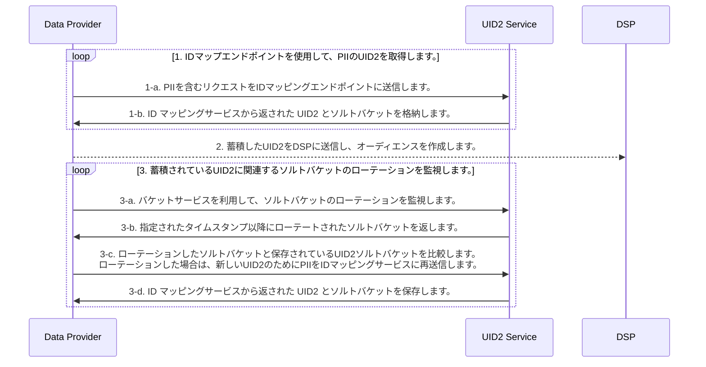

[UID2 API Documentation](../../README.md) > [v1](../README.md) > Integration Guides > Advertiser/Data Provider Integration Guide

# Advertiser/Data Provider Integration Guide (Deprecated)

> IMPORTANT: UID2 API v1 は非推奨となり、2023 年 3 月 31 日までにすべての v1 SDK ファイルとエンドポイント、v0 SDK ファイル、およびバージョン管理されていないエンドポイントが削除され、現在のユーザーのみがサポートされるようになります。2023 年 3 月 31 日までに、必ず UID2 API v2(../../v2/upgrades/upgrade-guide.md) へのアップグレードをお願いします。初めてフレームワークに触れる方は、[UID2 API v2](../../v2/README.md) をご利用ください。

このガイドでは、ユーザーデータを収集し、DSP にプッシュする組織のためのインテグレーション手順について説明します。データコレクターには、広告主、データオンボーダー、測定プロバイダー、ID グラフプロバイダー、サードパーティデータプロバイダ、および DSP にデータを送信する他の組織が含まれます。このガイドには、次のセクションがあります:

- [Integration Steps](#integration-steps)
- [FAQs](#faqs)

Snowflake Data Marketplace でホストされる Open Operator Service を使用する場合は、[Snowflake Integration](../sdks/snowflake_integration.md) も参照してください。

## Integration Steps

次の図は、データコレクターがオーディエンスの構築とターゲティングのために、PII を UID2 識別子にマッピングするために必要なステップの概要を示しています。PII とは、ユーザーの正規化されたメールアドレス、または正規化され SHA256 ハッシュ化されメールアドレスのことを指します。

### Retrieve a UID2 for PII using the identity map endpoints

| Step | Endpoint                                                                                                         | Description                                                                                                                                                                                                                                                                                                                                                                                                                                                                                                                                                                                                                                                                                                                                                                                                           |
| ---- | ---------------------------------------------------------------------------------------------------------------- | --------------------------------------------------------------------------------------------------------------------------------------------------------------------------------------------------------------------------------------------------------------------------------------------------------------------------------------------------------------------------------------------------------------------------------------------------------------------------------------------------------------------------------------------------------------------------------------------------------------------------------------------------------------------------------------------------------------------------------------------------------------------------------------------------------------------- |
| 1-a  | [GET /identity/map](../endpoints/get-identity-map.md) [POST /identity/map](../endpoints/post-identity-map.md) | PII を含むリクエストを ID マッピングエンドポイントに送信します。                                                                                                                                                                                                                                                                                                                                                                                                                                                                                                                                                                                                                                                                                                                                                      |
| 1-b  | [GET /identity/map](../endpoints/get-identity-map.md) [POST /identity/map](../endpoints/post-identity-map.md) | 返却された `advertising_id` (UID2) は、関連する DSP でオーディエンスをターゲットするために使用できます。  レスポンスは、ユーザーの UID2 とそれに対応するソルトを割り当てたバケットの `bucket_id` を返します。バケットに割り当てられたソルトは毎年ローテーションされるため、生成される UID2 にも影響があります。ソルトバケットのローテーションを確認する方法の詳細については、 [ソルトバケットローテーションの監視](#monitor-for-salt-bucket-rotations-related-to-your-stored-uid2s) を参照してください。  メンテナンスを容易にするために、ユーザーの UID2 と `bucket_id` をマッピングテーブルで保存することを推奨します。インクリメンタルな更新についてのガイダンスは、[インクリメンタルプロセスで UID2 を継続的に更新する](#use-an-incremental-process-to-continuously-update-uid2) を参照してください。 |

### Send UID2 to a DSP to build an audience

オーディエンスを構築する際の [前段階](#retrieve-a-uid2-for-pii-using-the-identity-map-endpoints) として `advertising_id` (UID2) を DSP に送信してください。オーディエンスを構築するためのインテグレーションプロセスは、各 DSP で独自に設定されています。UID2 を送信してオーディエンスを構築するには、DSP が提供するインテグレーションガイダンスに従ってください。

### Monitor for salt bucket rotations related to your stored UID2s

UID2 は特定の時点におけるユーザーの識別子であるため、ユーザーの UID2 は少なくとも年に一度入れ替わることになります。

各ソルトバケットはだいたい 1 年に 1 回更新されるとはいえ、個々のバケットの更新は 1 年に分散して行われます。これは、全バケットの約 1/365 が毎日ローテーションされることを意味します。

> IMPORTANT: あなたのインテグレーションが最新の UID2 を持っていることを確認するために、アクティブなユーザーのソルトバケットのローテーションを毎日チェックしてください。

| Step | Endpoint                                                                                                         | Description                                                                                                                                                                                   |
| ---- | ---------------------------------------------------------------------------------------------------------------- | --------------------------------------------------------------------------------------------------------------------------------------------------------------------------------------------- |
| 3-a  | [GET /identity/buckets](../endpoints/get-identity-buckets.md)                                                    | 指定されたタイムスタンプ以降に変更されたすべてのソルトバケットのリクエストをバケットステータスエンドポイントに送信します。                                                                    |
| 3-b  | [GET /identity/buckets](../endpoints/get-identity-buckets.md)                                                    | バケットステータスエンドポイントは、 `bucket_id` と `last_updated` のタイムスタンプのリストを返します。                                                                                       |
| 3-c  | [GET /identity/map](../endpoints/get-identity-map.md) [POST /identity/map](../endpoints/post-identity-map.md) | 返された `bucket_id` を、キャッシュした UID2 のソルトバケットと比較します。 UID2 のソルトバケットがローテーションした場合は、新しい UID2 用に PII を ID マッピングサービスに再送信します。 |
| 3-d  | [GET /identity/map](../endpoints/get-identity-map.md) [POST /identity/map](../endpoints/post-identity-map.md) | 返された `advertising_id` と `bucket_id` を格納します。                                                                                                                                       |

### Use an incremental process to continuously update UID2

UID2 ベースのオーディエンスを上記の手順で継続的に更新・維持します。

[UID2 取得手順](#retrieve-a-uid2-for-pii-using-the-identity-map-endpoints) からの応答には、マッピング情報が含まれています。PII (`identifier`), UID2 (`advertising_id`), ソルトバケット (`bucket_id`) の間のマッピングと、最終更新タイムスタンプをキャッシュすることができます。

[ソルトバケットのローテーションを監視](#monitor-for-salt-bucket-rotations-related-to-your-stored-uid2s) の結果から、[ID マップエンドポイントを使用して UID2 を取得](#retrieve-a-uid2-for-pii-using-the-identity-map-endpoints) することでローテーションしたソルトバケットの UID2 をリマップすることができます。オーディエンスの UID2 を更新するには、[DSP に送信](#send-uid2-to-a-dsp-to-build-an-audience) します。

## FAQs

### ソルトバケットローテーションによる UID2 更新のタイミングはどうすればわかりますか？

UID2 生成リクエストで提供されるメタデータには、UID2 生成に使用されたソルトバケットが記載されています。ソルトバケットは永続的で、UID2 生成に使用された基本的な PII に対応します。指定されたタイムスタンプ以降にローテーションされたソルトバケットを返すには、 [GET /identity/buckets](../endpoints/get-identity-buckets.md) エンドポイントを使用します。返されたローテーション済みのソルトバケットは、どの UID2 をリフレッシュすべきかを知らせてくれます。

### リフレッシュされたメールアドレスは、以前関連付けられていたのと同じバケットに割り当てられるのですか？

必ずしもそうとは限りません。特定のバケット ID に関連付けられたメールアドレスをマッピングし直すと、別のバケット ID に割り当てられる場合があります。バケット ID を確認するには、[マッピングファンクション](#retrieve-a-uid2-for-pii-using-the-identity-map-endpoints) を呼び出し、返ってきた UID2 とバケット ID を再度保存してください。

> IMPORTANT: メールアドレスのマッピングや再マッピングを行う際には、バケットの数、特定のローテーション日、メールアドレスがどのバケットに割り当てられるかを仮定しないように注意してください。

### UID のインクリメンタルアップデートは、どれくらいの頻度で行うべきですか？

オーディエンスを更新する頻度は、毎日が推奨されます。

### マッピング用の PII の SHA256 はどのように生成すればよいですか？

[メールアドレスの正規化ルール](../../README.md#email-address-normalization) に従い、ソルトなしでハッシュ化する必要があります。また、送信前に値を base64 エンコードする必要があります。

### メールアドレスやメールアドレスのハッシュマッピングを大量に保存する必要がありますか？

はい。メールアドレスやハッシュのマッピングを保存しないと、数百万件のアドレスのマッピングを行う際に処理時間が大幅に増加する可能性があります。しかし、実際に更新する必要があるマッピングのみを再計算することで、毎日更新する必要があるのは UID2 の約 1/365 であるため、総処理時間を短縮することができます。

> IMPORTANT: Private Operator を使用していない限り、単一の HTTP 接続を使用して、一度に 5 ～ 10K 通のバッチで、メールアドレスまたはハッシュを連続してマッピングする必要があります。言い換えれば、複数の並列接続を作成することなくマッピングを行うことです。

### ユーザーのオプトアウトはどのように処理すればよいですか？

ユーザーが [Transparency and Control Portal](https://www.transparentadvertising.org/) を通じて UID2 ベースのターゲティング広告をオプトアウトすると、オプトアウト信号が DSP とパブリッシャーに送信され、入札時にオプトアウトが処理されます。広告主またはデータプロバイダとして、このシナリオで UID2 オプトアウトを確認する必要はありません。

ユーザーが自分のウェブサイトからオプトアウトした場合、オプトアウトを処理するための内部手順に従ってください。たとえば、そのユーザーに対して UID2 を生成しないように選択することもできます。
