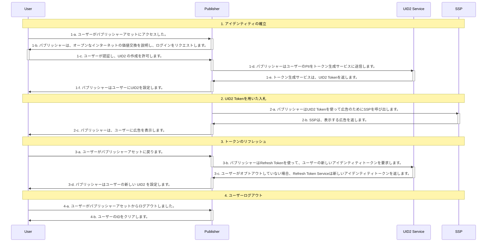

[UID2 API Documentation](../../getting-started.md) > [v1](../README.md) > [Integration Guides](README.md) > Publisher Integration Guide, Server-Only (Without SDK) (Deprecated)

# Publisher Integration Guide, Server-Only (Without SDK) (Deprecated)

> IMPORTANT: UID2 API v1 は非推奨となり、2023 年 3 月 31 日までにすべての v1 SDK ファイルとエンドポイント、v0 SDK ファイル、およびバージョン管理されていないエンドポイントが削除され、現在のユーザーのみがサポートされるようになります。2023 年 3 月 31 日までに、必ず [UID2 API v2 へのアップグレード](../../v2/upgrades/upgrade-guide.md) をお願いします。初めてフレームワークに触れる方は、[UID2 API v2](../../v2/summary-doc-v2.md) をご利用ください。

このガイドは、UID2 対応のシングルサインオンや ID プロバイダーではなく、UID2 と直接インテグレーションしながら、RTB ビッドストリーム用に UID2 を利用した ID トークンを生成したいと考えるアプリ開発者や CTV 放送局を対象としています。

このガイドでは、SDK を使用しないでインテグレーションを行う場合に考慮すべき [基本的な手順](#integration-steps) を概説しています。たとえば、ユーザログインとログアウトの実装方法、UID2 ID 情報の管理とターゲティング広告への使用方法、トークンのリフレッシュ方法、ID が見つからない場合の対処、ユーザーのオプトアウトの処理方法などを決定する必要があります。[FAQ](#faqs)も参照してください。

> TIP: UID2 を使ったクライアント ID の確立と Advertising Token の取得を容易にするために、[Client-Side JavaScript SDK v1](../sdks/client-side-identity-v1.md) を使用することを検討してください。詳しくは、[UID2 SDK Integration Guide](./publisher-client-side.md) を参照してください。

## Integration Steps

以下の図は、ユーザーがパブリッシャーと UID2 Token を確立するために必要なステップと、UID2 Token が RTB ビッドストリームとどのようにインテグレーションされるかの概要を示しています。

次のセクションでは、図中の各ステップについて詳細を説明します:

1.  [Establish identity: user login](#establish-identity-user-login)
2.  [Bid using UID2 tokens](#bid-using-uid2-tokens)
3.  [Refresh tokens](#refresh-tokens)
4.  [Clear Identity: user logout](#clear-identity-user-logout)

### Establish Identity: User Login

ステップ 1-c で認証が行われ、ユーザーに規約を受け入てもらい、パブリッシャーがメールアドレスや電話番号を検証した後、サーバーサイドで UID2 Token を生成する必要があります。次の表は、トークン生成のステップの詳細を示しています。

| Step | Endpoint                                                  | Description                                                                                                                                                                                                                                                                                                                                                             |
| :--- | :-------------------------------------------------------- | :---------------------------------------------------------------------------------------------------------------------------------------------------------------------------------------------------------------------------------------------------------------------------------------------------------------------------------------------------------------------- |
| 1-d  | [GET /token/generate](../endpoints/get-token-generate.md) | パブリッシャーが UID2 を使用してアイデンティティを確立するには、次の 2 つの方法があります： - UID2 対応シングルサインオンプロバイダーとインテグレーションします。 - [GET /token/generate](../endpoints/get-token-generate.md) エンドポイントを使って、提供された正規化および URL エンコードされたメールアドレスまたは電話番号を使って UID2 Token を生成します。 |
| 1-e  | [GET /token/generate](../endpoints/get-token-generate.md) | ユーザーのメールアドレス、電話番号、またはそれぞれのハッシュから生成した UID2 Token を返します。                                                                                                                                                                                                                                                                        |
| 1-f  | N/A                                                       | 返された `advertising_token` と `refresh_token` は、ユーザーに紐づくストレージに保存します。ファーストパーティクッキーのようなクライアントサイドのストレージや、サーバーサイドのストレージを検討するとよいでしょう。                                                                                                                                                    |

### Bid Using UID2 Tokens

UID2 ID 情報をどのように管理し、ターゲティング広告に使用したいか、たとえば返された Advertising Token を SSP に渡すかについて検討する必要があります。

| Step | Endpoint | Description                                                                                                                       |
| :--- | :------- | :-------------------------------------------------------------------------------------------------------------------------------- |
| 2-a  | N/A      | ステップ [1-e](#establish-identity-user-login) の `advertising_token` を入札のために SSP に送信します。そのままの値を送信します。 |

### Refresh Tokens

リフレッシュエンドポイントを活用して、最新バージョンの UID2 Token を取得します。ユーザーの UID2 ローテーションとオプトアウトの状態を同期させるには、UID2 Token をリフレッシュする必要があります。ユーザーがオプトアウトした場合、その Refresh Token を使用すると、トークン更新チェーンが終了します。

| Step | Endpoint                                                | Description                                                                                                                                                                                                          |
| :--- | :------------------------------------------------------ | :------------------------------------------------------------------------------------------------------------------------------------------------------------------------------------------------------------------- |
| 3-a  | N/A                                                     | ユーザーがアセットに戻り、再びアクティブになったとき、ID トークンをリフレッシュしてから、SSP に送信します。                                                                                                          |
| 3-b  | [GET /token/refresh](../endpoints/get-token-refresh.md) | ステップ [1-e](#establish-identity-user-login) で取得した `refresh_token` をクエリパラメータとして送信します。                                                                                                       |
| 3-c  | [GET /token/refresh](../endpoints/get-token-refresh.md) | UID2 Service は、オプトアウトしていないユーザーに対して新しい ID トークンを発行します。                                                                                                                              |
| 3-d  | N/A                                                     | 返された `advertising_token` と `refresh_token` は、ユーザーに紐づくストレージに保存します。ファーストパーティクッキーのようなクライアントサイドのストレージや、サーバーサイドのストレージを検討するとよいでしょう。 |

> TIP: [GET /token/generate](../endpoints/get-token-generate.md) または [GET /token/refresh](../endpoints/get-token-refresh.md) コールによって返された ID の `refresh_from` タイムスタンプからトークンのリフレッシュを始めてください。

### Clear Identity: User Logout

| Step | Endpoint | Description                                                                                       |
| :--- | :------- | :------------------------------------------------------------------------------------------------ |
| 4-a  | N/A      | ユーザーがパブリッシャーアセットからログアウトしました。                                          |
| 4-b  | N/A      | そのユーザー用に保存してある UID2 Token を削除します。UID2 Service とのやりとりは必要ありません。 |

## FAQs

### トークンを復号化する必要がありますか？

いいえ、パブリッシャーはトークンを復号化する必要はありません。

### オプトアウトの通知はどのように行われますか？

トークンのリフレッシュ処理では、ユーザーのオプトアウトを処理します。[GET /token/refresh](../endpoints/get-token-refresh.md) は、そのユーザーの空の ID とオプトアウトステータスを返します。UID2 ベースのターゲティング広告の使用を再開するには、ユーザーは再ログインして UID2 ID を再確立する必要があります。

### トークン生成の呼び出しは、サーバーサイドとクライアントサイドのどちらで行うべきですか？

UID2 Token は、認証後にサーバーサイドでのみ生成する必要があります。つまり、サービスにアクセスするために使用する API キーを秘密にするために、[GET /token/generate](../endpoints/get-token-generate.md) エンドポイントはサーバーサイドからのみ呼び出される必要があります。

### トークン リフレッシュの呼び出しをクライアントサイドから行うことはできますか。

[GET /token/refresh](../endpoints/get-token-refresh.md) は、API キーを使用する必要がないため、クライアントサイド（ブラウザやモバイルアプリなど）から呼び出すことが可能です。

### UID2 Token の一意性とローテーションのポリシーは？

UID2 Service では、ランダムな初期化ベクトルを使用してトークンを暗号化します。暗号化された UID2 は、インターネットを閲覧している特定のユーザーに対して一意となります。更新されるたびに、トークンは再暗号化されます。このメカニズムにより、信頼できない第三者がユーザーを追跡することができないようにします。

### 送信された PII と返されたトークンが一致するかどうかをテストするにはどうすればよいですか?

[GET /token/validate](../endpoints/get-token-validate.md) エンドポイントを使用して、[GET /token/generate](../endpoints/get-token-generate.md) を通じて送信する PII が有効かどうかをチェックすることができます。

1. PII がメールアドレスか電話番号かに応じて、以下の値のいずれかを使用して[GET /token/generate](../endpoints/get-token-generate.md) リクエストを送信してください。
   - `email` の値として `validate@email.com` を指定します。
   - `validate@email.com` を [SHA256 ハッシュし、URL エンコード、base64 エンコード](../../getting-started.md#email-address-hash-encoding) したものを `email_hash` の値として指定します。
   - `phone` の値として [URL エンコード](../README.md#query-parameter-value-encoding) した `+12345678901` を指定します。
   - `+12345678901` を [SHA256 ハッシュし、URL エンコード、base64 エンコード](../../getting-started.md#email-address-hash-encoding) したものを `phone_hash` の値として指定します。
2. 返された `advertising_token` を、次のステップで使用するために保存します。
3. [GET /token/validate](../endpoints/get-token-validate.md) で、ステップ 1 で送信した `email`, `email_hash`, `phone`, または `phone_hash` 値と `advertising_token` （ステップ 2 で保存）をプロパティ値としてリクエストを送信します。
   - もしレスポンスが `true` を返したら、ステップ 1 でリクエストとして送った PII は、ステップ 1 のレスポンスで受け取ったトークンと一致します。
   - `false` が返された場合、メールアドレス、電話番号、またはそれぞれのハッシュを送信する方法に問題がある可能性があります。

### Refresh Token のログアウトのワークフローをテストするにはどうしたらいいですか？

`optout@email.com` メールアドレスまたは `+00000000000` 電話番号を使用して、Refresh Token ワークフローをテストすることができます。これらのメールアドレスや電話番号をリクエストに使用すると、常に `refresh_token` を含む ID レスポンスが生成され、その結果ログアウト レスポンスが生成されます。

1. PII がメールアドレスか電話番号かに応じて、以下の値のいずれかを使用して [GET /token/generate](../endpoints/get-token-generate.md) リクエストを送信してください。
   - `email`の値として`optout@email.com` を指定します。
   - `optout@email.com`を [SHA256 ハッシュし、URL エンコード、base64 エンコード](../../getting-started.md#email-address-hash-encoding) したものを `email_hash` の値として指定します。
   - `phone` の値として [URL エンコード](../README.md#query-parameter-value-encoding) した `+00000000000` を指定してください。
   - `PHONE_HASH` 値として `+00000000000` を [SHA256 ハッシュし、URL エンコード、base64 エンコード](../../getting-started.md#phone-number-hash-encoding) したものを指定します。
2. 返された `refresh_token` を次のステップで使用するために保存します。
3. (ステップ 2 で保存した) `refresh_token` を `token` 値として [GET /token/refresh](../endpoints/get-token-refresh.md) リクエストを送ります。  `optout@email.com` というメールアドレスと `+00000000000` という電話番号は常にログアウトしたユーザーを表すため、レスポンスボディは空に、`status` 値には `optout` が設定されていなければなりません。
