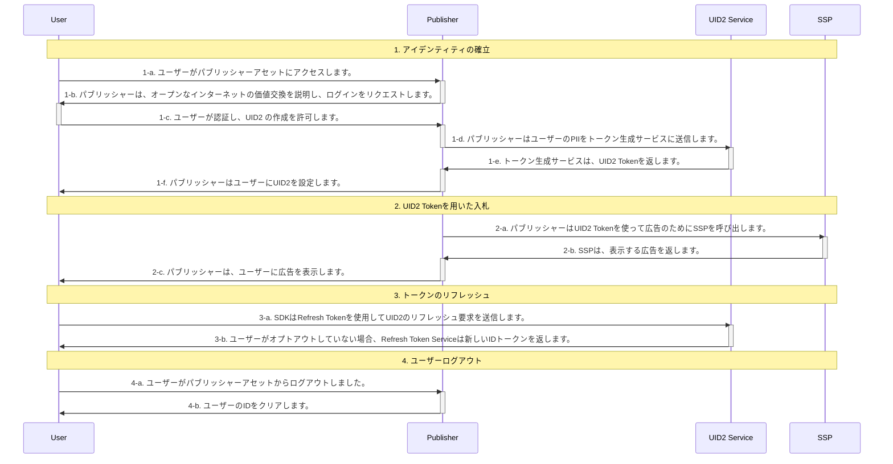

[UID2 API Documentation](../../README.md) > [v1](../README.md) > [Integration Guides](README.md) > Publisher Integration Guide

# Publisher Integration Guide (Deprecated)

> IMPORTANT: UID2 API v1 は非推奨となり、2023 年 3 月 31 日までにすべての v1 SDK ファイルとエンドポイント、v0 SDK ファイル、およびバージョン管理されていないエンドポイントが削除され、現在のユーザーのみがサポートされるようになります。2023 年 3 月 31 日までに、必ず UID2 API v2(../../v2/upgrades/upgrade-guide.md) へのアップグレードをお願いします。初めてフレームワークに触れる方は、[UID2 API v2](../../v2/README.md) をご利用ください。

> NOTE: このガイドは、UID2 SDK [version 0](../sdks/client-side-identity-v0.md) を対象としています。UID2 SDK [version 1](../sdks/client-side-identity-v1.md)を使用した*インテグレーションガイド*については、 [UID2 SDK Integration Guide](./publisher-client-side.md) をご覧ください。

このガイドでは、Web アセットを持つパブリッシャーが、入札ストリームに UID2 を使用して ID トークンを生成するためのインテグレーション手順を説明します。このガイドは、UID2 対応シングルサインオンや ID プロバイダーとインテグレーションするのではなく、UID2 と直接インテグレーションしてトークンを作成・管理したいパブリッシャーを対象としています。

- [Integration Steps](#integration-steps)
- [FAQs](#faqs)

アプリ開発者や CTV 放送局向けのカスタムインテグレーションシナリオについては、[Publisher Integration Guide (Custom)](./custom-publisher-integration.md)を参照してださい。

## Integration Steps

以下の図は、ユーザーがパブリッシャーと UID2 Token を確立するために必要なステップと、UID2 Token が RTB ビッドストリームとどのようにインテグレーションされるかの概要を示しています。



次のセクションでは、図中の各ステップについて詳細を説明します:

1.  [Establish Identity](#establish-identity)
2.  [Bid Using UID2 Tokens](#bid-using-uid2-tokens)
3.  [Refresh Tokens](#refresh-tokens)
4.  [User Logout](#user-logout)

### Establish Identity

ステップ 1-c で認証が行われ、ユーザーに規約を受け入れてもらい、パブリッシャーがメールアドレスを検証した後、サーバーサイドで UID2 Token を生成する必要があります。次の表は、トークン生成のステップの詳細を示しています。

| Step | Endpoint/SDK                                                        | Description                                                                                                                                                                                                                                                                                                                                                                                                             |
| ---- | ------------------------------------------------------------------- | ----------------------------------------------------------------------------------------------------------------------------------------------------------------------------------------------------------------------------------------------------------------------------------------------------------------------------------------------------------------------------------------------------------------------- |
| 1-d  | [GET /token/generate](../endpoints/get-token-generate.md)           | パブリッシャーが UID2 を使用してアイデンティティを確立するには、2 つの方法があります:<br>- UID2 対応のシングルサインオンプロバイダーとインテグレーションする。<br>- [GET /token/generate](../endpoints/get-token-generate.md) エンドポイントを使ってユーザーが認証したときに UID2 Token を生成する。このリクエストには、ユーザーの [正規化済み](../../README.md#email-address-normalization) メールアドレスを含みます。 |
| 1-e  | [GET /token/generate](../endpoints/get-token-generate.md)           | UID2 Token を返すトークン生成サービス。                                                                                                                                                                                                                                                                                                                                                                                 |
| 1-f  | [UID2 client-side identity SDK](../sdks/client-side-identity-v0.md) | 手順 1-e で返却された UID2 Token を、後述する Client-Side SDK のアイデンティティメカニズムを使用して SDK に送信します。このメカニズムにより、ユーザーがログアウトするまで UID2 Token が利用可能であることが保証されます。                                                                                                                                                                                               |

> IMPORTANT: 現在、UID2 SDK はトークンをファーストパーティ Cookie に保存しています。このような実装の詳細は将来的に変更される可能性があるため、潜在的な問題を回避するために、ID 管理は必ず UID2 SDK APIs に従って行ってください。

##### Client-Side SDK のアイデンティティメカニズム

```html
<script>
  __uid2.init({
    identity : <Response from the generate token api>
  });
</script>
```

### Bid Using UID2 Tokens

| Step | Endpoint/SDK                                                        | Description                                                                                                                                                                                        |
| ---- | ------------------------------------------------------------------- | -------------------------------------------------------------------------------------------------------------------------------------------------------------------------------------------------- |
| 2-a  | [UID2 client-side identity SDK](../sdks/client-side-identity-v0.md) | 確立された ID は、入札のためにクライアントサイドで利用可能です。後述の Client-Side SDK のアイデンティティアクセスメカニズムは、SSP に渡すユーザーの `advertising_token` へのアクセス権を返します。 |

##### Client-Side SDK のアイデンティティアクセスメカニズム

```html
<script>
  __uid2.getAdvertisingToken();
</script>
```

### Refresh Tokens

| Step | Endpoint/SDK                                                        | Description                                                                          |
| ---- | ------------------------------------------------------------------- | ------------------------------------------------------------------------------------ |
| 3-a  | [UID2 client-side identity SDK](../sdks/client-side-identity-v0.md) | SDK は自動的に UID2 Token をリフレッシュします。手動で操作する必要はありません。     |
| 3-b  | [UID2 client-side identity SDK](../sdks/client-side-identity-v0.md) | ユーザーがオプトアウトしていない場合、Refresh Token は新しい ID トークンを返します。 |

> TIP: SDK 以外のオプションでインテグレーションを行う場合は、5 分ごとに ID トークンを更新してください。

### User Logout

| Step | Endpoint/SDK                                                        | Description                                                                                                                                                |
| ---- | ------------------------------------------------------------------- | ---------------------------------------------------------------------------------------------------------------------------------------------------------- |
| 4-a  |                                                                     | ユーザーがパブリッシャーアセットからログアウトしました。                                                                                                   |
| 4-b  | [UID2 client-side identity SDK](../sdks/client-side-identity-v0.md) | ログアウト時にユーザーのローカルストレージから UID2 Token を削除します。UID2 Token を消去するには、後述の SDK Disconnect Identity Mechanism を使用します。 |

##### Client-Side SDK Disconnect Identity Mechanism

```html
<script>
  __uid2.disconnect();
</script>
```

## FAQs

### ユーザーのオプトアウトはどのように通知されますか？

トークンのリフレッシュ処理では、ユーザーのオプトアウトを処理します。ユーザーがオプトアウトした場合、Refresh Token を使用すると、自動的にそのセッションがクリアされます。[UID2 client-side SDK](../sdks/client-side-identity-v1.md) を参照してください。手動での操作は必要ありません。

### インテグレーションをテストするにはどうすればよいですか？

インテグレーションをテストするために使用できるビルトインツールが 2 つあります。

### 送信された PII と返されたトークンが一致するかどうかをテストするにはどうすればよいですか？

[GET /token/validate](../endpoints/get-token-validate.md) エンドポイントを使用して、[GET /token/generate](../endpoints/get-token-generate.md) を通じて送信する PII が有効かどうかをチェックすることができます。

1. 以下のどちらかを行ってください:
   - [GET /token/generate](../endpoints/get-token-generate.md) リクエストを `validate@email.com` を `email` に指定して送信します。
   - `validate@email.com` の [base64-encoded SHA256](../../README.md#email-address-hash-encoding) ハッシュを作成し、メールハッシュとして送信します。
2. ステップ 3 で使用するために返された `advertising_token` を保存します。
3. ステップ 1 で送信した `email` または `email_hash` と `advertising_token` (ステップ 2 で保存) を `token` として [GET /token/validate](../endpoints/get-token-validate.md) リクエストを送信してください。
   - もしレスポンスが `true` を返したら、ステップ 1 でリクエストとして送った `email` または `email_hash` が、ステップ 1 のレスポンスで受け取ったトークンと一致したことになります。
   - `false` を返した場合は、メールアドレスやメールハッシュの送信方法に問題がある可能性があります。

### Refresh Token の logout ワークフローをテストするにはどうしたらいいですか？

`optout@email.com` というメールアドレスを使って、トークン更新のワークフローをテストすることができます。このメールをリクエストに使用すると、常に `refresh_token` を含む ID レスポンスが生成され、ログアウトのレスポンスになります。

1. 以下のどちらかを行ってください:
   - `optout@email.com` を `email` として [GET /token/generate](../endpoints/get-token-generate.md) リクエストを送ります。
   - `optout@email.com` の [base64-encoded SHA256](../../README.md#email-address-hash-encoding) ハッシュを作成し、メールハッシュとして送信する。
2. ステップ 3 で使用するために返された `refresh_token` を保存します。
3. [GET /token/validate](../endpoints/get-token-validate.md) リクエストを、ステップ 1 で送信した `email` または `email_hash` と `refresh_token` （ステップ 2 で保存）を `token` に指定して送信してください。<br/> `optout@email.com` のメールは常にログアウトしたリフレッシュトークンを返すので、`body` レスポンスは空のはずです。
