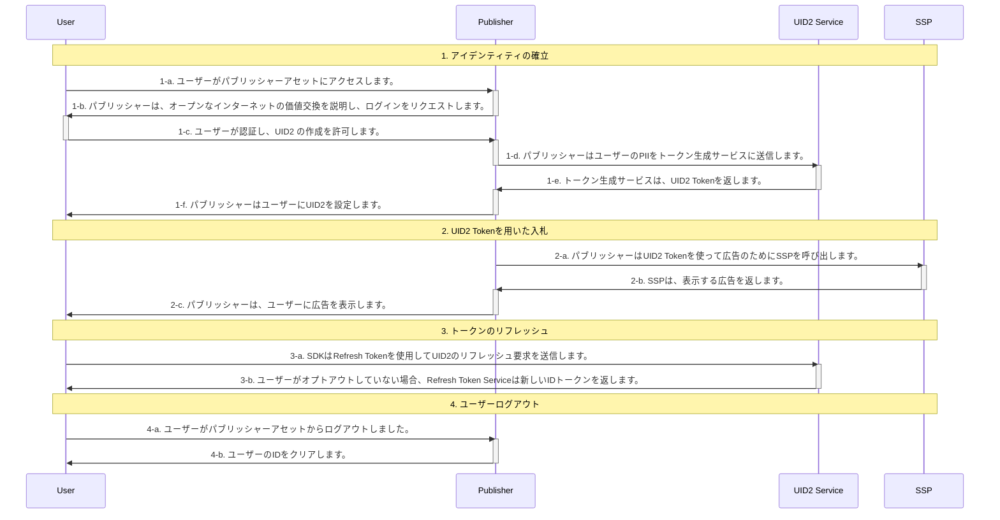

[UID2 API Documentation](../../getting-started.md) > [v1](../README.md) > [Integration Guides](README.md) > Client-Side JavaScript SDK Integration Guide (Deprecated)

# Client-Side JavaScript SDK Integration Guide (Deprecated)

> IMPORTANT: UID2 API v1 は非推奨となり、2023 年 3 月 31 日までにすべての v1 SDK ファイルとエンドポイント、v0 SDK ファイル、およびバージョン管理されていないエンドポイントが削除され、現在のユーザーのみがサポートされるようになります。2023 年 3 月 31 日までに、必ず [UID2 API v2 へのアップグレード](../../v2/upgrades/upgrade-guide.md) をお願いします。初めてフレームワークに触れる方は、[UID2 API v2](../../v2/summary-doc-v2.md) をご利用ください。

> NOTE: このガイドは UID2 SDK [version 1](../sdks/client-side-identity-v1.md) を対象としています。UID2 SDK の [previous version](../sdks/client-side-identity-v0.md) を使用した*インテグレーションガイド*については、[Publisher Integration Guide (Standard)](./publisher-client-side-v0.md) を参照してください。

このガイドは、UID2 対応シングルサインオンや ID プロバイダーではなく、UID2 と直接インテグレーションしながら、RTB ビッドストリーム用に UID2 を利用した ID トークンを生成したいと考える、Web アセットを持つパブリッシャーを対象としています。

このガイドでは、SDK を使用しないでインテグレーションを行う場合に考慮すべき [基本的な手順](#integration-steps) を概説しています。たとえば、ユーザーログインとログアウトの実装方法、UID2 ID 情報の管理と　ターゲティング広告への使用方法、トークンの更新方法、ID が見つからない場合の対処、ユーザーのオプトアウトの処理方法などを決定する必要があります。[FAQs](#faqs) も参照してください。

> IMPORTANT: UID2 SDK は現在、ファーストパーティクッキーにトークンを保存しています。このような実装の詳細は将来変更される可能性があるため、潜在的な問題を回避するために、ID 管理は必ず[Client-Side JavaScript SDK v1 APIs](../sdks/client-side-identity-v1.md#api-reference) に従って行ってください。

UID2 SDK を使用しない、アプリ開発者や CTV 放送局向けのカスタムインテグレーションシナリオについては、[Server-Only Integration Guide](./custom-publisher-integration.md) を参照してください。

## Integration Steps

以下の図は、ユーザーがパブリッシャーと UID2 Token を確立するために必要なステップと、UID2 Token が RTB ビッドストリームとどのようにインテグレーションされるかの概要を示しています。



次のセクションでは、図中の各ステップについて詳細を説明します:

1.  [Establish identity: user login](#establish-identity-user-login)
2.  [Bid using UID2 tokens](#bid-using-uid2-tokens)
3.  [Refresh tokens](#refresh-tokens)
4.  [Clear Identity: user logout](#clear-identity-user-logout)

### Establish Identity: User Login

ステップ 1-c で認証が行われ、ユーザーに規約を受け入れてもらい、パブリッシャーがメールアドレスや電話番号を検証した後、サーバーサイドで UID2 Token を生成する必要があります。次の表は、トークン生成のステップの詳細を示しています。

| Step | Endpoint/SDK                                                        | Description                                                                                                                                                                                                                                                                                                                                                                    |
| :--- | :------------------------------------------------------------------ | :----------------------------------------------------------------------------------------------------------------------------------------------------------------------------------------------------------------------------------------------------------------------------------------------------------------------------------------------------------------------------- |
| 1-d  | [GET /token/generate](../endpoints/get-token-generate.md)           | ユーザーが認証され、UID2 の作成が許可されたら、[GET /token/generate](../endpoints/get-token-generate.md) エンドポイントを使用して、提供された正規化および URL エンコード済みのメールアドレスまたは電話番号から UID2 Token を生成します。                                                                                                                                       |
| 1-e  | [GET /token/generate](../endpoints/get-token-generate.md)           | ユーザーのメールアドレス、電話番号、またはそれぞれのハッシュから生成された UID2 Token を返します。                                                                                                                                                                                                                                                                             |
| 1-f  | [Client-Side JavaScript SDK v1](../sdks/client-side-identity-v1.md) | 手順 1-e で返された UID2 Token を、SDK の[init() function](../sdks/client-side-identity-v1.md#initopts-object-void)の`identity`プロパティで送信し、以下のように [コールバック関数](../sdks/client-side-identity-v1.md#callback-function) を指定する必要があります。この仕組みにより、ユーザーがログアウトするまで、UID2 Token がターゲティング広告に利用できるようになります。 |

```html
<script>
  __uid2.init({
    callback : function (state) {...}, // Check advertising token and its status within the passed state and initiate targeted advertising.
    identity : {...} // The `body` property value from the token/generate API response.
  });
</script>
```

例:

```html
<script>
  __uid2.init({
    callback: onUid2IdentityUpdated,
    identity: {
      advertising_token:
        "AgmZ4dZgeuXXl6DhoXqbRXQbHlHhA96leN94U1uavZVspwKXlfWETZ3b/besPFFvJxNLLySg4QEYHUAiyUrNncgnm7ppu0mi6wU2CW6hssiuEkKfstbo9XWgRUbWNTM+ewMzXXM8G9j8Q=",
      refresh_token:
        "Mr2F8AAAF2cskumF8AAAF2cskumF8AAAADXwFq/90PYmajV0IPrvo51Biqh7/M+JOuhfBY8KGUn//GsmZr9nf+jIWMUO4diOA92kCTF69JdP71Ooo+yF3V5yy70UDP6punSEGmhf5XSKFzjQssCtlHnKrJwqFGKpJkYA==",
      identity_expires: 1633643601000,
      refresh_from: 1633643001000,
      refresh_expires: 1636322000000,
    },
  });
</script>
```

SDK は指定された [コールバック関数](../sdks/client-side-identity-v1.md#callback-function) を呼び出し（ID の利用可能性を示します）、確立した ID をクライアントサイドから入札に利用できるようにします。

### Bid Using UID2 Tokens

SDK は、有効な ID の状態と利用可能性に基づいて、バックグラウンドのトークンの自動更新を設定し、ID 情報を [ファーストパーティクッキー](../sdks/client-side-identity-v1.md#uid2-cookie-format) に格納して、ターゲティング広告に対する要求を開始するために使用します。

| Step | Endpoint/SDK                                                        | Description                                                                                                                                             |
| :--- | :------------------------------------------------------------------ | :------------------------------------------------------------------------------------------------------------------------------------------------------ |
| 2-a  | [Client-Side JavaScript SDK v1](../sdks/client-side-identity-v1.md) | 以下のように [getAdvertisingToken()](../sdks/client-side-identity-v1.md#getadvertisingtoken-string) で現在のユーザーの Advertising Token を入手します。 |

```html
<script>
  let advertisingToken = __uid2.getAdvertisingToken();
</script>
```

> TIP: 返された Advertising Token をどのように SSP に渡すかを検討する必要があります。

### Refresh Tokens

初期化の一環として、SDK は ID の [バックグラウンドでのトークン自動更新](../sdks/client-side-identity-v1.md#background-token-auto-refresh) を設定し、ID 上のタイムスタンプまたは断続的エラーによる更新の失敗によってバックグラウンドでトリガーされるようにします。

| Step | Endpoint/SDK                                                        | Description                                                                                                                                        |
| :--- | :------------------------------------------------------------------ | :------------------------------------------------------------------------------------------------------------------------------------------------- |
| 3-a  | [Client-Side JavaScript SDK v1](../sdks/client-side-identity-v1.md) | SDK はバックグラウンドで自動的に UID2 Token をリフレッシュします。手動で操作する必要はありません。                                                 |
| 3-b  | [Client-Side JavaScript SDK v1](../sdks/client-side-identity-v1.md) | ユーザーがオプトアウトしていない場合、[GET /token/refresh](../endpoints/get-token-refresh.md) は自動的に新しいアイデンティティトークンを返します。 |

### Clear Identity: User Logout

ユーザーがパブリッシャーのサイト(UID2 ではない)からログアウトすることを決めると、クライアントのライフサイクルは完了します。これにより、クライアントの ID セッションが閉じられ、ファーストパーティクッキー情報がクリアされます。

| Step | Endpoint/SDK                                                        | Description                                                                                                                                                                         |
| :--- | :------------------------------------------------------------------ | :---------------------------------------------------------------------------------------------------------------------------------------------------------------------------------- |
| 4-a  | N/A                                                                 | ユーザーがパブリッシャーのアセットからログアウトします。                                                                                                                            |
| 4-b  | [Client-Side JavaScript SDK v1](../sdks/client-side-identity-v1.md) | 以下のように [disconnect()](../sdks/client-side-identity-v1.md#disconnect-void) を用いてファーストパーティクッキーから UID2 ID をクリアし、クライアントライフサイクルを切断します。 |

```html
<script>
  __uid2.disconnect();
</script>
```

## FAQs

### ユーザーがオプトアウトした場合、どのように通知されますか？

[Client-Side JavaScript SDK v1](../sdks/client-side-identity-v1.md) のバックグラウンドのトークン自動更新プロセスでは、ユーザーのオプトアウトを処理します。ユーザーがオプトアウトした場合、UID2 SDK がトークンのリフレッシュを試みる際に、オプトアウトを知り、セッション（クッキーを含む）をクリアして、`OPTOUT` ステータスでコールバックを呼び出します。

## トークン生成の呼び出しは、サーバサイドとクライアントサイドのどちらで行うべきですか？

UID2 Token は、認証後にサーバーサイドでのみ生成する必要があります。つまり、サービスにアクセスするための API キーを秘密にするために、 [GET /token/generate](../endpoints/get-token-generate.md) というエンドポイントはサーバーサイドからのみ呼び出さなければなりません。

### トークン リフレッシュの呼び出しをクライアントサイドから行うことはできますか。

[GET /token/refresh](../endpoints/get-token-refresh.md) は、API キーを使用する必要がないため、クライアントサイド（ブラウザやモバイルアプリなど）から呼び出すことが可能です。

### 送信された PII と返されたトークンが一致するかどうかをテストするにはどうすればよいですか?

[GET /token/validate](../endpoints/get-token-validate.md) エンドポイントを使用して、[GET /token/generate](../endpoints/get-token-generate.md) を通じて送信する PII が有効かどうかをチェックすることができます。

1. PII がメールアドレスか電話番号かに応じて、以下の値のいずれかを使用して[GET /token/generate](../endpoints/get-token-generate.md) リクエストを送信してください。
   - `email` の値として `validate@email.com` を指定します。
   - `validate@email.com` を [SHA-256 ハッシュし、URL エンコード、base64 エンコード](../../getting-started.md#email-address-hash-encoding) したものを `email_hash` の値として指定します。
   - `phone` の値として [URL エンコード](../README.md#query-parameter-value-encoding) した `+12345678901` を指定します。
   - `+12345678901` を[SHA-256 ハッシュし、URL エンコード、base64 エンコード](../../getting-started.md#email-address-hash-encoding) したものを `phone_hash` の値として指定します。
2. 返された `advertising_token` を、次のステップで使用するために保存します。
3. [GET /token/validate](../endpoints/get-token-validate.md) で、ステップ 1 で送信した `email`, `email_hash`, `phone`, または `phone_hash` 値と `advertising_token` （ステップ 2 で保存）をプロパティ値としてリクエストを送信します。
   - もしレスポンスが `true` を返したら、ステップ 1 でリクエストとして送った PII は、ステップ 1 のレスポンスで受け取ったトークンと一致します。
   - `false` が返された場合、メールアドレス、電話番号、またはそれぞれのハッシュを送信する方法に問題がある可能性があります。

### トークン更新のログアウトワークフローをテストするにはどうすればよいですか？

`optout@email.com` メールアドレスまたは `+00000000000` 電話番号を使用して、トークン更新ワークフローをテストすることができます。メールアドレスや電話番号をリクエストに使用すると、常に `refresh_token` を含む ID レスポンスが生成され、その結果ログアウト レスポンスが生成されます。

1.  PII がメールアドレスか電話番号かに応じて、以下の値のいずれかを使用して[GET /token/generate](../endpoints/get-token-generate.md) リクエストを送信してください。
    - `email`の値として`optout@email.com` を指定します。
    - `optout@email.com`を [SHA-256 ハッシュし、URL エンコード、base64 エンコード](../../getting-started.md#email-address-hash-encoding) したものを `email_hash` の値として指定します。
    - `phone` の値として [URL エンコード](../README.md#query-parameter-value-encoding) した `+00000000000` を指定してください。
    - `PHONE_HASH` 値として `+00000000000` を [SHA-256 ハッシュし、URL エンコード、base64 エンコード](../../getting-started.md#phone-number-hash-encoding) したものを指定します。
2.  返された `refresh_token` を次のステップで使用するために保存します。
3.  (ステップ 2 で保存した) `refresh_token` を `token` 値として [GET /token/refresh](../endpoints/get-token-refresh.md) というリクエストを送ります。<br/> `optout@email.com` というメールと `+00000000000` という電話番号は常にログアウトしたユーザーを表すため、ボディ応答は空に、 `status` 値には `optout` をセットしてください。
