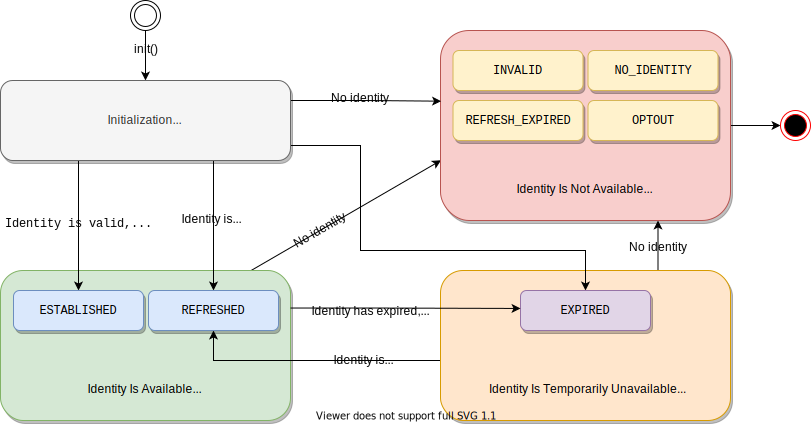

[UID2 API Documentation](../../README.md) > [v1](../README.md) > [SDKs](./README.md) > Client-Side Identity

# Client-Side Identity JavaScript SDK v1 (Deprecated)

> IMPORTANT: UID2 API v1 は非推奨となり、2023 年 3 月 31 日までにすべての v1 SDK ファイルとエンドポイント、v0 SDK ファイル、およびバージョン管理されていないエンドポイントが削除され、現在のユーザーのみがサポートされるようになります。2023 年 3 月 31 日までに、必ず UID2 API v2(../../v2/upgrade-guide.md) へのアップグレードをお願いします。初めてフレームワークに触れる方は、[UID2 API v2](../../v2/README.md) をご利用ください。

> NOTE: このドキュメントは、SDK の version 1 用です。以前のバージョンについては、[SDK version 0](./client-side-identity-v0.md) を参照してください。

この UID2 SDK を使用すると、UID2 を使用してクライアントの ID を確立し、Advertising Token を取得するプロセスを容易に行うことができます。以下のセクションでは、UID2 アイデンティティを確立するためのハイレベルな[ワークフロー](#workflow-overview)、SDK [API reference](#api-reference) および [UID2 cookie format](#uid2-cookie-format) について説明しています。コンテンツパブリッシャー向けのインテグレーション手順については、[UID2 SDK Integration Guide](../guides/publisher-client-side.md) をご覧ください。

> NOTE: このドキュメントで、"ID" という用語は、Advertising Token を含む UID2 Token のパッケージを指します。

### Improvements and Changes from Version 0

UID2 SDK の v1 アップデートにより、以下を利用できるようになりました。

- UID2 Service の最新の機能強化。
- Advertising Token の準備ができたとき、更新されたとき、利用できなくなったときに受け取る非同期通知。<br/>これにより、ターゲティング広告とのインテグレーションがより簡単になり、パブリッシャーワークフローに明確な実装経路が提供されます。
- より効率的なトークン自動更新プロセスにより、ターゲティング広告の継続性を確保します。
- また、SDK の裏側でどのように動作するかをより詳細に制御することで、ニーズに合わせて微調整を行うことができます。

> IMPORTANT: UID2 SDK の version 1 は、ユーザーセッション継続のための version 0 クッキーをサポートしていますが、後方互換性がないため、以下に示すコードの変更が必要です。

次の表は、SDK の具体的な更新内容を示しています。

| Change                                                                       | Description                                                                                                                                                                                                                                                        |
| :--------------------------------------------------------------------------- | :----------------------------------------------------------------------------------------------------------------------------------------------------------------------------------------------------------------------------------------------------------------- |
| New required [callback function](#callback-function)                         | コールバックは、[init()](#initopts-object-void) 関数に渡さなければなりません。コールバックは、初期化処理が完了した後に呼び出されます。                                                                                                                             |
| [Background token auto-refresh](#background-token-auto-refresh)              | `init()`が完了し、Refresh Token が有効な間は、UID2 SDK はバックグラウンドで定期的に ID のリフレッシュを行います。                                                                                                                                                  |
| New `opts` [object parameters](#parameters) in `init()`                      | [init()](#initopts-object-void) 関数の引数として渡される `opts` オブジェクトに、UID2 ファーストパーティクッキー、ID をリフレッシュする UID2 Operator URL、リフレッシュチェックとリトライ期間を設定できるオプションパラメータを含めることができるようになりました。 |
| Updated [getAdvertisingToken()](#getadvertisingtoken-string) return value    | `getAdvertisingToken()` 関数は `undefined` を返せるようになりました。                                                                                                                                                                                              |
| New [getAdvertisingTokenAsync()](#getadvertisingtokenasync-promise) function | この関数は、初期化が完了した時点で決定(Settled)となった Promise を返します。                                                                                                                                                                                       |
| New [abort()](#abort-void) function                                          | この関数は、UID2 SDK が行っているバックグラウンド処理を終了させることができます。                                                                                                                                                                                  |

## Include the SDK Script

UID2 を使用して ID を管理したり、ターゲティング広告用の Advertising Token を取得したいページには、以下の SDK スクリプトを実装してください:

```html
<script
  src="https://prod.uidapi.com/static/js/uid2-sdk-1.0.0.js"
  type="text/javascript"
></script>
```

## Workflow Overview

SDK を使用して UID2 ID を確立するためのクライアントサイドワークフローは、以下の手順で構成されています:

1. [Initialize the SDK](#initopts-object-void) を行い、ステップ成功時に呼び出される [コールバック関数](#callback-function) を指定します。
2. SDK がコールバック関数を呼び出すのを待ちます。コールバック関数は、ID の使用可能性を示します:
   - ID が利用可能な場合、[background token auto-refresh](#background-token-auto-refresh) がセットアップされます。
   - 利用できない場合、利用できない理由が指定されます。
3. ID の [state](#workflow-states-and-transitions) に基づいて、SDK は次の処理を行います。
   - 有効な ID が利用可能な場合、SDK は ID が [ファーストパーティクッキー](#uid2-cookie-format) で利用可能であることを確認します。
   - ID が利用できない場合、SDK は ID が更新可能かどうかに基づいて、適切なアクションを実行します。詳細は、[Workflow States and Transitions](#workflow-states-and-transitions) を参照してください。
4. ID の状態に応じた処理を行います。
   - Advertising Token が利用可能な場合、それを使用してターゲティング広告のリクエストを開始します。
   - そうでない場合は、非ターゲティング広告を使用するか、同意書付きの UID2 ログインにユーザーをリダイレクトします。

Web インテグレーションの手順については、[Publisher Integration Guide (Standard)](../guides/publisher-client-side.md) を参照してください。

### Workflow States and Transitions

次の表は、2 つの主要な関数である [getAdvertisingToken()](#getadvertisingtoken-string) と [isLoginRequired()](#isloginrequired-boolean) が返す値の組み合わせに基づいて、SDK が取り得る 4 つの主要な状態の概要を示し、それぞれの状態で開発者として取ることができる適切な行動を示しています。

| State                               | Advertising Token | Login Required | Description                                                                                                                                                                                                                                                                                                                                                                                                                                                                                                 | Identity Status Value                                    |
| :---------------------------------- | :---------------- | :------------- | :---------------------------------------------------------------------------------------------------------------------------------------------------------------------------------------------------------------------------------------------------------------------------------------------------------------------------------------------------------------------------------------------------------------------------------------------------------------------------------------------------------- | :------------------------------------------------------- |
| Initialization                      | `undefined`       | `undefined`    | コールバックが呼び出されるまでの初期状態。                                                                                                                                                                                                                                                                                                                                                                                                                                                                  | N/A                                                      |
| Identity Is Available               | available         | `false`        | 有効な ID が正常に確立またはリフレッシュされました。Advertising Token は、ターゲティング広告で使用できます。                                                                                                                                                                                                                                                                                                                                                                                                | `ESTABLISHED` or `REFRESHED`                             |
| Identity Is Temporarily Unavailable | `undefined`       | `false`        | ID（Advertising Token）の有効期限が切れており、自動リフレッシュに失敗しました。[Background auto-refresh](#background-token-auto-refresh) の試行は、Refresh Token の有効期限が切れるか、ユーザーが拒否するまで続きます。</br>以下のいずれかを行うことができます：</br>- ターゲティングのない広告を使います。</br>- 同意フォームを使って UID2 ログインにユーザーを誘導します。</br>NOTE: ID はしばらくすると正常に更新されますが、例えば、UID2 サービスが一時的に利用できない場合など、この方法は使えません。 | `EXPIRED`                                                |
| Identity Is Not Available           | `undefined`       | `false`        | ID が利用できないため、リフレッシュすることができません。SDK はファーストパーティ Cookie をクリアします。</br>UID2 ベースのターゲティング広告を再び使用するには、同意書付きの UID2 ログインにユーザーをリダイレクトする必要があります。                                                                                                                                                                                                                                                                     | `INVALID`, `NO_IDENTITY`, `REFRESH_EXPIRED`, or `OPTOUT` |

次の図は、4 つの状態と、それぞれの ID の [status value](#identity-status-values)、およびそれらの間の可能な遷移を表しています。SDK は、各遷移で [コールバック関数](#callback-function) を呼び出します。



### Background Token Auto-Refresh

SDK の [initialization](#initopts-object-void) の一部として、ID のトークン自動更新が設定され、ID 上のタイムスタンプまたは断続的なエラーによる更新の失敗によってバックグラウンドでトリガーされるようにしました。

ここでは、トークンの自動リフレッシュについて説明します:

- 一度にアクティブにできるのは、1 つのトークンリフレッシュコールのみです。
- ユーザーのオプトアウトや Refresh Token の期限切れにより [GET /token/refresh](../endpoints/get-token-refresh.md) が失敗すると、バックグラウンドでの自動更新処理が中断され、新しいログインが必要になります ([isLoginRequired()](#isloginrequired-boolean) は `true` を返します). それ以外の場合、自動更新の試みはバックグラウンドで継続されます。
- SDK 初期化時に指定された [コールバック関数](#callback-function) は、次の状況で呼び出されます。
  - 更新が成功するたびに呼び出されます。
  - 有効期限切れの Advertising Token のリフレッシュに初めて失敗した場合。
  - ユーザーがオプトアウトするなどして ID が無効になった場合</br>NOTE: コールバックは、ID が一時的に使用できず、自動更新が失敗し続けた場合には呼び出されません。この場合、SDK は既存の Advertising Token を継続して使用します。
- [disconnect()](#disconnect-void) 呼び出しは、アクティブなタイマーをキャンセルします。

## API Reference

> IMPORTANT: UID2 SDK とのすべてのやりとりは、グローバルな `__uid2` オブジェクトを通して行われます。以下の API はすべて `UID2` クラスのメンバです。

- [constructor()](#constructor)
- [init()](#initopts-object-void)
- [getAdvertisingToken()](#getadvertisingtoken-string)
- [getAdvertisingTokenAsync()](#getadvertisingtokenasync-promise)
- [isLoginRequired()](#isloginrequired-boolean)
- [disconnect()](#disconnect-void)
- [abort()](#abort-void)

### constructor()

UID2 オブジェクトを構築します。

> TIP: この関数を呼ぶ代わりに、グローバルな `__uid2` オブジェクトを使用することができます。

### init(opts: object): void

SDK を初期化し、ターゲティング広告のためのユーザー ID を確立します。

この関数について知っておくべきことは、以下のとおりです。

- `init()`は、SDK が対応するスクリプトタグによってロードされた後、通常はページのロード中にいつでも呼び出すことができます。
- 初期化呼び出しには、SDK が初期化された後に呼び出される [コールバック関数](#callback-function) が必要です。
- クライアントで UID2 ライフサイクルのインスタンスを作成する場合、`init()` コールの `identity` プロパティは、サーバーサイドで生成された ID を持つ [GET /token/generate](../endpoints/get-token-generate.md) または [GET /token/refresh](../endpoints/get-token-refresh.md) コールから正常に返される応答 JSON オブジェクトの `body` プロパティを指します。
- SDK は [ファーストパーティクッキー](#uid2-cookie-format) を使って、渡された UID2 ID 情報をセッションに保存するので、異なるページロードで以降の `init()` コールを行うと、 `identity` プロパティが空になることがあります。
- 特定の動作を調整するために、初期化コールにはオプションの設定 [parameters](#parameters) を含めることができます。

以下は、サーバーサイドで生成された ID を含む `init()` 呼び出しのテンプレートです。

```html
<script>
  __uid2.init({
    callback : function (state) {...}, // Check advertising token and its status within the passed state and initiate targeted advertising.
    identity : {...} // The `body` property value from the token/generate or token/refresh API response.
  });
</script>
```

例えば:

For example:

```html
<script>
  __uid2.init({
    callback: onUid2IdentityUpdated,
    identity: {
      advertising_token:
        "AgmZ4dZgeuXXl6DhoXqbRXQbHlHhA96leN94U1uavZVspwKXlfWETZ3b/besPFFvJxNLLySg4QEYHUAiyUrNncgnm7ppu0mi6wU2CW6hssiuEkKfstbo9XWgRUbWNTM+ewMzXXM8G9j8Q=",
      refresh_token:
        "Mr2F8AAAF2cskumF8AAAF2cskumF8AAAADXwFq/90PYmajV0IPrvo51Biqh7/M+JOuhfBY8KGUn//GsmZr9nf+jIWMUO4diOA92kCTF69JdP71Ooo+yF3V5yy70UDP6punSEGmhf5XSKFzjQssCtlHnKrJwqFGKpJkYA==",
      identity_expires: 1633643601000,
      refresh_from: 1633643001000,
      refresh_expires: 1636322000000,
    },
  });
</script>
```

以下は、ファーストパーティクッキーの ID を使用した `init()` 呼び出しの例です。このようなブロックを、ID が確立された後にユーザーが訪れる可能性のあるどのページにも置くことができます。

```html
<script>
  __uid2.init({
    callback : function (state) {...} // Check advertising token and its status within the passed state and initiate targeted advertising.
  });
</script>
```

#### Parameters

`opts` オブジェクトは以下のプロパティをサポートしています。

| Property             | Data Type                | Attribute  | Description                                                                                                                                                                                                                                                                                                   | Default Value              |
| :------------------- | :----------------------- | :--------- | :------------------------------------------------------------------------------------------------------------------------------------------------------------------------------------------------------------------------------------------------------------------------------------------------------------ | :------------------------- |
| `callback`           | `function(object): void` | 必須       | 渡された ID を検証した後、SDK が呼び出す関数です。詳しくは、[コールバック関数](#callback-function) を参照してください。                                                                                                                                                                                       | N/A                        |
| `identity`           | object                   | オプション | [GET /token/generate](../endpoints/get-token-generate.md) または [GET /token/refresh](../endpoints/get-token-refresh.md) コールに成功し、サーバー上で ID を生成したときの `body` プロパティ値です。[ファーストパーティクッキー](#uid2-cookie-format) の ID を使用するには、このプロパティを空にしてください。 | N/A                        |
| `baseUrl`            | string                   | オプション | [GET /token/refresh](../endpoints/get-token-refresh.md) エンドポイントを呼び出すときに使用する UID2 Operator のカスタムベース URL、例えば `https://my.operator.com` です。                                                                                                                                    | `https://prod.uidapi.com ` |
| `refreshRetryPeriod` | number                   | オプション | 断続的にエラーが発生した場合に、トークンのリフレッシュを再試行する秒数です。                                                                                                                                                                                                                                  | 5                          |
| `cookieDomain`       | string                   | オプション | [UID2 cookie](#uid2-cookie-format) に適用されるドメイン名の文字列です。                                                                                                                                                                                                                                       | `undefined`                |
| `cookiePath`         | string                   | オプション | [UID2 cookie](#uid2-cookie-format) に適用されるパス文字列です。                                                                                                                                                                                                                                               | `/`                        |

#### Errors

`init()`関数は以下のエラーを投げることがあります。

| Error        | Description                                                                                                                                                                                                          |
| :----------- | :------------------------------------------------------------------------------------------------------------------------------------------------------------------------------------------------------------------- |
| `TypeError`  | 以下のいずれかの問題が発生しました:<br>- この関数はすでに呼び出されています。<br/>- `opts` の値はオブジェクトではありません。<br/>- コールバック関数が指定されていません。<br>- `callback`の値は関数ではありません。 |
| `RangeError` | リフレッシュリトライ回数が 1 回未満です。                                                                                                                                                                            |

#### Callback Function

コールバック関数 `function(object): void` は、初期化が完了したことを示します。その後、SDK は確立された ID のリフレッシュに成功すると、コールバックを呼び出します。コールバック関数が呼び出されるタイミングについては、[Background Token Auto-Refresh](#background-token-auto-refresh) を参照してください。

`object` パラメータは以下のプロパティを含みます。

| Property           | Data Type                  | Description                                                                                                                    |
| :----------------- | :------------------------- | :----------------------------------------------------------------------------------------------------------------------------- |
| `advertisingToken` | string                     | ターゲティング広告のために SSP に渡されるトークンです。トークン/ID が無効または利用できない場合、値は `undefined` となります。 |
| `status`           | `UID2.IdentityStatus` enum | ID のステータスを示す数値。詳しくは、[Identity Status Values](#identity-status-values) を参照してください。                    |
| `statusText`       | string                     | ID ステータスに関する追加情報。                                                                                                |

#### Identity Status Values

[コールバック関数](#callback-function) は `status` フィールドの値を `UID2.IdentityStatus` enum から数値として返し、 `UID2.IdentityStatus[state.status]` をコールして対応する文字列に変換することができます。以下の表は `status` enum に対応する文字列の一覧です。

> IMPORTANT: 以下の値は、ID の利用可能性を通知することのみを目的としています。条件付きロジックで使用しないでください。

| Status            | Advertising Token Availability | Description                                                                                                                                                                 |
| :---------------- | :----------------------------- | :-------------------------------------------------------------------------------------------------------------------------------------------------------------------------- |
| `ESTABLISHED`     | Available                      | ID は有効で、渡された値またはファーストパーティクッキーから設定され、ターゲティング広告に利用できるようになりました。                                                       |
| `REFRESHED`       | Available                      | UID2 Operator へのコールにより ID が正常にリフレッシュされ、ターゲティング広告に利用できるようになりました。                                                                |
| `EXPIRED`         | Not available                  | SDK がトークンのリフレッシュに失敗したため、ターゲティング広告に使用できる ID がありません。有効な Refresh Token がまだ存在するため、自動リフレッシュの試行は継続されます。 |
| `REFRESH_EXPIRED` | Not available                  | ファーストパーティクッキーの Refresh Token または渡された ID の有効期限が切れているため、ターゲティング広告に利用できる ID がありません。                                   |
| `NO_IDENTITY`     | Not available                  | ファーストパーティクッキーが設定されておらず、`init()`関数に ID が渡されていないため、ターゲティング広告に利用できる ID はありません。                                      |
| `INVALID`         | Not available                  | SDK がファーストパーティクッキーまたは渡された ID の解析に失敗したため、ターゲティング広告に利用できる ID がありません。                                                    |
| `OPTOUT`          | Not available                  | ユーザーが ID のリフレッシュをオプトアウトしているため、ターゲティング広告に利用できる ID はありません。                                                                    |

ID が利用できない場合、最適なアクションを決定するために、[isLoginRequired()](#isloginrequired-boolean) 関数を使用することができます。

### getAdvertisingToken(): string

現在の Advertising Token を取得します。

この関数は、[init()](#initopts-object-void) を呼び出し、提供されたコールバックを呼び出した _後に_ 呼び出してください。例えば:

```html
<script>
  let advertisingToken = __uid2.getAdvertisingToken();
</script>
```

`getAdvertisingToken()` 関数は、(初期化完了コールバックからだけでなく)どこからでも Advertising Token にアクセスできるようにし、以下の場合は `undefined` を返します。

- [コールバック関数](#callback-function) がまだ呼び出されていません。つまり、SDK の初期化が完了していません。
- SDK の初期化は完了しているが、使用する有効な ID が存在しません。
- SDK の初期化は完了しているが、ユーザーがオプトアウトしたなどの理由で、自動更新により ID がクリアされました。

ID が使用できない場合、最適なアクションを決定するために、[isLoginRequired()](#isloginrequired-boolean) 関数を使用します。

### getAdvertisingTokenAsync(): Promise

現在の Advertising Token に対応する `Promise` 文字列を取得します。

この関数は、[init()](#initopts-object-void) の呼び出しの前または後に呼び出すことができます。返された Promise は、初期化が完了し、[コールバック関数](#callback-function) が呼び出された後、Advertising Token の利用可能性に基づいて決定されます。

- Advertising Token が利用可能な場合、現在の Advertising Token で Promise が実行されます。
- Advertising Token が一時的にでも利用できない場合、Promise は現在の Advertising Token で実行されます。Advertising Token が一時的にでも利用できない場合、Promise は `Error` のインスタンスで拒否されます。この場合、最適な行動を判断するために、[isLoginRequired()](#isloginrequired-boolean) を使用することができます。

> NOTE: `getAdvertisingTokenAsync()` 関数が初期化完了 _後_ に呼ばれた場合、現在の状態に基づいて Promise が即座に決定されます。

```html
<script>
  __uid2
    .getAdvertisingTokenAsync()
    .then((advertisingToken) => {
      /* initiate targeted advertising */
    })
    .catch((err) => {
      /* advertising token not available */
    });
</script>
```

> TIP: この関数を使用すると、`init()` を呼び出したコンポーネントとは別のコンポーネントから UID2 SDK の初期化の完了を通知することができます。

### isLoginRequired(): boolean

UID2 ログイン ([GET /token/generate](../endpoints/get-token-generate.md) 呼び出し) が必要であるかどうかを指定します。

この関数は、[Workflow States and Transitions](#workflow-states-and-transitions) に示すように、見つからない ID を処理するための追加のコンテキストを提供することもできます。

```html
<script>
  __uid2.isLoginRequired();
</script>
```

#### Return Values

| Value       | Description                                                                                                                                                                                                                                          |
| :---------- | :--------------------------------------------------------------------------------------------------------------------------------------------------------------------------------------------------------------------------------------------------- |
| `true`      | ID が利用できないため、UID2 ログインが必要です。この値は次のいずれかを示します:<br/>- ユーザーがオプトアウトした。<br/>- Refresh Token の有効期限が切れた。<br/>- ファーストパーティクッキーが使用できず、サーバーが生成した ID が提供されていない。 |
| `false`     | ログインは必要ありません。<br/>- ID は有効です。<br/>- ID は有効期限が切れており、断続的なエラーによりトークンがリフレッシュされなかったことを示します。自動更新に成功すると、ID が復元される可能性があります。                                      |
| `undefined` | SDK の初期化はまだ完了していません。                                                                                                                                                                                                                 |

### disconnect(): void

[ファーストパーティクッキー](#uid2-cookie-format) から UID2 ID をクリアし、クライアントの ID セッションを閉じ、クライアントのライフサイクルを切断します。

未認証のユーザーが存在する場合、またはユーザーがパブリッシャーのサイトのターゲティング広告からログアウトしたい場合は、次の呼び出しを行います。

```html
<script>
  __uid2.disconnect();
</script>
```

この関数を実行すると、[getAdvertisingToken()](#getadvertisingtoken-string) 関数は`undefined`、[isLoginRequired()](#isloginrequired-boolean) は`true`を返します。

### abort(): void

バックグラウンドのタイマーやリクエストを終了します。UID2 オブジェクトは未指定の状態のままとなり、それ以上使用できなくなります。

この関数は、既存の UID2 オブジェクトを新しいインスタンスに置き換えるような高度なシナリオで使用することを目的としています。たとえばシングルページのアプリケーションでは、サーバーからの [GET /token/generate](../endpoints/get-token-generate.md) 応答で新しい ID を受け取った後に、 これを使用して現在の UID2 オブジェクトをクリアしたり新しいオブジェクトを構築・初期化したりすることができます。

## UID2 Cookie Format

この SDK は、ファーストパーティのクッキーを使用して、ユーザーの ID を保存します。

### Properties

次の表は、Cookie のプロパティの一覧です。

| Properties | Default Value | Comments                                                                                                                                                                                                           |
| :--------- | :------------ | :----------------------------------------------------------------------------------------------------------------------------------------------------------------------------------------------------------------- |
| `Name`     | `__uid_2`     | N/A                                                                                                                                                                                                                |
| `Expiry`   | N/A           | この値は、Operator が [GET /token/generate](../endpoints/get-token-generate.md) または [GET /token/refresh](../endpoints/get-token-refresh.md) レスポンスで指定した Refresh Token の有効期限のタイムスタンプです。 |
| `Path`     | `/`           | SDK の初期化時に [init() parameter](#parameters) `cookiePath` で別のパスを設定することができます。                                                                                                                 |
| `Domain`   | `undefined`   | SDK の初期化時に [init() parameter](#parameters) `cookieDomain` で別のドメインを指定することができます。                                                                                                           |

### Contents Structure

UID2 クッキーのコンテンツは、URI エンコードされた JSON オブジェクトの文字列表現で、[GET /token/generate](../endpoints/get-token-generate.md) または [GET /token/refresh](../endpoints/get-token-refresh.md) 応答における `body` プロパティの構造と同じですが、 `private` オブジェクトは例外となります。

以下は UID2 クッキーの構造体の例です:

```json
{
  "advertising_token": "AgAAAAVacu1uAxgAxH+HJ8+nWlS2H4uVqr6i+HBDCNREHD8WKsio/x7D8xXFuq1cJycUU86yXfTH9Xe/4C8KkH+7UCiU7uQxhyD7Qxnv251pEs6K8oK+BPLYR+8BLY/sJKesa/koKwx1FHgUzIBum582tSy2Oo+7C6wYUaaV4QcLr/4LPA==",
  "refresh_token": "AgAAAXxcu2RbAAABfGHhwFsAAAF79zosWwAAAAWeFJRShH8u1AYc9dYNTB20edyHJU9mZv11e3OBDlLTlS5Vb97iQVumc7b/8QY/DDxr6FrRfEB/D85E8GzziB4YH7WUCLusHaXKLxlKBSRANSD66L02H3ss56xo92LMDMA=",
  "identity_expires": 1633643601000,
  "refresh_from": 1633643001000,
  "refresh_expires": 1636322000000,
  "private": {}
}
```

> IMPORTANT: `private` オブジェクトの内容は明示的に指定されておらず、SDK が解釈するために残されています。このオブジェクトの構造、セマンティクス、互換性に関して、いかなる仮定もしないでください。クッキーを更新する場合は、その構造を保持しなければなりません。
