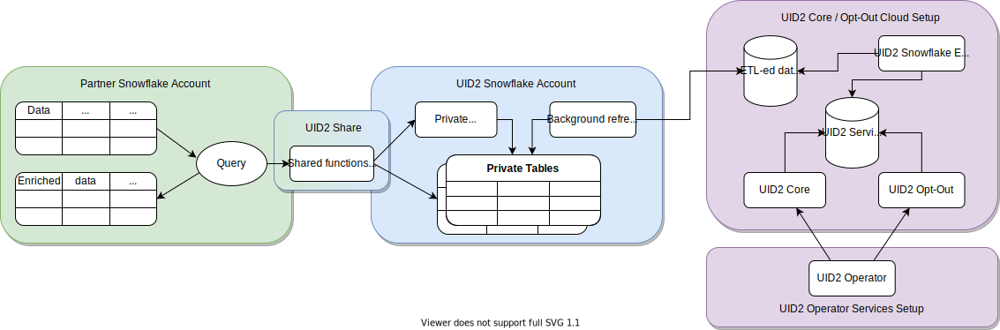

# Snowflake Integration

[Snowflake](https://www.snowflake.com/?lang=ja)はクラウドデータウェアハウスソリューションであり、パートナーであるお客様がデータを保存し、UID2とインテグレーションすることができます。Snowflakeを使用することで、UID2は、機密性の高いPIIを公開することなく、認可された消費者の識別子データを安全に共有することができます。Operator Web Servicesに直接消費者の識別子データを照会するオプションもありますが、Snowflake UID2インテグレーションはよりシームレスな体験を提供します。

次の図は、SnowflakeでのUID2インテグレーションプロセスへの関わり方を示しています:



|Partner Snowflake Account|UID2 Snowflake Account|UID2 Core Opt-out Cloud Setup|
| :--- | :--- | :--- |
| パートナーとして、データをホストするためのSnowflakeアカウントを設定し、UID2 Shareを通じて機能やビューを消費することでUID2インテグレーションを行います。 | SnowflakeアカウントでホストされているUID2インテグレーションは、プライベートテーブルからデータを引き出す認可された関数やビューへのアクセスを許可するものです。プライベート テーブルにはアクセスできません。UID2 共有は、UID2 関連のタスクを実行するのに必要な必須データのみを公開します。 | ETL（Extract Transform Load）ジョブは、UID2 Operator Web Servicesを動かす内部データとともに、UID2 Core/Optout Snowflakeストレージを常に更新します。Operator Web Servicesで使用されるデータは、UID2 Shareでも利用できます。 |
| 共有関数やビューを使用すると、Snowflakeにトランザクションの計算コストを支払うことになります。 | UID2 Snowflakeアカウントで保護されたこれらのプライベートテーブルは、UID2関連のタスクを完了するために使用される内部データを保持するUID2 Core/Optout Snowflakeストレージと自動的に同期します。 | |

## Access the UID2 Shares

UID2 Shareへのアクセスは、[Snowflake Data Marketplace](https://www.snowflake.com/data-marketplace/)を通じて、選択したUID2のパーソナライズドリストに基づいて特定のデータセットをリクエストすることができます。現在、UID2のスノーフレークデータマーケットプレイスでは、広告主・ブランド向けとデータプロバイダー向けの2つのパーソナライズドリストが提供されています。

>IMPORTANT: データをリクエストするには、Snowflakeアカウントに`ACCOUNTADMIN`ロール権限が必要です。

UID2 Shareへのアクセスをリクエストするには、以下の手順を実行します:

1.	Snowflake Data Marketplaceにログインし、興味のあるUID2ソリューションを選択します:
      - [Unified ID 2.0 Advertiser Identity Solution](https://app.snowflake.com/marketplace/listing/GZT0ZRYXTMV)
      - [Unified ID 2.0 Data Provider Identity Solution](https://app.snowflake.com/marketplace/listing/GZT0ZRYXTN0)
2.	**Personalized Data**のセクションで、**Request Data**をクリックします。
3.	画面の指示に従って、連絡先などの必要な情報を確認・入力してください。
4.	The Trade Deskの既存のお客様で、*Advertiser* Identity Solutionにご興味のある方は、データリクエストフォームの**Message**欄に、The Trade Deskが発行したパートナーおよび広告主のIDをご記入ください。
5.	フォームを送信します。

リクエストを受け取った後、UID2管理者が適切なアクセス方法を連絡します。Snowflakeでのデータリクエスト管理の詳細については、[Snowflake documentation](https://docs.snowflake.com/en/user-guide/data-marketplace-consumer.html)を参照してください。

## Shared Objects

選択したUID2ソリューションにかかわらず、以下の機能を使用して、単一または複数のメールアドレスまたはメールアドレスハッシュをUID2にマッピングすることができます:

- `FN_T_UID2_IDENTITY_MAP_EMAIL` (See [Map Email Addresses](#map-email-addresses))
- `FN_T_UID2_IDENTITY_MAP_EMAIL_HASH` (See [Map Email Address Hashes](#map-email-address-hashes))

再生成する必要のあるUID2を特定するには、UID2 Shareの`UID2_SALT_BUCKETS`ビューを使用します。詳細は[UID2の再生成](#regenerate-uid2s)を参照してください。

### Database and Schema Names

以下のセクションでは、各ソリューションのクエリ例を紹介します。これらは、データベースとスキーマ名の変数を除いて同一のものです。

```
{DATABASE_NAME}.{SCHEMA_NAME}
```
例:
```
select UID2, BUCKET_ID from table({DATABASE_NAME}.{SCHEMA_NAME}.FN_T_UID2_IDENTITY_MAP_EMAIL('validate@email.com'));
```

すべてのクエリの例では、各名前の変数に以下のデフォルト値を使用しています:

| Variable |Advertiser Solution Default Value | Data Provider Solution Default Value| Comments |
| :--- | :--- | :--- | :--- |
| `{DATABASE_NAME}` | `UID2_PROD_ADV_SH` | `UID2_PROD_DP_SH` | 必要に応じて、選択したUID2 Shareへのアクセスが許可された後に新しいデータベースを作成する際に、デフォルトのデータベース名を変更することができます。 |
| `{SCHEMA_NAME}`| `ADV` | `DP` | これは変更不能の名前です。 |

### Map Email Addresses

単一のメールアドレスや複数のメールアドレスを、対応するUID2やセカンドレベルのソルトバケットIDにマッピングするには、`FN_T_UID2_IDENTITY_MAP_EMAIL`関数を使います。この関数は、メールアドレスを引数として受け取り、UID2の [正規化](../../README.md#email-normalization)ルールを使って正規化します。

|Argument|Data Type|Description|
| :--- | :--- | :--- |
|　`EMAIL`　|　varchar(128)　| UID2とセカンドレベルのバケットIDにマッピングされるメールアドレス。 |

問い合わせに成功すると、指定されたメールアドレスの以下の情報が返されます。

>NOTE: リクエストの中に無効なメールアドレスがある場合は、`NULL`の値が返されます。

|　Column Name　|　Data Type|Description　|
| :--- | :--- | :--- |
| `UID2` | TEXT | メールアドレスに関連するUID。 |
| `BUCKET_ID` | TEXT | UID2の生成に使用されたセカンドレベルのソルトバケットのID。このIDは、`UID2_SALT_BUCKETS`ビューのバケットIDに対応しています。 |

#### Single Email Mapping Request Example

以下のクエリは、[デフォルトのデータベースとスキーマの名称](#database-and-schema-names)を使用して、1つのメールアドレスをマッピングする方法を示しています。

##### Advertiser Solution Query
```
select UID2, BUCKET_ID from table(UID2_PROD_ADV_SH.ADV.FN_T_UID2_IDENTITY_MAP_EMAIL('validate@email.com'));
```

##### Data Provider Solution Query
```
select UID2, BUCKET_ID from table(UID2_PROD_DP_SH.DP.FN_T_UID2_IDENTITY_MAP_EMAIL('validate@email.com'));
```

##### Results

```
+----------------------------------------------+------------+
| UID2                                         | BUCKET_ID  |
+----------------------------------------------+------------+
| 2ODl112/VS3x2vL+kG1439nPb7XNngLvOWiZGaMhdcU= | ad1ANEmVZ  |
+----------------------------------------------+------------+
```

#### Multiple Emails Mapping Request Example

以下のクエリは、[デフォルトのデータベースとスキーマの名称](#database-and-schema-names)を使用して、複数のメールアドレスをマッピングする方法を示しています。

##### Advertiser Solution Query
```
select a.ID, a.EMAIL, m.UID2, m.BUCKET_ID from AUDIENCE a LEFT JOIN(
    select ID, t.* from AUDIENCE, lateral UID2_PROD_ADV_SH.ADV.FN_T_UID2_IDENTITY_MAP_EMAIL(EMAIL) t) m
    on a.ID=m.ID;
```
##### Data Provider Solution Query
```
select a.ID, a.EMAIL, m.UID2, m.BUCKET_ID from AUDIENCE a LEFT JOIN(
    select ID, t.* from AUDIENCE, lateral UID2_PROD_DP_SH.DP.FN_T_UID2_IDENTITY_MAP_EMAIL(EMAIL) t) m
    on a.ID=m.ID;
```

##### Results

以下のテーブルは、不適切にフォーマットされたメールに対する `NULL` 値を含む、レスポンスの各項目を示しています。

```
+----+--------------------+----------------------------------------------+------------+
| ID | EMAIL              | UID2                                         | BUCKET_ID  |
+----+--------------------+----------------------------------------------+------------+
|  1 | validate@email.com | 2ODl112/VS3x2vL+kG1439nPb7XNngLvOWiZGaMhdcU= | ad1ANEmVZ  |
|  2 | test@uidapi.com    | IbW4n6LIvtDj/8fCESlU0QG9K/fH63UdcTkJpAG8fIQ= | a30od4mNRd |
|  3 | NULL               | NULL                                         | NULL       |
+----+--------------------+----------------------------------------------+------------+
```

### Map Email Address Hashes

1つまたは複数のメールアドレスハッシュを、対応するUID2とセカンドレベルのソルトバケットIDにマッピングするには、メールアドレスハッシュを引数にとる`FN_T_UID2_IDENTITY_MAP_EMAIL_HASH`関数を使います。

|Argument|Data Type|Description|
| :--- | :--- | :--- |
|`EMAIL_HASH`|varchar(128)| ユーザーの正規化されたメールアドレスのbase64エンコードされたSHA256ハッシュです。メールアドレスハッシュが[正規化](../../README.md#email-normalization)ルールを使って正しくフォーマットされていることを確認してください。正規化されたメールアドレスから計算されたハッシュを使用してください。|

クエリが成功すると、指定されたメールアドレスハッシュについて以下の情報が返されます。

>NOTE: リクエストの中に不適切なフォーマットのメールアドレスハッシュがある場合は、`NULL`の値が返されます。

|Column Name|Data Type|Description|
| :--- | :--- | :--- |
| `UID2` | TEXT | メールアドレスに関連するUID2。 |
| `BUCKET_ID` | TEXT | UID2の生成に使用されたセカンドレベルのソルトバケットのID。このIDは、`UID2_SALT_BUCKETS`ビューのバケットIDに対応しています。 |

#### Single Email Hash Mapping Request Example

以下のクエリは、[デフォルトのデータベースとスキーマの名称](#database-and-schema-names)を使用して、1つのメールアドレスハッシュをマッピングする方法を示しています。

##### Advertiser Solution Query

```
select UID2, BUCKET_ID from table(UID2_PROD_ADV_SH.ADV.FN_T_UID2_IDENTITY_MAP_EMAIL(BASE64_ENCODE(SHA2_BINARY('validate@email.com', 256))));
```

##### Data Provider Solution Query

```
select UID2, BUCKET_ID from table(UID2_PROD_DP_SH.DP.FN_T_UID2_IDENTITY_MAP_EMAIL(BASE64_ENCODE(SHA2_BINARY('validate@email.com', 256))));
```

##### Results

```
+----------------------------------------------+------------+
| UID2                                         | BUCKET_ID  |
+----------------------------------------------+------------+
| 2ODl112/VS3x2vL+kG1439nPb7XNngLvOWiZGaMhdcU= | ad1ANEmVZ  |
+----------------------------------------------+------------+
```

#### Multiple Email Hashes Mapping Request Example

以下のクエリは、[デフォルトのデータベースとスキーマの名称](#database-and-schema-names)を使用して、複数のメールアドレスハッシュをマッピングする方法を示しています。

##### Advertiser Solution Query
```
select a.ID, a.EMAIL_HASH, m.UID2, m.BUCKET_ID from AUDIENCE a LEFT JOIN(
    select ID, t.* from AUDIENCE, lateral UID2_PROD_ADV_SH.ADV.FN_T_UID2_IDENTITY_MAP_EMAIL_HASH(EMAIL_HASH) t) m
    on a.ID=m.ID;
```

##### Data Provider Solution Query
```
select a.ID, a.EMAIL_HASH, m.UID2, m.BUCKET_ID from AUDIENCE a LEFT JOIN(
    select ID, t.* from AUDIENCE, lateral UID2_PROD_DP_SH.DP.FN_T_UID2_IDENTITY_MAP_EMAIL_HASH(EMAIL_HASH) t) m
    on a.ID=m.ID;
```

##### Results

以下のテーブルは、不適切にフォーマットされたメールアドレスハッシュに対する `NULL` 値を含む、レスポンスの各項目を示しています。

```
+----+----------------------------------------------+----------------------------------------------+------------+
| ID | EMAIL_HASH                                   | UID2                                         | BUCKET_ID  |
+----+----------------------------------------------+----------------------------------------------+------------+
|  1 | LdhtUlMQ58ZZy5YUqGPRQw5xUMS5dXG5ocJHYJHbAKI= | 2ODl112/VS3x2vL+kG1439nPb7XNngLvOWiZGaMhdcU= | ad1ANEmVZ  |
|  2 | NULL                                         | NULL                                         | NULL       |
|  3 |/XJSTajB68SCUyuc3ePyxSLNhxrMKvJcjndq8TuwW5g=  | IbW4n6LIvtDj/8fCESlU0QG9K/fH63UdcTkJpAG8fIQ= | a30od4mNRd |
+----+----------------------------------------------+----------------------------------------------+------------+
```

### Regenerate UID2s

`UID2_SALT_BUCKETS`ビューのクエリは、セカンドレベルのソルトバケットが最後に更新された日時を返します。セカンドレベルソルトはUID2を生成する際に使用されます。バケット内のソルトが更新されると、以前に生成されたUID2は古くなり、他のパーティが同じユーザに対して生成したUID2と一致しなくなります。

再生成が必要なUID2を判断するには、UID2が生成されたときのタイムスタンプと、セカンドレベルのソルトバケット更新の最新のタイムスタンプを比較します。

|Column Name|Data Type|Description|
| :--- | :--- | :--- |
| `BUCKET_ID` | TEXT | セカンドレベルのソルトバケットのID。このIDは、IDマップ関数が返す `BUCKET_ID` と同じです。`BUCKET_ID`をキーにして、関数の呼び出し結果とこのビューの呼び出し結果の間でジョインクエリを実行します。 |
| `LAST_SALT_UPDATE_UTC` | TIMESTAMP_NTZ | バケットのソルトが最後に更新された時間。この値はUTCタイムゾーンです。 |

次の例は、入力テーブルと、セカンドレベルソルトの更新により再生成が必要なテーブル内のUID2を見つけるために使用されるクエリを示しています。

#### Targeted Input Table

```
select * from AUDIENCE_WITH_UID2;
```
```
+----+--------------------+----------------------------------------------+------------+-------------------------+
| ID | EMAIL              | UID2                                         | BUCKET_ID  | LAST_UID2_UPDATE_UTC    |
+----+--------------------+----------------------------------------------+------------+-------------------------+
|  1 | validate@email.com | 2ODl112/VS3x2vL+kG1439nPb7XNngLvOWiZGaMhdcU= | ad1ANEmVZ  | 2021-03-01 00:00:00.000 |
|  2 | test1@uidapi.com   | Q4A5ZBuBCYfuV3Wd8Fdsx2+i33v7jyFcQbcMG/LH4eM= | ad1ANEmVZ  | 2021-03-03 00:00:00.000 |
|  3 | test2@uidapi.com   | NULL                                         | NULL       | NULL                    |
+----+--------------------+----------------------------------------------+------------+-------------------------+
```

見つからないUID2や古くなったUID2を見つけるには、[デフォルトのデータベースとスキーマの名称](#database-and-schema-names)を使用した以下のクエリ例を使用します。

##### Advertiser Solution Query
```
select a.*, b.LAST_SALT_UPDATE_UTC
  from AUDIENCE_WITH_UID2 a LEFT OUTER JOIN UID2_PROD_ADV_SH.ADV.UID2_SALT_BUCKETS b
  on a.BUCKET_ID=b.BUCKET_ID
  where a.LAST_UID2_UPDATE_UTC < b.LAST_SALT_UPDATE_UTC or a.UID2 IS NULL;
```

##### Data Provider Solution Query
```
select a.*, b.LAST_SALT_UPDATE_UTC
  from AUDIENCE_WITH_UID2 a LEFT OUTER JOIN UID2_PROD_DP_SH.DP.UID2_SALT_BUCKETS b
  on a.BUCKET_ID=b.BUCKET_ID
  where a.LAST_UID2_UPDATE_UTC < b.LAST_SALT_UPDATE_UTC or a.UID2 IS NULL;
```

##### Results

以下のテーブルはレスポンスの各項目を示したものです。結果には、以下のID 1の例のように、メール、`UID2`、`BUCKET_ID`、`LAST_UID2_UPDATE_UTC`、`LAST_SALT_UPDATE_UTC`が含まれています。ID 2については、対応するUID2が最後のバケットアップデート後に生成されたため、情報は返されません。ID 3については、UID2が存在しないため、`NULL`の値が返されます。

```
+----+--------------------+----------------------------------------------+------------+-------------------------+-------------------------+
| ID | EMAIL              | UID2                                         | BUCKET_ID  | LAST_UID2_UPDATE_UTC    | LAST_SALT_UPDATE_UTC    |
+----+--------------------+----------------------------------------------+------------+-------------------------+-------------------------+
|  1 | validate@email.com | 2ODl112/VS3x2vL+kG1439nPb7XNngLvOWiZGaMhdcU= | ad1ANEmVZ  | 2021-03-01 00:00:00.000 | 2021-03-02 00:00:00.000 |
|  3 | test2@uidapi.com   | NULL                                         | NULL       | NULL                    | NULL                    |
+----+--------------------+----------------------------------------------+------------+-------------------------+-------------------------+
```
