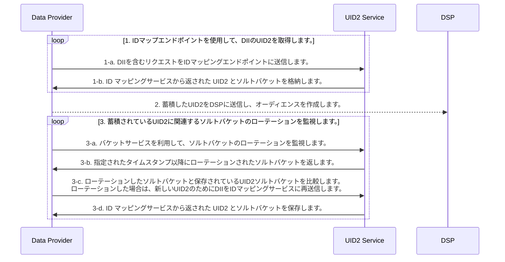

[UID2 Overview](../../../README-ja.md) > [Getting Started](../../README.md) > [v2](../summary-doc-v2.md) > [Integration Guides](summary-guides.md) > Advertiser/Data Provider Integration Guide

# Advertiser/Data Provider Integration Guide

このガイドでは、ユーザーデータを収集し、DSP にプッシュする組織のためのインテグレーション手順について説明します。データコレクターには、広告主、データオンボーダー、測定プロバイダー、ID グラフプロバイダー、サードパーティデータプロバイダー、および DSP にデータを送信する他の組織が含まれます。

このガイドには、次のセクションがあります:

- [Integration Steps（インテグレーション手順）](#integration-steps)
  - [Retrieve a raw UID2 for DII using the identity map endpoints（ID マップエンドポイントを使用して、DII の raw UID2 を取得する）](#retrieve-a-raw-uid2-for-dii-using-the-identity-map-endpoints)
  - [Send raw UID2 to a DSP to build an audience（raw の UID2 を DSP に送り、オーディエンスを構築する）](#send-raw-uid2-to-a-dsp-to-build-an-audience)
  - [Monitor for salt bucket rotations related to your stored UID2s（保存されている UID2 に関連するソルトバケットのローテーションをモニターする）](#monitor-for-salt-bucket-rotations-related-to-your-stored-raw-uid2s)
  - [Use an incremental process to continuously update UID2s（インクリメンタルプロセスを使用して、UID2 を継続的に更新する）](#use-an-incremental-process-to-continuously-update-raw-uid2s)
- [FAQs（よくある質問）](#faqs)

Snowflake Data Marketplace でホストされる Open Operator Service を使用する場合は、[Snowflake Integration Guide](../guides/snowflake_integration.md) も参照してください。

## Integration Steps

次の図は、オーディエンスの構築とターゲティングのために、データコレクターが DII を UID2 識別子にマッピングするために完了しなければならない手順の概要を示しています。DII とは、ユーザーの正規化されたメールアドレスまたは電話番号、あるいは正規化され SHA-256 ハッシュ化されたメールアドレスまたは電話番号のことを指します。

### Retrieve a raw UID2 for DII using the identity map endpoints

| Step | Endpoint                                                          | Description                                                                                                                                                                                                                                                                                                                                                                                                                                                                                                                                                                                                                                                                                                                                                                                                                                                  |
| ---- | ----------------------------------------------------------------- | ------------------------------------------------------------------------------------------------------------------------------------------------------------------------------------------------------------------------------------------------------------------------------------------------------------------------------------------------------------------------------------------------------------------------------------------------------------------------------------------------------------------------------------------------------------------------------------------------------------------------------------------------------------------------------------------------------------------------------------------------------------------------------------------------------------------------------------------------------------ |
| 1-a  | [POST /identity/map](../endpoints/post-identity-map.md)リクエスト | DII を含むリクエストを ID マッピングエンドポイントに送信します。                                                                                                                                                                                                                                                                                                                                                                                                                                                                                                                                                                                                                                                                                                                                                                                             |
| 1-b  | [POST /identity/map](../endpoints/post-identity-map.md)レスポンス | レスポンスで返される`advertising_id`（raw UID2）は、関連する DSP でオーディエンスをターゲティングするために使用できます。 このレスポンスは、ユーザーの raw UID2 と、ソルトバケットの対応する`bucket_id`を返します。バケットに割り当てられたソルトは毎年ローテーションされるため、生成される UID2 に影響を及ぼします。ソルトバケットのローテーションを確認する方法の詳細は、[Monitor for salt bucket rotations](#monitor-for-salt-bucket-rotations-related-to-your-stored-raw-uid2s)を参照してください。  メンテナンスを容易にするために、ユーザーの raw UID2 と `bucket_id` をマッピングテーブルに格納することが推奨されるアプローチです。インクリメンタルアップデートに関するガイダンスは、[Use an-incremental-process-to-continuously-update raw-UID2s](#use-an-incremental-process-to-continuously-update-raw-uid2s) を参照してください。 |

### Send raw UID2 to a DSP to build an audience

[前のステップ](#retrieve-a-raw-uid2-for-dii-using-the-identity-map-endpoints)（ステップ 1-b）で返した `advertising_id` (raw UID2) をオーディエンスを構築しながら DSP に送ります。各 DSP は、オーディエンスを構築するための独自のインテグレーションプロセスを持っています。DSP が提供する、raw UID2 を送信してオーディエンスを構築するためのインテグレーションガイダンスにしたがってください。

### Monitor for salt bucket rotations related to your stored raw UID2s

raw UID2 は、特定の時点のユーザーに対する識別子です。特定のユーザーの raw UID2 は、ソルトのローテーションの結果、少なくとも 1 年に 1 回は変化します。

ソルトバケットの更新は 1 年に 1 回程度ですが、個々のバケットの更新は 1 年に分散しています。全ソルトバケットの約 1/365 を毎日ローテーションしています。

> IMPORTANT: あなたのインテグレーションが最新の raw UID2 を持っていることを確認するために、アクティブなユーザーのソルトバケットのローテーションを毎日チェックしてください。

| Step | Endpoint                                                        | Description                                                                                                                                                                                                                           |
| ---- | --------------------------------------------------------------- | ------------------------------------------------------------------------------------------------------------------------------------------------------------------------------------------------------------------------------------- |
| 3-a  | [POST /identity/buckets](../endpoints/post-identity-buckets.md) | 特定のタイムスタンプ以降に変更されたすべてのソルトバケットについて、バケットステータスエンドポイントにリクエストを送信します。                                                                                                        |
| 3-b  | [POST /identity/buckets](../endpoints/post-identity-buckets.md) | バケットステータスエンドポイントは、 `bucket_id` と `last_updated` のタイムスタンプのリストを返します。                                                                                                                               |
| 3-c  | [POST /identity/map](../endpoints/post-identity-map.md)         | 返された`bucket_id`を、キャッシュしておいた raw UID2 のソルトバケットと比較します。 1 つ以上の raw UID2 についてソルトバケットが更新されていることがわかったら、新しい UID2 について ID マッピングサービスに DII を再送信します。 |
| 3-d  | [POST /identity/map](../endpoints/post-identity-map.md)         | `advertising_id`と`bucket_id`に返された新しい値を保存します。                                                                                                                                                                         |

### Use an incremental process to continuously update raw UID2s

UID2 ベースのオーディエンス情報を正確かつ最新の状態に保つために、毎日以下のインテグレーション手順を実行してください。

1. [Retrieve a raw UID2 for DII using the identity map endpoints](#retrieve-a-raw-uid2-for-dii-using-the-identity-map-endpoints)からの応答には、マッピング情報が含まれています。DII (`identifier`), raw UID2 (`advertising_id`), ソルトバケット (`bucket_id`) 間のマッピングを、最新の `last_updated` タイムスタンプとともにキャッシュします。

2. 直前の[ソルトバケットローテーションステップ](#monitor-for-salt-bucket-rotations-related-to-your-stored-raw-uid2s) の結果を使用して、[ID マップエンドポイントを使用して raw UID2 を取得](#retrieve-a-raw-uid2-for-dii-using-the-identity-map-endpoints) して、ソースバケットがローテーションされた raw UID2 をマッピングしなおしてください。オーディエンスの UID2 を更新するには、[DSP に送信](#send-raw-uid2-to-a-dsp-to-build-an-audience)します。

## FAQs

UID2 フレームワークを使用する広告主およびデータプロバイダー向けのよくある質問は、[FAQs for Advertisers and Data Providers](../getting-started/gs-faqs.md#faqs-for-advertisers-and-data-providers) を参照してください。

すべてのリストは、[Frequently Asked Questions](../getting-started/gs-faqs.md)を参照してください。
