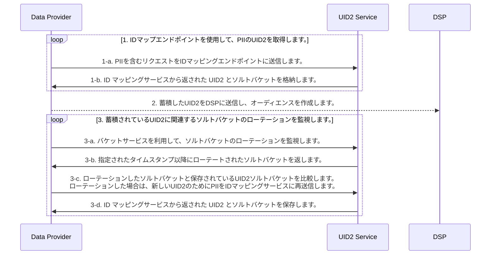

[UID2 Overview](../../../README.md) > [Getting Started](../../README.md) > [v2](../summary-doc-v2.md) > [Integration Guides](summary-guides.md) > Advertiser/Data Provider Integration Guide

# Advertiser/Data Provider Integration Guide

このガイドでは、ユーザーデータを収集し、DSP にプッシュする組織のためのインテグレーション手順について説明します。データコレクターには、広告主、データオンボーダー、測定プロバイダー、ID グラフプロバイダー、サードパーティデータプロバイダ、および DSP にデータを送信する他の組織が含まれます。このガイドには、次のセクションがあります:

- [Integration Steps](#integration-steps)
  - [Retrieve a UID2 for PII using the identity map endpoints](#retrieve-a-uid2-for-pii-using-the-identity-map-endpoints)
  - [Send UID2 to a DSP to build an audience](#send-uid2-to-a-dsp-to-build-an-audience)
  - [Monitor for salt bucket rotations related to your stored UID2s](#monitor-for-salt-bucket-rotations-related-to-your-stored-uid2s)
  - [Use an incremental process to continuously update UID2s](#use-an-incremental-process-to-continuously-update-uid2)
- [FAQs](#faqs)

Snowflake Data Marketplace でホストされる Open Operator Service を使用する場合は、[Snowflake Integration Guide](../sdks/snowflake_integration.md) も参照してください。

## Integration Steps

次の図は、データコレクターがオーディエンスの構築とターゲティングのために、PII を UID2 識別子にマッピングするために必要なステップの概要を示しています。PII とは、ユーザーの正規化されたメールアドレス、または正規化され SHA256 ハッシュ化されメールアドレスのことを指します。

### Retrieve a UID2 for PII using the identity map endpoints

| Step | Endpoint                                                | Description                                                                                                                                                                                                                                                                                                                                                                                                                                                                                                                                                                                                                                                                                                                                                                                                     |
| ---- | ------------------------------------------------------- | --------------------------------------------------------------------------------------------------------------------------------------------------------------------------------------------------------------------------------------------------------------------------------------------------------------------------------------------------------------------------------------------------------------------------------------------------------------------------------------------------------------------------------------------------------------------------------------------------------------------------------------------------------------------------------------------------------------------------------------------------------------------------------------------------------------- |
| 1-a  | [POST /identity/map](../endpoints/post-identity-map.md) | PII を含むリクエストを ID マッピングエンドポイントに送信します。                                                                                                                                                                                                                                                                                                                                                                                                                                                                                                                                                                                                                                                                                                                                                |
| 1-b  | [POST /identity/map](../endpoints/post-identity-map.md) | 返却された `advertising_id` (UID2) は、関連する DSP でオーディエンスをターゲットするために使用できます。 レスポンスは、ユーザーの UID2 とそれに対応するソルトを割り当てたバケットの `bucket_id` を返します。バケットに割り当てられたソルトは毎年ローテーションされるため、生成される UID2 にも影響があります。ソルトバケットのローテーションを確認する方法の詳細については、 [ソルトバケットローテーションの監視](#monitor-for-salt-bucket-rotations-related-to-your-stored-uid2s) を参照してください。 メンテナンスを容易にするために、ユーザーの UID2 と `bucket_id` をマッピングテーブルで保存することを推奨します。インクリメンタルな更新についてのガイダンスは、[インクリメンタルプロセスで UID2 を継続的に更新する](#use-an-incremental-process-to-continuously-update-uid2) を参照してください。 |

### Send UID2 to a DSP to build an audience

オーディエンスを構築する際の [前段階](#retrieve-a-uid2-for-pii-using-the-identity-map-endpoints) として `advertising_id` (UID2) を DSP に送信してください。オーディエンスを構築するためのインテグレーションプロセスは、各 DSP で独自に設定されています。UID2 を送信してオーディエンスを構築するには、DSP が提供するインテグレーションガイダンスに従ってください。

### Monitor for salt bucket rotations related to your stored UID2s

UID2 は特定の時点におけるユーザーの識別子であるため、ユーザーの UID2 は少なくとも年に一度入れ替わることになります。

各ソルトバケットはだいたい 1 年に 1 回更新されるとはいえ、個々のバケットの更新は 1 年に分散して行われます。これは、全バケットの約 1/365 が毎日ローテーションされることを意味します。

> IMPORTANT: あなたのインテグレーションが最新の UID2 を持っていることを確認するために、アクティブなユーザーのソルトバケットのローテーションを毎日チェックしてください。

| Step | Endpoint                                                        | Description                                                                                                                                                                                    |
| ---- | --------------------------------------------------------------- | ---------------------------------------------------------------------------------------------------------------------------------------------------------------------------------------------- |
| 3-a  | [POST /identity/buckets](../endpoints/post-identity-buckets.md) | 指定されたタイムスタンプ以降に変更されたすべてのソルトバケットのリクエストをバケットステータスエンドポイントに送信します。                                                                     |
| 3-b  | [POST /identity/buckets](../endpoints/post-identity-buckets.md) | バケットステータスエンドポイントは、 `bucket_id` と `last_updated` のタイムスタンプのリストを返します。                                                                                        |
| 3-c  | [POST /identity/map](../endpoints/post-identity-map.md)         | 返された `bucket_id` を、キャッシュした UID2 のソルトバケットと比較します。 UID2 のソルトバケットがローテーションした場合は、新しい UID2 用に PII を ID マッピングサービスに再送信します。 |
| 3-d  | [POST /identity/map](../endpoints/post-identity-map.md)         | 返された `advertising_id` と `bucket_id` を格納します。                                                                                                                                        |

### Use an incremental process to continuously update UID2

UID2 ベースのオーディエンスを上記の手順で継続的に更新・維持します。

[UID2 取得手順](#retrieve-a-uid2-for-pii-using-the-identity-map-endpoints) からの応答には、マッピング情報が含まれています。PII (`identifier`), UID2 (`advertising_id`), ソルトバケット (`bucket_id`) の間のマッピングと、最終更新タイムスタンプをキャッシュすることができます。

[ソルトバケットのローテーションを監視](#monitor-for-salt-bucket-rotations-related-to-your-stored-uid2s) の結果から、[ID マップエンドポイントを使用して UID2 を取得](#retrieve-a-uid2-for-pii-using-the-identity-map-endpoints) することでローテーションしたソルトバケットの UID2 をリマップすることができます。オーディエンスの UID2 を更新するには、[DSP に送信](#send-uid2-to-a-dsp-to-build-an-audience) します。

## FAQs

UID2 フレームワークを使用する広告主およびデータプロバイダー向けのよくある質問については、[FAQs for Advertisers and Data Providers](../getting-started/gs-faqs.md#faqs-for-advertisers-and-data-providers) を参照して下さい。

すべてのリストは、[Frequently Asked Questions](../getting-started/gs-faqs.md)を参照して下さい。
