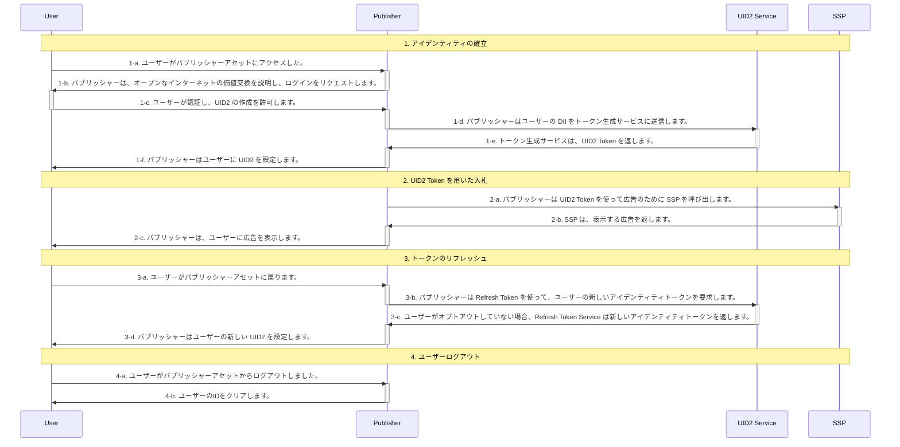

[UID2 Overview](../../../README-ja.md) > [Getting Started](../../README.md) > [v2](../summary-doc-v2.md) > [Integration Guides](summary-guides.md) > Publisher Integration Guide, Server-Only (Without SDK)

# Publisher Integration Guide, Server-Only (Without SDK)

このガイドは、UID2 対応のシングルサインオンや ID プロバイダーではなく、UID2 と直接インテグレーションしながら、RTB ビッドストリーム用に UID2 を利用した ID トークンを生成したいと考えるアプリ開発者や CTV 放送局を対象としています。

以下のセクションが含まれています:

- [Introduction（はじめに）](#introduction)
- [Integration Steps（インテグレーション手順）](#integration-steps)
  - [Establish Identity: User Login（アイデンティティを確立する: ユーザーログイン）](#establish-identity-user-login)
  - [Bid Using UID2 Tokens（UID2 Token を使った入札）](#bid-using-uid2-tokens)
  - [Refresh Tokens（トークンのリフレッシュ）](#refresh-tokens)
  - [Clear Identity: User Logout（アイデンティティの消去: ユーザーログアウト）](#clear-identity-user-logout)
- [FAQs（よくある質問）](#faqs)

## Introduction

このガイドでは、SDK を使用せずにインテグレーションを行う場合に考慮する必要がある[基本的な手順](#integration-steps)を概説します。たとえば、ユーザーのログインとログアウトの実装方法、UID2 ID 情報の管理とターゲティング広告への使用方法、トークンのリフレッシュ、ID の欠落への対処、ユーザーのオプトアウトの処理方法などを決定する必要があります。[FAQ](#faqs)も参照してください。

パブリッシャーが UID2 とインテグレーションするために利用できるオプションは以下のとおりです:

- Client JavaScript SDK, with UID2 SDK for Java on the server.
- Client JavaScript SDK, with custom server code.
- Server-only integration, with UID2 SDK for Java on server.
- Server-only integration, with custom server code.

このドキュメントでは、最後の選択肢について詳細を説明します。

ワークフローを示す[アプリケーション例](https://example-srvonly-integ.uidapi.com/)はこちらです。アプリケーションのドキュメントは、[Server-Only UID2 Integration Example](https://github.com/IABTechLab/uid2-examples/blob/main/publisher/server_only/README.md)を参照してください。また、[FAQ](#faqs)も参照してください。

> TIP: UID2 を使ったクライアント ID の確立と Advertising Token の取得を容易にするために、[Client-Side JavaScript SDK (v2)](../sdks/client-side-identity.md) を使用することを検討してください。詳しくは、[Client-Side JavaScript SDK Integration Guide](./publisher-client-side.md) を参照してください。

## Integration Steps

以下の図は、ユーザーがパブリッシャーと UID2 Token を確立するために必要なステップと、UID2 Token が RTB ビッドストリームとどのようにインテグレーションされるかを概説したものです。

次のセクションでは、図中の各ステップについて詳細を説明します:

1.  [Establish identity: user login](#establish-identity-user-login)
2.  [Bid using UID2 tokens](#bid-using-uid2-tokens)
3.  [Refresh tokens](#refresh-tokens)
4.  [Clear Identity: user logout](#clear-identity-user-logout)

### Establish Identity: User Login

ステップ 1-c で認証が行われ、ユーザーに規約を受け入れてもらい、パブリッシャーがメールアドレスや電話番号を検証した後、サーバーサイドで UID2 Token を生成する必要があります。次の表は、トークン生成のステップの詳細を示しています。

| Step | Endpoint                                                    | Description                                                                                                                                                                                                                                                                                                                                |
| :--- | :---------------------------------------------------------- | :----------------------------------------------------------------------------------------------------------------------------------------------------------------------------------------------------------------------------------------------------------------------------------------------------------------------------------------- |
| 1-d  | [POST /token/generate](../endpoints/post-token-generate.md) | パブリッシャーが UID2 を使用してアイデンティティを確立するには、2 つの方法があります: - UID2 対応のシングルサインオンプロバイダーとインテグレーションします。 - [POST /token/generate](../endpoints/post-token-generate.md) エンドポイントを使って、ユーザーの正規化したメールアドレスまたは電話番号から UID2 Token を生成します。 |
| 1-e  | [POST /token/generate](../endpoints/post-token-generate.md) | ユーザーのメールアドレス、電話番号、またはそれぞれのハッシュから生成された UID2 Token を返します。                                                                                                                                                                                                                                         |
| 1-f  | N/A                                                         | 返された `advertising_token` と `refresh_token` は、ユーザーに紐づくストレージに保存します。ファーストパーティクッキーのようなクライアントサイドのストレージや、サーバーサイドのストレージを検討するとよいでしょう。                                                                                                                       |

### Bid Using UID2 Tokens

UID2 ID 情報をどのように管理し、ターゲティング広告に使用したいか、たとえば返された Advertising Token を SSP に渡すかについて検討する必要があります。

| Step | Endpoint | Description                                                                                                                       |
| :--- | :------- | :-------------------------------------------------------------------------------------------------------------------------------- |
| 2-a  | N/A      | ステップ [1-e](#establish-identity-user-login) の `advertising_token` を入札のために SSP に送信します。そのままの値を送信します。 |

### Refresh Tokens

リフレッシュエンドポイントを活用して、最新バージョンの UID2 Token を取得します。ユーザーの UID2 ローテーションとオプトアウトの状態を同期させるには、UID2 Token をリフレッシュする必要があります。ユーザーがオプトアウトした場合、その Refresh Token を使用すると、トークン更新チェーンが終了します。

| Step | Endpoint                                                  | Description                                                                                                                                                                                                          |
| :--- | :-------------------------------------------------------- | :------------------------------------------------------------------------------------------------------------------------------------------------------------------------------------------------------------------- |
| 3-a  | N/A                                                       | ユーザーがアセットに戻り、再びアクティブになったとき、ID トークンをリフレッシュしてから、SSP に送信します。                                                                                                          |
| 3-b  | [POST /token/refresh](../endpoints/post-token-refresh.md) | ステップ [1-e](#establish-identity-user-login) で取得した `refresh_token` をクエリパラメータとして送信します。                                                                                                       |
| 3-c  | [POST /token/refresh](../endpoints/post-token-refresh.md) | UID2 Service は、オプトアウトしていないユーザーに対して新しい ID トークンを発行します。                                                                                                                              |
| 3-d  | N/A                                                       | 返された `advertising_token` と `refresh_token` は、ユーザーに紐づくストレージに保存します。ファーストパーティクッキーのようなクライアントサイドのストレージや、サーバーサイドのストレージを検討するとよいでしょう。 |

> TIP: [POST /token/generate](../endpoints/post-token-generate.md) または [POST /token/refresh](../endpoints/post-token-refresh.md) コールによって返された ID の `refresh_from` タイムスタンプからトークンのリフレッシュを始めてください。

### Clear Identity: User Logout

| Step | Endpoint | Description                                                                                       |
| :--- | :------- | :------------------------------------------------------------------------------------------------ |
| 4-a  | N/A      | ユーザーがパブリッシャーアセットからログアウトしました。                                          |
| 4-b  | N/A      | そのユーザー用に保存してある UID2 Token を削除します。UID2 Service とのやりとりは必要ありません。 |

## FAQs

パブリッシャー向けのよくある質問は、[FAQs for Publishers Not Using an SDK](../getting-started/gs-faqs.md#faqs-for-publishers-not-using-an-sdk) を参照してください。

すべてのリストは、[Frequently Asked Questions](../getting-started/gs-faqs.md)を参照してください。
