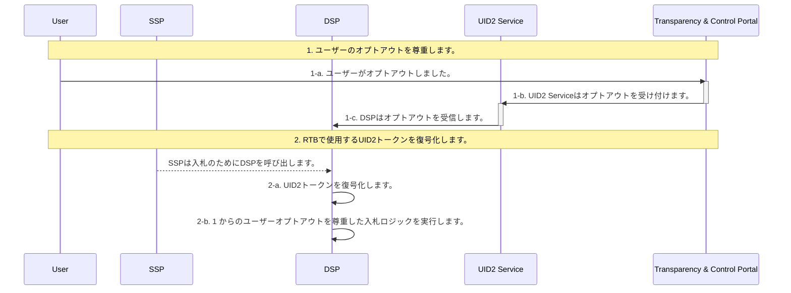
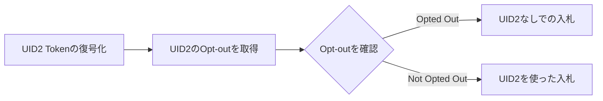

[UID2 API Documentation](../../README.md) > [v2](../README.md) > [Integration Guides](README.md) > DSP Integration Guide

# DSP Integration Guide

本ガイドは、ビッドストリームで UID2 を取引する DSP のためのもので、次のセクションがあります:

- [Integration Steps](#integration-steps)
- [FAQs](#faqs)

## Integration Steps

以下は、RTB で UID2 をサポートするための DSP のインテグレーションワークフローで、大きく 2 つのステップで構成されています:

1. [Honor user opt-outs](#honor-user-opt-outs)
2. [Decrypt UID2 tokens to use in RTB](#decrypt-uid2-tokens-for-rtb-use)



### Honor User Opt-Outs

UID2 Service からのユーザーのオプトアウトを受け取り、それを尊重するために、DSP はオンボーディング時に、あらかじめ設定されたインターフェースを UID2 Service に提供します。UID2 Service は、ユーザーの UID2 とオプトアウトのタイムスタンプを、事前に設定されたインターフェースに送信します。インターフェースの例としては、webhooks や API エンドポイントなどがあります。

UID2 Service は、ユーザーがオプトアウトしてから数秒以内に以下のデータを送信します。これを DSP が記録し、[Decrypt UID2 Tokens for RTB Use](#decrypt-uid2-tokens-for-rtb-use) で定義されている入札ロジックを使用するようにします。

| Parameter   | Description                            |
| :---------- | :------------------------------------- |
| `identity`  | オプトアウトしたユーザーの UID2 です。 |
| `timestamp` | ユーザーがオプトアウトした時刻です。   |

次の例は、UID2 とそれに対応するタイムスタンプを受信するように設定された Webhook を示しています。

```html
https://dsp.example.com/optout?user=%%identity%%&optouttime=%%timestamp%%
```

#### Bidding Opt-Out Logic

入札時（2-b）に以下のロジックを使用し、ユーザーのオプトアウトを尊重します。

提供されている [RTB SDK](../sdks/dsp-client-v1-overview.md) を活用して、受信した UID2 Token を復号化することができます。レスポンスには UID2 と UID2 が作成された時刻が含まれ、以下の擬似コードでは `established_timestamp`と表現されます。DSP は UID2 の最新のオプトアウトタイムスタンプを確認する必要があります。以下の疑似コードでは `optout_timestamp`と表現されています。

オプトアウトのロジックを次の図に示します。



もし`established_timestamp`の値が`optout_timestamp`の値より小さい場合は、ユーザーがオプトアウトしたことになり、UID2 は RTB に使用するべきではありません。このような場合、代替 ID を送信して入札するか、入札しないかは、DSP の判断によります。

<b>Check Opt-Out</b> ステップのロジックは以下の通りです。

```java
if (established_timestamp < optout_timestamp) {
  // Opted out
}
```

### Decrypt UID2 Tokens for RTB Use

| Step | SDK                                          | Description                                                                                                                                                                                   |
| :--- | :------------------------------------------- | :-------------------------------------------------------------------------------------------------------------------------------------------------------------------------------------------- |
| 2-a  | [RTB SDK](../sdks/dsp-client-v1-overview.md) | 提供されている SDK を活用して、入力された UID2 Token を復号化します。レスポンスには `UID2` と UID2 の作成時刻が含まれます。                                                                   |
| 2-b  |                                              | DSP は UID2 のオプトアウトプロトコルを尊重することが要求されます。ユーザーオプトアウトの設定と入札時の尊重については、[ユーザーオプトアウトの尊重](#honor-user-opt-outs) を参照してください。 |

## FAQs

### UID2 に適用する復号化鍵はどうすればよいのですか？

復号化鍵の更新は、提供される [RTB SDK](../sdks/dsp-client-v1-overview.md) によって自動的に処理されます。UID2 Token のメタデータには、暗号時のタイムスタンプが記載されており、どの復号化鍵が適用されるかが分かります。

### 復号鍵はどこで手に入りますか？

[RTB SDK](../sdks/dsp-client-v1-overview.md) ライブラリはバックグラウンドで UID2 　 Service と通信し、定期的に最新のキーを取得します。

### ソルトバケットがローテーションしたか、またいつローテーションしたかを知るにはどうしたらよいですか？

DSP は、UID2 ソルトバケットがいつローテーションされたかを知ることができません。これは、ユーザーが Cookie をクリアしても、DSP は気づかないのと同じです。ソルトバケットのローテーションは DSP に大きな影響を与えません。

### DSP はレイテンシーを気にする必要がありますか？

UID2 Service は、入札プロセスに遅延を発生させません。遅延が発生した場合は、UID2 Service ではなく、ネットワークに起因するものです。

### UID2 を使用した場合、DSP はどのようにして適切なフリークエンシーキャップを維持すればよいのでしょうか？

UID2 はクッキーと同じように古くなる可能性があります。したがって、DSP は現在 Cookie や deviceID ベースの頻度制限に使われているのと同じインフラを UID2 にも適用することができます。詳しくは、ソルトバケットローテーションに関するこちらの [FAQ](./advertiser-dataprovider-guide.md#%E3%82%BD%E3%83%AB%E3%83%88%E3%83%90%E3%82%B1%E3%83%83%E3%83%88%E3%83%AD%E3%83%BC%E3%83%86%E3%83%BC%E3%82%B7%E3%83%A7%E3%83%B3%E3%81%AB%E3%82%88%E3%82%8B-uid2-%E6%9B%B4%E6%96%B0%E3%81%AE%E3%82%BF%E3%82%A4%E3%83%9F%E3%83%B3%E3%82%B0%E3%81%AF%E3%81%A9%E3%81%86%E3%81%99%E3%82%8C%E3%81%B0%E3%82%8F%E3%81%8B%E3%82%8A%E3%81%BE%E3%81%99%E3%81%8B) を参照してください。
