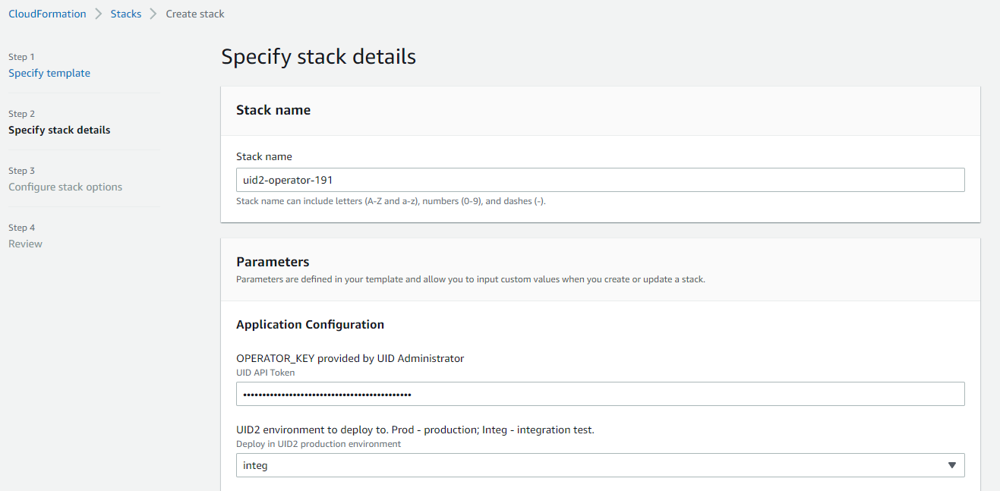
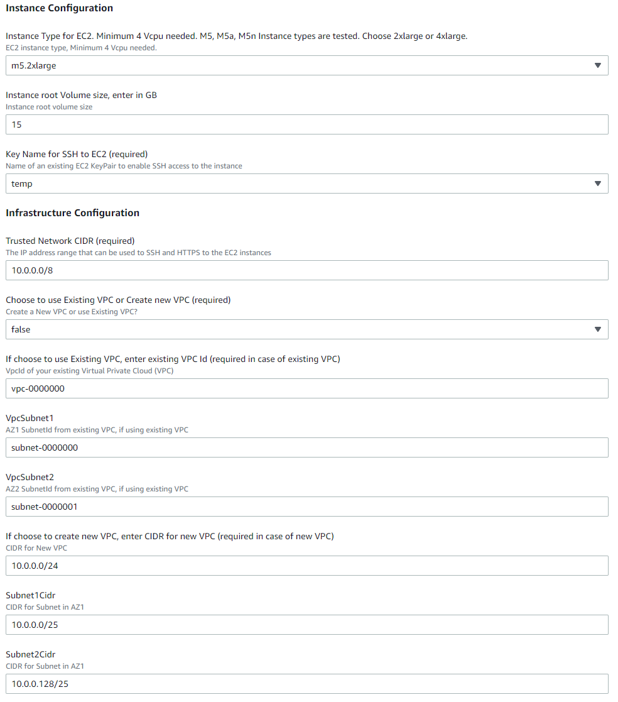

[UID2 Overview](../../../README-ja.md) > [Getting Started](../../README.md) > [v2](../summary-doc-v2.md) > [Integration Guides](summary-guides.md) > AWS Marketplace

# UID2 Operator: AWS Marketplace Integration Guide

UID2 Operator は、UID2 エコシステムにおける API サーバーです。AWS Marketplace で稼働する Private Operator サービスの場合、UID2 Operator ソリューションは[AWS Nitro](https://aws.amazon.com/ec2/nitro/) Enclave テクノロジーで強化されています。これは、UID2 情報を不正なアクセスから保護するための追加のセキュリティ対策です。

このガイドには、以下の情報が含まれています:

- [UID2 Operator on AWS Marketplace Product（AWS Marketplace プロダクトの UID2 Operator）](#uid2-operator-on-aws-marketplace-product)
  - [Prerequisites（前提条件）](#prerequisites)
  - [Resources Created（作成されるリソース）](#resources-created)
  - [Customization Options（カスタマイズオプション）](#customization-options)
- [Deployment（デプロイ）](#deployment)
- [Checking UID2 Operator Status（UID2 Operator のステータス確認）](#checking-uid2-operator-status)
- [Creating a Load Balancer（ロードバランサーの作成）](#creating-a-load-balancer)
- [Upgrading the UID2 Operator（UID2 Operator のアップグレード）](#upgrading-the-uid2-operator)
- [Technical Support（テクニカルサポート）](#technical-support)

## UID2 Operator on AWS Marketplace Product

NOTE: [UID2 Operator on AWS Marketplace](https://aws.amazon.com/marketplace/pp/prodview-wdbccsarov5la) は無償製品です。製品ページに表示されている費用は、必要なインフラの概算費用となります。

Unified ID 2.0 Operator on AWS Marketplace 製品を契約することで、以下を利用できます:

- **[Amazon Machine Image (AMI)](https://docs.aws.amazon.com/AWSEC2/latest/UserGuide/AMIs.html)** UID2 Operator Service がインストールされ、ブートストラップの準備が整っている状態です:<br/>
  AMI には、UID2 Operator Service がすでにセットアップされた[Amazon Linux 2](https://aws.amazon.com/amazon-linux-2/?amazon-linux-whats-new.sort-by=item.additionalFields.postDateTime&amazon-linux-whats-new.sort-order=desc)オペレーティングシステムが含まれています。AMI をベースにした EC2 インスタンスが起動すると、AWS アカウントから設定を自動的に取得し、エンクレーブ内で UID2 Operator サーバーを起動します。
- **[CloudFormation](https://aws.amazon.com/cloudformation/) template**:<br/>
  このテンプレートでは、UID2 Operator AMI がデプロイ展開されます。

### Prerequisites

AWS で 1 つまたは複数の UID2 Operator をサブスクライブしてデプロイするには、次の手順を実行します:

1. UID2 Operator としてあなたの組織を登録します。
2. [最小限の権限](#minimal-iam-role-privileges)を持つ[IAM](https://aws.amazon.com/iam/)ロールで AWS アカウントを作成します。

#### Minimal IAM Role Privileges

> IMPORTANT: ワンクリックデプロイを成功させるためには、AWS アカウントに以下のアクションを実行する権限が必要です:

```json
{
  "Version": "2012-10-17",
  "Statement": [
    {
      "Sid": "VisualEditor0",
      "Effect": "Allow",
      "Action": [
        "ec2:*",
        "kms:*",
        "autoscaling:*",
        "cloudformation:*",
        "iam:ListRoleTags",
        "secretsmanager:*",
        "iam:PutRolePolicy",
        "iam:AddRoleToInstanceProfile",
        "iam:ListRolePolicies",
        "iam:ListPolicies",
        "iam:GetRole",
        "iam:GetPolicy",
        "iam:DeleteRole",
        "iam:UpdateRoleDescription",
        "iam:TagPolicy",
        "iam:GetRolePolicy",
        "iam:CreateInstanceProfile",
        "iam:UntagRole",
        "iam:TagRole",
        "iam:ListInstanceProfilesForRole",
        "iam:PassRole",
        "iam:DeleteRolePolicy",
        "iam:ListPolicyTags",
        "iam:DeleteInstanceProfile",
        "iam:ListRoles",
        "iam:CreatePolicy",
        "iam:UntagPolicy",
        "iam:UpdateRole",
        "iam:UntagInstanceProfile",
        "iam:TagInstanceProfile",
        "iam:SetDefaultPolicyVersion",
        "iam:UpdateAssumeRolePolicy",
        "iam:GetPolicyVersion",
        "iam:RemoveRoleFromInstanceProfile",
        "iam:CreateRole",
        "iam:AttachRolePolicy",
        "iam:DetachRolePolicy",
        "iam:ListAttachedRolePolicies",
        "iam:DeletePolicy",
        "iam:ListInstanceProfileTags",
        "iam:CreatePolicyVersion",
        "iam:GetInstanceProfile",
        "iam:ListInstanceProfiles",
        "iam:ListPolicyVersions",
        "iam:DeletePolicyVersion",
        "iam:ListUserTags"
      ],
      "Resource": "*"
    }
  ]
}
```

### Resources Created

次の表は、[デプロイメント](#deployment) 中に作成されるすべてのリソースを一覧表、どのリソースが常に作成され、どのリソースが CloudFormation テンプレートの`CreateVPC`条件に依存しているかを示しています。

| Name                    | Type                                 | Description                                                                                                                                                                                              | Created       |
| :---------------------- | :----------------------------------- | :------------------------------------------------------------------------------------------------------------------------------------------------------------------------------------------------------- | :------------ |
| `KMSKey`                | `AWS::KMS::Key`                      | 秘密暗号化用のキー（設定文字列用）です。                                                                                                                                                                 | Always        |
| `SSMKeyAlias`           | `AWS::KMS::Alias`                    | [KMS](https://aws.amazon.com/kms/)キーに簡単にアクセスする方法を提供するエイリアスです。                                                                                                                 | Always        |
| `TokenSecret`           | `AWS::SecretsManager::Secret`        | オペレーターキーを含む暗号化されたコンフィギュレーションです。                                                                                                                                           | Always        |
| `WorkerRole`            | `AWS::IAM::Role`                     | UID2 Operator が実行する IAM ロールです。ロールは、設定キーへのアクセスを提供します。                                                                                                                    | Always        |
| `WorkerInstanceProfile` | `AWS::IAM::InstanceProfile`          | Operator EC2 インスタンスにアタッチする Worker Role を持つインスタンスプロファイルです。                                                                                                                 | Always        |
| `VPC`                   | `AWS::EC2::VPC`                      | Virtual Private Cloud（VPC）は、プライベートオペレーターをホストとする仮想プライベートネットワークです。既存の VPC をカスタマイズして利用することも可能です。[VPC Chart](#vpc-chart)も参照してください。 | Conditionally |
| `Subnet1`               | `AWS::EC2::Subnet`                   | 新しく作成された VPC の最初のサブネットです。                                                                                                                                                            | Conditionally |
| `Subnet2`               | `AWS::EC2::Subnet`                   | 新しく作成された VPC の 2 番目のサブネットです。                                                                                                                                                         | Conditionally |
| `RouteTable`            | `AWS::EC2::RouteTable`               | 新しく作成された VPC とサブネットのルーティングテーブルです。                                                                                                                                            | Conditionally |
| `InternetGateway`       | `AWS::EC2::InternetGateway`          | オペレーターが UID2 CORE Service と通信したり、セキュリティアップデートをダウンロードしたりするためのインターネットゲートウェイです。                                                                      | Conditionally |
| `AttachGateway`         | `AWS::EC2::VPCGatewayAttachment`     | インターネットゲートウェイと VPC を関連付ける値。                                                                                                                                                        | Conditionally |
| `SecurityGroup`         | `AWS::EC2::SecurityGroup`            | オペレーターインスタンスに対するルールを提供するセキュリティグループポリシーです。[Security Group Policy](#security-group-policy)も参照してください。                                                      | Always        |
| `LaunchTemplate`        | `AWS::EC2::LaunchTemplate`           | すべての構成が整った起動テンプレートです。このテンプレートから新しい UID2 Operator インスタンスを生成できます。                                                                                | Always        |
| `AutoScalingGroup`      | `AWS::AutoScaling::AutoScalingGroup` | 起動テンプレートがアタッチされているオートスケーリンググループ（ASG）。必要に応じて、これを使用して、希望のインスタンス数を後で更新できます。                                                  | Always        |

### Customization Options

以下は、[デプロイ](#deployment) の実行中または実行後にカスタマイズできる内容です。

- VPC: 新しい VPC とサブネットを設定するか、既存のものを使用するかのどちらかです。
- ルートボリュームサイズ (8G Minimum)
- SSH キー: UID2 Operator の EC2 インスタンスにアクセスする際に使用する SSH キーです。
- [Instance type](https://aws.amazon.com/ec2/instance-types/m5/): m5.2xlarge、m5.4xlarge、といった具合です。カスタマイズがない場合は、デフォルト値の m5.2xlarge を推奨します。

### Security Group Policy

> NOTE: ドメインに関連する証明書をエンクレーブに渡すのを避けるため、HTTPS の代わりにインバウンド HTTP が許可されています。これは、組織内部のプライベートネットワークで使用する場合、セキュアレイヤーのコストを回避することにもなります。

| Port Number | Direction | Protocol | Description                                                                                                                                                                                                                                                                                |
| ----------- | --------- | -------- | ------------------------------------------------------------------------------------------------------------------------------------------------------------------------------------------------------------------------------------------------------------------------------------------ |
| 80          | Inbound   | HTTP     | 　 Healthcheck エンドポイント `/opt/healthcheck` を含むすべての UID2 API を提供します。<br/>すべてが稼働している場合、エンドポイントは HTTP 200 を返し、レスポンスボディは `OK` となります。詳しくは、[Checking UID2 Operator Status](#checking-uid2-operator-status) を参照してください。 |
| 9080        | Inbound   | HTTP     | Prometheus metrics サービス (`/metrics`).                                                                                                                                                                                                                                                  |
| 443         | Outbound  | HTTPS    | UID2 Core Service を呼び出し、オプトアウトデータとキーストアを更新します。                                                                                                                                                                                                                 |

### VPC Chart

次の図は、プライベートオペレーターをホストする仮想プライベートクラウドを示したものです。


## Deployment

UID2 Operator を AWS Marketplace をデプロイするには、次の手順を実行します:

1. [UID2 Operator on AWS Marketplace](https://aws.amazon.com/marketplace/pp/prodview-wdbccsarov5la) をサブスクライブしてください。AWS がサブスクリプションを完了するまで、数分かかる場合があります。
2. **Configuration** をクリックします。
3. Configuration ページで、**Launch** をクリックし、**Launch CloudFormation** アクションを選択します。
4. Create stack ウィザードで、テンプレートを指定し、**Next** をクリックします。テンプレートファイルの S3 パスが自動的に入力されます。
5. [スタックの詳細](#stack-details) を入力し、**Next** をクリックします。
6. [スタックオプション](#stack-configuration-options) を設定し、**Next** をクリックします。
7. 入力した情報を確認し、変更したい場合は変更します。
8. IAM ロールの作成許可を求められたら、**I acknowledge that AWS CloudFormation might create IAM resources** のチェックボックスを選択します。
9. **Create stack** をクリックします。

スタックが作成されるまでには数分かかります。作成された Auto Scaling Group（ASG）が表示されたら、それを選択して EC2 インスタンスを確認します（デフォルトでは、開始するインスタンスは１つだけです）。 詳しくは、[UID2 オペレーターの状態確認](#checking-uid2-operator-status) を参照してください。

### Stack Details

以下の画像は、スタックの作成ウィザード（[デプロイ](#deployment)ステップ 5）の**Specify stack details**ページを示しています。以下の表は、パラメータ値のリファレンスを提供します。



下段です：



次の表は、[デプロイ](#deployment) のステップ 5 で指定するパラメータ値について説明したものです。

| Parameter                  | Description                                                                                                                                                                                                                                                                                                                                                                                |
| :------------------------- | :----------------------------------------------------------------------------------------------------------------------------------------------------------------------------------------------------------------------------------------------------------------------------------------------------------------------------------------------------------------------------------------- |
| Stack name                 | 好きな名前をつけてください。                                                                                                                                                                                                                                                                                                                                                               |
| OPERATOR_KEY               | UID2 Admin チームから受け取ったオペレーターキーです。                                                                                                                                                                                                                                                                                                                                      |
| UID2 Environment           | 本番環境なら `prod`、インテグレーションテスト環境なら `integ` を選択します。                                                                                                                                                                                                                                                                                                               |
| Instance Type              | `m5.2xlarge` を推奨します。                                                                                                                                                                                                                                                                                                                                                                |
| Instance root volume size  | 15GB 以上を推奨します。                                                                                                                                                                                                                                                                                                                                                                    |
| Key Name for SSH           | デプロイされた EC2 インスタンスに SSH アクセスするための EC2 キーペアです。                                                                                                                                                                                                                                                                                                                |
| Trusted Network CIDR       | CIDR (Classless Inter-Domain Routing) 値は、オペレーターサービスにアクセスできる IP アドレス範囲を決定します。<br/>UID2 オペレーターへのアクセスを制限して、内部ネットワークまたはロードバランサーからのみアクセスできるようにするには、CIDR 値として内部 IP 範囲を指定します。                                                                                                            |
| Choose to use Existing VPC | 新しい VPC とサブネットを作成する場合は、このパラメータに`true`を設定します。既存の VPC とサブネットを使用する場合は、`false`に設定します。<br/>既存の VPC を使用する場合は、[VPC dashboard](https://console.aws.amazon.com/vpc/home)から自分の VPC を見つけることができます。それ以外の場合は、**existing VPC Id**, **VpcSubnet1**, **VpcSubnet2** フィールドを空白のままにしてください。 |

### Stack Configuration Options

以下は、スタック作成ウィザード（[デプロイ](#deployment) ステップ 6）の [スタックオプションの設定](#stack-configuration-options) ページのスクリーンショットです。


次の表は、[デプロイ](#deployment) のステップ 6 で指定するパラメータ値について説明したものです。

| Parameter             | Description                                                                                                                                                     |
| :-------------------- | :-------------------------------------------------------------------------------------------------------------------------------------------------------------- |
| Tags                  | (オプション) スタックにタグをつけます。                                                                                                                         |
| Permissions           | AWS Marketplace に登録する IAM ロールとスタックをデプロイする IAM ロールが分かれている場合、スタックをデプロイするために使用するロールの名前/ARN を入力します。 |
| Stack failure options | デプロイメントに失敗したときの処理を選択します。`すべてのスタックリソースをロールバックする`オプションを推奨します。                                            |
| Advanced options      | これらはオプションです。                                                                                                                                        |

### Stack Configuration Options

次の画像は、スタックの作成ウィザード（[デプロイメント](#deployment)ステップ 6）の**スタックオプションの設定**ページを示しています。


| Parameter        | Description                                                                                                                                                   |
| :--------------- | :------------------------------------------------------------------------------------------------------------------------------------------------------------ |
| Tags             | (Optional) Tag your stack.                                                                                                                                    |
| Permissions      | AWS Marketplace に加入する IAM ロールとスタックをデプロイする IAM ロールが分かれている場合、スタックのデプロイに使用するロールの名前/ARN を入力してください。 |
| Advanced options | これらはオプションです。                                                                                                                                      |

## Checking UID2 Operator Status

EC2 インスタンスを見つけるには、次の手順を実行します:

1. CloudFormation スタックで、**Resources** タブをクリックし、Auto Scaling Group (ASG) を見つけます。
2. **Physical ID** 列の ASG リンクをクリックします。
3. 選択した ASG 内で、**Instance management** タブに移動し、利用可能な EC2 インスタンスの ID を見つけることができます（デフォルトでは 1 つのインスタンスのみが起動します）。
4. オペレーターの状態を調べるには、ブラウザで `http://{public-dns-of-your-instance}/ops/healthcheck` にアクセスしてください。`OK` は良好な状態を示します。


## Creating a Load Balancer

ロードバランサーとターゲットオペレーターのオートスケーリンググループを作成するには、次の手順を実行します:

1. AWS コンソールで、EC2 ダッシュボードに移動し、`Load Balancer` を検索する。
2. **Create Load Balancer** をクリックします。
3. ロードバランサータイプのページで、**Application Load Balancer** のセクションで、**Create** をクリックします。
4. UID2 **Load balancer name** を入力し、パブリックインターネットから UID2 API にアクセスする必要があるかどうかに応じて、**Internet-facing** または **Internal** スキームを選択します。
5. ターゲットの **VPC** と、CloudFormation スタックで使用する少なくとも 2 つのサブネットを選択します。
6. **Create new security group** をクリックし、その名前として `UID2SGALB` を入力します。
7. **Inbound rules** の下で、要件に応じて **HTTPS** と **Source IP range** を選択し、**Create security group** をクリックします。
8. ロードバランサーのページに戻り、新しく作成した UID2SGALB セキュリティグループを選択します。
9. **Listeners and routing** の下にある **Create target group** リンクをクリックし、[specify the target group details](#specifying-target-group-details) をクリックします。
10. ロードバランサーのページに戻り、**Forward to** で `UID2ALBTG` を選択し、**Port** を `443` に変更します。
11. [AWS ユーザーガイド](https://docs.aws.amazon.com/elasticloadbalancing/latest/application/create-https-listener.html) の手順に従い、HTTPS リスナーを設定します。
12. **Create load balancer** をクリックします。

### Specifying Target Group Details

[ロードバランサーの作成](#creating-a-load-balancer) でターゲットグループを作成する場合は、次の手順で行います:

1. グループの詳細ページで、ターゲットタイプ に **Instances** を選択し、**Target group name** に `UID2ALBTG` を入力し、**Protocol version** に **HTTP1** を選択します。
2. **Health checks** の下で、**Health check path** として `/ops/healthcheck` を指定し、**Advanced health check settings** セクションを開きます。
3. **Port** で **Override** を選択し、デフォルト値を `9080` に変更します。
4. オートスケーリンググループで作成した UID2 Operator EC2 インスタンスを選択し、**Include as pending below** をクリックします。
5. 選択したインスタンスの **Ports** に `80` が含まれていることを確認します。
6. **Create target group** をクリックします。

## Upgrading the UID2 Operator

ここでは、バージョンアップについて説明します:

各オペレーターのバージョンを更新するたびに、Private Operator は、アップグレードのウィンドウを持つメール通知を受け取ります。アップグレードウィンドウの後、古いバージョンは非アクティブ化され、サポートされなくなります。

ここでは、アップグレードについて紹介します：

- 新しいバージョンの提供に関する情報は、[UID2 Operator on AWS Marketplace](https://aws.amazon.com/marketplace/pp/prodview-wdbccsarov5la) のページで提供されます。
- UID2 Operator をアップグレードするには、新しい CloudFormation スタックを作成します。詳しくは、[デプロイ](#deployment) を参照してください。

> TIP: スムーズな移行を行うには、まず新しいスタックを作成します。新しいスタックが起動し、サービスを提供する準備ができたら、古いスタックを削除してください。ロードバランサーを使用している場合は、まず新しいインスタンスを立ち上げて実行してから、DNS 名を以前のものから新しいものに変換してください。

## Technical Support

製品のサブスクライブや導入に問題がある場合は、[aws-mktpl-uid@thetradedesk.com](mailto:aws-mktpl-uid@thetradedesk.com) までご連絡ください。
