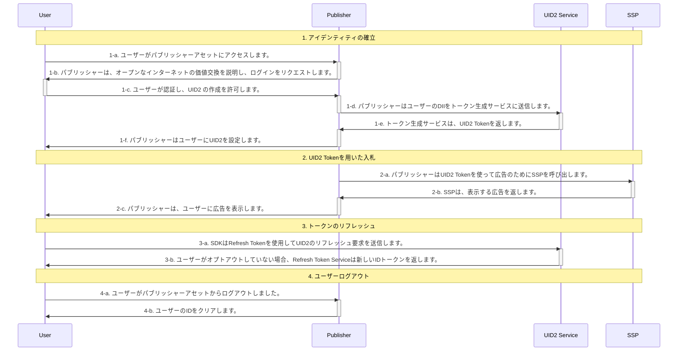

[UID2 Overview](../../../README-ja.md) > [Getting Started](../../README.md) > [v2](../summary-doc-v2.md) > [Integration Guides](summary-guides.md) > Client-Side JavaScript SDK Integration Guide

# Client-Side JavaScript SDK Integration Guide

このガイドは、UID2 対応シングルサインオンや ID プロバイダーではなく、UID2 と直接インテグレーションしながら、RTB ビッドストリーム用に UID2 を利用して ID トークンを生成したいと考える、Web アセットを持つパブリッシャーを対象としています。

以下のセクションが含まれています:

- [Introduction（はじめに）](#introduction)
- [Integration Steps（インテグレーション手順）](#integration-steps)
  - [Establish Identity: User Login（アイデンティティを確立する: ユーザーログイン）](#establish-identity-user-login)
  - [Bid Using UID2 Tokens（UID2 Token を使った入札）](#bid-using-uid2-tokens)
  - [Refresh Tokens（トークンのリフレッシュ）](#refresh-tokens)
  - [Clear Identity: User Logout（アイデンティティの消去: ユーザーログアウト）](#clear-identity-user-logout)
- [FAQs（よくある質問）](#faqs)

## Introduction

このガイドでは、SDK を使用せずにインテグレーションする場合に考慮する必要がある [基本的な手順](#integration-steps) を概説しています。たとえば、ユーザーログインとログアウトの実装方法、UID2 ID 情報の管理とターゲティング広告への使用方法、トークンの更新方法、ID が見つからない場合の対処、ユーザーのオプトアウトの処理方法などを決定する必要があります。[FAQ](#faqs)も参照してください。

UID2 を使用したクライアント ID の確立と Advertising Token の取得を容易にするため、このガイドで説明する Web インテグレーション手順では、UID2 SDK とも呼ばれる [Client-Side JavaScript SDK (v2)](../sdks/client-side-identity.md) を使用しています。このガイドで説明するインテグレーション手順と SDK の使用方法を説明する [サンプルアプリケーション](https://example-jssdk-integ.uidapi.com/) があります(現在はメールアドレス用のみ)。アプリケーションのドキュメントは、[UID2 SDK インテグレーション例](https://github.com/IABTechLab/uid2-examples/blob/main/publisher/standard/README.md) を参照してください。

> IMPORTANT: 現在、UID2 SDK はトークンをファーストパーティクッキーに保存しています。このような実装の詳細は将来的に変更される可能性があるため、潜在的な問題を回避するために、ID 管理は必ず [Client-Side JavaScript SDK APIs](../sdks/client-side-identity.md#api-reference) に基づいて行ってください。

[Client-Side JavaScript SDK (v2)](../sdks/client-side-identity.md) を使用しない、アプリ開発者や CTV 放送局向けのカスタムインテグレーションシナリオは、[Server-Only Integration Guide](custom-publisher-integration.md) を参照してください。

> NOTE: Google Ad Manager を使用していて、セキュアシグナル機能を使用したい場合、まずこのガイドの手順を行い、次に[Google Ad Manager Secure Signals Integration Guide](google-ss-integration.md)の追加手順を行ってください。

## Integration Steps

以下の図は、ユーザーがパブリッシャーと UID2 Token を確立するために必要なステップと、UID2 Token が RTB ビッドストリームとどのようにインテグレーションされるかの概要を示しています。



次のセクションでは、図中の各ステップについて詳細を説明します:

1.  [Establish identity: user login](#establish-identity-user-login)
2.  [Bid using UID2 tokens](#bid-using-uid2-tokens)
3.  [Refresh tokens](#refresh-tokens)
4.  [Clear Identity: user logout](#clear-identity-user-logout)

### Establish Identity: User Login

ステップ 1-c で認証が行われ、ユーザーに規約を受け入れてもらい、パブリッシャーがメールアドレスや電話番号を検証した後、サーバー側で UID2 Token を生成する必要があります。次の表は、トークン生成のステップの詳細を示しています。

| Step | Endpoint/SDK                                                       | Description                                                                                                                                                                                                                                                                                                                                                        |
| :--- | :----------------------------------------------------------------- | :----------------------------------------------------------------------------------------------------------------------------------------------------------------------------------------------------------------------------------------------------------------------------------------------------------------------------------------------------------------- |
| 1-d  | [POST /token/generate](../endpoints/post-token-generate.md)        | ユーザーが認証され、UID2 の作成が許可されたら、[POST /token/generate](../endpoints/post-token-generate.md) エンドポイントを使用して、ユーザーの正規化したメールアドレスまたは電話番号を使って UID2 Token を生成します。                                                                                                                                            |
| 1-e  | [POST /token/generate](../endpoints/post-token-generate.md)        | ユーザーのメールアドレス、電話番号、またはそれぞれのハッシュから生成された UID2 Token を返します。                                                                                                                                                                                                                                                                 |
| 1-f  | [Client-Side JavaScript SDK (v2)](../sdks/client-side-identity.md) | 手順 1-e で返された UID2 Token を、SDK の　[init()](../sdks/client-side-identity.md#initopts-object-void) の `identity` プロパティで送り、以下のように [コールバック関数](../sdks/client-side-identity.md#callback-function) を指定する必要があります。この仕組みにより、ユーザーがログアウトするまで、UID2 Token がターゲティング広告に利用できるようになります。 |

```html
<script>
  __uid2.init({
    callback : function (state) {...}, // Check advertising token and its status within the passed state and initiate targeted advertising.
    identity : {...} // The `body` property value from the token/generate API response.
  });
</script>
```

例:

```html
<script>
  __uid2.init({
    callback: onUid2IdentityUpdated,
    identity: {
      advertising_token:
        "AgmZ4dZgeuXXl6DhoXqbRXQbHlHhA96leN94U1uavZVspwKXlfWETZ3b/besPFFvJxNLLySg4QEYHUAiyUrNncgnm7ppu0mi6wU2CW6hssiuEkKfstbo9XWgRUbWNTM+ewMzXXM8G9j8Q=",
      refresh_token:
        "Mr2F8AAAF2cskumF8AAAF2cskumF8AAAADXwFq/90PYmajV0IPrvo51Biqh7/M+JOuhfBY8KGUn//GsmZr9nf+jIWMUO4diOA92kCTF69JdP71Ooo+yF3V5yy70UDP6punSEGmhf5XSKFzjQssCtlHnKrJwqFGKpJkYA==",
      identity_expires: 1633643601000,
      refresh_from: 1633643001000,
      refresh_expires: 1636322000000,
    },
  });
</script>
```

SDK は指定された [コールバック関数](../sdks/client-side-identity.md#callback-function) を呼び出し（ID の利用可能性を示します）、確立した ID をクライアント側の入札に利用できるようにします。

### Bid Using UID2 Tokens

SDK は、有効な ID の状態と利用可能性に基づいて、バックグラウンドトークンの自動更新を設定し、ID 情報を [ファーストパーティクッキー](../sdks/client-side-identity.md#uid2-cookie-format) に格納して、ターゲティング広告に対する要求を開始するために使用します。

| Step | Endpoint/SDK                                                       | Description                                                                                                                                          |
| :--- | :----------------------------------------------------------------- | :--------------------------------------------------------------------------------------------------------------------------------------------------- |
| 2-a  | [Client-Side JavaScript SDK (v2)](../sdks/client-side-identity.md) | 以下のように [getAdvertisingToken()](../sdks/client-side-identity.md#getadvertisingtoken-string) で現在のユーザーの Advertising Token を取得します。 |

```html
<script>
  let advertisingToken = __uid2.getAdvertisingToken();
</script>
```

> TIP: 返された Advertising Token をどのように SSP に渡すかを検討する必要があります。

### Refresh Tokens

初期化の一環として、SDK は ID の [バックグラウンドでのトークン自動更新](../sdks/client-side-identity.md#background-token-auto-refresh) を設定し、ID 上のタイムスタンプまたは断続的エラーによる更新の失敗によってバックグラウンドでトリガーされるようにします。

| Step | Endpoint/SDK                                                       | Description                                                                                                                              |
| :--- | :----------------------------------------------------------------- | :--------------------------------------------------------------------------------------------------------------------------------------- |
| 3-a  | [Client-Side JavaScript SDK (v2)](../sdks/client-side-identity.md) | SDK はバックグラウンドで自動的に UID2 Token をリフレッシュします。手動で操作する必要はありません。                                       |
| 3-b  | [Client-Side JavaScript SDK (v2)](../sdks/client-side-identity.md) | ユーザーがオプトアウトしていない場合、[POST /token/refresh](../endpoints/post-token-refresh.md) は自動的に新しい ID トークンを返します。 |

### Clear Identity: User Logout

ユーザーがパブリッシャーのサイト(UID2 ではない)からログアウトすること決めると、クライアントのライフサイクルは完了します。これにより、クライアントの ID セッションが閉じられ、ファーストパーティクッキー情報がクリアされます。

| Step | Endpoint/SDK                                                       | Description                                                                                                                                                                      |
| :--- | :----------------------------------------------------------------- | :------------------------------------------------------------------------------------------------------------------------------------------------------------------------------- |
| 4-a  | N/A                                                                | ユーザーがパブリッシャーのアセットからログアウトします。                                                                                                                         |
| 4-b  | [Client-Side JavaScript SDK (v2)](../sdks/client-side-identity.md) | 以下のように [disconnect()](../sdks/client-side-identity.md#disconnect-void) を用いてファーストパーティクッキーから UID2 ID をクリアし、クライアントライフサイクルを切断します。 |

```html
<script>
  __uid2.disconnect();
</script>
```

## FAQs

パブリッシャー向けのよくある質問は、[FAQs for Publishers Using an SDK](../getting-started/gs-faqs.md#faqs-for-publishers-using-an-sdk) を参照してください。

すべてのリストは、[Frequently Asked Questions](../getting-started/gs-faqs.md)を参照してください。
