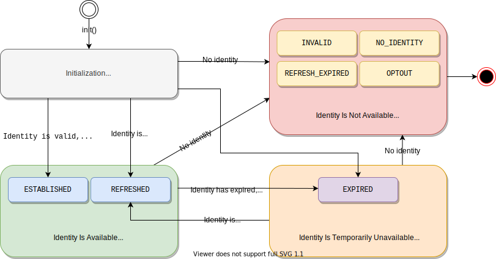

[UID2 API Documentation](../../README.md) > [v2](../README.md) > [SDKs](./README.md) > Client-Side Identity

# Client-Side Identity JavaScript SDK (v2)

この UID2 SDK を使用すると、UID2 を使用してクライアントの ID を確立し、Advertising Token を取得するプロセスを容易に行うことができます。以下のセクションでは、UID2 アイデンティティを確立するためのハイレベルな [ワークフロー](#workflow-overview)、SDK [API reference](#api-reference) および [UID2 クッキー形式](#uid2-cookie-format) について説明しています。

- コンテンツパブリッシャーの統合手順については、[UID2 SDK 統合ガイド](../guides/publisher-client-side.md) を参照してください。
- [アプリケーション例](https://example-jssdk-integ.uidapi.com/)のドキュメントについては、[UID2 SDK インテグレーション例](https://github.com/UnifiedID2/uid2-examples/blob/main/publisher/standard/README.md) のガイドを参照してください。

> NOTE: このドキュメントで、"ID" という用語は、Advertising Token を含む UID2 Token のパッケージを指します。

## Include the SDK Script

UID2 を使用して ID を管理したり、ターゲティング広告用の Advertising Token を取得したりしたいページには、以下の SDK スクリプトを実装してください。

```html
<script
  src="https://prod.uidapi.com/static/js/uid2-sdk-2.0.0.js"
  type="text/javascript"
></script>
```

## Workflow Overview

SDK を使用して UID2 ID を確立するためのクライアント側ワークフローは、以下のステップで構成されます:

1. [SDK の初期化](#initopts-object-void) と [コールバック関数](#callback-function) を指定し、このステップが正常に終了したときに呼び出されるようにします。
2. SDK がコールバック関数を呼び出すのを待ちます。コールバック関数は、ID の使用可能性を示します。
   - ID が利用可能な場合、[バックグラウンドトークン自動更新](#background-token-auto-refresh) がセットアップされます。
   - 利用できない場合、利用できない理由が指定されます。
3. ID の [state](#workflow-states-and-transitions) に基づいて、SDK は次の処理を行います。
   - 有効な ID が利用可能な場合、SDK は ID が [ファーストパーティクッキー](#uid2-cookie-format) で利用可能であることを確認します。
   - ID が利用できない場合、SDK は ID が更新可能かどうかに基づいて、適切なアクションを実行します。詳細は、[Workflow States and Transitions](#workflow-states-and-transitions) を参照してください。
4. ID の状態に応じた処理を行います。
   - Advertising Token が利用可能な場合、それを使用してターゲティング広告のリクエストを開始します。
   - そうでない場合は、非ターゲティング広告を使用するか、同意書付きの UID2 ログインにユーザーをリダイレクトします。

Web インテグレーションの手順については、[Publisher Integration Guide (Standard)](../guides/publisher-client-side.md) を参照してください。

### Workflow States and Transitions

次の表は、2 つの主要な関数である [getAdvertisingToken()](#getadvertisingtoken-string) と [isLoginRequired()](#isloginrequired-boolean) が返す値の組み合わせに基づいて、SDK が取り得る 4 つの主要な状態の概要を示し、それぞれの状態で開発者として取ることができる適切な行動を示しています

| State                               | Advertising Token | Login Required | Description                                                                                                                                                                                                                                                                                                                                                                                                                                                                                     | Identity Status Value                                    |
| :---------------------------------- | :---------------- | :------------- | :---------------------------------------------------------------------------------------------------------------------------------------------------------------------------------------------------------------------------------------------------------------------------------------------------------------------------------------------------------------------------------------------------------------------------------------------------------------------------------------------- | :------------------------------------------------------- |
| Initialization                      | `undefined`       | `undefined`    | コールバックが呼び出されるまでの初期状態。                                                                                                                                                                                                                                                                                                                                                                                                                                                      | N/A                                                      |
| Identity Is Available               | available         | `false`        | 有効な ID が正常に確立またはリフレッシュされました。Advertising Token は、ターゲティング広告で使用できます。                                                                                                                                                                                                                                                                                                                                                                                    | `ESTABLISHED` or `REFRESHED`                             |
| Identity Is Temporarily Unavailable | `undefined`       | `false`        | ID（Advertising Token）の有効期限が切れており、自動リフレッシュに失敗しました。[バックグラウンド自動更新](#background-token-auto-refresh) の試行は、リフレッシュトークンの有効期限が切れるか、ユーザーが拒否するまで続きます。</br>以下のいずれかを行うことができます：</br>- ターゲティングのない広告を使います。</br>- 同意フォームを使って UID2 ログインにユーザーを誘導します。</br>NOTE: UID2 Service が一時的に利用できない場合など、しばらくすると ID が正常に更新される場合があります。 | `EXPIRED`                                                |
| Identity Is Not Available           | `undefined`       | `false`        | ID が利用できないため、リフレッシュすることができません。SDK はファーストパーティ Cookie をクリアします。                                                                                                                                                                                                                                                                                                                                                                                       | `INVALID`, `NO_IDENTITY`, `REFRESH_EXPIRED`, or `OPTOUT` |

次の図は、4 つの状態と、それぞれの ID の [status value](#identity-status-values)、およびそれらの間の可能な遷移を表しています。SDK は、各遷移で [コールバック関数](#callback-function) を呼び出します。



### Background Token Auto-Refresh

SDK の [初期化](#initopts-object-void) の一部として、ID のトークン自動更新が設定され、ID 上のタイムスタンプまたは断続的なエラーによる更新の失敗によりバックグラウンドでトリガーされます。

以下は、トークンの自動リフレッシュについて知っておく必要があることです。

- 一度にアクティブにできるのは、1 つのトークンリフレッシュコールのみです。
- [POST /token/refresh](../endpoints/post-token-refresh.md) レスポンスが、ユーザーのオプトアウトやリフレッシュトークンの期限切れにより失敗した場合、バックグラウンドでの自動リフレッシュ処理は中断され、新しいログインが必要となります ([isLoginRequired()](#isloginrequired-boolean) は `true` を返します)。それ以外の場合、自動更新の試みはバックグラウンドで継続されます。
- SDK 初期化時に指定された　[コールバック関数](#callback-function) は、次の状況で呼び出されます。
  - 更新が成功するたびに呼び出されます。
  - 有効期限切れのアドバタイジングトークンのリフレッシュに初めて失敗した場合に呼び出されます。
  - ユーザーがオプトアウトするなどして ID が無効になった場合に呼び出されます。</br>注：コールバックは、ID が一時的に使用できず、自動更新が失敗し続けた場合には呼び出されません。この場合、SDK は既存の Advertising Token を継続して使用します。
- [disconnect()](#disconnect-void) 呼び出しは、アクティブなタイマーをキャンセルします。

## API Reference

> IMPORTANT: UID2 SDK とのすべてのやりとりは、グローバルな `__uid2` オブジェクトを通して行われます。以下の API はすべて `UID2` クラスのメンバです。

- [constructor()](#constructor)
- [init()](#initopts-object-void)
- [getAdvertisingToken()](#getadvertisingtoken-string)
- [getAdvertisingTokenAsync()](#getadvertisingtokenasync-promise)
- [isLoginRequired()](#isloginrequired-boolean)
- [disconnect()](#disconnect-void)
- [abort()](#abort-void)

### constructor()

UID2 オブジェクトを作成します。

> TIP: この関数をコールする代わりに、グローバルな `__uid2` オブジェクトを使用することもできます。

### init(opts: object): void

SDK を初期化し、ターゲティング広告のためのユーザー ID を確立します。

この関数について知っておくべきことは、以下のとおりです:

- `init()`は、SDK が対応するスクリプトタグによってロードされた後、通常はページのロード中にいつでも呼び出すことができます。
- 初期化呼び出しには、SDK が初期化された後に呼び出される [コールバック関数](#callback-function) が必要です。
- クライアントで UID2 ライフサイクルのインスタンスを作成する場合、`init()` コールの `identity` プロパティは、サーバーサイドで生成された ID を持つ [POST /token/generate](../endpoints/post-token-generate.md) または [POST /token/refresh](../endpoints/post-token-refresh.md) コールに成功すると返ってくる応答 JSON オブジェクトの `body` プロパティを指します。
- SDK は [ファーストパーティクッキー](#uid2-cookie-format) を使って、渡された UID2 ID 情報をセッションに保存するので、異なるページロードでそれ以降の `init()` コールを行うと、 `identity` プロパティが空になることがあります。
- 特定の動作を調整するために、初期化コールにはオプションの設定 [パラメータ](#parameters) を含めることができます。

以下は、サーバーサイドで生成された ID を含む `init()` 呼び出しのテンプレートです。

```html
<script>
  __uid2.init({
    callback : function (state) {...}, // Check advertising token and its status within the passed state and initiate targeted advertising.
    identity : {...} // The `body` property value from the token/generate or token/refresh API response.
  });
</script>
```

例えば:

```html
<script>
  __uid2.init({
    callback: onUid2IdentityUpdated,
    identity: {
      advertising_token:
        "AgmZ4dZgeuXXl6DhoXqbRXQbHlHhA96leN94U1uavZVspwKXlfWETZ3b/besPFFvJxNLLySg4QEYHUAiyUrNncgnm7ppu0mi6wU2CW6hssiuEkKfstbo9XWgRUbWNTM+ewMzXXM8G9j8Q=",
      refresh_token:
        "Mr2F8AAAF2cskumF8AAAF2cskumF8AAAADXwFq/90PYmajV0IPrvo51Biqh7/M+JOuhfBY8KGUn//GsmZr9nf+jIWMUO4diOA92kCTF69JdP71Ooo+yF3V5yy70UDP6punSEGmhf5XSKFzjQssCtlHnKrJwqFGKpJkYA==",
      identity_expires: 1633643601000,
      refresh_from: 1633643001000,
      refresh_expires: 1636322000000,
    },
  });
</script>
```

以下は、ファーストパーティクッキーの ID を使用した `init()` 呼び出しの例です。このようなブロックを、ID が確立された後にユーザが訪れる可能性のあるどのページにも置くことができます。

```html
<script>
  __uid2.init({
    callback : function (state) {...} // Check advertising token and its status within the passed state and initiate targeted advertising.
  });
</script>
```

#### Parameters

`opts` オブジェクトは以下のプロパティをサポートしています。

The `opts` object supports the following properties.

| Property             | Data Type                | Attribute              | Description                                                                                                                                                                                                                                                                                                                                                                                                                                                                                                                                                                                                                             | Default Value              |
| :------------------- | :----------------------- | :--------------------- | :-------------------------------------------------------------------------------------------------------------------------------------------------------------------------------------------------------------------------------------------------------------------------------------------------------------------------------------------------------------------------------------------------------------------------------------------------------------------------------------------------------------------------------------------------------------------------------------------------------------------------------------- | :------------------------- |
| `callback`           | `function(object): void` | 必須<br>Required       | 渡された ID を検証した後、SDK が呼び出す関数。詳しくは、[コールバック関数](#callback-function) を参照してください。 <br>The function the SDK is to invoke after validating the passed identity. For details, see [Callback Function](#callback-function).                                                                                                                                                                                                                                                                                                                                                                               | N/A                        |
| `identity`           | object                   | オプション<br>Optional | [POST /token/generate](../endpoints/post-token-generate.md) または [POST /token/refresh](../endpoints/post-token-refresh.md) がサーバ上で成功し、ID を生成したときの `body` プロパティ値です。[ファーストクッキー](#uid2-cookie-format) の ID を使用するには、このプロパティを空にしてください。<br>The `body` property value from a successful [POST /token/generate](../endpoints/post-token-generate.md) or [POST /token/refresh](../endpoints/post-token-refresh.md) call that has been run on the server to generate an identity. To use the identity from a [first-party cookie](#uid2-cookie-format), leave this property empty. | N/A                        |
| `baseUrl`            | string                   | オプション<br>Optional | [POST /token/refresh](../endpoints/post-token-refresh.md) エンドポイントを呼び出すときに使用する UID2 オペレータのカスタムベース URL、例えば `https://my.operator.com` です。<br>The custom base URL of the UID2 operator to use when invoking the [POST /token/refresh](../endpoints/post-token-refresh.md) endpoint, for example, `https://my.operator.com`.                                                                                                                                                                                                                                                                          | `https://prod.uidapi.com ` |
| `refreshRetryPeriod` | number                   | オプション<br>Optional | 断続的にエラーが発生した場合に、トークンのリフレッシュを再試行する秒数です。<br>The number of seconds after which to retry refreshing tokens if intermittent errors occur.                                                                                                                                                                                                                                                                                                                                                                                                                                                              | 5                          |
| `cookieDomain`       | string                   | オプション<br>Optional | [UID2 cookie](#uid2-cookie-format) に適用されるドメイン名の文字列です。<br>The domain name string to apply to the [UID2 cookie](#uid2-cookie-format).                                                                                                                                                                                                                                                                                                                                                                                                                                                                                   | `undefined`                |
| `cookiePath`         | string                   | オプション<br>Optional | [UID2 cookie](#uid2-cookie-format) に適用されるパス文字列です。<br>The path string to apply to the [UID2 cookie](#uid2-cookie-format).                                                                                                                                                                                                                                                                                                                                                                                                                                                                                                  | `/`                        |

#### Errors

`init()`関数は以下のエラーを投げることがあります。

The `init()` function can throw the following errors.

| Error        | Description                                                                                                                                                                                                                                                                                                                                                                                                                                        |
| :----------- | :------------------------------------------------------------------------------------------------------------------------------------------------------------------------------------------------------------------------------------------------------------------------------------------------------------------------------------------------------------------------------------------------------------------------------------------------- |
| `TypeError`  | 以下のいずれかの問題が発生しました。<br>- ファクションはすでに呼び出されています。<br>- `opts` 値はオブジェクトではありません。<br>- コールバック関数が指定されていません。<br>- `callback` 値は関数ではありません。<br>One of the following issues has occurred:<br/>- The fuction has already been called.<br/>- The `opts` value is not an object.<br/>- There is no callback function specified.<br/>- The `callback` value is not a function. |
| `RangeError` | リフレッシュリトライ回数が 1 回未満です。<br>The refresh retry period is less than 1.                                                                                                                                                                                                                                                                                                                                                              |

#### Callback Function

コールバック関数 `function(object): void` は、初期化が完了したことを示します。その後、SDK は確立された ID のリフレッシュに成功すると、コールバックを呼び出します。コールバック関数が呼び出されるタイミングについては、[Background Token Auto-Refresh](#background-token-auto-refresh) を参照してください。

The `function(object): void` callback function indicates that the initialization is complete. Subsequently, the SDK invokes the callback when it successfully refreshes the established identity. For details on when the callback function is called, see [Background Token Auto-Refresh](#background-token-auto-refresh).

`object` パラメータには、以下のプロパティが含まれます。

The `object` parameter includes the following properties.

| Property           | Data Type                  | Description                                                                                                                                                                                                                                                           |
| :----------------- | :------------------------- | :-------------------------------------------------------------------------------------------------------------------------------------------------------------------------------------------------------------------------------------------------------------------- |
| `advertisingToken` | string                     | ターゲティング広告のために SSP に渡されるトークンです。トークン/ID が無効または利用できない場合、値は `undefined` となります。<br>The token to be passed to SSPs for targeted advertising. If the token/identity is invalid or unavailable, the value is `undefined`. |
| `status`           | `UID2.IdentityStatus` enum | ID のステータスを示す数値です。詳しくは、[status value](#identity-status-values)を参照してください。<br>The numeric value that indicates the status of the identity. For details, see [Identity Status Values](#identity-status-values).                              |
| `statusText`       | string                     | ID status に関わる追加情報。<br>Additional information pertaining to the identity status.                                                                                                                                                                             |

#### Identity Status Values

[コールバック関数](#callback-function) は `status` フィールドの値を `UID2.IdentityStatus` enum から数値として返し、`UID2.IdentityStatus[state.status]` をコールして対応する文字列に変換することができます。以下の表は `status` enum に対応する文字列の一覧です。

> IMPORTANT: 以下の値は、ID の利用可能性を通知することのみを目的としています。条件ロジックでは使用しないでください。

The [callback function](#callback-function) returns the `status` field values as numbers from the `UID2.IdentityStatus` enum, which can be turned into the corresponding strings by calling `UID2.IdentityStatus[state.status]`. The following table lists the string values for the `status` enum.

> IMPORTANT: The following values are intended only to inform you of identity availability. Do not use them in conditional logic.

| Status            | Advertising Token Availability | Description                                                                                                                                                                                                                                                                                                                                                                |
| :---------------- | :----------------------------- | :------------------------------------------------------------------------------------------------------------------------------------------------------------------------------------------------------------------------------------------------------------------------------------------------------------------------------------------------------------------------- |
| `ESTABLISHED`     | Available                      | D は有効で、渡された値またはファーストクッキーから設定され、ターゲティング広告に利用できるようになりました。<br>The identity is valid, was set from the passed value or the first-party cookie, and is now available for targeted advertising.                                                                                                                             |
| `REFRESHED`       | Available                      | UID2 Operator へのコールにより ID が正常にリフレッシュされ、ターゲティング広告に利用できるようになりました。<br>The identity was successfully refreshed by a call to the UID2 operator is now available for targeted advertising.                                                                                                                                          |
| `EXPIRED`         | Not available                  | SDK がトークンのリフレッシュに失敗したため、ターゲティング広告に使用できる ID がありません。有効なリフレッシュ トークンがまだ存在するため、自動リフレッシュの試行は継続されます。<br>No identity is available for targeted advertising, as the SDK failed to refresh the token. Since there is still a valid refresh token available, auto-refresh attempts will continue. |
| `REFRESH_EXPIRED` | Not available                  | ファーストパーティクッキーの Refresh Token または渡された ID の有効期限が切れているため、ターゲティング広告に利用できる ID がありません。<br>No identity is available for targeted advertising, as the refresh token on the first-party cookie or the passed identity has expired.                                                                                         |
| `NO_IDENTITY`     | Not available                  | ファーストパーティクッキーが設定されておらず、`init()`関数に ID が渡されていないため、ターゲティング広告に利用できる ID はありません。<br>No identity is available for targeted advertising, as a first-party cookie was not set and no identity has been passed to the `init()` function.                                                                                 |
| `INVALID`         | Not available                  | SDK がファーストパーティクッキーまたは渡された ID の解析に失敗したため、ターゲティング広告に利用できる ID がありません。<br>No identity is available for targeted advertising, as the SDK failed to parse the first-party cookie or the passed identity.                                                                                                                   |
| `OPTOUT`          | Not available                  | ユーザーが ID のリフレッシュをオプトアウトしているため、ターゲティング広告に利用できる ID はありません。<br>No identity is available for targeted advertising, as the user has opted out from refreshing identity.                                                                                                                                                         |

ID が利用できない場合、最適なアクションを決定するために、[isLoginRequired()](#isloginrequired-boolean) 関数を使用することができます。

If the identity is not available, to determine the best course of action, use the [isLoginRequired()](#isloginrequired-boolean) function.

### getAdvertisingToken(): string

現在の Advertising Token を取得します。

この関数は、例えば [init()](#initopts-object-void) を呼び出し、提供されたコールバックを呼び出した _後に_ 必ず呼び出してください、例えば:

Gets the current advertising token.

Be sure to call this function _after_ calling [init()](#initopts-object-void) and invoking the supplied callback, for example:

```html
<script>
  let advertisingToken = __uid2.getAdvertisingToken();
</script>
```

`getAdvertisingToken()` 関数は、(初期化完了コールバックからだけでなく)どこからでも Advertising Token にアクセスできるようにし、以下の場合は `undefined` を返します。

- [コールバック関数](#callback-function) がまだ呼び出されていません。つまり、SDK の初期化が完了していません。
- SDK の初期化は完了しましたが、使用する有効な ID が存在しません。
- SDK の初期化は完了しているが、ユーザーがオプトアウトしたなどの理由で、自動更新により ID がクリアされました。

ID が使用できない場合、最適なアクションを決定するために、[isLoginRequired()](#isloginrequired-boolean) 関数を使用します。

The `getAdvertisingToken()` function allows you to get access to the advertising token from anywhere (not just from the initialization completion callback) and returns `undefined` in the following cases:

- The [callback function](#callback-function) has not been called yet, which means the SDK initialization is not complete.
- The SDK initialization is complete, but there is no valid identity to use.
- The SDK initialization is complete, but the auto-refresh has cleared the identity, for example, because the user has opted out.

If the identity is not available, to determine the best course of action, use the [isLoginRequired()](#isloginrequired-boolean) function.

### getAdvertisingTokenAsync(): Promise

現在の Advertising Token に対応する `Promise` 文字列を取得します。

Gets a `Promise` string for the current advertising token.

この関数は、[init()](#initopts-object-void) の呼び出しの前または後に呼び出すことができます。返された promise は、初期化が完了し、[コールバック関数](#callback-function)が呼び出された後、Advertising Token の利用可能性に基づいて解決されます。

- Advertising Token が利用可能な場合、現在の Advertising Token でプロミスが実行されます。
- Advertising Token が一時的にでも利用できない場合、promise は現在の Advertising Token で実行されます。Advertising Token が一時的にでも利用できない場合、promise は `Error` のインスタンスで拒否されます。この場合、最適なアクションを決定するために、[isLoginRequired()](#isloginrequired-boolean) を使用することができます。

This function can be called before or after the [init()](#initopts-object-void) call. The returned promise is settled after the initialization is complete and the [callback function](#callback-function) is invoked, based on the availability of the advertising token:

- If the advertising token is available, the promise is fulfilled with the current advertising token.
- If the advertising token is not available, even temporarily, the promise is rejected with an instance of `Error`. To determine the best course of action in this case, you can use [isLoginRequired()](#isloginrequired-boolean).

> NOTE: 初期化が完了した後に `getAdvertisingTokenAsync()` 関数を呼び出した場合、現在の状態に応じてすぐに promise が決定されます。

> NOTE: If the `getAdvertisingTokenAsync()` function is called _after_ the initialization is complete, the promise is settled immediately based on the current state.

```html
<script>
  __uid2
    .getAdvertisingTokenAsync()
    .then((advertisingToken) => {
      /* initiate targeted advertising */
    })
    .catch((err) => {
      /* advertising token not available */
    });
</script>
```

> TIP: この関数を使用すると、`init()` を呼び出したコンポーネント以外のコンポーネントから、UID2 SDK の初期化の完了を通知してもらうことができます。

> TIP: You can use this function to be notified of the completion of the UID2 SDK initialization from a component that may not be the one that called `init()`.

### isLoginRequired(): boolean

UID2 ログイン ([POST /token/generate](../endpoints/post-token-generate.md) 呼び出し) が必要であるかどうかを指定します。

この関数は、[Workflow States and Transitions](#workflow-states-and-transitions) に示すように、見つからない ID を処理するための追加のコンテキストも提供することができます。

Specifies whether a UID2 login ([POST /token/generate](../endpoints/post-token-generate.md) call) is required.

The function can also provide additional context for handling missing identities, as shown in [Workflow States and Transitions](#workflow-states-and-transitions).

```html
<script>
  __uid2.isLoginRequired();
</script>
```

#### Return Values

| Value       | Description                                                                                                                                                                                                                                                                                                                                                                                                                                                                                                                                            |
| :---------- | :----------------------------------------------------------------------------------------------------------------------------------------------------------------------------------------------------------------------------------------------------------------------------------------------------------------------------------------------------------------------------------------------------------------------------------------------------------------------------------------------------------------------------------------------------- |
| `true`      | ID が利用できないため、UID2 ログインが必要です。この値は以下のいずれかを示しています。<br>- ユーザーがオプトアウトしました。<br>- Refresh Token の有効期限が切れています。<br>- ファーストパーティクッキーが使用できず、サーバーで生成された ID も提供されていません。<br>The identity is not available, and the UID2 login is required. This value indicates any of the following:<br/>- The user has opted out.<br/>- The refresh token has expired.<br/>- A first-party cookie is not available and no server-generated identity has been supplied. |
| `false`     | ログインは必要ありません。この値は、以下のいずれかを示します。<br>- ID が存在し、有効です。<br>- ID は有効期限が切れていて、断続的なエラーのためにトークンがリフレッシュされませんでした。自動更新に成功すると、ID が復元される可能性があります。<br>No login is required. This value indicates either of the following:<br/>- The identity is present and valid.<br/>- The identity has expired, and the token was not refreshed due to an intermittent error. The identity may be restored after a successful auto-refresh attempt.                  |
| `undefined` | SDK の初期化はまだ完了していません。<br>The SDK initialization is not complete yet.                                                                                                                                                                                                                                                                                                                                                                                                                                                                    |

### disconnect(): void

[ファーストパーティクッキー](#uid2-cookie-format)から UID2 ID をクリアし、クライアントの ID セッションを閉じ、クライアントのライフサイクルを切断します。

未認証のユーザーが存在する場合、またはユーザーがパブリッシャーのサイトのターゲティング広告からログアウトしたい場合は、次の呼び出しを行います。

Clears the UID2 identity from the [first-party cookie](#uid2-cookie-format), thus closing the client's identity session and disconnecting the client lifecycle.

When an unauthenticated user is present, or a user wants to log out of targeted advertising on the publisher's site, make the following call:

```html
<script>
  __uid2.disconnect();
</script>
```

この関数を実行すると、[getAdvertisingToken()](#getadvertisingtoken-string)　関数は`undefined`、[isLoginRequired()](#isloginrequired-boolean)　は`true`を返します。

After this function is executed, the [getAdvertisingToken()](#getadvertisingtoken-string) function returns `undefined` and the [isLoginRequired()](#isloginrequired-boolean) function returns `true`.

### abort(): void

バックグラウンドのタイマーやリクエストを終了させます。UID2 オブジェクトは未指定の状態のままとなり、それ以上使用できなくなります。

この関数は、既存の UID2 オブジェクトを新しいインスタンスに置き換えるような高度なシナリオで使用することを目的としています。たとえばシングルページのアプリケーションでは、サーバーからの [POST /token/generate](../endpoints/post-token-generate.md) レスポンスで新しい ID を受け取った後に、 これを使用して現在の UID2 オブジェクトをクリアしたり新しいオブジェクトを構築・初期化したりしたくなるかもしれません。

Terminates any background timers or requests. The UID2 object remains in an unspecified state and cannot be used anymore.

This function is intended for use in advanced scenarios where you might want to replace the existing UID2 object with a new instance. For example, single-page applications may want to use this to clear the current UID2 object and construct or initialize a new one after receiving a new identity in the [POST /token/generate](../endpoints/post-token-generate.md) response from the server.

## UID2 Cookie Format

この SDK は、ファーストパーティクッキーを使用して、ユーザーの ID を保存します。

The SDK uses first-party cookies to store users' identities.

### Properties

次の表は、クッキーのプロパティの一覧です。

The following table lists the cookie properties.

| Properties | Default Value | Comments                                                                                                                                                                                                                                                                                                                                                                                                                                                |
| :--------- | :------------ | :------------------------------------------------------------------------------------------------------------------------------------------------------------------------------------------------------------------------------------------------------------------------------------------------------------------------------------------------------------------------------------------------------------------------------------------------------ |
| `Name`     | `__uid_2`     | N/A                                                                                                                                                                                                                                                                                                                                                                                                                                                     |
| `Expiry`   | N/A           | 値は、オペレーターが [POST /token/generate](../endpoints/post-token-generate.md) または [POST /token/refresh](../endpoints/post-token-refresh.md) レスポンスで指定した Refresh Token の有効期限タイムスタンプになります。<br>The value is the refresh token expiration timestamp as specified by the operator in the [POST /token/generate](../endpoints/post-token-generate.md) or [POST /token/refresh](../endpoints/post-token-refresh.md) response. |
| `Path`     | `/`           | SDK の初期化時に `cookiePath` [init() parameter](#parameters) で別のパスを設定することができます。<br>You can set a different path with the `cookiePath` [init() parameter](#parameters) during the SDK initialization.                                                                                                                                                                                                                                 |
| `Domain`   | `undefined`   | SDK の初期化時に `cookieDomain` [init() parameter](#parameters) で別のドメインを指定することができます。<br>You can specify a different domain with the `cookieDomain` [init() parameter](#parameters) during the SDK initialization.                                                                                                                                                                                                                   |

### Contents Structure

UID2 クッキーのコンテンツは、URI エンコードされた JSON オブジェクトの文字列表現で、[POST /token/generate](../endpoints/post-token-generate.md) または [POST /token/refresh](../endpoints/post-token-refresh.md) レスポンスの `body` プロパティと同じですが、 `private` オブジェクトが例外となります。

以下は UID2 クッキーの構造体の例です。

The UID2 cookie contents are a URI-encoded string representation of a JSON object with the structure identical to that of the `body` property in a [POST /token/generate](../endpoints/post-token-generate.md) or [POST /token/refresh](../endpoints/post-token-refresh.md) response, with the exception of the `private` object.

The following is an example of the UID2 cookie structure:

```json
{
  "advertising_token": "AgAAAAVacu1uAxgAxH+HJ8+nWlS2H4uVqr6i+HBDCNREHD8WKsio/x7D8xXFuq1cJycUU86yXfTH9Xe/4C8KkH+7UCiU7uQxhyD7Qxnv251pEs6K8oK+BPLYR+8BLY/sJKesa/koKwx1FHgUzIBum582tSy2Oo+7C6wYUaaV4QcLr/4LPA==",
  "refresh_token": "AgAAAXxcu2RbAAABfGHhwFsAAAF79zosWwAAAAWeFJRShH8u1AYc9dYNTB20edyHJU9mZv11e3OBDlLTlS5Vb97iQVumc7b/8QY/DDxr6FrRfEB/D85E8GzziB4YH7WUCLusHaXKLxlKBSRANSD66L02H3ss56xo92LMDMA=",
  "identity_expires": 1633643601000,
  "refresh_from": 1633643001000,
  "refresh_expires": 1636322000000,
  "private": {}
}
```

> IMPORTANT: `private` オブジェクトの内容は明示的に指定されておらず、SDK が解釈できるようになっています。このオブジェクトの構造、セマンティクス、互換性に関して、いかなる仮定もしないでください。クッキーを更新する場合は、その構造を保持しなければなりません。

> IMPORTANT: The contents of the `private` object are explicitly unspecified and left for the SDK to interpret. Do not make any assumptions about the structure, semantics, or compatibility of this object. Any updates to the cookie must retain its structure.
