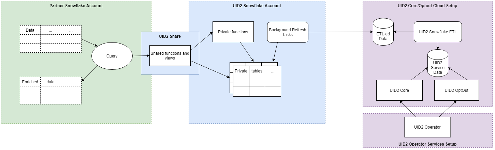

[UID2 API Documentation](../../README.md) > v1 > [SDKs](./README.md) > RTB SDK

# Snowflake Integration

[Snowflake](https://www.snowflake.com/) is a cloud computing-based data warehousing solution.
UID2 integration facilities are provided for partners who host their data on the platform to
utilize the UID2 Operator Service APIs directly from Snowflake.

UID2 integration is hosted under a special Snowflake account which exposes a share that partners
can request access to. The share exposes functions and views for performing UID2 related tasks.

The following diagram demonstrates how the Snowflake integration works:



Key points:

 - Partners can access only the functions and views explicitly shared by the UID2 Snowflake account
 - Shared functions and views depend on private tables (Partners will not have access to these)
   which are automatically synchronized from UID2 Core/OptOut Snowflake-specific storage
 - The Snowflake-specific storage is automatically updated by ETL jobs from the same data
   that ultimately powers the UID2 Operator web services
 - Partners are responsible for the computation costs associated with their use of the shared
   functions and views
   
Snowflake integration is currently available on AWS in the `us-east-1` region. Support for
other cloud providers and regions will be driven by demand.
   
## Access to UID2 Share

At present access to the UID2 Share is provided explicitly by the UID2 administrators 
([contact information](../../README.md#contact-info)). In order to establish the access,
one needs to provide the following information to the administrators:

 - Snowflake account to give the access to, this can be obtained for example by running 
   `select CURRENT_ACCOUNT()` query
 - Cloud provider and region where the Snowflake account is hosted
 - UID2 client authentication key

UID2 client authentication key is issued to registered UID2 partners and gives access to UID2
operator web services. The key is associated with specific privileges which determine which
endpoints can be invoked. As part of establishing access to the UID2 Snowflake share, partner's
account will be associated with a specific client access key and this will determine which of
the objects the partner can actually use through the share.

Client authentication key is only necessary at setup time. It is not needed when using the shared
objects.

Once access to the share has been configured on the UID2 account side, partner should see the
available share in the Snowflake Console (ACCOUNTADMIN role required). From here one can create
a new database from the share either by using the Console or by executing SQL statements similar
to the following:

```
CREATE DATABASE "UID2" FROM SHARE XYZ12345."UID2_INTEG_SH"
   COMMENT='Access to UID2 shared functions and views';
GRANT IMPORTED PRIVILEGES ON DATABASE "UID2" TO ROLE "SYSADMIN";
```

## Shared Objects

All shared obects available for use by partners are available in the `PUBLIC` schema of the
database created for the UID2 share. Examples below assume the database name `UID2`.

### Function FN_T_UID2_IDENTITY_MAP_EMAIL

This is a table function which maps an email address to the corresponding UID2 and second
level bucket id.

Arguments:

 - `EMAIL` -- `varchar(128)` -- email address to map

Output:

|Column Name|Data Type|Description|
| --- | --- | --- |
| UID | TEXT | UID2 associated with the email address or NULL if email address cannot be mapped (e.g. email address is NULL or invalid) |
| BUCKET_ID | TEXT | ID of the second level salt bucket which was used to generate the UID. This would map to the bucket id in the `UID2_SALT_BUCKETS` view |

Usage notes:

 - the function will normalize the email address according to UID2 email normalization rules
 - passing an invalid email address or NULL would result in NULL values being returned 
 - in the context of a lateral projection failed mappings will not emit any rows

Basic example:

```
select UID, BUCKET_ID from table(UID2.PUBLIC.FN_T_UID2_IDENTITY_MAP_EMAIL('validate@email.com'));
```

Possible result:

```
2ODl112/VS3x2vL+kG1439nPb7XNngLvOWiZGaMhdcU=, ad1ANEmVZA
```

Map email addresses in a table (the join is added to indicate which email addresses failed to get mapped):

```
select a.ID, a.EMAIL, m.UID, m.BUCKET_ID from AUDIENCE a LEFT JOIN(
    select ID, t.* from AUDIENCE, lateral UID2.PUBLIC.FN_T_UID2_IDENTITY_MAP_EMAIL(EMAIL) t) m
    ON a.ID=m.ID;
```

Possible result:

```
1, validate@email.com, 2ODl112/VS3x2vL+kG1439nPb7XNngLvOWiZGaMhdcU=, ad1ANEmVZA
2, NULL, NULL, NULL
3, test@uidapi.com, IbW4n6LIvtDj/8fCESlU0QG9K/fH63UdcTkJpAG8fIQ=, a30od4mNRd
```

### Function FN_T_UID2_IDENTITY_MAP_EMAIL_HASH

This is a table function which maps an email address hash to the corresponding UID2 and second
level bucket id.

Arguments:

 - `EMAIL_HASH` -- `varchar(128)` -- he [URL-encoded, base64-encoded SHA256 hash](../../README.md#encoding-email-hashes)
   of the [normalized email address](../../README.md#emailnormalization) of a user

Output:

|Column Name|Data Type|Description|
| --- | --- | --- |
| UID | TEXT | UID2 associated with the email address hash or NULL if the hash cannot be mapped (e.g. NULL or invalid) |
| BUCKET_ID | TEXT | ID of the second level salt bucket which was used to generate the UID. This would map to the bucket id in the `UID2_SALT_BUCKETS` view |

Usage notes:

 - it is the caller's responsibility to ensure that the email hash is in the correct format and
   was computed from the normalized email address
 - passing an invalid email address hash or NULL would result in NULL values being returned
 - in the context of a lateral projection failed mappings will not emit any rows

Basic example:

```
select UID, BUCKET_ID from table(UID2.PUBLIC.FN_T_UID2_IDENTITY_MAP_EMAIL(BASE64_ENCODE(SHA2_BINARY('validate@email.com', 256))));
```

Possible result:

```
2ODl112/VS3x2vL+kG1439nPb7XNngLvOWiZGaMhdcU=, ad1ANEmVZA
```

Map email address hashes in a table (the join is added to indicate which hashes failed to get mapped):

```
select a.ID, a.EMAIL_HASH, m.UID, m.BUCKET_ID from AUDIENCE a LEFT JOIN(
    select ID, t.* from AUDIENCE, lateral UID2.PUBLIC.FN_T_UID2_IDENTITY_MAP_EMAIL_HASH(EMAIL_HASH) t) m
    ON a.ID=m.ID;
```

Possible result:

```
1, LdhtUlMQ58ZZy5YUqGPRQw5xUMS5dXG5ocJHYJHbAKI=, 2ODl112/VS3x2vL+kG1439nPb7XNngLvOWiZGaMhdcU=, ad1ANEmVZA
2, NULL, NULL, NULL
3, /XJSTajB68SCUyuc3ePyxSLNhxrMKvJcjndq8TuwW5g=, IbW4n6LIvtDj/8fCESlU0QG9K/fH63UdcTkJpAG8fIQ=, a30od4mNRd
```

### View UID2_SALT_BUCKETS

This provides information about when each of the second level salt buckets was last updated.

UID2 are generated from a second level salt belonging to a particular bucket. If the salt in the bucket
gets updated, the previously generated UID2 is no longer current and may not match against the UID2
generated by other parties for the same user. By saving information about when UID2 was last generated
and comparing that to the last second level salt bucket update timestamp, you can determine which
UIDs need to be regenerated.

Columns:

|Column Name|Data Type|Description|
| --- | --- | --- |
| HASHED_BUCKET_ID | TEXT | ID of the second level salt bucket. This can be joined against with `BUCKET_ID` returned by identity map functions. |
| LAST_UPDATE | INT | Timestamp of the last time the salt in the bucket got updated, expressed as `epoch_milliseconds`. |

The following example demonstrates how to find the UID-s which need to be regenerated due
to updated second level salt.

Assuming the following input table:

```
create table AUDIENCE_WITH_UID2(
   ID INT NOT NULL,
   EMAIL TEXT,
   UID2 TEXT,
   UID2_BUCKET_ID TEXT,
   LAST_UID2_UPDATE TIMESTAMP);
```

Find which UID2 are missing or outdated:

```
select a.*, b.LAST_UPDATE as LAST_SALT_UPDATE
  from AUDIENCE_WITH_UID2 a LEFT OUTER JOIN UID2.PUBLIC.UID2_SALT_BUCKETS b
  ON a.UID2_BUCKET_ID=b.HASHED_BUCKET_ID
  where DATE_PART('epoch_milliseconds', a.LAST_UPDATE) < b.LAST_UPDATE or a.UID2 IS NULL;
```

Possible result:

```
1, validate@email.com, 2ODl112/VS3x2vL+kG1439nPb7XNngLvOWiZGaMhdcU=, ad1ANEmVZA, 2021-02-28 23:58:20.000, 1614556800000
3, test@uidapi.com, NULL, NULL, NULL, NULL
```
