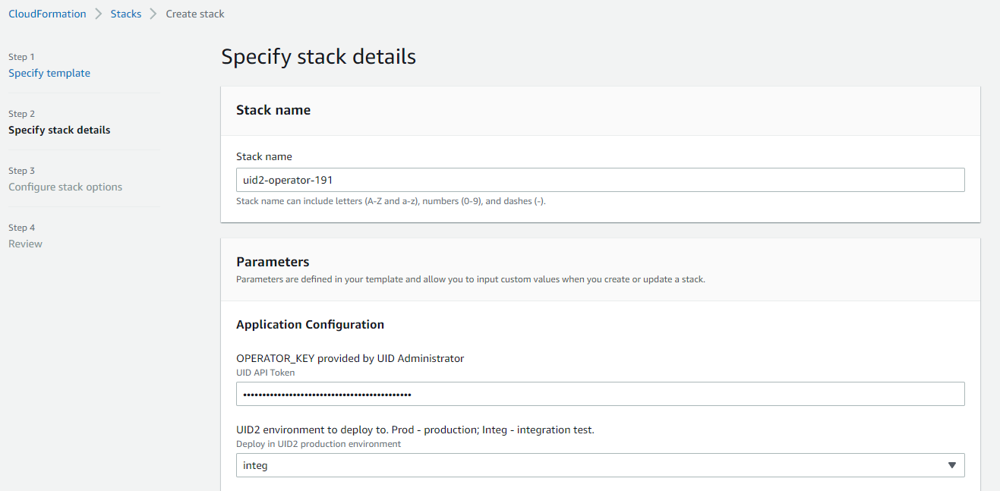
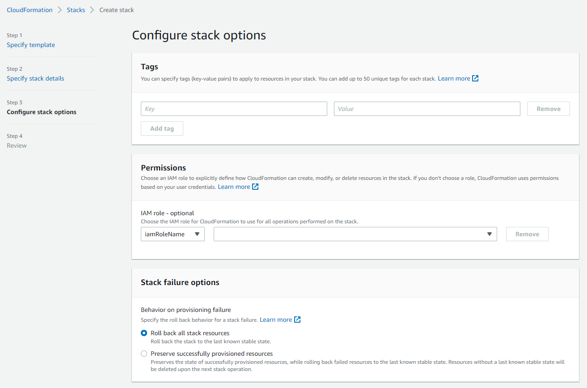

[UID2 Overview](../../../README.md) > [Getting Started](../../README.md) > [v2](../README.md) > [Integration Guides](README.md) > AWS Marketplace

# UID2 Operator: AWS Marketplace Integration Guide

The UID2 Operator is the API server in the UID2 ecosystem. To protect Personally Identifiable Information (PII) from unauthorized access, the UID2 Operator solution is enhanced with AWS Nitro Enclave technology.

This guide includes the following information:

- [UID2 Operator on AWS Marketplace Product](#uid2-operator-on-aws-marketplace-product)
  -  [Prerequisites](#prerequisites)
  -  [Resources Created](#resources-created)
  -  [Customization Options](#customization-options)
  -  [Security Group Policy](#security-group-policy)
  -  [VPC Chart](#vpc-chart)
- [Deployment](#deployment)
- [Checking UID2 Operator Status](#checking-uid2-operator-status)
- [Creating a Load Balancer](#creating-a-load-balancer)
- [Upgrading UID2 Operator](#upgrading-uid2-operator)
- [Technical Support](#technical-support)

## UID2 Operator on AWS Marketplace Product

>NOTE: [UID2 Operator on AWS Marketplace](https://aws.amazon.com/marketplace/pp/prodview-wdbccsarov5la) is a free product. The cost displayed on the product page is an infrastructure cost estimate.

By subscribing to the UID2 Operator on AWS Marketplace product, you gain access to the following:

- **Amazon Machine Image (AMI)** with the UID2 Operator service installed and ready to bootstrap:<br/>
    The AMI contains a AmazonLinux2 OS with UID2 Operator service set up. When an EC2 instance based on the AMI boots up, it automatically fetches configuration from your AWS account and starts the UID2 Operator server inside an enclave.  
- **CloudFormation template** to deploy UID2 Operator AMIs.

### Prerequisites

To subscribe and deploy UID2 Operators on AWS, you must complete the following steps:

1. Register your organization as a UID2 Operator.
2. Create an AWS account with an IAM role that has the [minimal privileges](#minimal-iam-role-privileges).

#### Minimal IAM Role Privileges

>IMPORTANT: To succeed in a one-click deployment, your AWS account must have the privilege to run the following actions.

```json
{
    "Version": "2012-10-17",
    "Statement": [
        {
            "Sid": "VisualEditor0",
            "Effect": "Allow",
            "Action": [
                "ec2:*",
                "kms:*",
                "autoscaling:*",
                "cloudformation:*",
                "iam:ListRoleTags",
                "secretsmanager:*",
                "iam:PutRolePolicy",
                "iam:AddRoleToInstanceProfile",
                "iam:ListRolePolicies",
                "iam:ListPolicies",
                "iam:GetRole",
                "iam:GetPolicy",
                "iam:DeleteRole",
                "iam:UpdateRoleDescription",
                "iam:TagPolicy",
                "iam:GetRolePolicy",
                "iam:CreateInstanceProfile",
                "iam:UntagRole",
                "iam:TagRole",
                "iam:ListInstanceProfilesForRole",
                "iam:PassRole",
                "iam:DeleteRolePolicy",
                "iam:ListPolicyTags",
                "iam:DeleteInstanceProfile",
                "iam:ListRoles",
                "iam:CreatePolicy",
                "iam:UntagPolicy",
                "iam:UpdateRole",
                "iam:UntagInstanceProfile",
                "iam:TagInstanceProfile",
                "iam:SetDefaultPolicyVersion",
                "iam:UpdateAssumeRolePolicy",
                "iam:GetPolicyVersion",
                "iam:RemoveRoleFromInstanceProfile",
                "iam:CreateRole",
                "iam:AttachRolePolicy",
                "iam:DetachRolePolicy",
                "iam:ListAttachedRolePolicies",
                "iam:DeletePolicy",
                "iam:ListInstanceProfileTags",
                "iam:CreatePolicyVersion",
                "iam:GetInstanceProfile",
                "iam:ListInstanceProfiles",
                "iam:ListPolicyVersions",
                "iam:DeletePolicyVersion",
                "iam:ListUserTags"
            ],
            "Resource": "*"
        }
    ]
}
```

### Resources Created

The following table lists all resources that are created during the [deployment](#deployment) and indicates which of them are always created and which depend on the `CreateVPC` condition in the CloudFormation template.

| Name | Type | Description | Created |
|:------|:------|:-------------|:--------------|
| `KMSKey` | `AWS::KMS::Key` | The key for secret encryption (for configuration strings). | Always |
| `SSMKeyAlias` | `AWS::KMS::Alias` | An alias that provides an easy way to access the KMS key. | Always |
| `TokenSecret` | `AWS::SecretsManager::Secret` | An encrypted configuration that includes the operator key. | Always |
| `WorkerRole` | `AWS::IAM::Role` | The IAM role that your UID2 Operators run as. Roles provide access to configuration keys. | Always |
| `WorkerInstanceProfile` | `AWS::IAM::InstanceProfile` | The instance profile with Worker Role to attach to Operator EC2 instances. | Always |
| `VPC` | `AWS::EC2::VPC` | Virtual Private Cloud (VPC) is a virtual private network that hosts private operators. You can customize and use an existing one as well. See also [VPC Chart](#vpc-chart).| Conditionally |
| `Subnet1` | `AWS::EC2::Subnet` | The first subnet of newly created VPC. | Conditionally |
| `Subnet2` | `AWS::EC2::Subnet` | The second subnet of newly created VPC. | Conditionally |
| `RouteTable` | `AWS::EC2::RouteTable` | The Routing Table of the newly created VPC and subnets. | Conditionally |
| `InternetGateway` | `AWS::EC2::InternetGateway` | The Internet Gateway that allows operators to communicate with the UID2 Core Service and download security updates. | Conditionally|
| `AttachGateway` | `AWS::EC2::VPCGatewayAttachment` | Associates Internet Gateway with the VPC. | Conditionally |
| `SecurityGroup` | `AWS::EC2::SecurityGroup` | A security group policy that provides rules for operator instances. See also [Security Group Policy](#security-group-policy).| Always |
| `LaunchTemplate` | `AWS::EC2::LaunchTemplate` | A launch template with all configurations in place. You can spawn new UID2 Operator instances from it. | Always |
| `AutoScalingGroup` | `AWS::AutoScaling::AutoScalingGroup` | An auto-scaling group (ASG) to which the launch template is attached. You can update the desired number of instances with it later. | Always |


### Customization Options

Here's what you can customize during or after the [deployment](#deployment):

- VPC: You can either set up a new VPC and subnets or use existing ones.
- Root volume size (8G Minimal)
- SSH key: This is the SSH key that you use to access the UID2 Operator EC2 instances.
- Instance type: m5.2xlarge, m5.4xlarge, and so on. If no customization m5.2xlarge is default and recommended.

### Security Group Policy

>NOTE: To avoid passing certificates associated with your domain into enclave, inbound HTTP is allowed instead of HTTPS. This also avoids the cost of a secure layer, if used in a private network internal to your organization. 

| Port Number | Direction | Protocol | Description |
| ----------- | --------- | -------- | ------ |
| 80 | Inbound | HTTP | Serves all UID2 APIs, including the healthcheck endpoint `/opt/healthcheck`. |
| 9080 | Inbound | HTTP | Serves prometheus metrics `/metrics`. |
| 443 | Outbound | HTTPS | Calls the UID2 Core Service; updates opt-out data and key store. |

### VPC Chart

The following diagram illustrates the virtual private cloud that hosts private operators.


## Deployment

To deploy the UID2 Operator on AWS Marketplace, complete the following steps:

1. Subscribe to [UID2 Operator on AWS Marketplace](https://aws.amazon.com/marketplace/pp/prodview-wdbccsarov5la). It might take several minutes before AWS completes your subscription.
2. Click **Configuration**.
3. On the Configuration page, click **Launch** and select the **Launch CloudFormation** action.
4. In the Create stack wizard, specify the template and click **Next**. The S3 path for template file is automatically filled in.
5. Fill in the [stack details](#stack-details) and click **Next**.
6. Configure [stack options](#stack-configuration-options) and click **Next**.
7. Review the information you have entered and make any changes you want.
8. If you are asked fo permission to create IAM roles, select the **I acknowledge that AWS CloudFormation might create IAM resources** checkbox.
9. Click **Create stack**.

It takes several minutes for the stack to be created. When you see an Auto Scaling Group (ASG) created, you can select it and check the EC2 instances (by default, there is only one instance to start with).  For details, see [Checking UID2 Operator Status](#checking-uid2-operator-status).

### Stack Details

The following are two screenshots of the "Specify stack details" page in the Create stack wizard ([deployment](#deployment) step 5). The table that follows provides a parameter value reference.

 


The following table explains the parameter values that you need to provide in step 5 during the [deployment](#deployment).

| Parameter | Description |
| :--- |:--- |
|Stack name |Any name of your choice. |
|OPERATOR_KEY |This is the Operator Key that you received from the UID2 Admin team. |
|UID2 Environment |Select `prod` for production environment or `integ` for integration test environment. |
|Instance Type |`m5.2xlarge` is recommended. |
|Instance root volume size |15 GB or more is recommended. |
|Key Name for SSH |Your EC2 key pair for SSH access to the EC2 instances deployed. |
|Trusted Network CIDR |This decides which IP address range have access to your operator service.<br />Restrict it to internal IP range if you intend to access the operators only through internal network or load balancer. |
|Choose to use Existing VPC | Set to `true` to create new VPC and subnets or to `false` to use user-provided VPC and subnets. <br/>If you decided to use existing VPC, you can find your own VPCs from [VPC dashboard](https://console.aws.amazon.com/vpc/home). Otherwise, leave the **existing VPC Id**, **VpcSubnet1**, **VpcSubnet2** fields blank. |

### Stack Configuration Options

The following is a screenshot of the Configure stack options page in the Create stack wizard ([deployment](#deployment) step 6).



The following table explains the parameter values that you need to provide in step 6 during the [deployment](#deployment).

| Parameter | Description |
| :--- |:--- |
|Tags | (Optional) Tag your stack. |
|Permissions |If you have separate IAM roles subscribing to AWS marketplace and deploying the stack, enter the name/ARN of the role you are going to use to deploy the stack. |
|Stack failure options |Choose what happens when deployment fails. The `Roll back all stack resources` option is recommended. |
|Advanced options | These are are optional. |

## Checking UID2 Operator Status

To find the EC2 instances, complete the following steps:

1. In the CloudFormation stack, click the **Resources** tab and find the Auto Scaling Group (ASG). 
2. Click the ASG link in the **Physical ID** column.
3. Inside the selected ASG, go to the **Instance management** tab where you can find the ID of the available EC2 instances (by default it starts only one instance).
4. To test operator status, in your browser, go to [http://\<public-dns-of-your-instance\>/ops/healthcheck](http://<public-domain-name>/ops/healthcheck). `OK` indicates good status.


## Creating a Load Balancer

To create a load balancer and a target operator auto scaling group, complete the following steps:

1. In the AWS Console, navigate to the EC2 dashboard and search for `Load Balancer`.
2. Click **Create Load Balancer**.
3. On the Load balancer types page, in the **Application Load Balancer** section, click **Create**.
4. Enter the UID2 **Load balancer name** and, depending on whether you need to access UID2 APIs from public internet, choose the **Internet-facing** or **Internal** scheme.
5. Select the **VPC** for your targets and at least two subnets used in your CloudFormation stack.
6. Click **Create new security group** and enter `UID2SGALB` as its name.
7. Under **Inbound rules**, select **HTTPS** and **Source IP range**, which depend on your requirements, and click **Create security group**.
8. Go back to the Load Balancer page and select the newly created UID2SGALB security group.
9. Under **Listeners and routing**, click the **Create target group** link and [specify the target group details](#specifying-target-group-details).
10. Go back to the Load Balancer page, select `UID2ALBTG` under **Forward to** and change **Port** to `443`.
11. Set up an HTTPS listener by following the instructions in [AWS user guide](https://docs.aws.amazon.com/elasticloadbalancing/latest/application/create-https-listener.html).
12. Click **Create load balancer**.

### Specifying Target Group Details

To create a target group when [creating a load balancer](#creating-a-load-balancer), complete the following steps:

1. On the Specify group details page, select **Instances** as target type, enter `UID2ALBTG` as **Target group name**, and select **HTTP1** as the **Protocol version**.
2. Under **Health checks**, provide `/ops/healthcheck` as the **Health check path** and expand the **Advanced health check settings** section. 
3. Select **Override** as the **Port** and change the default value to `9080`.
4. Select UID2 Operator EC2 Instances created by your auto scaling group and click **Include as pending below**. 
5. Make sure the **Ports for the selected instances** contains `80`.
6. Click **Create target group**.

## Upgrading UID2 Operator

For each operator version update, private operators receive an email notification with an upgrade window, after which the old version is deactivated and no longer supported.

Here's what you need to know about upgrading:

- Information on the availability of new versions is provided at [UID2 Operator on AWS Marketplace](https://aws.amazon.com/marketplace/pp/prodview-wdbccsarov5la).
- To upgrade your UID2 Operators, create a new CloudFormation stack. For details, see [Deployment](#deployment).

>TIP: For a smooth transition, create the new stack first. After the new stack is bootstrapped and ready to serve, delete the old stack. If you have load balancer created, convert the DNS name from previous one to the new one after the new instances are up.

## Technical Support

If you have trouble subscribing or deploying the product, please contact us at [aws-mktpl-uid@thetradedesk.com](mailto:aws-mktpl-uid@thetradedesk.com).

