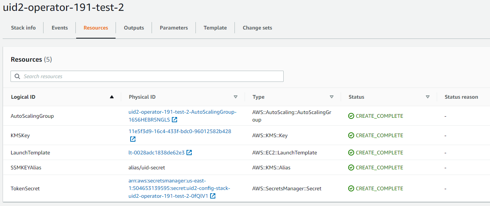

[UID2 API Documentation](../../README.md) > [v2](../README.md) > [Integration Guides](README.md) > AWS Marketplace

# UID2 Operator: AWS Marketplace Integration Guide

The UID2 Operator is the API server in the UID2 ecosystem. The UID2 Operator solution is enhanced with AWS Nitro Enclave technology to protect Personally Identifiable Information (PII) from unauthorized access.

This guide includes the following information:

- [UID2 Operator on AWS Marketplace Product](#uid2-operator-on-aws-marketplace-product)
  -  [Prerequisites](#prerequisites)
  -  [Resources Created](#resources-created)
  -  [Customization Options](#customization-options)
- [Deployment](#deployment)
- [Checking UID2 Operator Status](#checking-uid2-operator-status)
- [Upgrading UID2 Operator](#upgrading-uid2-operator)
- [Technical Support](#technical-support)

## UID2 Operator on AWS Marketplace Product

>NOTE: [UID2 Operator on AWS Marketplace](https://aws.amazon.com/marketplace/pp/prodview-wdbccsarov5la) is a free product. The cost that appears on the product page is an infrastructure cost estimate.

By subscribing the UID2 Operator on AWS Marketplace product, you gain access to the following:

- **Amazon Machine Image (AMI)** with the UID2 Operator service installed and ready to bootstrap:<br/>
    The AMI contains a AmazonLinux2 OS with UID2 Operator service set up. When an EC2 instance based on the AMI boots up, it automatically fetches configuration from your AWS account and starts the UID2 Operator server inside an enclave.  
- **CloudFormation template** to deploy UID2 Operator AMIs

### Prerequisites

To subscribe and deploy UID2 Operators on AWS, you must complete the following steps:

- Register your organization as a UID2 Operator.
- Create an AWS account with an IAM role that has the [minimal privileges](#minimal-iam-roleactions).

#### Minimal IAM Role Actions

>IMPORTANT: To succeed in a one-click deployment, your AWS account must have the privilege to run the following actions:

```json
{
    "Version": "2012-10-17",
    "Statement": [
        {
            "Sid": "VisualEditor0",
            "Effect": "Allow",
            "Action": [
                "ec2:*",
                "kms:*",
                "autoscaling:*",
                "cloudformation:*",
                "iam:ListRoleTags",
                "secretsmanager:*",
                "iam:PutRolePolicy",
                "iam:AddRoleToInstanceProfile",
                "iam:ListRolePolicies",
                "iam:ListPolicies",
                "iam:GetRole",
                "iam:GetPolicy",
                "iam:DeleteRole",
                "iam:UpdateRoleDescription",
                "iam:TagPolicy",
                "iam:GetRolePolicy",
                "iam:CreateInstanceProfile",
                "iam:UntagRole",
                "iam:TagRole",
                "iam:ListInstanceProfilesForRole",
                "iam:PassRole",
                "iam:DeleteRolePolicy",
                "iam:ListPolicyTags",
                "iam:DeleteInstanceProfile",
                "iam:ListRoles",
                "iam:CreatePolicy",
                "iam:UntagPolicy",
                "iam:UpdateRole",
                "iam:UntagInstanceProfile",
                "iam:TagInstanceProfile",
                "iam:SetDefaultPolicyVersion",
                "iam:UpdateAssumeRolePolicy",
                "iam:GetPolicyVersion",
                "iam:RemoveRoleFromInstanceProfile",
                "iam:CreateRole",
                "iam:AttachRolePolicy",
                "iam:DetachRolePolicy",
                "iam:ListAttachedRolePolicies",
                "iam:DeletePolicy",
                "iam:ListInstanceProfileTags",
                "iam:CreatePolicyVersion",
                "iam:GetInstanceProfile",
                "iam:ListInstanceProfiles",
                "iam:ListPolicyVersions",
                "iam:DeletePolicyVersion",
                "iam:ListUserTags"
            ],
            "Resource": "*"
        }
    ]
}
```

### Resources Created

The following table lists all resources that are created during the deployment.

| Resource | Description |
| :--- |:--- |
| CloudFormation Stack | A logical representation of all the resources created. This helps you deploy and rollback resources as a group. |
| KMS Key | The key for secret encryption (for configuration string). |
| Configuration as Secret | A secret named `uid2-operator-config-key` created in the Secret Manager. |
| Worker Role | The IAM role that your UID2 Operators will run as. |
| Worker Instance Profile | The Instance Profile that your UID2 Operators will run as. It refers to Worker Role. |
| Virtual Private Cloud (VPC) and subnets | The virtual network that UID2 Operators will run in. You can customize and use existing ones as well. |
| Security Group | A security group providing minimal access for UID2 Operator to serve. It automatically refers to the used VPC. |
| Launch Template | A launch template with all the configurations in place. You can spawn new UID2 Operator instances from it. |
| Auto Scaling Group (ASG) | An ASG to which the launch template attached. You can update the desired number of instances with it later. |
| UID2 Operator instances | The EC2 instances will start after the ASG is created.|

### Customization Options

Here's what you can customize during or afater the deployment:

- VPC: You can either set up a new VPC and subnets or use existing ones.
- Root volume size
- SSH key: This is the SSH key that you use to access the UID2 Operator EC2 instances.
- Instance type: m5.2xlarge, m5.4xlarge, and so on

## Deployment

To deploy the UID2 Operator on AWS Marketplace, complete the following steps:

1. Subscribe to [UID2 Operator on AWS Marketplace](https://aws.amazon.com/marketplace/pp/prodview-wdbccsarov5la). It might take several minutes before AWS completes your subscription.
2. Click **Configuration**.
3. On the Configuration page, click **Launch** and select the **Launch CloudFormation** action.
4. In the Create stack wizard, Specify the template and click **Next**. The S3 path for template file is automatically filled in.
5. Fill in the [stack details](#stack-details) and click **Next**.
6. Configure [stack options](#stack-configuration-options) and click **Next**.
7. Review the information you have entered and make any changes you want.
8. If you are asked fo permission to create IAM roles, select the **I acknowledge that AWS CloudFormation might create IAM resources** checkbox.
9. Click **Create stack**.

It takes several minutes for the stack to be created. When you see an Auto Scaling Group (ASG) created, you can select it and check the EC2 instances. For details, see [Checking UID2 Operator Status](#checking-uid2-operator-status).

### Stack Details

The following are screenshots of the Stack details page in the wizard (step 5 during the [deployment](#deployment)). The table that follows provides a parameter value reference.

 


The following table explains the parameter values that you need to provide in step 5 during the [deployment](#deployment).

| Parameter | Description |
| :--- |:--- |
|Stack name |Any name of your choice. |
|OPERATOR_KEY |This is the Operator Key you received from UID2 admin team. |
|UID2 Environment |Select `prod` for production environment or `integ` for integration test environment. |
|Instance Type |m5.2xlarge is recommended. |
|Instance root volume size |15GB or more is recommended. |
|Key Name for SSH |Your EC2 key pair for SSH access to the EC2 instances deployed. |
|Trusted Network CIDR |This decides which IP address range have access to your operator service. |
|Choose to use Existing VPC | Set to `true` to create new VPC and subnets or to `false` to use user-provided VPC and subnets. <br/>If you decided to use existing VPC, you can find your own VPCs from [VPC dashboard](https://console.aws.amazon.com/vpc/home). Otherwise, leave the **existing VPC Id**, **VpcSubnet1**, **VpcSubnet2** fields blank. |

### Stack Configuration Options

The following screenshot shows TBD  (step 6 during the [deployment](#deployment)).


The following table explains the parameter values that you need to provide in step 6 during the [deployment](#deployment).

| Parameter | Description |
| :--- |:--- |
|Tags | (Optional) Tag your stack. |
|Permissions |If you have separate IAM roles subscribing to AWS marketplace and deploying the stack, put the name/ARN of the role you are going to use to deploy the stack. |
|Stack failure options |Choose what happens when deployment fails. The `roll back all stack resources` options is recommended. |
|Advanced options | These are are optional. |
     
## Checking UID2 Operator Status

To find the EC2 instances, complete the following steps:

1. In the CloudFormation stack, click the **Resources** tab and find the Auto Scaling Group (ASG). 
2. Click the ASG link in the **Physical ID** column.
3. Inside the selected ASG, go to the **Instance management** tab where you can find the ID of the available EC2 instances (by default it starts only one instance).
4. To test operator status, in your browser, visit [http://<public-domain-name>/ops/healthcheck](http://<public-domain-name>/ops/healthcheck). `OK` indicates good status.



## Upgrading UID2 Operator

Here's what you need to know about upgrading:

- Informantion on the availability of versions is provided at [UID2 Operator on AWS Marketplace](https://aws.amazon.com/marketplace/pp/prodview-wdbccsarov5la).
- To upgrade your UID2 Operators, create a new CloudFormation stack. For details, see [Deployment](#deployment).

>TIP: For a smooth transition, create the new stack first. After the new stack is bootstrapped and ready to serve, delete the old stack.

## Technical Support

If you have trouble subscribing or deploying the product, please contact us at [aws-mktpl-uid@thetradedesk.com](mailto:aws-mktpl-uid@thetradedesk.com).


