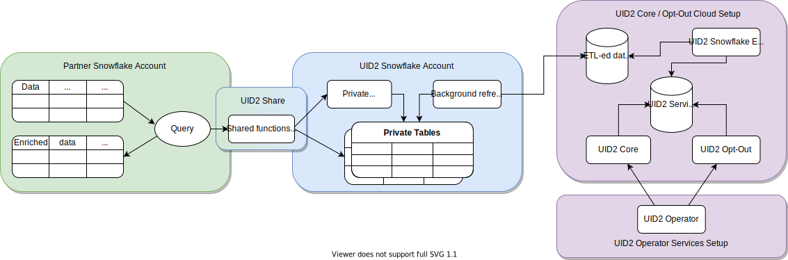

# Snowflake Integration

[Snowflake](https://www.snowflake.com/) is a cloud data warehousing solution, where you as a partner can store your data and integrate with UID2. Using Snowflake, UID2 enables you to securely share authorized consumer identifier data without exposing sensitive PII. Even though you have the option to query the Operator Web Services directly for the consumer identifier data, the Snowflake UID2 integration offers a more seamless experience.

The following diagram illustrates how you engage with the UID2 integration process in Snowflake:



|Partner Snowflake Account|UID2 Snowflake Account|UID2 Core Opt-out Cloud Setup|
| :--- | :--- | :--- |
|As a partner, you set up a Snowflake account to host your data and engage in UID2 integration by consuming functions and views through the UID2 Share. | UID2 integration, hosted in a Snowflake account, grants you access to authorized functions and views that draw data from private tables. You can’t access the private tables. The UID2 Share reveals only essential data needed for you to perform UID2-related tasks. |ETL (Extract Transform Load) jobs constantly update the UID2 Core/Optout Snowflake storage with internal data that powers the UID2 Operator Web Services. The data used by the Operator Web Services is also available through the UID2 Share. |
|When you use shared functions and views, you pay Snowflake for transactional computation costs.  |These private tables, secured in the UID2 Snowflake account, automatically synchronize with the UID2 Core/Optout Snowflake storage that holds internal data used to complete UID2-related tasks.  | |


## Access the UID2 Shares

Access to the UID2 Share is available through the [Snowflake Data Marketplace](https://www.snowflake.com/data-marketplace/) where you can request specific data sets based on the UID2 personalized listing you select. Currently, there are two personalized listings offered in the Snowflake Data Marketplace for UID2: for advertisers/brands and data providers.

>IMPORTANT: To be able to request data, you must have the `ACCOUNTADMIN` role privileges in your Snowflake account.

To request access to a UID2 Share, complete the following steps:

1.	Log in to the Snowflake Data Marketplace and select the UID2 solution in which you are interested:
      - [Unified ID 2.0 Advertiser Identity Solution](https://app.snowflake.com/marketplace/listing/GZT0ZRYXTMV)
      - [Unified ID 2.0 Data Provider Identity Solution](https://app.snowflake.com/marketplace/listing/GZT0ZRYXTN0)
2.	In the **Personalized Data** section, click **Request Data**.
3.	Follow the onscreen instructions to verify and provide your contact and other required information.
4.	If you are an existing client of The Trade Desk and are interested in the *Advertiser* Identity Solution, include your partner and advertiser IDs issued by The Trade Desk in the **Message** field of the data request form.
5.	Submit the form.

After your request is received, a UID2 administrator will contact you with the appropriate access instructions. For details about managing data requests in Snowflake, see the [Snowflake documentation](https://docs.snowflake.com/en/user-guide/data-marketplace-consumer.html).


## Shared Objects

Regardless of the UID2 solution you choose, you can map single or multiple email addresses or email hashes to UID2s by using the following functions:

- `FN_T_UID2_IDENTITY_MAP_EMAIL` (See [Map Email Addresses](#map-email-addresses))
- `FN_T_UID2_IDENTITY_MAP_EMAIL_HASH` (See [Map Email Address Hashes](#map-email-address-hashes))

To identify the UID2s that you must regenerate, use the `UID2_SALT_BUCKETS` view from the UID2 Share. For details, see [Regenerate UID2s](#regenerate-uid2s).

### Database and Schema Names

The following sections include query examples for each solution, which are identical except for the database and schema name variables:

```
{DATABASE_NAME}.{SCHEMA_NAME}
```
For example:
```
select UID2, BUCKET_ID from table({DATABASE_NAME}.{SCHEMA_NAME}.FN_T_UID2_IDENTITY_MAP_EMAIL('validate@email.com'));
```

All query examples use the following default values for each name variable:

| Variable |Advertiser Solution Default Value | Data Provider Solution Default Value| Comments |
| :--- | :--- | :--- | :--- |
| `{DATABASE_NAME}` | `UID2_PROD_ADV_SH` | `UID2_PROD_DP_SH` | If needed, you can change the default database name when creating a new database after you are granted access to the selected UID2 Share. |
| `{SCHEMA_NAME}`| `ADV` | `DP` | This is an immutable name. |

### Map Email Addresses

To map a single email address or multiple email addresses to the corresponding UID2s and second-level salt bucket IDs, use the `FN_T_UID2_IDENTITY_MAP_EMAIL` function. It takes an email address as its argument and normalizes it using the UID2 [Email Normalization](../../README.md#email-normalization) rules.

|Argument|Data Type|Description|
| :--- | :--- | :--- |
|`EMAIL`|varchar(128)| The email address to map to the UID2 and second-level bucket ID. |

A successful query returns the following information for the specified email address.

>NOTE: For any invalid email addresses in the request, `NULL` values are returned.

|Column Name|Data Type|Description|
| :--- | :--- | :--- |
| `UID2` | TEXT | The UID2 associated with the email address. |
| `BUCKET_ID` | TEXT | The ID of the second-level salt bucket used to generate the UID2. This ID maps to the bucket ID in the `UID2_SALT_BUCKETS` view. |


#### Single Email Mapping Request Example

The following queries illustrate how to map a single email address, using the [default database and schema names](#database-and-schema-names).

##### Advertiser Solution Query
```
select UID2, BUCKET_ID from table(UID2_PROD_ADV_SH.ADV.FN_T_UID2_IDENTITY_MAP_EMAIL('validate@email.com'));
```

##### Data Provider Solution Query
```
select UID2, BUCKET_ID from table(UID2_PROD_DP_SH.DP.FN_T_UID2_IDENTITY_MAP_EMAIL('validate@email.com'));
```

##### Results

```
+----------------------------------------------+------------+
| UID2                                         | BUCKET_ID  |
+----------------------------------------------+------------+
| 2ODl112/VS3x2vL+kG1439nPb7XNngLvOWiZGaMhdcU= | ad1ANEmVZ  |
+----------------------------------------------+------------+
```

#### Multiple Emails Mapping Request Example
The following queries illustrate how to map multiple email addresses, using the [default database and schema names](#database-and-schema-names).

##### Advertiser Solution Query
```
select a.ID, a.EMAIL, m.UID2, m.BUCKET_ID from AUDIENCE a LEFT JOIN(
    select ID, t.* from AUDIENCE, lateral UID2_PROD_ADV_SH.ADV.FN_T_UID2_IDENTITY_MAP_EMAIL(EMAIL) t) m
    on a.ID=m.ID;
```
##### Data Provider Solution Query
```
select a.ID, a.EMAIL, m.UID2, m.BUCKET_ID from AUDIENCE a LEFT JOIN(
    select ID, t.* from AUDIENCE, lateral UID2_PROD_DP_SH.DP.FN_T_UID2_IDENTITY_MAP_EMAIL(EMAIL) t) m
    on a.ID=m.ID;
```

##### Results

The following table identifies each item in the response, including `NULL` values for an improperly formatted email.

```
+----+--------------------+----------------------------------------------+------------+
| ID | EMAIL              | UID2                                         | BUCKET_ID  |
+----+--------------------+----------------------------------------------+------------+
|  1 | validate@email.com | 2ODl112/VS3x2vL+kG1439nPb7XNngLvOWiZGaMhdcU= | ad1ANEmVZ  |
|  2 | test@uidapi.com    | IbW4n6LIvtDj/8fCESlU0QG9K/fH63UdcTkJpAG8fIQ= | a30od4mNRd |
|  3 | NULL               | NULL                                         | NULL       |
+----+--------------------+----------------------------------------------+------------+
```

### Map Email Address Hashes
To map a single email address hash or multiple hashes to the corresponding UID2s and second-level salt bucket IDs, use the `FN_T_UID2_IDENTITY_MAP_EMAIL_HASH` function which takes an email address hash as its argument.

|Argument|Data Type|Description|
| :--- | :--- | :--- |
|`EMAIL_HASH`|varchar(128)| The base64-encoded SHA256 hash of the normalized email address of a user. Ensure that the email hash is correctly formatted using the [Email Normalization](../../README.md#email-normalization) rules. Use the hash computed from the normalized email address.|

A successful query returns the following information for the specified email address hash.

>NOTE: For any improperly formatted email address hashes in the request, `NULL` values are returned.

|Column Name|Data Type|Description|
| :--- | :--- | :--- |
| `UID2` | TEXT | The UID2 associated with the email address. |
| `BUCKET_ID` | TEXT | The ID of the second-level salt bucket that was used to generate the UID2. This ID maps to the bucket ID in the `UID2_SALT_BUCKETS` view. |

#### Single Email Hash Mapping Request Example
The following queries illustrate how to map a single email address hash, using the [default database and schema names](#database-and-schema-names).

##### Advertiser Solution Query
```
select UID2, BUCKET_ID from table(UID2_PROD_ADV_SH.ADV.FN_T_UID2_IDENTITY_MAP_EMAIL(BASE64_ENCODE(SHA2_BINARY('validate@email.com', 256))));
```

##### Data Provider Solution Query
```
select UID2, BUCKET_ID from table(UID2_PROD_DP_SH.DP.FN_T_UID2_IDENTITY_MAP_EMAIL(BASE64_ENCODE(SHA2_BINARY('validate@email.com', 256))));
```

##### Results

```
+----------------------------------------------+------------+
| UID2                                         | BUCKET_ID  |
+----------------------------------------------+------------+
| 2ODl112/VS3x2vL+kG1439nPb7XNngLvOWiZGaMhdcU= | ad1ANEmVZ  |
+----------------------------------------------+------------+
```


#### Multiple Email Hashes Mapping Request Example
The following queries illustrate how to map multiple email address hashes, using the [default database and schema names](#database-and-schema-names).

##### Advertiser Solution Query
```
select a.ID, a.EMAIL_HASH, m.UID2, m.BUCKET_ID from AUDIENCE a LEFT JOIN(
    select ID, t.* from AUDIENCE, lateral UID2_PROD_ADV_SH.ADV.FN_T_UID2_IDENTITY_MAP_EMAIL_HASH(EMAIL_HASH) t) m
    on a.ID=m.ID;
```

##### Data Provider Solution Query
```
select a.ID, a.EMAIL_HASH, m.UID2, m.BUCKET_ID from AUDIENCE a LEFT JOIN(
    select ID, t.* from AUDIENCE, lateral UID2_PROD_DP_SH.DP.FN_T_UID2_IDENTITY_MAP_EMAIL_HASH(EMAIL_HASH) t) m
    on a.ID=m.ID;
```

##### Results

The following table identifies each item in the response, including `NULL` values for an improperly formatted email hash.

```
+----+----------------------------------------------+----------------------------------------------+------------+
| ID | EMAIL_HASH                                   | UID2                                         | BUCKET_ID  |
+----+----------------------------------------------+----------------------------------------------+------------+
|  1 | LdhtUlMQ58ZZy5YUqGPRQw5xUMS5dXG5ocJHYJHbAKI= | 2ODl112/VS3x2vL+kG1439nPb7XNngLvOWiZGaMhdcU= | ad1ANEmVZ  |
|  2 | NULL                                         | NULL                                         | NULL       |
|  3 |/XJSTajB68SCUyuc3ePyxSLNhxrMKvJcjndq8TuwW5g=  | IbW4n6LIvtDj/8fCESlU0QG9K/fH63UdcTkJpAG8fIQ= | a30od4mNRd |
+----+----------------------------------------------+----------------------------------------------+------------+
```

### Regenerate UID2s

The `UID2_SALT_BUCKETS` view query returns the date and time when the second-level salt buckets were last updated. Second-level salt is used when generating UID2s. When the salt in the bucket is updated, the previously generated UID2 becomes outdated and doesn’t match the UID2 generated by other parties for the same user.

To determine which UID2s need regeneration, compare the timestamps of when they were generated to the most recent timestamp of the second-level salt bucket update.

|Column Name|Data Type|Description|
| :--- | :--- | :--- |
| `BUCKET_ID` | TEXT | The ID of the second-level salt bucket. This ID parallels the `BUCKET_ID` returned by the identity map functions. Use the `BUCKET_ID` as the key to do a join query between the function call results and results from this view call.  |
| `LAST_SALT_UPDATE_UTC` | TIMESTAMP_NTZ | The last time the salt in the bucket was updated. This value is expressed in UTC timezone. |

The following example shows an input table and the query used to find the UID2s in the table that require regeneration due to updated second-level salt.

#### Targeted Input Table
```
select * from AUDIENCE_WITH_UID2;
```
```
+----+--------------------+----------------------------------------------+------------+-------------------------+
| ID | EMAIL              | UID2                                         | BUCKET_ID  | LAST_UID2_UPDATE_UTC    |
+----+--------------------+----------------------------------------------+------------+-------------------------+
|  1 | validate@email.com | 2ODl112/VS3x2vL+kG1439nPb7XNngLvOWiZGaMhdcU= | ad1ANEmVZ  | 2021-03-01 00:00:00.000 |
|  2 | test1@uidapi.com   | Q4A5ZBuBCYfuV3Wd8Fdsx2+i33v7jyFcQbcMG/LH4eM= | ad1ANEmVZ  | 2021-03-03 00:00:00.000 |
|  3 | test2@uidapi.com   | NULL                                         | NULL       | NULL                    |
+----+--------------------+----------------------------------------------+------------+-------------------------+
```

To find missing or outdated UID2s, use the following query examples, which use the [default database and schema names](#database-and-schema-names).

##### Advertiser Solution Query
```
select a.*, b.LAST_SALT_UPDATE_UTC
  from AUDIENCE_WITH_UID2 a LEFT OUTER JOIN UID2_PROD_ADV_SH.ADV.UID2_SALT_BUCKETS b
  on a.BUCKET_ID=b.BUCKET_ID
  where a.LAST_UID2_UPDATE_UTC < b.LAST_SALT_UPDATE_UTC or a.UID2 IS NULL;
```

##### Data Provider Solution Query
```
select a.*, b.LAST_SALT_UPDATE_UTC
  from AUDIENCE_WITH_UID2 a LEFT OUTER JOIN UID2_PROD_DP_SH.DP.UID2_SALT_BUCKETS b
  on a.BUCKET_ID=b.BUCKET_ID
  where a.LAST_UID2_UPDATE_UTC < b.LAST_SALT_UPDATE_UTC or a.UID2 IS NULL;
```

##### Results

The following table identifies each item in the response. The result includes an email, `UID2`, `BUCKET_ID`, `LAST_UID2_UPDATE_UTC`, and `LAST_SALT_UPDATE_UTC` as shown in the ID 1 example below. No information is returned for ID 2 because the corresponding UID2 was generated after the last bucket update. For ID 3, `NULL` values are returned due to a missing UID2.

```
+----+--------------------+----------------------------------------------+------------+-------------------------+-------------------------+
| ID | EMAIL              | UID2                                         | BUCKET_ID  | LAST_UID2_UPDATE_UTC    | LAST_SALT_UPDATE_UTC    |
+----+--------------------+----------------------------------------------+------------+-------------------------+-------------------------+
|  1 | validate@email.com | 2ODl112/VS3x2vL+kG1439nPb7XNngLvOWiZGaMhdcU= | ad1ANEmVZ  | 2021-03-01 00:00:00.000 | 2021-03-02 00:00:00.000 |
|  3 | test2@uidapi.com   | NULL                                         | NULL       | NULL                    | NULL                    |
+----+--------------------+----------------------------------------------+------------+-------------------------+-------------------------+
```
