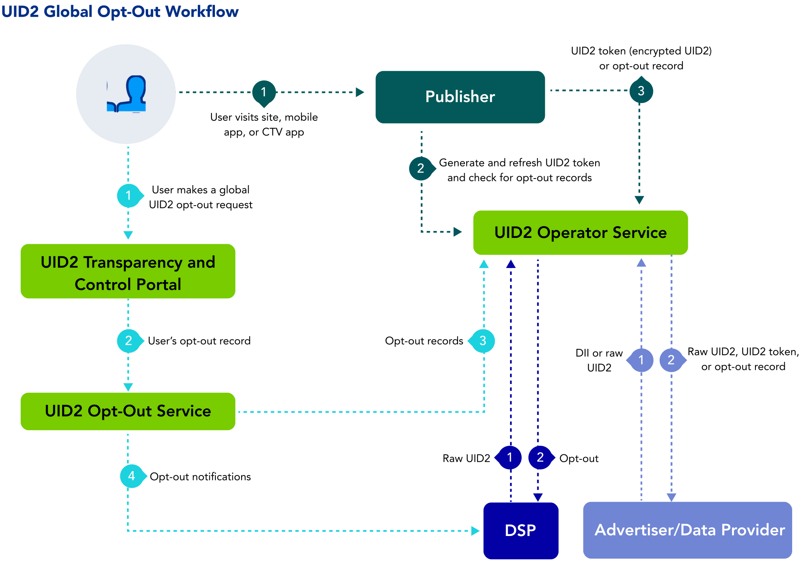

import Link from '@docusaurus/Link';

# User Opt-Out

Many different publishers and advertisers use UID2. Different publishers might have different opt-out processes for their individual sites; however, UID2 as a whole has very specific opt-out processes that all UID2 [participants](overviews/participants-overview.md#uid2-external-participants) are expected to honor.

## How Users Can Opt Out of UID2

Within the UID2 ecosystem, there are two types of opt out:
- Opt out of the participant's site
- Opt out of UID2

Because each participant has their own opt-out workflow, participants are mandated to respect a user's opted-out status and therefore not create a UID2 for any user who opted out from the participant.

For example, if a user opts out of a publisher's site, but has not opted out of UID2, the publisher should not generate a UID2 token for that user.  

Consumers can always opt out of UID2 being used to show them personalized ads, in the [Transparency and Control Portal](https://www.transparentadvertising.com/). Choose email address or phone number, enter the data, and follow the prompts.

:::tip
To opt out both your email address and your phone number, do them one at a time.
:::

## Difference Between Opting Out from a Single Participant and Opting Out of UID2

If a consumer opts out from a specific participant, UID2 guidelines mandate that the participant no longer uses that consumer's information to create or generate a UID2, because the consumer opted out of that site specifically. Those are the requirements of the UID2 framework.

In addition, if a user opts out from a specific participant, that information is not relayed to UID2. Opting out from a specific participant does not opt a consumer out of UID2.

The sure way for a consumer to fully opt out of UID2 is in the [Transparency and Control Portal](https://www.transparentadvertising.com/).

## Opt-Out Workflow

When a consumer opts out of UID2, that individual's UID2 is no longer accepted for targeted advertising anywhere in the UID2 ecosystem. However, because there is a delay in the time it takes to process and refresh UID2 information, the UID2 for a user who has opted out might be in play for a short while after opt-out. As each participant periodically refreshes their UID2s, the opt-out information is propagated to the participants.

The following steps provide a high-level outline of the opt-out workflow intended for users who have had a UID2 created from their email address or phone number. 

1. Users visit the [Transparency and Control Portal](https://www.transparentadvertising.com/), where they can globally opt out of UID2.
2. The Transparency and Control Portal sends the opt-out request to the UID2 <Link href="../ref-info/glossary-uid#gl-operator-service">Operator Service</Link>.
3. If the user has opted out, the UID2 Operator Service distributes the opt-out information to UID2 participants, as shown in the following table.

   | Participant | Distribution Method |
   | :--- | :--- | 
   | Publishers | A publisher calling  [POST&nbsp;/token/generate](../endpoints/post-token-generate.md) with the required `optout_check` parameter set to `1`, or [POST&nbsp;/token/refresh](../endpoints/post-token-refresh.md), receives the opt-out response instead of the UID2 token. |
   | DSPs | The UID2 Operator Service distributes information on all opted-out users to DSPs via a webhook provided for the purpose. For details, see [Honor User Opt-Outs](../guides/dsp-guide#honor-user-opt-outs). DSPs can also check the opt-out status of raw UID2s using the [POST&nbsp;/optout/status](../endpoints/post-optout-status.md) endpoint. |
   | Advertisers and data providers | The UID2 Operator Service distributes opt-out information to advertisers and data providers via the [POST&nbsp;/identity/map](../endpoints/post-identity-map.md) endpoint. Another option is to check the opt-out status of raw UID2s using the [POST&nbsp;/optout/status](../endpoints/post-optout-status.md) endpoint. |
   | Sharers | UID2 sharers can check the opt-out status of raw UID2s using the [POST&nbsp;/optout/status](../endpoints/post-optout-status.md) endpoint. |

This workflow allows users to opt out of personalized advertising based on their UID2 through the Transparency and Control Portal.

