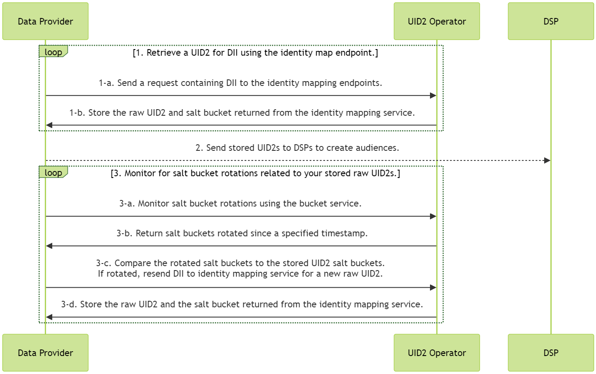

# Advertiser/Data Provider Integration Guide

This guide covers integration steps for organizations that collect user data and push it to other UID2 participants. Data collectors include advertisers, data on-boarders, measurement providers, identity graph providers, third-party data providers, and any other organizations that send data to other participants.

<!-- It includes the following sections:

* [Integration Steps](#integration-steps)
   - [Retrieve a raw UID2 for DII using the identity map endpoints](#1-retrieve-a-raw-uid2-for-dii-using-the-identity-map-endpoint)
   - [Send stored raw UID2s to DSPs to create audiences](#2-send-stored-raw-uid2s-to-dsps-to-create-audiences)
   - [Monitor for salt bucket rotations related to your stored raw UID2s](#3-monitor-for-salt-bucket-rotations-related-to-your-stored-raw-uid2s)
* [Use an incremental process to continuously update raw UID2s](#use-an-incremental-process-to-continuously-update-raw-uid2s)
* [FAQs](#faqs) -->

If you are using an Open Operator service hosted in the Snowflake Data Marketplace, see also [Snowflake Integration Guide](snowflake_integration.md).

## Integration Steps

The following diagram outlines the steps that data collectors must complete to map [directly identifying information (DII)](../ref-info/glossary-uid.md#gl-dii) to UID2 identifiers for audience building and targeting.

DII refers to a user's normalized email address or phone number, or the normalized and SHA-256-hashed email address or phone number.

<!-- diagram source: resource/advertiser-flow-mermaid.md -->

Refer to the following sections for details about the different parts of the diagram:
1. [Retrieve a raw UID2 for DII using the identity map endpoints](#1-retrieve-a-raw-uid2-for-dii-using-the-identity-map-endpoint)
2. [Send stored raw UID2s to DSPs to create audiences](#2-send-stored-raw-uid2s-to-dsps-to-create-audiences)
3. [Monitor for salt bucket rotations related to your stored raw UID2s](#3-monitor-for-salt-bucket-rotations-related-to-your-stored-raw-uid2s)

### 1: Retrieve a raw UID2 for DII using the identity map endpoint

| Step | Endpoint | Description |
| --- | --- | --- |
| 1-a | [POST&nbsp;/identity/map](../endpoints/post-identity-map.md) request | Send a request containing DII to the identity mapping endpoint. |
| 1-b | [POST&nbsp;/identity/map](../endpoints/post-identity-map.md) response | The `advertising_id` (raw UID2) returned in the response can be used to target audiences on relevant DSPs. The response returns a user's raw UID2 and the corresponding `bucket_id` for the salt bucket. The salt assigned to the bucket rotates annually, which impacts the generated raw UID2. For details on how to check for salt bucket rotation, see [3: Monitor for salt bucket rotations](#3-monitor-for-salt-bucket-rotations-related-to-your-stored-raw-uid2s). For ease of maintenance, a recommended approach is to store a user's raw UID2 and `bucket_id` in a mapping table. For guidance on incremental updates, see [Use an incremental process to continuously update raw UID2s](#use-an-incremental-process-to-continuously-update-raw-uid2s). |

### 2: Send stored raw UID2s to DSPs to create audiences

Send the `advertising_id` (raw UID2) returned in Step 1-b to a DSP while building your audiences. Each DSP has a unique integration process for building audiences; follow the integration guidance provided by the DSP for sending raw UID2s to build an audience.

### 3: Monitor for salt bucket rotations related to your stored raw UID2s
A raw UID2 is an identifier for a user at a specific moment in time. The raw UID2 for a specific user changes at least once per year, as a result of the salt rotation. 

Even though each salt bucket is updated approximately once per year, individual bucket updates are spread over the year. Approximately 1/365th of all salt buckets are rotated daily.

>IMPORTANT: To ensure that your integration has the current raw UID2s, check salt bucket rotation for active users every day.

| Step | Endpoint | Description |
| --- | --- | --- |
| 3-a | [POST&nbsp;/identity/buckets](../endpoints/post-identity-buckets.md) | Send a request to the bucket status endpoint for all salt buckets that have changed since a specific timestamp. |
| 3-b | [POST&nbsp;/identity/buckets](../endpoints/post-identity-buckets.md) | UID2 service: The bucket status endpoint returns a list of `bucket_id` and `last_updated` timestamps. |
| 3-c | [POST&nbsp;/identity/map](../endpoints/post-identity-map.md) | Compare the returned `bucket_id` to the salt buckets of raw UID2s that you've cached. If you find that the salt bucket was updated for one or more raw UID2s, re-send the DII to the identity mapping service for a new raw UID2. |
| 3-d | [POST&nbsp;/identity/map](../endpoints/post-identity-map.md) | Store the new values returned for `advertising_id` and `bucket_id`. |

## Use an Incremental Process to Continuously Update Raw UID2s

To keep your UID2-based audience information accurate and up to date, follow these integration steps every day:

1. The response from the [UID2 retrieval step](#1-retrieve-a-raw-uid2-for-dii-using-the-identity-map-endpoint) contains mapping information. Cache the following:
   - The mapping between DII (`identifier`), raw UID2 (`advertising_id`), and salt bucket (`bucket_id`).
   - The most recent `last_updated` timestamp.
2. Using the results from Step 3, [Monitor for salt bucket rotations related to your stored raw UID2s](#3-monitor-for-salt-bucket-rotations-related-to-your-stored-raw-uid2s), remap any raw UID2 for which the salt buckets have been rotated by retrieving new raw UID2 for those IDs, following Step 1, [Retrieve a raw UID2 for DII using the identity map endpoint](#1-retrieve-a-raw-uid2-for-dii-using-the-identity-map-endpoint).

   Then, use the refreshed UID2s to update audiences, following Step 2, [send raw UID2 to a DSP](#2-send-stored-raw-uid2s-to-dsps-to-create-audiences).

## FAQs

For a list of frequently asked questions for advertisers and data providers using the UID2 framework, see [FAQs for Advertisers and Data Providers](../getting-started/gs-faqs.md#faqs-for-advertisers-and-data-providers).
