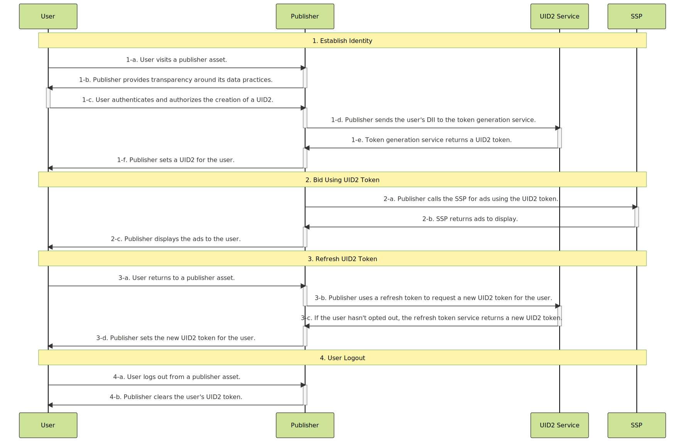

# Publisher Integration Guide, Server-Only

This guide is for publishers who want to generate UID2 tokens (advertising tokens) for the RTB bid stream, while integrating directly with UID2 rather than UID2-enabled single-sign-on or identity providers. 

<!-- It includes the following sections:

- [Introduction](#introduction)
- [Integration Steps ](#integration-steps)
  - [Establish Identity: User Login](#establish-identity-user-login)
  - [Bid Using UID2 Tokens](#bid-using-uid2-tokens)
  - [Refresh Tokens](#refresh-tokens)
  - [Clear Identity: User Logout](#clear-identity-user-logout)
  - [Sample Application](#sample-application)
- [FAQs](#faqs) -->

## Introduction

The guide outlines the [basic steps](#integration-steps) that you need to consider if you're building an integration without using a client-side or server-side SDK. For example, you need to decide how to do the following:

- Implement user login and logout
- Manage UID2 identity information and use it for targeted advertising
- Refresh UID2 tokens
- Deal with missing identities
- Manage user opt-outs

See also [FAQs](#faqs).

The following are the options available for publishers to integrate with UID2:

- Client UID2 SDK for JavaScript (see [UID2 SDK for JavaScript Reference Guide](../sdks/client-side-identity.md)), with [UID2 SDK for Java](../sdks/uid2-sdk-ref-java.md) on the server.
- Client UID2 SDK for JavaScript (see [UID2 SDK for JavaScript Reference Guide](../sdks/client-side-identity.md)), with custom server code.
- Server-only integration, with [UID2 SDK for Java](../sdks/uid2-sdk-ref-java.md) or [UID2 SDK for Python](../sdks/uid2-sdk-ref-python.md) on the server.
- Server-only integration, with custom server code.

This guide provides information for the last two options.

There is also an example application that demonstrates the workflow. See [Sample Application](#sample-application).

>TIP: To facilitate the process of establishing client identity using UID2 and retrieving UID2 tokens, consider using the UID2 SDK for JavaScript. For details, see [Server-Side Integration Guide for JavaScript](integration-javascript-server-side.md).

## Integration Steps

The following diagram outlines the steps required for a user to establish a UID2 token with a publisher and how the UID2 token integrates with the RTB bid stream.

If you're using a server-side SDK, the SDK takes care of all the steps that mention endpoints: for example, step 1-d, the publisher sends the user's DII to the token generation service.

<!-- https://mermaid.live/edit#pako:eNqdVTtv2zAQ_isHLRlqC6idyUOGwh0MtIVQV5sWRjzJRGVSJSm3bpD_3uPDUmRZDZIske_I73F3JJ-SUnFMNgmAwV8dyhK3gtWaHQsJ9NcybUUpWiYt5MAM5Ab1NJW5VNY9NsIcbuXz3Xbld7v_e9QnUeJ01X6fFTKEvymLoE6oIV9QeAMfU_hsLPMMsOMorbDnsDZfPjx8cEuWLPX64CSMsAYYtBdJRG7QpmFDRhuWudvwmA6qAf-0DRPSgD0gnFjTIYXKA5M1Sal8VLUoQUiLWqIFJjloVzXjyRpVCxkpWGnFiZGHfNDoJZZRIusIj0yUtMh4JBdRWvzFIKDUyKxQ0lEzX7gIzfEavP-dDf7cBsfHXzo0KHlA70jDnYHtbgdW-YhVP8lbjRJ14DWhTVPW7NoiUUWX9HUxiin8mIGkotlOSxN9Beob7nrcmwYdSTV2Z3vISune500HM2O2SuGT4NQiIeuA5E0MtGGVm7SBuGRNE8pKWU_NqMydx3DRicleiJ94F6GPULiVm0kH09fIdUwBF4am8zz10kPMFGnlRm7QGnGC3Ij9nkKtU_iOlUY6jddlirO-7o_jxQpRzR3J-RFejw8p6XRN1pE7TC0Bx3NIKYm_X1T89Ul4dZbXroK7qkeBAzPyztJlYJGD6uzCp8aSpqM-1vWOcV9fH2YbuvhWwzMdvY_d-qJq8jRq5X3fSrrjjLMMlVbHt3XTwYxaWTbI9Og6-l95smSRHFEfmeD0XD25fJHQ3iMWyYY-yTb1v0gK-Uwr6TJV-7Msk43VHS6SruUEEp-2ZFOxxlAUubBKfw0voH8In_8BLSZHlA -->

The following sections provide additional details for each step in the diagram:
 
 1. [Establish identity: user login](#establish-identity-user-login)
 2. [Bid using a UID2 token](#bid-using-uid2-tokens)
 3. [Refresh a UID2 token](#refresh-tokens)
 4. [Clear Identity: user logout](#clear-identity-user-logout)

### Establish Identity: User Login

After authentication in step 1-c, which includes getting the user's consent and allows the publisher to validate the user's email address or phone number, the publisher can send a request to generate a UID2 token, on the server side. The following table details the token generation steps.

| Step | Endpoint | Description |
| :--- | :--- | :--- |
| 1-d | [POST&nbsp;/token/generate](../endpoints/post-token-generate.md) | There are two ways for publishers to establish identity with UID2: - Integrate with a UID2-enabled single-sign-on provider. - Use the [POST&nbsp;/token/generate](../endpoints/post-token-generate.md) endpoint to generate a UID2 token using the normalized email address or phone number of the user. |
| 1-e | [POST&nbsp;/token/generate](../endpoints/post-token-generate.md) | Return a UID2 token generated from the user's hashed or unhashed email address or phone number, plus associated values such as the refresh token. |
| 1-f | N/A | Place the returned `advertising_token` and `refresh_token` in a store tied to a user. You might consider client-side storage, such as a first-party cookie, or server-side storage. |

### Bid Using a UID2 Token

Consider how you want to manage UID2 identity information and use it for targeted advertising; for example, to pass the returned UID2 token to SSPs.

| Step | Endpoint | Description |
| :--- | :--- | :--- |
| 2-a | N/A| Send the `advertising_token` from step [1-e](#establish-identity) to the SSP for bidding. Send the value as is. |

>NOTE: For an example of what a UID2 token might look like in the bid stream, when it's sent from an SSP to a DSP, see [What does a UID2 token look like in the bid stream?](../getting-started/gs-faqs.md#what-does-a-uid2-token-look-like-in-the-bid-stream)

### Refresh a UID2 Token

Use the `POST /token/refresh` endpoint to make sure you always have a valid and up-to-date UID2 token. The UID2 token must be refreshed to sync with the UID2 rotation. In addition, the token refresh process checks the user's opt-out status, and if the user has opted out, no new token is sent. This ends the token refresh chain, and you must not use that UID2 token again.

| Step | Endpoint | Description |
| :--- | :--- | :--- |
| 3-a |N/A | When a user returns to an asset and becomes active again, refresh the UID2 token before sending it to the SSP. | 
| 3-b | [POST&nbsp;/token/refresh](../endpoints/post-token-refresh.md)  | Send the `refresh_token` obtained in step [1-e](#establish-identity) as a query parameter. |
| 3-c | [POST&nbsp;/token/refresh](../endpoints/post-token-refresh.md) | The UID2 service issues a new identity token for users that haven't opted out. |
| 3-d | N/A| Place the values returned by the `POST /token/refresh` endpoint, `advertising_token` and `refresh_token`, so that they are linked to the user. You might consider client-side storage, such as a first-party cookie, or server-side storage. |

>TIP: Refresh tokens starting from the `refresh_from` timestamp, which is part of the identity returned by the [POST&nbsp;/token/generate](../endpoints/post-token-generate.md) or [POST&nbsp;/token/refresh](../endpoints/post-token-refresh.md) endpoints. 

### Clear Identity: User Logout

If the user logs out, do not use the UID2 token.

| Step | Endpoint | Description |
| :--- | :--- | :--- |
| 4-a | N/A | The user logs out from a publisher asset. |
| 4-b | N/A | Remove the UID2 token you've stored for that user. No interaction with the UID2 service is required. |

## Sample Application

A sample application is available for server-only integration. See:

- [Server-Only UID2 Integration Example (sample application)](https://secure-signals-srvonly-integ.uidapi.com/)
- [Server-Only UID2 Integration Example (readme)](https://github.com/IABTechLab/uid2-examples/blob/main/publisher/server_only/README.md)

## FAQs

For a list of frequently asked questions for the publisher audience, see [FAQs for Publishers](../getting-started/gs-faqs.md#faqs-for-publishers).
