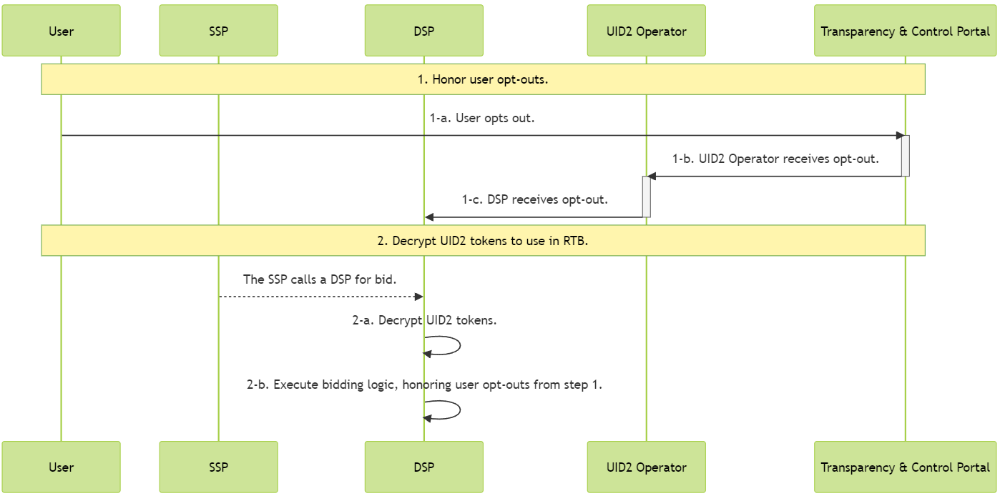
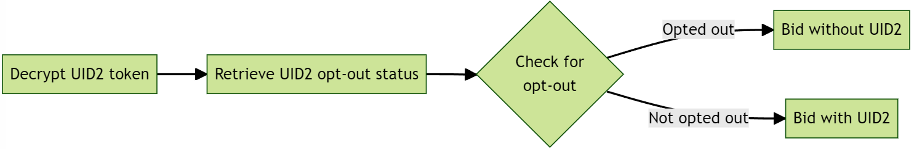

import Link from '@docusaurus/Link';

# DSP Integration Guide

This guide is for DSPs who transact on UID2s in the <Link href="../ref-info/glossary-uid#gl-bidstream">bidstream</Link>.

DSPs receive UID2 tokens in bid requests, and decrypt the [UID2 tokens](../ref-info/glossary-uid.md#gl-uid2-token) to arrive at [raw UID2s](../ref-info/glossary-uid.md#gl-raw-uid2) that they can use for bidding, using one of the server-side SDKs that support this function.

For a summary of available server-side SDKs, see [SDKs: Summary](../sdks/summary-sdks.md).

:::note
If your back end is written in a language not covered by one of the available server-side SDKs, ask your UID2 contact in case there is additional information available to help you. If you're not sure who to ask, see [Contact Info](../getting-started/gs-account-setup.md#contact-info).
:::

## Integration Steps 

The following describes the integration workflow for DSP to support UID2 as part of RTB, which consists of two major steps:
1. [Honor user opt-outs](#honor-user-opt-outs)
2. [Decrypt UID2 tokens for RTB use](#decrypt-uid2-tokens-for-rtb-use)



<!-- diagram source: resource/dsp-guide-flow-mermaid.md.bak -->

### Honor User Opt-Outs

This section includes the following information for DSPs, who must honor user opt-out of UID2:

- [Opt-Out Webhook](#opt-out-webhook)
- [POST /optout/status Endpoint](#post-optoutstatus-endpoint)
- [Bidding Opt-Out Logic](#bidding-opt-out-logic)

For details about the UID2 opt-out workflow and how users can opt out, see [User Opt-Out](../getting-started/gs-opt-out.md).

#### Opt-Out Webhook

To receive and honor user opt-outs from the UID2 service, the DSP establishes a pre-configured interface (an opt-out webhook/API endpoint) and provides it to the UID2 service during onboarding. When a user opts out, the UID2 service sends the user's raw UID2 and the corresponding opt-out timestamp to the pre-configured interface.

The UID2 service sends the following data within seconds of a user's opt-out, which the DSP records and uses the bidding logic defined in [Decrypt UID2 Tokens for RTB Use](#decrypt-uid2-tokens-for-rtb-use).

| Parameter | Description |
| :--- | :--- |
| `identity` | The raw UID2 for the user who opted out. |
| `timestamp` | The time when the user opted out (for information only). |

The DSP must respond to the opt-out data with a 200 response code.

The following example illustrates a webhook configured to receive the raw UID2 and the corresponding timestamp:

```html
https://dsp.example.com/optout?user=%%identity%%&optouttime=%%timestamp%%
```

#### POST /optout/status Endpoint

DSPs can check the opt-out status of raw UID2s using the [POST&nbsp;/optout/status](../endpoints/post-optout-status.md) endpoint.

#### Bidding Opt-Out Logic

Use the logic below during bidding (2-b) to honor a user's opt-out.

Leverage one of the server-side SDKs (see [SDKs: Summary](../sdks/summary-sdks.md)) to decrypt incoming UID2 tokens into raw UID2s. The response to the decrypt function contains the raw UID2. 

The following diagram illustrates opt-out logic.



If the user has opted out, the UID2 must not be used for RTB. In these cases, the DSP can choose to send an alternate ID for bidding or can choose not to bid.

### Decrypt UID2 Tokens for RTB Use

The following table provides details for Step 2 of the workflow diagram shown in [Integration Steps](#integration-steps).

| Step | SDK | Description |
| :--- | :--- | :--- |
| 2-a | Server-side SDK (see [SDKs: Summary](../sdks/summary-sdks.md)) | Leverage the provided SDK to decrypt incoming UID2 tokens. The response contains the `UID2` and the UID2 creation time. |
| 2-b | | DSPs are required to honor opt-out protocol for UID2s. For details on configuring user opt-outs and honoring them during bidding, see [Honor user opt-outs](#honor-user-opt-outs). |

## Recommendations for Managing Latency

:::note 
This section refers to the example code in [Usage for DSPs](../sdks/sdk-ref-csharp-dotnet.md#usage-for-dsps) in the *SDK for C# / .NET Reference Guide*. The method names are similar for the [Java](../sdks/sdk-ref-java.md#usage-for-dsps), [Python](../sdks/sdk-ref-python#usage-for-dsps), and [C++](../sdks/sdk-ref-cplusplus.md#interface) SDKs.
:::

For a low latency/high throughput setup, follow these recommendations:

- Have a local instance of the `BidstreamClient` class for each server. This can be in-process or out-of-process. In-process is the easiest.
- Call the client `Refresh` method periodically in the background: for example, once per hour, with some randomization to avoid mass simultaneous method calls across all instances after all servers are restarted.
- When a token needs to be decrypted, call the `DecryptTokenIntoRawUid` method. In-process is the fastest, but out-of-process is also acceptable if it's done correctly.
  :::note
  The token decryption method is thread-safe, so you can call it on multiple threads at the same time.
  :::

## FAQs

For a list of frequently asked questions for DSPs, see [FAQs for DSPs](../getting-started/gs-faqs.md#faqs-for-dsps).
