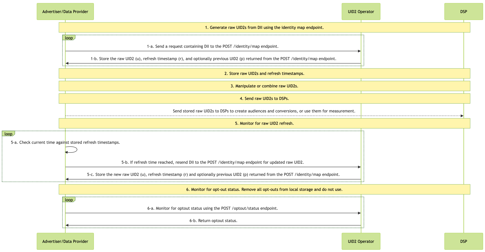
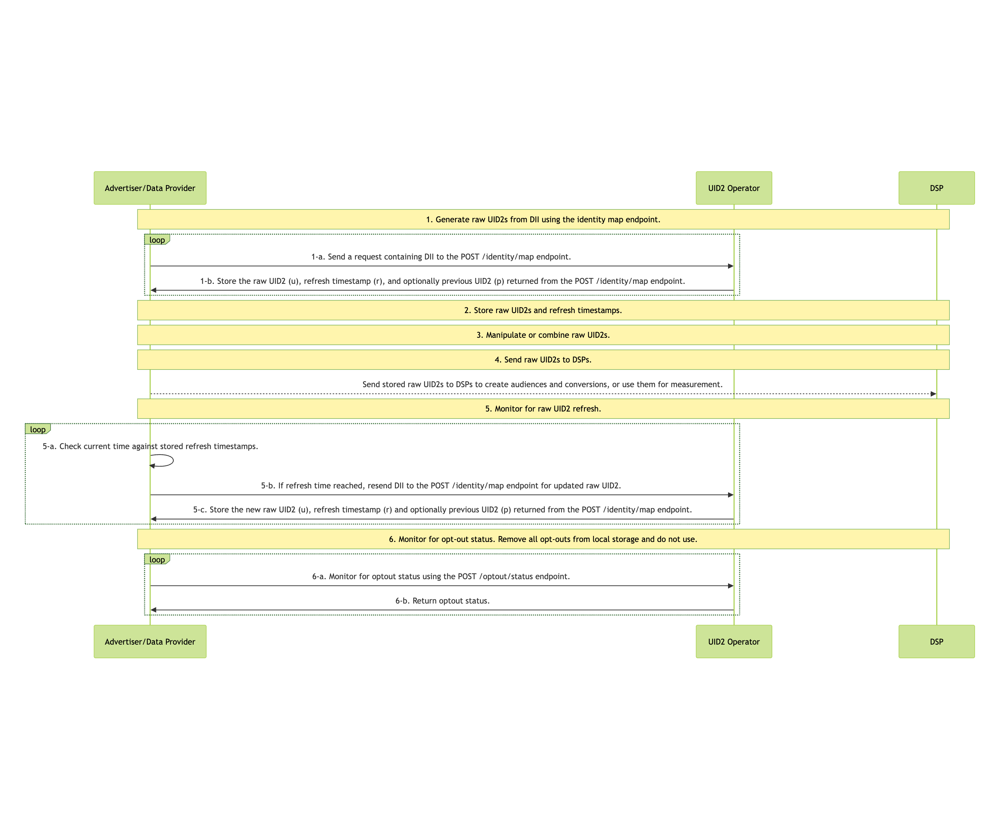

import Link from '@docusaurus/Link';

# Advertiser/Data Provider Integration to HTTP Endpoints

This guide covers integration steps for advertisers and data providers to integrate with UID2 by writing code to call UID2 HTTP endpoints, rather than using another implementation option such as an SDK, Snowflake, or AWS Entity Resolution.

:::tip
For a summary of all integration options and steps for advertisers and data providers, see [Advertiser/Data Provider Integration Overview](integration-advertiser-dataprovider-overview.md).
:::

## Complete UID2 Account Setup and Configure Account

To integrate with UID2, you'll need to have a UID2 account. If you haven't yet created an account, first follow the steps described on the [Account Setup](../getting-started/gs-account-setup.md) page.

When initial account setup is complete, you'll receive instructions and a link to access the [UID2 Portal](../portal/portal-overview.md), where you can create your [credentials](../getting-started/gs-credentials.md) for the production environment and configure additional values, if needed. For details, see [Getting Started with the UID2 Portal](../portal/portal-getting-started.md).

You'll need to set up these values, in the UID2 Portal on the [API Keys](../portal/api-keys.md) page:

- <Link href="../ref-info/glossary-uid#gl-api-key">API key</Link>, also called a client key
- <Link href="../ref-info/glossary-uid#gl-client-secret">Client secret</Link>, a value known only to the participant and the UID2 service

:::important
It's very important that you keep these values secure. For details, see [Security of API Key and Client Secret](../getting-started/gs-credentials.md#security-of-api-key-and-client-secret).
:::

## High-Level Steps

At a high level, the steps for advertisers and data providers integrating with UID2 are as follows:

1. [Generate Raw UID2s from DII](#1-generate-raw-uid2s-from-dii)

2. [Store Raw UID2s and Refresh Timestamps](#2-store-raw-uid2s-and-refresh-timestamps)

3. [Manipulate or Combine Raw UID2s](#3-manipulate-or-combine-raw-uid2s)

4. [Send Stored Raw UID2s to DSPs to Create Audiences or Conversions](#4-send-stored-raw-uid2s-to-dsps-to-create-audiences-or-conversions)

5. [Monitor for Raw UID2 Refresh](#5-monitor-for-raw-uid2-refresh)

6. [Monitor for Opt-Out Status](#6-monitor-for-opt-out-status)

## Integration Diagram

The following diagram outlines the steps that data collectors must complete to map DII to raw UID2s for audience building and targeting.

DII refers to a user's normalized email address or phone number, or the normalized and SHA-256-hashed email address or phone number.

<!-- diagram source: resource/advertiser-flow-endpoints-v3-mermaid.mermaid -->

### 1: Generate Raw UID2s from DII

| Step | Endpoint | Description |
| --- | --- | --- |
| 1-a | [POST&nbsp;/identity/map](../endpoints/post-identity-map.md) request | Send a request containing DII to the identity mapping endpoint. |
| 1-b | [POST&nbsp;/identity/map](../endpoints/post-identity-map.md) response | The raw UID2 (`u` field) returned in the response can be used to target audiences on relevant DSPs. The response returns a user's raw UID2 (`u`), refresh timestamp (`r`), and optionally the previous raw UID2 (`p`) if the current UID2 was rotated within the last 90 days. Use the refresh timestamp to determine when to refresh the UID2. For details, see [5: Monitor for Raw UID2 Refresh](#5-monitor-for-raw-uid2-refresh). |

### 2: Store Raw UID2s and Refresh Timestamps

The response from Step 1, [Generate Raw UID2s from DII](#1-generate-raw-uid2s-from-dii), contains mapping information. We recommend that you store the following information returned in Step 1:

- Cache the mapping between DII and raw UID2 (`u` field).
- Store the refresh timestamp (`r` field) to know when the raw UID2 could refresh.
- Optionally store the previous raw UID2 (`p` field) if provided for users whose UID2 was refreshed within the last 90 days.

### 3: Manipulate or Combine Raw UID2s

Use the UID2s you received in Step 1. For example, you might do one or more of the following:

- Do some manipulation: for example, combine raw UID2s you generated from DII and raw UID2s received from another participant such as an advertiser or data provider.
- Add new raw UID2s into an existing audience.

### 4: Send Stored Raw UID2s to DSPs to Create Audiences or Conversions

Use the raw UID2s for some purpose such as:

   - Sending stored raw UID2s to DSPs to create audiences and conversions.
   - Using the raw UID2s for measurement.

For example, you could send the (<Link href="../ref-info/glossary-uid#gl-raw-uid2">raw UID2</Link>) (`u` field) returned in Step 1-b to a DSP while building your audiences. Each DSP has a unique integration process for building audiences; follow the integration guidance provided by the DSP for sending raw UID2s to build an audience.

You could also send conversion information via API or pixels for measurement (attribution) or for retargeting.

### 5: Monitor for Raw UID2 Refresh

A raw UID2 is an identifier for a user at a specific moment in time. The raw UID2 for a specific user changes roughly once per year as part of the UID2 refresh process.

The v3 Identity Map API provides a refresh timestamp (`r` field) in the response that indicates when each raw UID2 might refresh. Use this timestamp to determine when to regenerate raw UID2s for your stored data. It is guaranteed that it won't refresh before that time.

We recommend checking for refresh opportunities daily. The following table shows the steps for monitoring raw UID2 refresh.

| Step | Action | Description |
| :--- | :--- | :--- |
| 5-a | Local timestamp check | Compare the current time with the refresh timestamp (`r` field) you stored from the [POST&nbsp;/identity/map](../endpoints/post-identity-map.md) response previously. |
| 5-b | [POST&nbsp;/identity/map](../endpoints/post-identity-map.md) | If the current time is greater than or equal to the refresh timestamp, regenerate the raw UID2 by calling the identity map endpoint again with the same DII. |
| 5-c | Local storage update | Store the new raw UID2 (`u` field), refresh timestamp (`r` field) and optionally previous UID2 (`p` field) returned from the response. |

#### Determine whether to refresh a raw UID2

To determine whether to refresh a raw UID2, follow these steps:

1. Compare the current time with the refresh timestamp (`r` field) you stored from the [POST&nbsp;/identity/map](../endpoints/post-identity-map.md) response.

2. If the current time is greater than or equal to the refresh timestamp, regenerate the raw UID2 by calling [POST&nbsp;/identity/map](../endpoints/post-identity-map.md) again with the same DII.

This approach ensures your raw UID2s remain current and valid for audience targeting and measurement.

### 6: Monitor for Opt-Out Status

It's important to honor user opt-out status. Periodically, monitor for opt-out status, to be sure that you don't continue using raw UID2s for users that have recently opted out.

There are two ways that you can check with the UID2 <Link href="../ref-info/glossary-uid#gl-operator-service">Operator Service</Link> to make sure you have the latest opt-out information:

- Call the [POST&nbsp;/identity/map](../endpoints/post-identity-map.md) endpoint to check for opt-outs. If the DII has been opted out, no raw UID2 is generated.

- Check the opt-out status of raw UID2s using the [POST&nbsp;/optout/status](../endpoints/post-optout-status.md) endpoint.

For details about the UID2 opt-out workflow and how users can opt out, see [User Opt-Out](../getting-started/gs-opt-out.md).

## Using POST /identity/map Version 2

:::note
The following information is relevant only if you are using version 2 or earlier of the `POST /identity/map` endpoint, and is provided for reference only. New implementations should use the latest version. For instructions, see [High-Level Steps](#high-level-steps).
:::

The key differences when using v2 of the Identity Map API are:

- **Step 2**: Store salt bucket IDs instead of refresh timestamps
- **Step 5**: Monitor for salt bucket rotations instead of using refresh timestamps

All other steps (1, 3, 4, and 6) are the same as described in the v3 implementation: see [High-Level Steps](#high-level-steps).

### Integration Diagram (v2)

The following diagram outlines the v2 integration flow. Note that the differences are in Step 2 (storing salt bucket IDs) and Step 5 (monitoring salt bucket rotations).

<!-- diagram source: resource/advertiser-flow-endpoints-v2-mermaid.md.bak -->

### Store Raw UID2s and Salt Bucket IDs (v2)

:::note
This step replaces Step 2 in the v3 implementation.
:::

The response from Step 1 contains mapping information. We recommend that you store the following information returned in Step 1:

- Cache the mapping between DII (`identifier`), raw UID2 (`advertising_id`), and salt bucket (`bucket_id`).
- Store the timestamp for when you received the response data. Later, you can compare this timestamp with the `last_updated` timestamp returned in Step 5.

### Monitor for Salt Bucket Rotations for Your Stored Raw UID2s (v2)

:::note
This step replaces Step 5 in the v3 implementation.
:::

A raw UID2 is an identifier for a user at a specific moment in time. The raw UID2 for a specific user changes roughly once per year, as a result of the <Link href="../ref-info/glossary-uid#gl-salt-bucket">salt bucket</Link> rotation.

Even though each salt bucket is updated approximately once per year, individual bucket updates are spread over the year. Approximately 1/365th of all salt buckets are rotated daily. Based on this, we recommend checking salt bucket rotation regularly, on a cadence that aligns with your audience refreshes. For example, if you refresh weekly, check for salt bucket updates weekly.

If the salt bucket has been rotated, regenerate the raw UID2. For details, see [Determine whether the salt bucket has been rotated](#determine-whether-the-salt-bucket-has-been-rotated).

The following table shows the steps for checking for salt bucket rotation.

| Step | Endpoint | Description |
| --- | --- | --- |
| 5-a | [POST&nbsp;/identity/buckets](../endpoints/post-identity-buckets.md) | Send a request to the `POST /identity/buckets` endpoint for all salt buckets that have changed since a specific timestamp. |
| 5-b | [POST&nbsp;/identity/buckets](../endpoints/post-identity-buckets.md) | UID2 service: The `POST /identity/buckets` endpoint returns a list of `bucket_id` and `last_updated` timestamps. |
| 5-c | [POST&nbsp;/identity/map](../endpoints/post-identity-map-v2.md) | Compare the returned `bucket_id` to the salt buckets of raw UID2s that you've cached. If you find that the salt bucket was updated for one or more raw UID2s, re-send the DII to the `POST /identity/map` endpoint for a new raw UID2. |
| 5-d | [POST&nbsp;/identity/map](../endpoints/post-identity-map-v2.md) | Store the new values returned for `advertising_id` and `bucket_id`. |

##### Determine whether the salt bucket has been rotated

To determine whether the salt bucket ID for a specific raw UID2 has changed, follow these steps.

1. Compare these two values:

    - The `last_updated` timestamp of each `bucket_id` returned as part of monitoring the salt bucket rotations.

    - The timestamp of the raw UID2 generation of the same `bucket_id`, which was returned in Step 1 and stored in Step 2.

1. If the `last_updated` timestamp is more recent than the timestamp you recorded earlier, the salt bucket has been rotated. As a result, you'll need to regenerate any raw UID2s associated with this `bucket_id`, following Step 1, [Generate Raw UID2s from DII](#1-generate-raw-uid2s-from-dii).
