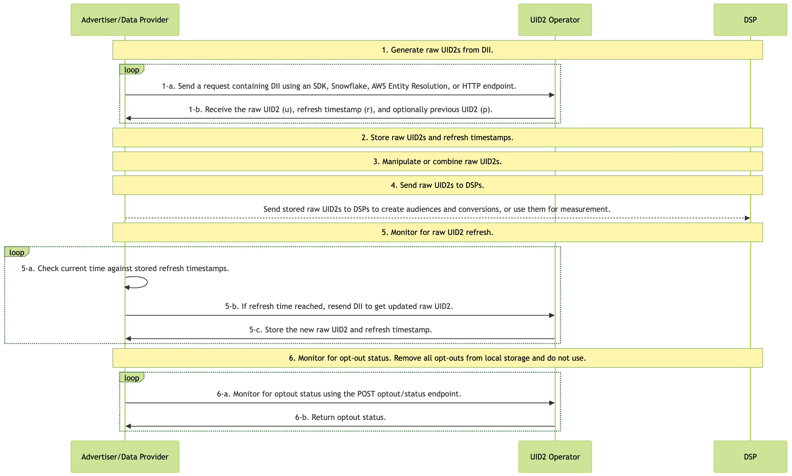
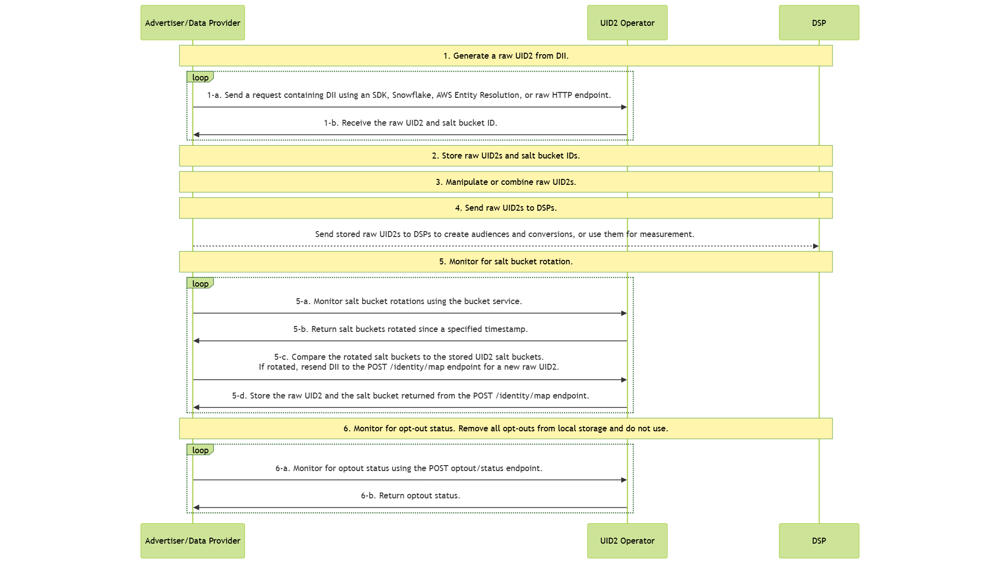

import Link from '@docusaurus/Link';

# Advertiser/Data Provider Integration Overview

This guide provides an overview of integration options for organizations that collect user data and push it to other UID2 participants. Data collectors include advertisers, data on-boarders, measurement providers, identity graph providers, third-party data providers, and any other organizations that send data to other participants.

## Advertiser/Data Provider Routes to Use UID2

Within the ad tech industry, advertisers use identity to build audiences, track conversions, and generate their graphs. As an advertiser, or as a data provider acting on behalf of an advertiser, the following table shows some examples of how you can accomplish some of these goals with UID2.

:::note
There are other ways that you can use UID2, outside these use cases. These are just some examples.
:::

| Send/Receive? | Action | Advantage/Result |
| --- | --- | --- |
| Send in audiences | Send raw UID2s via API or pixels | Create audiences. |
| Send&nbsp;in&nbsp;conversions | Send raw UID2s as conversion information | Use conversion information for measurement (attribution) or for retargeting via API or pixels. |
| Receive&nbsp;graph&nbsp;data | Receive raw UID2s from graph/data providers via API or pixels | Build graph data. |

## High-Level Steps

At a high level, the steps for advertisers and data providers integrating with UID2 are as follows:

1. [Generate Raw UID2s from DII](#1-generate-raw-uid2s-from-dii)

2. [Store Raw UID2s and Refresh Timestamps](#2-store-raw-uid2s-and-refresh-timestamps)

3. [Manipulate or Combine Raw UID2s](#3-manipulate-or-combine-raw-uid2s)

4. [Send Stored Raw UID2s to DSPs to Create Audiences or Conversions](#4-send-stored-raw-uid2s-to-dsps-to-create-audiences-or-conversions)

5. [Monitor for Raw UID2 Refresh](#5-monitor-for-raw-uid2-refresh)

6. [Monitor for Opt-Out Status](#6-monitor-for-opt-out-status)

:::note
If your implementation uses a version of the [POST&nbsp;/identity/map](../endpoints/post-identity-map.md) endpoint earlier than version 3, see [Using POST /identity/map Version 2](#using-post-identitymap-version-2). If you're using this version, we recommend you upgrade as soon as possible to take advantage of the enhancements.
:::

## Summary of Implementation Options

The following table shows the implementation options that are available for advertisers and data providers, for each of the high-level steps. Some steps are managed solely as part of your own custom implementation; some steps can be managed by one or more of the UID2 implementation options available. For details, click the link on each step.

| High-Level Step | Implementation Options |
| --- | --- |
| [1: Generate Raw UID2s from DII](#1-generate-raw-uid2s-from-dii) | Use any of the following options to map DII to raw UID2s:<ul><li>One of these UID2 SDKs:<ul><li>Python SDK: [Map DII to Raw UID2s](../sdks/sdk-ref-python.md#map-dii-to-raw-uid2s)</li><li>Java SDK: [Usage for Advertisers/Data Providers](../sdks/sdk-ref-java.md#usage-for-advertisersdata-providers)</li></ul></li><li>Snowflake: [Map DII](integration-snowflake.md#map-dii)</li><li>AWS Entity Resolution: [AWS Entity Resolution Integration Guide](integration-aws-entity-resolution.md)</li><li>HTTP endpoints: [POST&nbsp;/identity/map](../endpoints/post-identity-map.md)</li></ul> |
| [2: Store Raw UID2s and Refresh Timestamps](#2-store-raw-uid2s-and-refresh-timestamps) | Custom (your choice). |
| [3: Manipulate or Combine Raw UID2s](#3-manipulate-or-combine-raw-uid2s) | Custom (your choice). |
| [4: Send Stored Raw UID2s to DSPs to Create Audiences or Conversions](#4-send-stored-raw-uid2s-to-dsps-to-create-audiences-or-conversions) | Custom (your choice). |
| [5: Monitor for Raw UID2 Refresh](#5-monitor-for-raw-uid2-refresh) | Use the refresh timestamp (`r` field) returned from the [POST&nbsp;/identity/map](../endpoints/post-identity-map.md) endpoint to determine when to refresh Raw UID2s. |
| [6: Monitor for Opt-Out Status](#6-monitor-for-opt-out-status) | API call to the [POST /optout/status](../endpoints/post-optout-status.md) endpoint. |

## Integration Diagram

The following diagram outlines the steps that data collectors must complete to map DII to raw UID2s for audience building and targeting.

DII refers to a user's normalized email address or phone number, or the normalized and SHA-256-hashed email address or phone number.

To keep your UID2-based audience information accurate and up to date, follow these integration steps every day.

<!-- diagram source: resource/advertiser-flow-overview-v3-mermaid.mermaid -->

For details about the different parts of the diagram, refer to the following sections.

### 1: Generate Raw UID2s from DII

You can generate raw UID2s from <Link href="../ref-info/glossary-uid#gl-dii">directly identifying information (DII)</Link>, or receive UID2s from another UID2 participant such as a data provider acting on your behalf.

To generate raw UID2s, use one of the following options:

- One of the UID2 SDKs:

  - Python SDK: See [Map DII to Raw UID2s](../sdks/sdk-ref-python.md#map-dii-to-raw-uid2s).
  - Java SDK: See [Usage for Advertisers/Data Providers](../sdks/sdk-ref-java.md#usage-for-advertisersdata-providers).

- Snowflake: See [Map DII](integration-snowflake.md#map-dii).

- AWS Entity Resolution: See [AWS Entity Resolution Integration Guide](integration-aws-entity-resolution.md).

- HTTP endpoints: [POST&nbsp;/identity/map](../endpoints/post-identity-map.md). For details, see [Generate Raw UID2s from DII](integration-advertiser-dataprovider-endpoints.md#1-generate-raw-uid2s-from-dii).

### 2: Store Raw UID2s and Refresh Timestamps

The response from Step 1, [Generate Raw UID2s from DII](#1-generate-raw-uid2s-from-dii), contains mapping information. We recommend that you store the following information returned in Step 1:

- Cache the mapping between DII and raw UID2 (`u` field).
- Store the refresh timestamp (`r` field) to know when the raw UID2 could refresh.
- Optionally store the previous raw UID2 (`p` field) if provided for users whose UID2 was refreshed within the last 90 days.

### 3: Manipulate or Combine Raw UID2s

Use the raw UID2s you received in Step 1. For example, you might do one or more of the following:

- Do some manipulation: for example, combine raw UID2s you generated from DII and raw UID2s received from another participant such as an advertiser or data provider.
- Add new raw UID2s into an existing audience.

### 4: Send Stored Raw UID2s to DSPs to Create Audiences or Conversions

Use the raw UID2s for some purpose such as:

   - Sending stored raw UID2s to DSPs to create audiences and conversions.
   - Using the raw UID2s for measurement.

For example, you could send the (<Link href="../ref-info/glossary-uid#gl-raw-uid2">raw UID2</Link> (`u` field) returned in Step 1 to a DSP while building your audiences. Each DSP has a unique integration process for building audiences; follow the integration guidance provided by the DSP for sending raw UID2s to build an audience.

You could also send conversion information via API or pixels for measurement (attribution) or for retargeting.

### 5: Monitor for Raw UID2 Refresh

A raw UID2 is an identifier for a user at a specific moment in time. The raw UID2 for a specific user changes roughly once per year as part of the UID2 refresh process.

The v3 Identity Map API provides a refresh timestamp (`r` field) in the response that indicates when each raw UID2 might refresh. Use this timestamp to determine when to regenerate raw UID2s for your stored data. It is guaranteed that it won't refresh before that time.

We recommend checking for refresh opportunities daily. To determine whether to refresh a raw UID2:

1. Compare the current time with the refresh timestamp (`r` field) you stored from the [POST&nbsp;/identity/map](../endpoints/post-identity-map.md) response.

2. If the current time is greater than or equal to the refresh timestamp, regenerate the raw UID2 by calling [POST&nbsp;/identity/map](../endpoints/post-identity-map.md) again with the same DII.

This approach ensures your raw UID2s remain current and valid for audience targeting and measurement.

### 6: Monitor for Opt-Out Status

It's important to honor user opt-out status. Periodically, monitor for opt-out status, to be sure that you don't continue using raw UID2s for users that have recently opted out.

There are two ways that you can check with the UID2 <Link href="../ref-info/glossary-uid#gl-operator-service">Operator Service</Link> to make sure you have the latest opt-out information:

- Call the [POST&nbsp;/identity/map](../endpoints/post-identity-map.md) endpoint to check for opt-outs. If the DII has been opted out, no raw UID2 is generated.

- Check the opt-out status of raw UID2s using the [POST&nbsp;/optout/status](../endpoints/post-optout-status.md) endpoint.

For details about the UID2 opt-out workflow and how users can opt out, see [User Opt-Out](../getting-started/gs-opt-out.md).

## Using POST /identity/map Version 2

:::note
The following information is relevant only to integration approaches that use an earlier version of the `POST /identity/map` endpoint, version 2, and is provided for reference only. New implementations should use the latest version: see [High-Level Steps](#high-level-steps).
:::

The key differences when using v2 of the Identity Map API are:

- **Step 2**: Store salt bucket IDs instead of refresh timestamps
- **Step 5**: Monitor for salt bucket rotations instead of using refresh timestamps

All other steps (1, 3, 4, and 6) are the same as described in the v3 implementation: see [High-Level Steps](#high-level-steps).

### Integration Diagram (v2)

The following diagram outlines the v2 integration flow. Note that the main differences are in Step 2 (storing salt bucket IDs) and Step 5 (monitoring salt bucket rotations):

<!-- diagram source: resource/advertiser-flow-overview-v2-mermaid.md.bak -->

### Store Raw UID2s and Salt Bucket IDs (v2)

:::note
This step replaces Step 2 in the v3 implementation.
:::

The response from Step 1 contains mapping information. We recommend that you store the following information returned in Step 1:

- Cache the mapping between DII (`identifier`), raw UID2 (`advertising_id`), and salt bucket (`bucket_id`).
- Store the timestamp for when you received the response data. Later, you can compare this timestamp with the `last_updated` timestamp returned in Step 5.

### Monitor for Salt Bucket Rotations for Your Stored Raw UID2s (v2)

:::note
This step replaces Step 5 in the v3 implementation.
:::

A raw UID2 is an identifier for a user at a specific moment in time. The raw UID2 for a specific user changes roughly once per year, as a result of the <Link href="../ref-info/glossary-uid#gl-salt-bucket">salt bucket</Link> rotation.

Even though each salt bucket is updated approximately once per year, individual bucket updates are spread over the year. Approximately 1/365th of all salt buckets are rotated daily. Based on this, we recommend checking salt bucket rotation regularly, on a cadence that aligns with your audience refreshes. For example, if you refresh weekly, check for salt bucket updates weekly.

If the salt bucket has been rotated, regenerate the raw UID2. For details, see [Determine whether the salt bucket has been rotated](#determine-whether-the-salt-bucket-has-been-rotated-v2).

For instructions for monitoring for salt bucket rotations, refer to one of the following:

- Python SDK: [Monitor Rotated Salt Buckets](../sdks/sdk-ref-python.md#monitor-rotated-salt-buckets).

- Snowflake: [Monitor for Salt Bucket Rotation and Regenerate Raw UID2s](integration-snowflake.md#monitor-for-salt-bucket-rotation-and-regenerate-raw-uid2s).

- HTTP endpoints: [Monitor for Salt Bucket Rotations for Your Stored Raw UID2s (v2)](integration-advertiser-dataprovider-endpoints.md#monitor-for-salt-bucket-rotations-for-your-stored-raw-uid2s-v2).

:::note
For AWS Entity Resolution, there is no way to do salt bucket monitoring. As an alternative, you could regenerate raw UID2s periodically using the AWS Entity Resolution service.
:::

##### Determine whether the salt bucket has been rotated (v2)

To determine whether the salt bucket ID for a specific raw UID2 has changed, follow these steps.

1. Compare these two values:

  - The `last_updated` timestamp of each `bucket_id` returned as part of monitoring the salt bucket rotations (whatever option you choose).

  - The timestamp of the raw UID2 generation of the same `bucket_id`, which was returned in Step 1 and stored in Step 2.

1. If the `last_updated` timestamp is more recent than the timestamp you recorded earlier, the salt bucket has been rotated. As a result, you'll need to regenerate any raw UID2s associated with this `bucket_id`, following Step 1, [Generate Raw UID2s from DII](#1-generate-raw-uid2s-from-dii).

## FAQs

For a list of frequently asked questions for advertisers and data providers using the UID2 framework, see [FAQs for Advertisers and Data Providers](../getting-started/gs-faqs.md#faqs-for-advertisers-and-data-providers).
