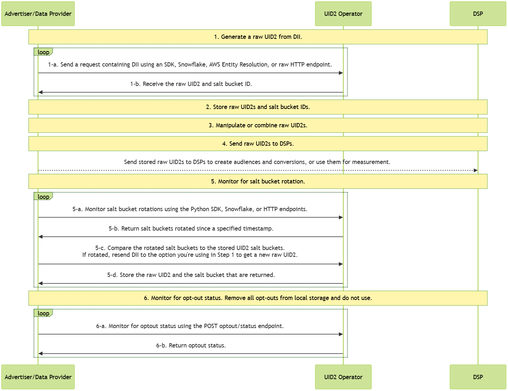

import Link from '@docusaurus/Link';

# Advertiser/Data Provider Integration Overview

This guide provides an overview of integration options for organizations that collect user data and push it to other UID2 participants. Data collectors include advertisers, data on-boarders, measurement providers, identity graph providers, third-party data providers, and any other organizations that send data to other participants.

## Advertiser/Data Provider Routes to Use UID2

Within the ad tech industry, advertisers use identity to build audiences, track conversions, and generate their graphs. As an advertiser, or as a data provider acting on behalf of an advertiser, the following table shows some examples of how you can accomplish some of these goals with UID2.

:::note
There are other ways that you can use UID2, outside these use cases. These are just some examples.
:::

| Send/Receive? | Action | Advantage/Result |
| --- | --- | --- |
| Send in audiences | Send UID2s via API or pixels | Create audiences. |
| Send in conversions | Send UID2s as conversion information | Use conversion information for measurement (attribution) or for retargeting via API or pixels. |
| Receive graph data | Receive UID2s from graph/data providers via API or pixels | Build graph data. |

<!-- - **Create/send in audiences**: You can send UID2s to create audiences via API or pixels
- **Send in conversions**: You can send UID2s as conversion information that can be used for measurement (attribution) or retargeting via API or pixels
- **Receive graph data**: You can receive UID2s from graph/data providers via API or pixels. -->

## High-Level Steps

At a high level, the steps for advertisers and data providers integrating with UID2 are as follows:

1. Generate raw UID2s from <Link href="../ref-info/glossary-uid#gl-dii">directly identifying information (DII)</Link>, or receive UID2s from another UID2 participant such as a data provider acting on your behalf.

2. Store the raw UID2s and the salt bucket IDs returned from the identity mapping service.

3. Use the UID2s you received in Step 1. For example, you might combine UID2s you generated from DII with other UID2s, or add new UID2s into an existing audience.

[**Comment from GWH_SW__01: "What other UID2s, e.g. other UID2s collected from pixels?" and I said: "I really am not sure... and, this data came from Kimberly. UID2s from pixels would be UID2 tokens, and I'm not sure whether advertisers mix raw UID2s and UID2 tokens. I can check with AD. Otherwise, not sure about making this edit. LMK if you have additional input. I think perhaps they might already have some UID2s that they could combine with but not sure."**]

4. Use the raw UID2s for some purpose such as:

   - Send stored raw UID2s to DSPs to create audiences and conversions.
   - Use the raw UID2s for measurement.

5. Monitor for Salt Bucket Rotations for your stored raw UID2s.

6. Periodically, monitor for opt-out status, to be sure that you don't continue using UID2s for users that have recently opted out. For details, see [Monitor for Opt-Out Status](#6-monitor-for-opt-out-status).

[**GWH_AD__02 Which do you think is better: include the detail links in the step (as I did in Step 5 but not Step 1), or include the links in the high-level steps table also? To do both is repetitive but maybe quicker for users.**]

## Summary of Implementation Options

The following table shows the implementation options that are available for advertisers and data providers, for each of the high-level steps. Some steps are managed solely as part of your own custom implementation; some steps can be managed by one or more of the UID2 implementation options available. For details, click the link on each step.

| High-Level Step | Implementation Options |
| --- | --- |
| [1: Generate Raw UID2s from DII](#1-generate-raw-uid2s-from-dii) | Any of the following options:<ul><li>One of the UID2 SDKs that supports generating raw UID2s from DII</li><li>Snowflake</li><li>AWS Entity Resolution</li><li>Raw HTTP endpoint</li></ul> |
| [2: Store Raw UID2s and Salt Bucket IDs](#2-store-raw-uid2s-and-salt-bucket-ids) | Custom (your choice). |
| [3: Manipulate or Combine Raw UID2s](#3-manipulate-or-combine-raw-uid2s) | Custom (your choice). |
| [4: Send Stored Raw UID2s to DSPs to Create Audiences or Conversions](#4-send-stored-raw-uid2s-to-dsps-to-create-audiences-or-conversions) | Custom (your choice). |
| [5: Monitor for Salt Bucket Rotations for Your Stored Raw UID2s](#5-monitor-for-salt-bucket-rotations-for-your-stored-raw-uid2s) | Any of the following options:<ul><li><strong>Python SDK</strong>: see <Link href="../sdks/sdk-ref-python">SDK for Python Reference Guide</Link></li><li><strong>Snowflake</strong>: see <Link href="snowflake_integration">Snowflake Integration Guide</Link>, section titled <Link href="snowflake_integration#monitor-for-salt-bucket-rotation-and-regenerate-raw-uid2s">Monitor for Salt Bucket Rotation and Regenerate Raw UID2s</Link></li><li><strong>Raw HTTP endpoint</strong>: <Link href="../endpoints/post-identity-buckets">POST /identity/buckets</Link></li></ul> |
| [6: Monitor for opt-out status](#6-monitor-for-opt-out-status) | API call to the [POST /optout/status](../endpoints/post-optout-status.md) endpoint. |

## Integration Diagram

The following diagram outlines the steps that data collectors must complete to map DII to raw UID2s for audience building and targeting.

DII refers to a user's normalized email address or phone number, or the normalized and SHA-256-hashed email address or phone number.

To keep your UID2-based audience information accurate and up to date, follow these integration steps every day.

<!-- diagram source: resource/advertiser-flow-overview-mermaid.md.bak -->

For details about the different parts of the diagram, refer to the following sections.

### 1: Generate Raw UID2s from DII

To generate raw UID2s, use one of the following options:

- One of the UID2 SDKs:

  - Python SDK: [Map DII to Raw UID2s](../sdks/sdk-ref-python.md#map-dii-to-raw-uid2s).
  - Java SDK: [Usage for Advertisers/Data Providers](../sdks/sdk-ref-java.md#usage-for-advertisersdata-providers).

- Snowflake: [Map DII](snowflake_integration.md#map-dii).

- AWS Entity Resolution: [AWS Entity Resolution Integration Guide](integration-aws-entity-resolution.md).

- HTTP endpoints: [Generate a raw UID2 from DII](integration-advertiser-dataprovider-endpoints.md#generate-raw-uid2s-from-dii).

### 2: Store Raw UID2s and Salt Bucket IDs

The response from Step 1, [Generate Raw UID2s from DII](#1-generate-raw-uid2s-from-dii), contains mapping information. Cache the following:
- The mapping between DII (`identifier`), raw UID2 (`advertising_id`), and salt bucket (`bucket_id`).
- The most recent `last_updated` timestamp.

[**GWH_SW or GWH_AD__003 question. If you're using Snowflake, AWS, or the Python SDK, is this done for you? Or it's always out of band, done by the participant?**]

[**Info from SW: "this last_updated is not returned in identity/map function/endpoint and only available in identity/bucket endpoint. so it is a bit cumbersome and require participant to maybe store the bucket_id with raw UID2/DII here and then have a separate table to store the bucket_id/last_updated fields and use the latter table to figure out which DII requires generating raw UID2 again. Or they can store all these columns in same table but they would need to update the table after separate identity/map and identity/bucket call"... not sure what to do with this.**]

### 3: Manipulate or Combine Raw UID2s

Use the UID2s you received in Step 1. For example, you might do one or more of the following:

- Do some manipulation: for example, combine UID2s you generated from DII and UID2s received from another participant such as an advertiser or data provider.
- Add new UID2s into an existing audience.

### 4: Send Stored Raw UID2s to DSPs to Create Audiences or Conversions

You could send the `advertising_id` (<Link href="../ref-info/glossary-uid#gl-raw-uid2">raw UID2</Link>) returned in Step 1-b to a DSP while building your audiences. Each DSP has a unique integration process for building audiences; follow the integration guidance provided by the DSP for sending raw UID2s to build an audience.

You could also send conversion information via API or pixels for measurement (attribution) or for retargeting.

### 5: Monitor for Salt Bucket Rotations for Your Stored Raw UID2s

A raw UID2 is an identifier for a user at a specific moment in time. The raw UID2 for a specific user changes at least once per year, as a result of the <Link href="../ref-info/glossary-uid#gl-salt-bucket">salt bucket</Link> rotation. 

Even though each salt bucket is updated approximately once per year, individual bucket updates are spread over the year. Approximately 1/365th of all salt buckets are rotated daily.

:::important
To ensure that your integration has the current raw UID2s, check salt bucket rotation for active users every day, and remap any raw UID2 for which the salt buckets have been rotated by retrieving new raw UID2 for those IDs, following Step 1, [Generate Raw UID2s from DII](#1-generate-raw-uid2s-from-dii).
:::

For instructions for monitoring for salt bucket rotations, refer to one of the following:

- Python SDK: [Monitor Rotated Salt Buckets](../sdks/sdk-ref-python.md#monitor-rotated-salt-buckets).

- Snowflake: [Monitor for Salt Bucket Rotation and Regenerate Raw UID2s](snowflake_integration.md#monitor-for-salt-bucket-rotation-and-regenerate-raw-uid2s).

- HTTP endpoints: [Monitor for Salt Bucket Rotations for Your Stored Raw UID2s](integration-advertiser-dataprovider-endpoints.md#monitor-for-salt-bucket-rotations-related-to-your-stored-raw-uid2s).

:::note
For AWS Entity Resolution, there is no way to do salt bucket monitoring. As an alternative, you could call the [POST&nbsp;/identity/map](../endpoints/post-identity-map.md) endpoint periodically to keep your information updated.
:::

### 6: Monitor for Opt-Out Status

It's important to honor user opt-out status. There are two ways that you can check with the UID2 <Link href="../ref-info/glossary-uid#gl-operator-service">Operator Service</Link> to make sure you have the latest opt-out information:

- You can call the [POST&nbsp;/identity/map](../endpoints/post-identity-map.md) endpoint to check for opt-outs. If the DII has been opted out, No raw UID2 is generated.

- You can check the opt-out status of raw UID2s using the [POST&nbsp;/optout/status](../endpoints/post-optout-status.md) endpoint.

For details about the UID2 opt-out workflow and how users can opt out, see [User Opt-Out](../getting-started/gs-opt-out.md).

## FAQs

For a list of frequently asked questions for advertisers and data providers using the UID2 framework, see [FAQs for Advertisers and Data Providers](../getting-started/gs-faqs.md#faqs-for-advertisers-and-data-providers).
