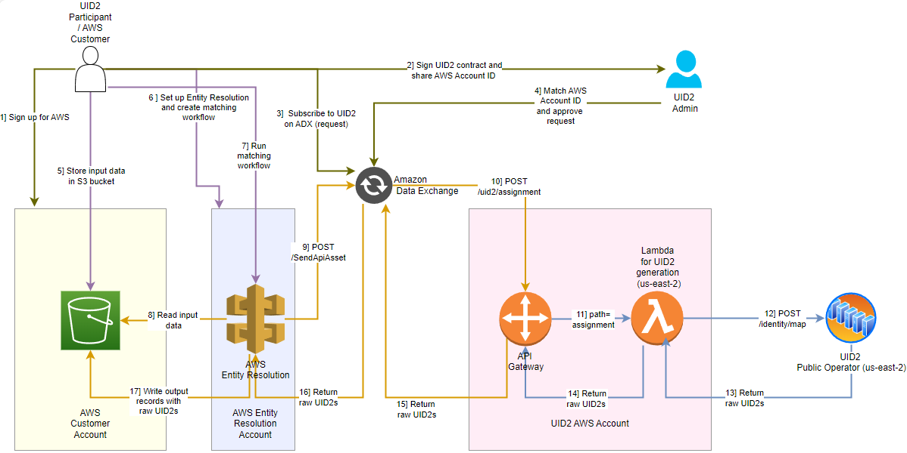
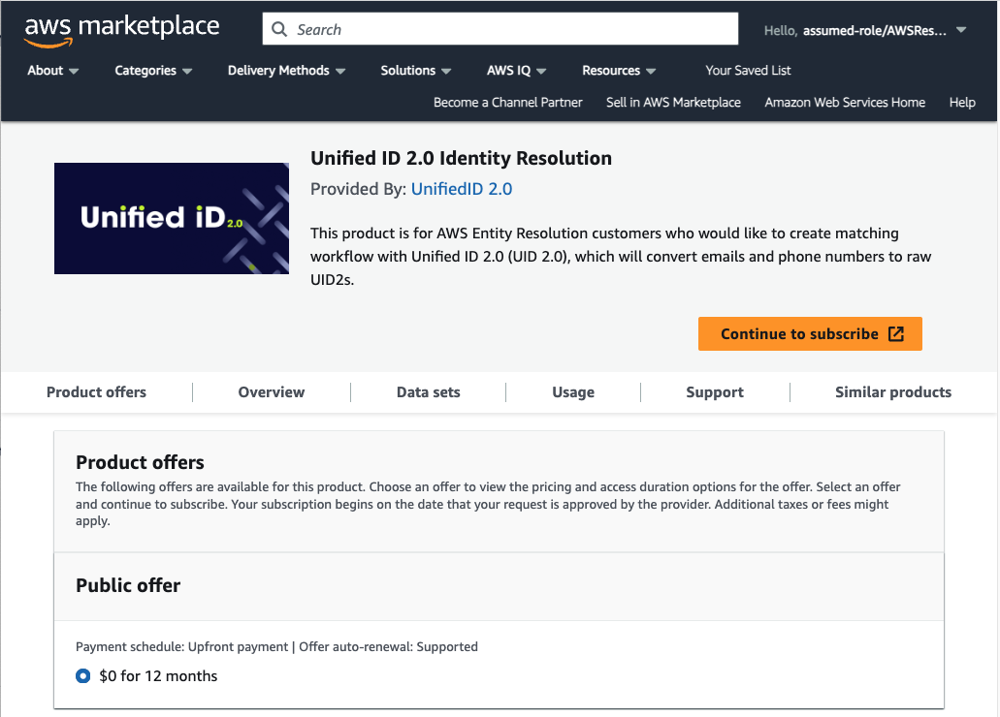

import Link from '@docusaurus/Link';

# AWS Entity Resolution Integration Guide

[AWS Entity Resolution](https://aws.amazon.com/entity-resolution/) is an identity resolution product from Amazon Web Services that allows AWS customers to integrate with the UID2 framework. Through the integration, you can securely and seamlessly generate UID2s for your data without making direct calls to the UID2 operator or handling sensitive client ID and secret key values.

This service allows you to map <Link href="../ref-info/glossary-uid#gl-dii">DII</Link> (email addresses or phone numbers) to raw UID2s swiftly and securely.

:::note
If you're not currently part of the UID2 ecosystem, go to the [Request Access to UID2](https://unifiedid.com/request-access) page.
:::

For a video presentation about integration with UID2 by using AWS Entity Resolution, and a demo, see [Getting Started with AWS Entity Resolution Integration with Unified ID 2.0](https://www.youtube.com/watch?v=ORbSsKMgVj8) on YouTube.

## Functionality

The following table summarizes the functionality available with the AWS Entity Resolution integration.

| Encrypt Raw UID2 to UID2 Token | Decrypt UID2 Token to Raw UID2 | Generate UID2 Token from DII | Refresh UID2 Token | Map DII to Raw UID2s |
| :--- |  :--- | :--- | :--- | :--- |
| No | No | No | No | Yes |

## Integration Summary

The following table summarizes the steps to integrate with UID2 using AWS Entity Resolution.

| Step/Link | Details |
| --- | --- |
| [Initial Setup Steps](#initial-setup-steps) | Create UID2 account, create AWS account, and link them:<ul><li>[Create UID2 Account](#create-uid2-account)</li><li>[Create AWS Account](#create-aws-account)</li><li>[Subscribe to UID2 on AWS Data Exchange](#subscribe-to-uid2-on-aws-data-exchange)</li></ul> |
| [Configure AWS Account](#configure-aws-account) | Set up IAM users, data tables, and schema mapping for your data. |
| [Create a Matching Workflow](#create-a-matching-workflow) | Create the workflow for matching your data, including input location, the matching technique to be applied, and output location. |
| [Run the Matching Workflow](#run-the-matching-workflow) | Process the input data to create raw UID2s. |

## Workflow Diagram

The following diagram illustrates the end-to-end UID2 process, from signing up for the service, through the configuration steps, to receiving the raw UID2s.



The following table shows the sequence of steps shown in the diagram.

| Step | Actor | Action |
| --- | --- | --- |
| 1 | Participant | Signs up for AWS. |
| 2 | Participant | Signs UID2 contract and shares AWS Account ID with UID2 contact. |
| 3 | Participant | Subscribes to UID2 on the Amazon Data Exchange. |
| 4 | UID2 Administrator | Matches the AWS Account ID provided in Step 2 with the signup request received in Step 3 and approves the request. |
| 5 | Participant | Stores input data in an Amazon S3 bucket. |
| 6 | Participant | Sets up Entity Resolution and creates a matching workflow. |
| 7 | Participant | Runs the matching workflow. |
| 8 | AWS Entity Resolution | Reads input data from the S3 bucket. |
| 9 | AWS Entity Resolution | Sends the input data to the Amazon Data Exchange using `POST /SendApiAsset`. |
| 10 | Amazon Data Exchange | Sends the data to the API Gateway using `POST /uid2/assignment`. |
| 11 | API Gateway | Sends the data to Lambda using `path=assignment`. |
| 12 | Lambda for UID2 generation | Sends the data to the UID2 Public Operator for conversion to raw UID2 using `POST /identity/map`. |
| 13 | UID2 Public Operator | Returns raw UID2s to Lambda for UID2 generation. |
| 14 | Lambda for UID2 generation | Returns raw UID2s to the API Gateway. |
| 15 | API Gateway | Returns raw UID2s to the Amazon Data Exchange. |
| 16 | Amazon Data Exchange | Returns raw UID2s to AWS Entity Resolution. |
| 17 | AWS Entity Resolution | Writes the output records to the S3 bucket including the raw UID2s. |

## Initial Setup Steps

The following are the initial steps for setting up your UID2 integration in AWS Entity Resolution:

- [Create AWS Account](#create-aws-account)
- [Create UID2 Account](#create-uid2-account)
- [Subscribe to UID2 on AWS Data Exchange](#subscribe-to-uid2-on-aws-data-exchange)

### Create AWS Account

Sign up for an AWS account, or use an existing one.

For details, see [Getting started: Are you a first-time AWS user?](https://docs.aws.amazon.com/accounts/latest/reference/welcome-first-time-user.html) in the AWS documentation.

### Create UID2 Account

Ask your UID2 contact to register you as a UID2 participant. If you're not sure who to ask, see [Contact Info](../getting-started/gs-account-setup.md#contact-info).

Send your UID2 contact the AWS account ID that you'll use for your UID2 integration on Entity Resolution.

### Subscribe to UID2 on AWS Data Exchange

Visit the [Unified ID 2.0 Identity Resolution](https://aws.amazon.com/marketplace/pp/prodview-66zqls7iqsm6o?sr=0-4&ref_=beagle&applicationId=AWSMPContessa#offers) page on the AWS Data Exchange and click **Continue to Subscribe.**



On receipt of your subscription request, the UID2 team does the following:
- Reviews your subscription request.
- Matches your request with the AWS account ID that you sent in [Create UID2 Account](#create-uid2-account).
- Approves the request.

## Configure AWS Account

UID2 participants store their data in AWS, in an S3 bucket, and integrate with AWS Entity Resolution. The basic steps, once you've created the AWS account (see [Create AWS Account](#create-aws-account)) are as follows.

:::note
For detailed instructions, see [Setting up AWS Entity Resolution](https://docs.aws.amazon.com/entityresolution/latest/userguide/setting-up.html) in the AWS documentation.
:::

1. [Create an administrator user](https://docs.aws.amazon.com/entityresolution/latest/userguide/setting-up.html#setting-up-create-iam-user).

2. [Prepare data tables](https://docs.aws.amazon.com/entityresolution/latest/userguide/setting-up.html#prepare-data-tables).

   In AWS Entity Resolution, each input data table contains source records with consumer identifiers. For UID2, the identifier can be either email address or phone number, but there must be only one identifier for each record. The identifier can be matched with other source records that you provide. Each record must have a Unique ID which is defined as the primary key in the schema mapping you create in Step 4. Follow these steps:

   - Save your input data table in a supported data format.
   - Upload your input data table to Amazon S3.
   - Create an [AWS Glue](https://docs.aws.amazon.com/glue/latest/dg/what-is-glue.html) table.

3. Create an IAM role for a console user.

4. Create a workflow job role for AWS Entity Resolution.

5. Create schema mapping for the data: see [Creating a schema mapping](https://docs.aws.amazon.com/entityresolution/latest/userguide/create-schema-mapping.html) in the AWS documentation.

## Create a Matching Workflow

When your initial account creation and setup are done, the next step is to create a matching workflow for your data.

The following steps are a summary of actions you'll take in the AWS Entity Resolution user interface. For additional details and instructions, see [Creating a matching workflow with UID 2.0](https://docs.aws.amazon.com/entityresolution/latest/userguide/create-matching-workflow-provider.html#create-mw-uid) in the AWS Entity Resolution documentation.

:::note
UID2 supports both email and phone number for UID2 generation. However, in AWS Entity Resolution, if both values are present in the schema mapping, the workflow duplicates each record in the output. One record uses the email for UID2 generation and the second record uses phone number. If your data includes a mix of emails and phone numbers and you don't want this duplication of records in the output, the best approach is to create a separate workflow for each, with separate schema mappings. In this scenario, go through the following steps twice&#8212;create one workflow for emails and a separate one for phone numbers.
:::

To create the matching workflow, first sign in to the AWS Management console, open the **AWS Entity Resolution** page, and choose **Workflows** > **Matching workflows** > **Create matching workflow**. Then, complete the following steps for your matching workflow.

1. Specify the following details for the matching workflow:
   - **Name**: This value is required. We recommend a short, clear, intuitive name. For example, with your own company name: `CompanyName_UID2_Daily_Matching`.
   - **Description**: An optional description for the matching workflow.
   - **Data input**: The source for your data in AWS. From the drop-down list, select an AWS Glue database, then the AWS Glue table, and then the schema mapping. You can specify more than one data input. In the following example, email is the only type of data input:

     | UniqueId | Name   | Email            | Date of Birth |
     |----------|--------|------------------|---------------|
     | 0001     | Test 1 | test1@uidapi.com | 1/1/90        |
     | 0002     | Test 2 | test2@gmail.com  | 1/2/78        |

     :::note
     If you have both email and phone numbers in the same record, the workflow duplicates each record in the output. If you don't want this, the best approach is to create a separate workflow for each. See details earlier in this section.
     :::

   - **Service access**: Grant permissions to Entity Resolution to access the specified data in AWS Glue and to call AWS Data Exchange on your behalf. We highly recommend that you select "Create and use a new service role" and let the workflow create a new role with all the required permissions. If you're using an existing service role, make sure that it is authorized to call AWS Data Exchange by adding the following permission:

        ```json
       {
        "Version": "2012-10-17",
        "Statement": [
            {
                "Effect": "Allow",
                "Sid": "DataExchangePermissions",
                "Action": "dataexchange:SendApiAsset",
                "Resource": [
                    "<Asset ARN>"
                ]
              }
          ]
        }
       ```
       The Asset ARN is available on the AWS Data Exchange console at "AWS Data Exchange" > "Entitled data" > "Unified ID 2.0 Identity Resolution" > "Data set: UnifiedID-2.0" > "Revision: Date" > "Asset: venice-api-gateway-prod"
   - **Decryption Key**: If the input data is encrypted, you must also specify the AWS Key Management Service (KMS) key for decryption.

2. Choose the matching technique:
   - Under **Matching method**, choose the **Partner services** option.
   - Then, under **Partner services**, choose **Unified ID2.0**.
   - Click **Next**.

     If you completed the earlier step, see [Subscribe to UID2 on AWS Data Exchange](#subscribe-to-uid2-on-aws-data-exchange), you'll see an **Approved** message.

3. Define the data output:
   - For **Data Output Destination**, specify the URI of the S3 bucket that you want to use for your output data. Select the data format: Normalized or Original.
   
     `Normalized` is the default, so that data inputs are normalized before matching.

     Your data is encrypted by default with a key that AWS owns and manages for you. To specify a different key, customize your encryption settings.

   - Select the input fields that you want to exclude from the output, and the fields that you want to hash in the output data, as shown in the following example.
   
     | UniqueId | Name   | Email            | Date of Birth | UID2_identifier  | UID2_advertising_id                            | UID2_bucket_id |
     |----------|--------|------------------|---------------|------------------|------------------------------------------------|----------------|
     | 0001     | Test 1 | test1@uidapi.com | 1/1/90        | test1@uidapi.com | Q4A5ZBuBCYfuV3Wd8Fdsx2+i33v7jyFcQbcMG/LH4eM=   | ad1ANEmVZ      |
     | 0002     | Test 2 | test2@gmail.com  | 1/2/78        | test2@gmail.com  | kds8hgBuBCYfuV3Wd8Fdsx2+i33v7jyFcQbcMG/jgksuh= | kd9ANE98d      |

4. **Review and Create**: Review all the details of the matching workflow. When you're satisfied with the values, click **Create**.

   The matching workflow is created, and you'll see a confirmation message.

## Run the Matching Workflow

Follow these steps to run the matching workflow and view the results.

For details, see [Running and managing matching workflows](https://docs.aws.amazon.com/entityresolution/latest/userguide/run-manage-matching-workflow.html) in the AWS Entity Resolution documentation.

1. Sign in to the AWS Management console, open the AWS Entity Resolution page, and choose **Workflows** > **Matching workflows**.

2. Choose the matching workflow that you want to run.

3. On the **Matching workflows** details page, in the upper right corner, choose **Run**.

   The matching workflow runs. When it is done, you'll see a status message of **Completed**.

4. To view the results, go to the **Data** output tab and then select your Amazon S3 location.
