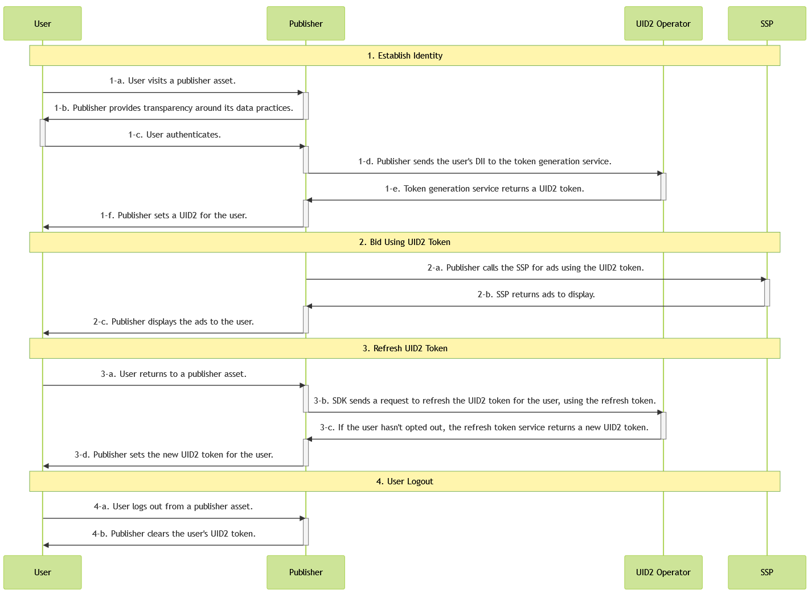

import Tabs from '@theme/Tabs';
import TabItem from '@theme/TabItem';
import Link from '@docusaurus/Link';

# Client-Server Integration Guide for JavaScript

This guide is for publishers with web assets who want to generate identity tokens using UID2 for the RTB <Link href="../ref-info/glossary-uid#gl-bidstream">bidstream</Link>, generating UID2 tokens on the server side and passing them to the publishers' web pages, and refreshing the tokens on the client side using the SDK for JavaScript.

This is called client-server integration because the JavaScript integration steps are client-side and some other steps are server-side.

If you prefer to integrate with UID2 via **only** client-side JavaScript changes, see [Client-Side Integration Guide for JavaScript](integration-javascript-client-side.md).

For technical details about the SDK, see [SDK for JavaScript Reference Guide](../sdks/sdk-ref-javascript.md).

## Sample Implementation Website

For an example application, see the UID2 Google Secure Signals with SDK v3 example:
- Code and docs: [UID2 SDK Secure Signals Integration Example](https://github.com/IABTechLab/uid2-web-integrations/tree/main/examples/google-secure-signals-integration/with_sdk_v3)
- Running site: [Client-Server UID2 SDK Integration Example](https://secure-signals-jssdk-integ.uidapi.com/)

## Introduction

This guide outlines the basic steps that you need to consider if you are building an integration without using an SDK. For example, you need to decide how to implement user authentication and data capture, how to manage UID2 identity information and use it for targeted advertising, and how to refresh tokens, deal with missing identities, and handle user opt-outs.

For a workflow diagram, see [Integration Steps](#integration-steps). See also [FAQs](#faqs).

To facilitate the process of establishing client identity using UID2 and retrieving advertising tokens, the web integration steps provided in this guide rely on the SDK for JavaScript. Here's an [example application](https://example-jssdk-integ.uidapi.com/) that illustrates the integration steps described in this guide and the usage of the SDK (currently only for email addresses). For the application documentation, see [UID2 SDK Integration Example](https://github.com/IABTechLab/uid2-examples/blob/main/publisher/standard/README.md).

:::tip
The first-party cookie and local storage implementation details might change in the future. To avoid potential issues, be sure to rely on the functionality documented in the [SDK for JavaScript API Reference](../sdks/sdk-ref-javascript.md#api-reference) for your identity management.
:::

For integration scenarios for publishers that do not use the SDK for JavaScript, see [Publisher Integration Guide, Server-Side](integration-publisher-server-side.md). 

:::note
If you are using Google Ad Manager and want to use the secure signals feature, first follow the steps in this guide and then follow the additional steps in the [Google Ad Manager Secure Signals Integration Guide](google-ss-integration.md).
:::

## Integration Steps 

The following diagram outlines the steps required for establishing a user's UID2 token with a publisher and how the UID2 token integrates with the RTB bidstream.



<!-- diagram source: resource/integration-javascript-client-server-mermaid.md.bak -->

The following sections provide additional details for each step in the diagram:
 
 1. [Establish identity: capture user data](#establish-identity-capture-user-data)
 2. [Bid Using UID2 Tokens](#bid-using-uid2-tokens)
 3. [Refresh Tokens](#refresh-tokens)
 4. [Clear Identity: User Logout](#clear-identity-user-logout)

### Establish Identity: Capture User Data

After authentication in step 1-c, which allows the publisher to validate the user's email address or phone number, a UID2 token must be generated on the server side. The following table details the token generation steps.

| Step | Endpoint/SDK | Description |
| :--- | :--- | :--- |
| 1-d | [POST&nbsp;/token/generate](../endpoints/post-token-generate.md) | Use the [POST&nbsp;/token/generate](../endpoints/post-token-generate.md) endpoint to generate a UID2 token using the email address or phone number provided by the user. Make sure it is normalized. |
| 1-e | [POST&nbsp;/token/generate](../endpoints/post-token-generate.md) | The endpoint returns a UID2 token generated from the user's email address, phone number, or the respective hash. |
| 1-f | SDK for JavaScript | The SDK sends the returned UID2 token from step 1-e to the SDK in the `identity` property of its [init() function](../sdks/sdk-ref-javascript.md#initopts-object-void). |
| 1-g | SDK for JavaScript | Provide the SDK a callback function that will receive identity updates from the SDK and use them to initiate targeted advertising. |

#### Generating a UID2 Token on the Server

The first step is to generate the UID2 token on your server.

For details, including instructions and examples, see [Server-Side Token Generation](../ref-info/ref-server-side-token-generation.md).

You will need to pass the `Identity` response to the SDK. See [Sending the UID2 Token to the SDK](#sending-the-uid2-token-to-the-sdk).

:::warning
For security reasons, the API key and secret used in token generation must be called server-side. Do not store these values on the client side. For details, see [Security of API Key and Client Secret](../getting-started/gs-credentials.md#security-of-api-key-and-client-secret).
:::

#### Sending the UID2 Token to the SDK

The following code examples illustrate steps 1-f and 1-g, in JavaScript and TypeScript.

<Tabs>
<TabItem value='js' label='JavaScript'>

```js
  window.__uid2 = window.__uid2 || {};
  window.__uid2.callbacks = window.__uid2.callbacks || [];

  // Step 1-f
  window.__uid2.callbacks.push((eventType, payload) => {
    if (eventType === 'SdkLoaded') {
      __uid2.init({
        identity : {
          "advertising_token": "AgmZ4dZgeuXXl6DhoXqbRXQbHlHhA96leN94U1uavZVspwKXlfWETZ3b/besPFFvJxNLLySg4QEYHUAiyUrNncgnm7ppu0mi6wU2CW6hssiuEkKfstbo9XWgRUbWNTM+ewMzXXM8G9j8Q=",
          "refresh_token": "Mr2F8AAAF2cskumF8AAAF2cskumF8AAAADXwFq/90PYmajV0IPrvo51Biqh7/M+JOuhfBY8KGUn//GsmZr9nf+jIWMUO4diOA92kCTF69JdP71Ooo+yF3V5yy70UDP6punSEGmhf5XSKFzjQssCtlHnKrJwqFGKpJkYA==",
          "identity_expires": 1633643601000,
          "refresh_from": 1633643001000,
          "refresh_expires": 1636322000000,
          "refresh_response_key":"dYNTB20edyHJU9mZv11e3OBDlLTlS5Vb97iQVumc7b/8QY/DDxr6FrRfEB/D",
        }
      });
    }
  });

  // Step 1-g
  window.__uid2.callbacks.push((eventType, payload) => {
    if (eventType !== 'SdkLoaded') {
      if (payload.identity) {
        const advertisingToken = payload.identity.advertising_token;
        // Pass advertising_token to your advertising system to use
      } else {
        // No identity is available. Trigger a workflow for obtaining email address or phone number if you want to use UID2 for targeted advertising.
      }
    }
  });
```

</TabItem>
<TabItem value='ts' label='TypeScript'>

```tsx
  import { EventType, CallbackPayload } from "./callbackManager";

  window.__uid2 = window.__uid2 || {};
  window.__uid2.callbacks = window.__uid2.callbacks || [];

  // Step 1-f
  window.__uid2.callbacks.push((eventType: EventType, payload: CallbackPayload) => {
    if (eventType === 'SdkLoaded') {
      __uid2.init({
        identity : {
          "advertising_token": "AgmZ4dZgeuXXl6DhoXqbRXQbHlHhA96leN94U1uavZVspwKXlfWETZ3b/besPFFvJxNLLySg4QEYHUAiyUrNncgnm7ppu0mi6wU2CW6hssiuEkKfstbo9XWgRUbWNTM+ewMzXXM8G9j8Q=",
          "refresh_token": "Mr2F8AAAF2cskumF8AAAF2cskumF8AAAADXwFq/90PYmajV0IPrvo51Biqh7/M+JOuhfBY8KGUn//GsmZr9nf+jIWMUO4diOA92kCTF69JdP71Ooo+yF3V5yy70UDP6punSEGmhf5XSKFzjQssCtlHnKrJwqFGKpJkYA==",
          "identity_expires": 1633643601000,
          "refresh_from": 1633643001000,
          "refresh_expires": 1636322000000,
          "refresh_response_key":"dYNTB20edyHJU9mZv11e3OBDlLTlS5Vb97iQVumc7b/8QY/DDxr6FrRfEB/D",
        }
      });
    }
  });

  // Step 1-g
  window.__uid2.callbacks.push((eventType: EventType, payload: CallbackPayload) => {
    if (eventType !== 'SdkLoaded') {
      if (payload.identity) {
        const advertisingToken = payload.identity.advertising_token;
        // Pass advertising_token to your advertising system to use
      } else {
        // No identity is available. Trigger a workflow for obtaining email address or phone number if you want to use UID2 for targeted advertising.
      }
    }
  });
```

</TabItem>
</Tabs>

The SDK invokes the specified [callback function](../sdks/sdk-ref-javascript.md#callback-function) (which indicates the identity availability) and makes the established identity available client-side for bidding. 

:::tip
Depending on the structure of your code, it might be convenient to combine the callbacks for steps 1-f and 1-g into a single callback function.
:::

### Bid Using UID2 Tokens

Based on the status and availability of a valid identity, the SDK does the following:

1. Sets up the background token auto-refresh.
1. Stores identity information in [local storage or a first-party cookie](../sdks/sdk-ref-javascript.md#uid2-storage-format).
1. Uses the identity information to initiate requests for targeted advertising.

<!-- (**GWH_TODO. Q: Not sure about the relationship between the steps above and the table below. And the diagram 2-a which says "the publisher calls the SSP for ads using the UID2 token". A: Diagram needs to be updated.**) -->

The bidding step is shown in the following table.

| Step | Endpoint/SDK | Description |
| :--- | :--- | :--- |
| 2-a | SDK for JavaScript | Gets the current user's advertising token by using the [getAdvertisingToken() function](../sdks/sdk-ref-javascript.md#getadvertisingtoken-string) as shown below. |

:::note
For an example of what a UID2 token might look like in the bidstream, when it's sent from an SSP to a DSP, see [What does a UID2 token look like in the bidstream?](../getting-started/gs-faqs.md#what-does-a-uid2-token-look-like-in-the-bidstream).
:::

```html
<script>
  let advertisingToken = __uid2.getAdvertisingToken();
</script>
```

:::info
You need to consider how you pass the returned advertising token to SSPs. With some other approaches to client-side UID2 implementation, such as using `Prebid.js` (see [UID2 Integration Overview for Prebid.js](integration-prebid.md)) or Google Ad Manager Secure Signals (see [Google Ad Manager Secure Signals Integration Guide](google-ss-integration.md)), the implementation includes functions that manage passing the returned advertising token. If you're using the SDK for JavaScript you'll need to manage this yourself.
:::

:::tip
Instead of calling `__uid2.getAdvertisingToken()`, you can use the `advertising_token` property of the identity passed to the callback that you set up for step 1-g. The callback will be called every time the identity changes.
:::

### Refresh Tokens

As part of its initialization, the SDK sets up a [token auto-refresh](../sdks/sdk-ref-javascript.md#background-token-auto-refresh) for the identity, which is triggered in the background by the timestamps on the identity or by failed refresh attempts due to intermittent errors.

| Step | Endpoint/SDK | Description |
| :--- | :--- | :--- |
| 3-a | [SDK for JavaScript](../sdks/sdk-ref-javascript.md) | The SDK automatically refreshes UID2 tokens in the background. No manual action is required. |
| 3-b | [SDK for JavaScript](../sdks/sdk-ref-javascript.md) | If the user hasn't opted out, the [POST&nbsp;/token/refresh](../endpoints/post-token-refresh.md) endpoint automatically returns new identity tokens. |


### Clear Identity: User Logout

The client lifecycle is complete when the user decides to log out from the publisher's site (not UID2). This closes the client's identity session and clears the first-party cookie information.

| Step | Endpoint/SDK | Description |
| :--- | :--- | :--- |
| 4-a | N/A | The user logs out from the publisher's asset. |
| 4-b | [SDK for JavaScript](../sdks/sdk-ref-javascript.md) | The SDK clears the UID2 identity from the first-party cookie and disconnects the client lifecycle by using the [disconnect() function](../sdks/sdk-ref-javascript.md#disconnect-void) as shown below.|


```html
<script>
  __uid2.disconnect();
</script>
```

## FAQs

For a list of frequently asked questions for the publisher audience, see [FAQs for Publishers](../getting-started/gs-faqs.md#faqs-for-publishers).
