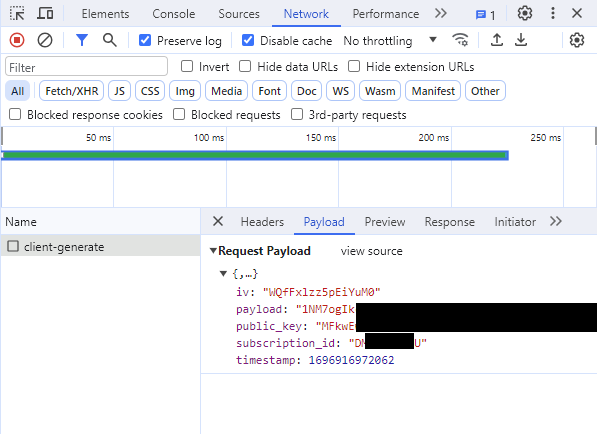

import Tabs from '@theme/Tabs';
import TabItem from '@theme/TabItem';
import Link from '@docusaurus/Link';

# Client-Side Integration Guide for JavaScript

<!-- The below segment is for UID2 only: not applicable for advertisers since EUID doesn't support sharing. -->
This guide is for all participants who want to integrate with UID2 and generate <Link href="../ref-info/glossary-uid#gl-uid2-token">UID2 tokens</Link> (advertising tokens) using only JavaScript client-side changes on their website with minimum effort.

This approach is used by the following participant types:

- **Publishers**: Most notably, this workflow is for publishers wanting to send UID2 tokens into the bidstream.
- **Advertisers** and **Data Providers**: In addition, advertisers and data providers would use this for adding a UID2 token to their tracking pixels (see [Tokenized Sharing in Pixels](sharing/sharing-tokenized-from-data-pixel.md)).

<!-- End of UID2-only section. -->
<!-- Begin EUID-only section. -->
<!-- This guide is for publishers who want to integrate with UID2 and generate EUID tokens (advertising tokens) using only JavaScript client-side changes on their website with minimum effort. -->
<!-- End of EUID-only section. -->

This guide does not apply to publishers who want to use a <Link href="../ref-info/glossary-uid#gl-private-operator">Private Operator</Link>, or who want to generate tokens server-side. Those publishers should follow the [Client-Server Integration Guide for JavaScript](integration-javascript-client-server.md).

UID2 provides a SDK for JavaScript (see [SDK for JavaScript Reference Guide](../sdks/sdk-ref-javascript.md)) with the following features:

- UID2 token generation
- Automatic refreshing of UID2 tokens
- Automatic storage of UID2 tokens in the browser

To implement, you'll need to complete the following steps:

1. [Complete UID2 account setup](#complete-uid2-account-setup)
2. [Add SDK For JavaScript to your site](#add-sdk-for-javascript-to-your-site)
3. [Configure the SDK for JavaScript](#configure-the-sdk-for-javascript)
4. [Check that the token was successfully generated](#check-that-the-token-was-successfully-generated)

## SDK for JavaScript Version

Support for client-side token generation is available in version 3.4.5 and above of the SDK. 

The URL for the SDK is:

- [https://cdn.prod.uidapi.com/uid2-sdk-3.4.5.js](https://cdn.prod.uidapi.com/uid2-sdk-3.4.5.js)

In the following code examples, the placeholder `{{ UID2_JS_SDK_URL }}` refers to this URL.

If you want to use a debug build of the SDK, use the following URL instead:

- [https://cdn.integ.uidapi.com/uid2-sdk-3.4.5.js](https://cdn.integ.uidapi.com/uid2-sdk-3.4.5.js)

## Sample Implementation Website

For an example website, see this example:
- Code: [Example Client-Side Integration for JavaScript](https://github.com/IABTechLab/uid2-web-integrations/tree/main/examples/cstg)
- Running site: [Client-Side Integration Example, UID2 JavaScript SDK](https://cstg-integ.uidapi.com/)

<!-- (Source code for running site: https://github.com/IABTechLab/uid2-web-integrations) -->
  

## Complete UID2 Account Setup

Complete the UID2 account setup by following the steps described in the [Account Setup](../getting-started/gs-account-setup.md) page. As part of the account setup process, you'll need to provide a list of **domain names** for the sites that you'll be using with this SDK for JavaScript.

When account setup is complete, you'll receive a client keypair consisting of two values that identify you to the UID2 servers: Subscription ID and public key. These values are unique to you, and you'll use them to configure the UID2 module. For details, see [Subscription ID and Public Key](../getting-started/gs-credentials.md#subscription-id-and-public-key).

:::tip
Only root-level domains are required for account setup. For example, if you're going to use SDK for JavaScript on example.com, shop.example.com, and example.org, you only need to provide the domain names example.com and example.org.
:::

## Add SDK For JavaScript to Your Site

The following code snippet provides an overview of the code you will need to add to your website. It also illustrates the different events that the SDK can trigger.

For a more detailed code snippet, see [Example Integration Code and When to Pass DII to the UID2 SDK](#example-integration-code-and-when-to-pass-dii-to-the-uid2-sdk).

For the `UID2_JS_SDK_URL` value, see [SDK for JavaScript Version](#sdk-for-javascript-version).

```js
<script async src="{{ UID2_JS_SDK_URL }}"></script>
 
<script>
 
// When the UID2 SDK is executed, it looks for these callbacks and invokes them.
window.__uid2 = window.__uid2 || {};
window.__uid2.callbacks = window.__uid2.callbacks || [];
window.__uid2.callbacks.push((eventType, payload) => {
  switch (eventType) {
    case "SdkLoaded":
      // The SdkLoaded event occurs just once.
      __uid2.init({});
      break;
 
    case "InitCompleted":
      // The InitCompleted event occurs just once.
      //
      // If there is a valid UID2 token, it is in payload.identity.
      break;
 
    case "IdentityUpdated":
      // The IdentityUpdated event happens when a UID2 token is generated or refreshed.
      // payload.identity contains the resulting latest identity.
      break;
  }
});
 
</script>
```

For more information about the SDK, see [SDK for JavaScript Reference Guide](../sdks/sdk-ref-javascript.md).

### Using the UID2 Integration Environment

By default, the SDK is configured to work with the UID2 production environment `https://prod.uidapi.com`. If you want to use the UID2 integration environment instead, provide the following URL in your call to `init`:

```js
__uid2.init({
  baseUrl: "https://operator-integ.uidapi.com",
});
```
:::note
Tokens from the UID2 integration environment are not valid for passing to the <Link href="../ref-info/glossary-uid#gl-bidstream">bidstream</Link>. For the integration environment, you will have different **Subscription ID** and **public key** values.
:::

### Optional: Specifying the API Base URL to Reduce Latency

By default, this SDK makes calls to a UID2 production environment server in the USA.

For information about how to choose the best URL for your use case, and a full list of valid base URLs, see [Environments](../getting-started/gs-environments.md).

To specify a UID2 server that is not the default, you can change it in the `init` call:

```js
__uid2.init({
  baseUrl: "https://global.prod.uidapi.com",
});
```

## Configure the SDK for JavaScript

UID2 provides the publisher with the following values required to use the client-side token generation feature:

* A Subscription ID
* A public key

You'll have one set of these values for your publisher Integration environment, and a separate set for your production environment.

To configure the SDK, call one of the following methods, with an object containing the **public key** and **Subscription ID** that you received during account setup, as well as the user's hashed or unhashed <Link href="../ref-info/glossary-uid#gl-dii">DII</Link> (email address or phone number):

*  `__uid2.setIdentityFromEmail`
*  `__uid2.setIdentityFromEmailHash`
*  `__uid2.setIdentityFromPhone`
*  `__uid2.setIdentityFromPhoneHash`

The following sections include coding examples for each scenario.

Once it's configured, the UID2 SDK takes care of the following:
- Generates a UID2 token for the user.
- Stores the token in the user's browser.
- Automatically refreshes the token as required while your site is open in the user's browser.

You can pass the user's DII to the UID2 SDK either hashed or unhashed. If you pass the DII unhashed, the UID2 SDK hashes it for you. If you want to pass the DII to the SDK already hashed, you must normalize it before hashing. For details, see [Normalization and Encoding](../getting-started/gs-normalization-encoding.md). 

## Format Examples for DII

The SDK encrypts the hashed DII before sending it to the UID2 service.

You can configure the SDK using any one of the four accepted DII formats, for any specific user. The DII format might vary per user but you can only send one value per user.

The following examples demonstrate the different ways that you can configure the UID2 SDK and list the requirements for the DII passed to the SDK:

- Email, Unhashed
- Email, Normalized and Hashed
- Phone Number, Unhashed
- Phone Number, Normalized and Hashed

If the SDK is configured multiples times, it uses the most recent configuration values.

For an example of how to generate email and phone hashes in JavaScript, see [Example Code: Hashing and Base-64 Encoding](#example-code-hashing-and-base-64-encoding).

<Tabs>
<TabItem value='example_email_unhashed' label='Email, Unhashed'>

The following example configures the UID2 SDK with an email address.

```js
await __uid2.setIdentityFromEmail(
    "test@example.com",
    {
        subscriptionId: subscriptionId,
        serverPublicKey: publicKey,
    }
);
```

In this scenario:

- No normalization or hashing is required by the publisher.
- The UID2 SDK normalizes and hashes the email address before sending the encrypted hash to the UID2 service.

</TabItem>
<TabItem value='example_email_hash' label='Email, Normalized and Hashed'>

The following example configures the UID2 SDK with a hashed email address.

```js
await __uid2.setIdentityFromEmailHash(
    'lz3+Rj7IV4X1+Vr1ujkG7tstkxwk5pgkqJ6mXbpOgTs=',
    {
        subscriptionId: subscriptionId,
        serverPublicKey: publicKey,
    }
);
```

In this scenario:
- **The publisher is responsible for normalizing and hashing the email address**. For details, see [Normalization and Encoding](../getting-started/gs-normalization-encoding.md).
- The UID2 SDK encrypts the hash before sending it to the UID2 service.

</TabItem>
<TabItem value='example_phone_unhashed' label='Phone Number, Unhashed'>

The following example configures the UID2 SDK with a phone number.

```js
await __uid2.setIdentityFromPhone(
    '+12345678901',
    {
        subscriptionId: subscriptionId,
        serverPublicKey: publicKey,
    }
);
```
In this scenario:

- **The publisher is responsible for normalizing the phone number**. For details, see [Phone Number Normalization](../getting-started/gs-normalization-encoding.md#phone-number-normalization).
- The UID2 SDK hashes the phone number before sending the encrypted hash to the UID2 service.

</TabItem>
<TabItem value='example_phone_hash' label='Phone Number, Normalized and Hashed'>

The following example configures the UID2 SDK with a hashed phone number:

```js
await __uid2.setIdentityFromPhoneHash(
    'EObwtHBUqDNZR33LNSMdtt5cafsYFuGmuY4ZLenlue4=',
    {
        subscriptionId: subscriptionId,
        serverPublicKey: publicKey,
    }
);
```

In this scenario:
- **The publisher is responsible for normalizing, hashing, and Base64-encoding the phone number**. For details, see [Normalization and Encoding](../getting-started/gs-normalization-encoding.md).
- The UID2 SDK encrypts the hash before sending it to the UID2 service.

</TabItem>
</Tabs>

## Token Storage and Refresh

After calling one of the methods listed in [Configure the SDK for JavaScript](#configure-the-sdk-for-javascript) successfully, an <Link href="../ref-info/glossary-uid#gl-identity">identity</Link> is generated and stored in local storage, under the key `UID2-sdk-identity`. The SDK refreshes the UID2 token periodically.

:::warning
The format of the object stored in local storage could change without notice. We recommend that you do **not** read or update the object in local storage directly. 
:::

## Example Integration Code and When to Pass DII to the UID2 SDK

If you're a publisher and this is the first page load with no <Link href="../ref-info/glossary-uid#gl-identity">identity</Link>, to start the token generation call you'll need to call one of the `setIdentity` methods with DII. Once an identity is generated, the advertising token (<Link href="../ref-info/glossary-uid#gl-uid2-token">UID2 token</Link>) that you would send to the bidstream will be available by waiting for the `IdentityUpdated` event from the SDK. For an example, see how the value for `advertising_token_to_use` is set in the following code snippet.

In some cases, the user's DII is not available on page load, and getting the DII has some associated cost. For example, an API call might be required to fetch the DII, or the user has to be prompted to provide the DII information.

You can potentially avoid that cost by checking for an existing token that you can use or refresh. To do this, call
[__uid2.isLoginRequired](../sdks/sdk-ref-javascript#isloginrequired-boolean) which returns a Boolean value. If it returns `true`, this means that the UID2 SDK cannot create a new advertising token with the existing resource and DII is required to generate a brand new UID2 token.

It is possible that when you provide DII, [__uid2.isLoginRequired](../sdks/sdk-ref-javascript#isloginrequired-boolean) still returns a `false` value. This happens if the user has opted out of UID2. The UID2 SDK for JavaScript respects the user's optout and does not generate UID2 tokens, even if you call any of the `setIdentity` method calls with the same DII again. Optionally, you might want to avoid making such calls repeatedly.

The following code snippet demonstrates how you might integrate with the UID2 SDK for JavaScript for these two scenarios&#8212;starting with no token, or reusing/refreshing an existing UID2 token.

```js
<script async src="{{ UID2_JS_SDK_URL }}"></script>
 
<script>
 
// UID2 provides these configuration values to the publisher.
const clientSideConfig = {
  subscriptionId: "...",
  serverPublicKey: "...",
};
  
// Example of a base-64 encoded SHA-256 hash of an email address.
const emailHash = "tMmiiTI7IaAcPpQPFQ65uMVCWH8av9jw4cwf/F5HVRQ=";

// When the UID2 SDK is executed, it looks for these callbacks and invokes them.
window.__uid2 = window.__uid2 || {};
window.__uid2.callbacks = window.__uid2.callbacks || [];
window.__uid2.callbacks.push(async (eventType, payload) => {
  switch (eventType) {
    case "SdkLoaded":
      // The SdkLoaded event occurs just once.
      __uid2.init({});
      break;
 
    case "InitCompleted":
      // The InitCompleted event occurs just once.
      //
      // If there is a valid UID2 token, it is in payload.identity.
      if (payload?.identity) {
        //
        // payload looks like this:
        // {
        //   "identity": {
        //     "advertising_token": "A4A...MqA",
        //     "refresh_token": "A3A...pdg==",
        //     "identity_expires": 1692257038260,
        //     "refresh_expires": 1692339838260,
        //     "refresh_from": 1692254338260
        //     "refresh_response_key": "z0v...zL0="
        //   }
        // }
        var advertising_token_to_use = payload.identity.advertising_token;
      } else {
         if (__uid2.isLoginRequired()) {
            // Call one of the setIdentityFrom functions to generate a new UID2 token.
            // Add any retry logic around this call as required.
            await __uid2.setIdentityFromEmailHash(
                emailHash,
                clientSideConfig);
          }  
          else {
            // there is a token generation API call in flight which triggers a IdentityUpdated event 
            // or no token would be generated because one of previous `setIdentity` calls determines the DII has opted out.
          }
      }
      break;
 
    case "IdentityUpdated":
      // The IdentityUpdated event happens when a UID2 token is generated or refreshed.
      // See previous comment for an example of how the payload looks.
      // It's possible that payload/identity objects could be null for reasons such as the token
      // expired and cannot be refreshed, or the user opted out of UID2. 
      // Check that the advertising token exists before using it.
      if (payload?.identity?.advertising_token) {
          var advertising_token_to_use = payload.identity.advertising_token;
      }
      break;
  }
});
 
</script>
```

## Check that the Token Was Successfully Generated

To check that the token was successfully generated, use the browser's developer tools to look for the token in local storage.


If there was a problem generating the token, find the request in the **Network** tab. You can find the request by filtering for the string `client-generate`. Information about why the request failed should be available in the response.



## Example Code: Hashing and Base-64 Encoding

The following code example demonstrates how to generate email and phone hashes in JavaScript.

```js
async function hash(value) {
  const hash = await window.crypto.subtle.digest(
    "SHA-256",
    new TextEncoder().encode(value)
  );
  return bytesToBase64(new Uint8Array(hash));
}
 
function bytesToBase64(bytes) {
  const binString = Array.from(bytes, (x) => String.fromCodePoint(x)).join("");
  return btoa(binString);
}
```