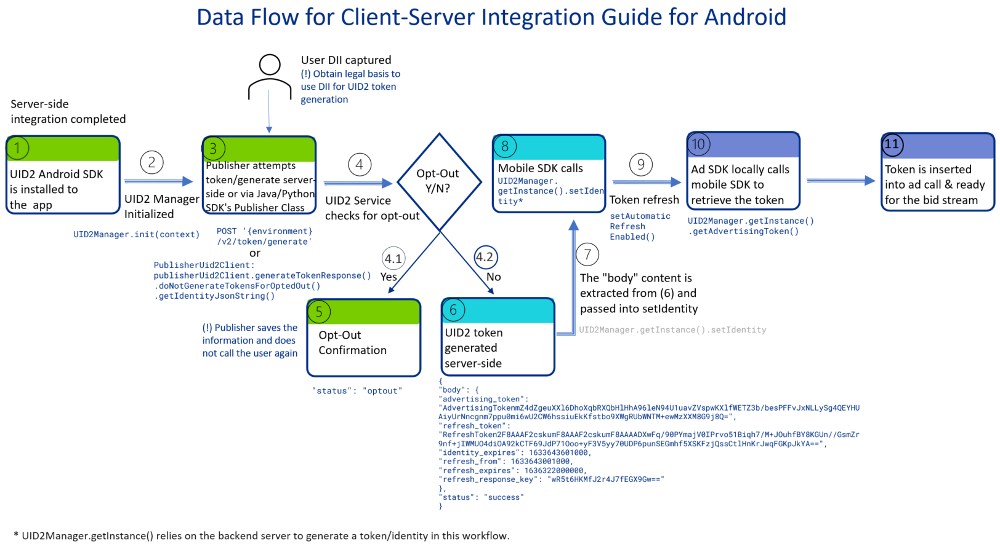

import Tabs from '@theme/Tabs';
import TabItem from '@theme/TabItem';
import Link from '@docusaurus/Link';
import ReduceLatency from '/docs/snippets/_sdk-reduce-latency.mdx';

# UID2 Client-Server Integration Guide for Mobile

This guide is intended for mobile app publishers who want to integrate with UID2 by generating UID2 tokens on their back-end servers (or server-side) via either a public or Private Operator and then pass the tokens and user identities into their mobile apps, which will in turn pass the tokens for bid stream use.  

This is called Client-Server Integration because some integration steps are client-side and some are server-side.

If you want to integrate with UID2 via client-side only changes (that is, all integration changes required are within the mobile apps), refer to the [UID2 Client-Side Integration Guide for Mobile](integration-mobile-client-side.md) instead.

This page provides a high-level overview of integration steps and links to additional documentation.

<!-- It includes the following sections:

- [Overview](#overview)
- [Complete the UID2 Account Setup](#complete-the-uid2-account-setup)
- [Client-Server Mobile Integration Data Flow Overview](#client-server-mobile-integration-data-flow-overview)
- [Implement Server-Side Token Generation On Your Back-End Server](#implement-server-side-token-generation-on-your-back-end-server)
- [Server-Side Token Refresh](#server-side-token-refresh)
- [Add UID2 Mobile SDK into Your Mobile App](#add-uid2-mobile-sdk-into-your-mobile-app)
- [Using the UID2 Integration Environment](#using-the-uid2-integration-environment)
- [Optional: Reduce Latency by Setting the API Base URL for the Production Environment](#optional-reduce-latency-by-setting-the-api-base-url-for-the-production-environment)
- [Token Storage](#token-storage)
- [Pass Generated Token for Bid Stream Use](#pass-generated-token-for-bid-stream-use)
- [Best Practice on When to Pass New UID2 Token to the UID2 SDK](#best-practice-on-when-to-pass-new-uid2-token-to-the-uid2-sdk)
- [Enable Logging (For Android Only)](#enable-logging-for-android-only)
- [Enable Automatic Token Refresh in Mobile App/Client Side](#enable-automatic-token-refresh-in-mobile-appclient-side)
- [Optional: UID2 GMA/IMA Plugin for GAM Secure Signal integration](#optional-uid2-gmaima-plugin-for-gam-secure-signal-integration) -->

## Overview

UID2 provides mobile SDKs for Android and iOS. Each SDK has the following features:

- Takes in a UID2 Identity (including a UID2 token) and persists it in local file storage.
- Automatically refreshes UID2 tokens. (**GWH__SW: curious... how often? Do the SDKs take our own advice of refreshing every hour? We don't need to say this, but we could, and even if we don't I'd like to know if we take our own advice.**)

You'll need to complete the following steps:

1. [Complete the UID2 account setup](#complete-the-uid2-account-setup).
1. [Implement server-side token generation on your back-end server](#implement-server-side-token-generation-on-your-back-end-server).
1. [Add the UID2 mobile SDK into your mobile app](#add-uid2-mobile-sdk-into-your-mobile-app).
1. [Configure the UID2 mobile SDK for your mobile app](#configure-the-uid2-mobile-sdk-for-your-mobile-app).
1. [Check that the token was successfully generated and then pass it for bid stream use](#pass-generated-token-for-bid-stream-use).
1. [Optional: UID2 GMA/IMA Plugin for GAM Secure Signal integration](#optional-uid2-gmaima-plugin-for-gam-secure-signal-integration).

## Complete the UID2 Account Setup

To set up your account, follow the steps described in [Account Setup](../getting-started/gs-account-setup.md).

(**GWH__SW do we not need them to provide the values listed in the client-side doc: Android Application ID etc? Line 181. Prob not as it's not client-side, like the domains list? If so... do I need to update the Account Setup page to list those credentials where we currently have Domains List? Amd what about the UID2 Portal??**)

When account setup is complete, you'll receive your unique API key and client secret. These values are unique to you, and it is important to keep them secure. For details, see [API Key and Client Secret](../getting-started/gs-credentials.md#api-key-and-client-secret).

## Client-Server Mobile Integration Data Flow Overview

The following diagram shows the data flow that the publisher must implement for UID2 client-server mobile integration.

This example uses the UID2 SDK for Android in the client-side mobile app and the UID2 SDK for Java on the server side.

**TODO: Add Rita’s latest diagram from here** (**GWH_ https://thetradedesk.slack.com/archives/C04TA13AQKF/p1715204733836019 to Rita**)



<!-- (**GWH_ https://ttdcorp-my.sharepoint.com/:p:/r/personal/rita_aleksanyan_thetradedesk_com/_layouts/15/Doc.aspx?sourcedoc=%7BDF894943-3D6A-4A60-A1E2-176ACD0BBBCC%7D&file=Sample%20Data%20Flow.pptx&wdLOR=c8FEF9DB2-E2FD-4F07-B411-B094C4813ACE&fromShare=true&action=edit&mobileredirect=true**) -->

## Implement Server-Side Token Generation On Your Back-End Server

The first step of UID2 integration is to be able to generate the UID2 token on your back-end server. Then, you can pass the token into your mobile apps for sending to the RTB bid stream.

There are two ways to generate UID2 tokens on the server side by providing directly identifying information (DII), as summarized in the following table.

| Integration Solution  | Generate Token | Refresh Token |
| :--- | :--- |  :--- |
| UID2 SDK for Java | ✅ | ✅ |
| UID2 SDK for Python | ✅ | ✅ |
| Direct integration (API endpoints with custom code) | ✅ | ✅ |

(**GWH__SW just saying... we say there are two ways and then show three... I can change 2 to 3 but just checking if any other adjustment is needed.**)

Whatever integration option you choose, you'll need to implement one of the following:

**Gen uptohere end Wed 5/8/24**

Call the POST /token/generate endpoint.

The identity output you need for the rest of this guide is the content inside the body section of a successful endpoint response, see an example here

Utilize one of the server-side SDKs’ UID2 Publisher Client classes that simplifies such request into a single method call. Please refer to the Publisher Basic Usage of the UID2 SDK for Java or UID2 SDK for Python for instructions

The Identity output you need for the rest of this guide is the output of the following two methods:

<Tabs groupId="language-selection">
<TabItem value='py' label='Python'>
```
token_generate_response.get_identity_json_string()
```

</TabItem>
<TabItem value='java' label='Java'>

```java
For Java: tokenGenerateResponse.getIdentityJsonString()
```

</TabItem>
</Tabs>

:::important
The endpoint and SDK API returns opt-out status if the DII (Directly Identifiable Information) you are generating the token for has opted out of UID2. If this happens, save the information and do not call the token generation endpoint for the same DII again. 
:::

You will need to pass this into the mobile app: see [Configure the UID2 Mobile SDK for your mobile app](#configure-the-uid2-mobile-sdk-for-your-mobile-app).

:::note
For security reasons, API key and secret used in token generation must be called server-side. Do not store these values inside a mobile app.
:::

## Server-Side Token Refresh

Token refresh is automatically enabled inside the UID2 mobile SDKs; you don't need to manage it explicitly on the server side.

You might decide to do server-side token refresh if you want to keep your changes in the mobile apps as simple as possible.

However, if you decide you want to do it on the server side and not client/mobile side, you can do so using one of the following:

Call the POST /token/refresh endpoint.

Utilize one of the server-side SDKs’ UID2 Publisher Client classes that simplifies such request into a single method call. Please refer to the Publisher Server-Only Integration section of the UID2 SDK for Java or UID2 SDK for Python for instructions

 and pass the newly refreshed Identity to the mobile app by following the rest of this guide below.

## Add UID2 Mobile SDK into Your Mobile App

For installation instructions, please see the UID2 SDK for Android Reference Guide and iOS Reference Guide.

Follow the UID2 SDK documentation to:

Add the pre-built UID2 SDK for Android libraries into your mobile app here.

Learn how to instantiate the UID2Manager instance in your Android app here. For iOS, refer to the Usage Guidelines.

## Using the UID2 Integration Environment

By default, the SDK is configured to work with the UID2 production environment https://prod.uidapi.com . If you want to use the UID2 integration environment instead, provide the following URL in your call to UID2Manager initiation.

<Tabs groupId="language-selection">
<TabItem value='android' label='Android'>

```js
UID2Manager.init(
  context = this,
  serverUrl = "https://operator-integ.uidapi.com"
)
```

</TabItem>
<TabItem value='ios' label='iOS'>

```js
// Must be set before UID2Manager.shared is accessed UID2Settings.shared.environment = .custom(
  url: URL(string: "https://operator-integ.uidapi.com")!
)
```

</TabItem>
</Tabs>

On iOS, you must set `UID2Settings` before you first access `UID2Manager.shared`. Any changes made to settings after the first access are  not read.

:::note
Bear in mind the following differences between environments:
- Tokens from the UID2 integration environment are not valid for passing to the bid stream.
- You'll have a different set of credentials (Subscription ID and public key) for each environment (integ and prod). Be sure to use the correct credentials for each environment.
:::

## Optional: Reduce Latency by Setting the API Base URL for the Production Environment

<ReduceLatency />

To specify a different UID2 server, you can change it in the init call:

<Tabs groupId="language-selection">
<TabItem value='android' label='Android'>

```js
UID2Manager.init(
  context = this,
  serverUrl = " https://global.prod.uidapi.com"
)
```

</TabItem>
<TabItem value='ios' label='iOS'>

```js
UID2Settings.shared.environment = .singapore
// or
UID2Settings.shared.environment = .custom(
  url: URL(string: "https://global.prod.uidapi.com")!
)
```

</TabItem>
</Tabs>

## Configure the UID2 Mobile SDK for Your Mobile App

After you've instantiated `UID2Manager` correctly in your mobile app, you'll need to pass a UID2 Identity generated from your back-end server (see [Implement server-side token generation on your back-end server](#implement-server-side-token-generation-on-your-back-end-server)), and then pass it into the mobile app using the `setIdentity` method:

<Tabs groupId="language-selection">
<TabItem value='android' label='Android'>

```js
UID2Manager.getInstance().generateIdentity()
```

</TabItem>
<TabItem value='ios' label='iOS'>

```js
UID2Manager.shared.setIdentity()
```

</TabItem>
</Tabs>

## Token Storage

After you call the `setIdentity` method, the UID2 Identity is persisted in local file storage.

:::warning
The format of the file stored in the local file storage, or the filename itself, could change without notice. We recommend that you do not read and update the file directly.
:::


## Pass Generated Token for Bid Stream Use

(**GWH__SW we have to make this (heading) shorter. I wonder can we break it into two steps? Just an idea.**)

In your mobile app, you can call

<Tabs groupId="language-selection">
<TabItem value='android' label='Android'>

```js
UID2Manager.getInstance().getAdvertisingToken()
```

</TabItem>
<TabItem value='ios' label='iOS'>

```js
UID2Manager.shared.getAdvertisingToken()
```

</TabItem>
</Tabs>

And if there was a successful identity added into the UID2Manager, it should return a string like:

```
AgAAAQFt3aNLXKXEyWS8Tpezcymk1Acv3n+ClOHLdAgqR0kt0Y+pQWSOVaW0tsKZI4FOv9K/rZH9+c4lpm2DBpmFJqjdF6FAaAzva5vxDIX/67UOspsYtiwxH73zU7Fj8PhVf1JcpsxUHRHzuk3vHF+ODrM13A8NAVlO1p0Wkb+cccIIhQ==
```


You can use this identity to pass downstream for sending in RTB bid stream.

If

<Tabs groupId="language-selection">
<TabItem value='android' label='Android'>

```js
UID2Manager.getInstance().getAdvertisingToken()
```

</TabItem>
<TabItem value='ios' label='iOS'>

```js
UID2Manager.shared.getAdvertisingToken()
```

</TabItem>
</Tabs>

returns null, there was not an identity or valid token generated for several reasons such as:

The identity is invalid

The advertising token inside the UID2 identity has expired and the refresh token expires too so token cannot be refreshed

In such situation, you will need to follow Implement Server-Side Token Generation on your back-end server section above and generate a new UID2 identity and pass the result into the mobile app’s UID2Manager again.


## Best Practice on When to Pass New UID2 Token to the UID2 SDK

(**GWH_SW can we make this into a Best Practices section and then just list this one for now? We'll get others I'm sure.**)

The best way to determine if a new UID2 identity is required by the UID2 SDK again is to always call

<Tabs groupId="language-selection">
<TabItem value='android' label='Android'>

UID2Manager.getInstance().getAdvertisingToken()

</TabItem>
<TabItem value='ios' label='iOS'>

```js
UID2Manager.shared.getAdvertisingToken()
```

</TabItem>
</Tabs>

On startup/resumption of the app, if it returns null, it is time to generate new identity on the back-end server by following the Implement Server-Side Token Generation on your back-end server section above and pass it into the mobile app’s UID2Manager instance again

## Enable Logging (For Android Only)

The UID2 SDK may generate logs which could help debugging any issues during UID2 integration work. You can enable the logging during UID2Manager initialization:

<Tabs groupId="language-selection">
<TabItem value='android' label='Android'>

```js
UID2Manager.init(
  context = this,
  isLoggingEnabled = true
)
```

</TabItem>
<TabItem value='ios' label='iOS'>

```js
UID2Settings.shared.isLoggingEnabled = true
```

On iOS, you must set UID2Settings before you first access UID2Manager.shared. Any changes made to settings after the first access will not be read.

</TabItem>
</Tabs>

## Enable Automatic Token Refresh in Mobile App/Client Side

The UID2Manager will perform automatic token refresh, after a valid UID2 identity has been passed into it. If for any reason token refresh should be disabled, this can be done by:

<Tabs groupId="language-selection">
<TabItem value='android' label='Android'>

**Android Java**:

```java
UID2Manager.getInstance()setAutomaticRefreshEnabled(false)
```

**Android Kotlin**:

```kotlin
UID2Manager.getInstance().automaticRefreshEnabled = false
```

</TabItem>
<TabItem value='ios' label='iOS'>

```js
UID2Manager.shared.automaticRefreshEnabled = false
```

</TabItem>
</Tabs>

## Optional: UID2 GMA/IMA Plugin for GAM Secure Signal integration

If you intend to generate UID2 tokens to send it to Google GMA/IMA SDKs, assuming you have followed the Client-Side or Server-Side Integration Guides for Mobile, you need to add UID2 GMA/IMA plugins into your mobile app. Refer to the Plugin guides on how to install it into your apps:

- [UID2 GMA Plugin for Android Integration Guide](mobile-plugin-gma-android.md)
- [UID2 GMA Plugin for iOS Integration Guide](mobile-plugin-gma-ios.md)
- [UID2 IMA Plugin for Android Integration Guide](mobile-plugin-ima-android.md)
- [UID2 IMA Plugin for iOS Integration Guide](mobile-plugin-ima-ios.md)

Note: You do not need to explicitly retrieve the advertising tokens using

<Tabs groupId="language-selection">
<TabItem value='android' label='Android'>

```js
UID2Manager.getInstance().getAdvertisingToken()
```

</TabItem>
<TabItem value='ios' label='iOS'>

```js
UID2Manager.shared.getAdvertisingToken()
```

</TabItem>
</Tabs>

and pass into Google GMA/IMA SDK manually – this would be done automatically by the UID2 GMA/IMA plugins.

You just need to ensure calling

<Tabs groupId="language-selection">
<TabItem value='android' label='Android'>

```js
UID2Manager.getInstance().getAdvertisingToken()
```

</TabItem>
<TabItem value='ios' label='iOS'>

```js
UID2Manager.shared.getAdvertisingToken()
```

</TabItem>
</Tabs>

return a non-null string object. Then Google GMA/IMA SDKs should be able to retrieve it via the UID2 GMA/IMA plugins.
