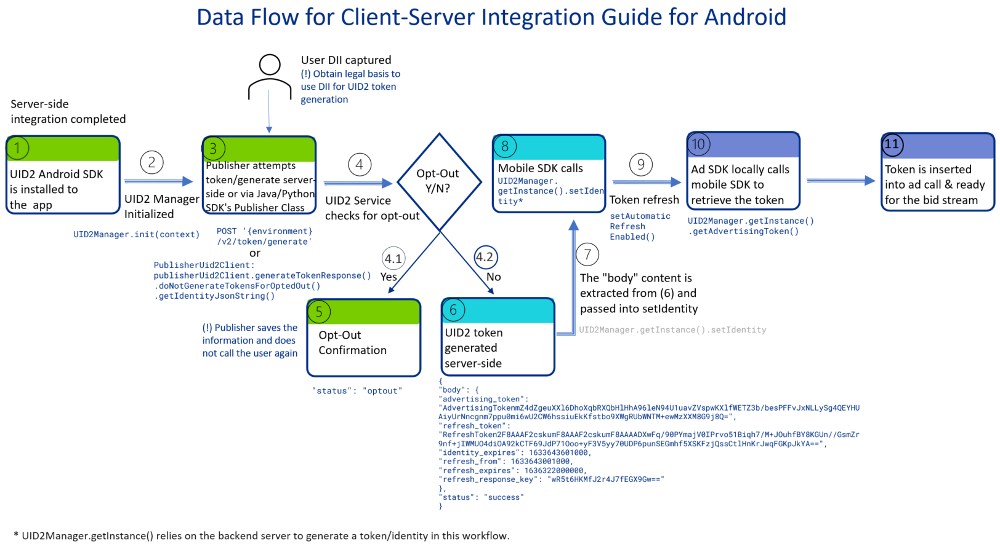

import Tabs from '@theme/Tabs';
import TabItem from '@theme/TabItem';
import Link from '@docusaurus/Link';
import ExampleAdvertisingToken from '/docs/snippets/_example-advertising-token.mdx';
import EnableLogging from '/docs/snippets/_mobile-docs-enable-logging.mdx';
import GMAIMA_Plugins from '/docs/snippets/_mobile_docs_gmaima-plugin-gss.mdx';
import PrebidMobileSDK from '/docs/snippets/_mobile_docs_prebid-mobile.mdx';
import ErrorResponseStates from '/docs/snippets/_mobile-docs-error-response-states.mdx';

# UID2 Client-Server Integration Guide for Mobile

This guide is for mobile app publishers who want to integrate with UID2 by generating UID2 tokens server-side via a <Link href="../ref-info/glossary-uid#gl-public-operator">Public Operator</Link> or <Link href="../ref-info/glossary-uid#gl-private-operator">Private Operator</Link> and then passing the tokens and user identities into their mobile apps, which will in turn pass the tokens for <Link href="../ref-info/glossary-uid#gl-bidstream">bidstream</Link> use.  

This is called client-server integration because some integration steps are client-side and some are server-side.

If you want to integrate with UID2 via client-side only changes (that is, all integration changes required are within the mobile apps), refer to the [UID2 Client-Side Integration Guide for Mobile](integration-mobile-client-side.md) instead.

This page provides a high-level overview of integration steps and links to additional documentation.

UID2 provides mobile SDKs for [Android](../sdks/sdk-ref-android.md) and [iOS](../sdks/sdk-ref-ios.md). Each SDK has the following features:

- Takes in a UID2 <Link href="../ref-info/glossary-uid#gl-identity">identity</Link> (a UID2 token and associated values) and persists it in local file storage.
- Automatically refreshes UID2 tokens.

:::note
This guide uses the group term **UID2 mobile SDKs** to include both the SDK for Android and the SDK for iOS.
:::

For FAQs relating to mobile publisher integrations, see [FAQs for Mobile Integrations](integration-mobile-overview.md#faqs-for-mobile-integrations).

You'll need to complete the following steps:

1. [Complete the UID2 account setup](#complete-the-uid2-account-setup).
2. [Implement server-side token generation](#implement-server-side-token-generation).
3. [Add the UID2 mobile SDK to your mobile app](#add-the-uid2-mobile-sdk-to-your-mobile-app).
4. [Configure the UID2 mobile SDK](#configure-the-uid2-mobile-sdk).
5. [Check that the token was successfully generated and then pass it for bidstream use](#pass-generated-token-for-bidstream-use).
6. [Optionally, integrate the UID2 GMA/IMA Plugin for GAM Secure Signals integration](#optional-uid2-gmaima-plugin-for-gam-secure-signals-integration).

## Mobile SDK Version

This guide provides instructions for using either of these UID2 mobile SDKs:

- SDK for Android (version 1.6.0 or later)
- SDK for iOS (version 1.7.0 or later)

For instructions for installing the correct SDK/version into your mobile app, see [Add the UID2 Mobile SDK to Your Mobile App](#add-the-uid2-mobile-sdk-to-your-mobile-app).

## Complete the UID2 Account Setup

To set up your account, follow the steps described in [Account Setup](../getting-started/gs-account-setup.md).

When account setup is complete, you'll receive your unique API key and client secret. These values are unique to you, and it's important to keep them secure. For details, see [API Key and Client Secret](../getting-started/gs-credentials.md#api-key-and-client-secret).

## Client-Server Mobile Integration Data Flow Overview

The following diagram shows the data flow that the publisher must implement for UID2 client-server mobile integration.

This example uses the [SDK for Android](../sdks/sdk-ref-android.md) in the client-side mobile app and the [SDK for Java](../sdks/sdk-ref-java.md) on the server side.



<!-- (**GWH_ https://ttdcorp-my.sharepoint.com/:p:/r/personal/rita_aleksanyan_thetradedesk_com/_layouts/15/Doc.aspx?sourcedoc=%7BDF894943-3D6A-4A60-A1E2-176ACD0BBBCC%7D&file=Sample%20Data%20Flow.pptx&wdLOR=c8FEF9DB2-E2FD-4F07-B411-B094C4813ACE&fromShare=true&action=edit&mobileredirect=true**) -->

## Implement Server-Side Token Generation

For a client-server UID2 integration for mobile, the first step is to be able to generate the UID2 token on your server. Then, you can pass the token into your mobile apps for sending to the RTB bidstream.

For details, including instructions and examples, see [Server-Side Token Generation](../ref-info/ref-server-side-token-generation.md).

You will need to pass the `Identity` response into the mobile app: see [Configure the UID2 Mobile SDK](#configure-the-uid2-mobile-sdk).

:::warning
For security reasons, the API key and secret used in token generation must be called server-side. Do not store these values inside a mobile app.
:::

## Server-Side Token Refresh

<a href="../ref-info/glossary-uid#gl-token-refresh">Token refresh</a> is automatically enabled inside the UID2 mobile SDKs; you don't need to manage it explicitly on the server side.

You might decide to do server-side token refresh if you want to keep your changes in the mobile apps as simple as possible.

If you want to manage token refresh on the server side and not the client/mobile side, you can do so using one of the following:

- Call the [POST&nbsp;/token/refresh](../endpoints/post-token-refresh.md) endpoint.
- Use one of the Publisher Client classes, in one of the UID2 server-side SDKs. These classes simplify the request into a single method call. 

  For instructions, see [SDK for Java, Usage for Publishers, Basic Usage Server-Side Integration section](../sdks/sdk-ref-java.md#basic-usage-server-side-integration) or [SDK for Python, Usage for Publishers, Server-Side Integration section](../sdks/sdk-ref-python.md#server-side-integration).

Then, pass the newly refreshed `Identity` value to the mobile app by following the rest of this guide.

## Add the UID2 Mobile SDK to Your Mobile App

For installation instructions, refer to one of the following:

- [SDK for Android Reference Guide](../sdks/sdk-ref-android.md)
- [SDK for iOS Reference Guide](../sdks/sdk-ref-ios.md)

At this point, you are ready to use the UID2 Identity generated server-side in the mobile SDK.

### Using the UID2 Integration Environment

By default, the SDK is configured to work with the UID2 production environment: `https://prod.uidapi.com`. If you want to use the UID2 integration environment instead, provide the following URL in your call to UID2Manager initialization:

<Tabs groupId="language-selection">
<TabItem value='android' label='Android'>

```js
UID2Manager.init(
  context = this,
  UID2Manager.Environment.Custom("https://operator-integ.uidapi.com")
)
```

</TabItem>
<TabItem value='ios' label='iOS'>

```js
// Must be set before UID2Manager.shared is accessed
UID2Settings.shared.uid2Environment = .custom(
  url: URL(string: "https://operator-integ.uidapi.com")!
)
```

</TabItem>
</Tabs>

:::note
Bear in mind the following differences between environments:
- Tokens from the UID2 integration environment are not valid for passing to the bidstream.
- You'll have a different set of API key and client secret values for each environment (integration and production). Be sure to use the correct values for each environment.
:::

### Optional: Specifying the API Base URL to Reduce Latency

By default, this SDK makes calls to a UID2 production environment server in the USA.

For information about how to choose the best URL for your use case, and a full list of valid base URLs, see [Environments](../getting-started/gs-environments.md).

To specify a UID2 server that is not the default, you can change it in the `init` call:

<Tabs groupId="language-selection">
<TabItem value='android' label='Android'>

```js
UID2Manager.init(
  context = this,
  UID2Manager.Environment.Signapore
)
// or 
UID2Manager.init(
  context = this,
  UID2Manager.Environment.Custom("https://global.prod.uidapi.com")
)
```

</TabItem>
<TabItem value='ios' label='iOS'>

```js
UID2Settings.shared.uid2Environment = .singapore
// or
UID2Settings.shared.uid2Environment = .custom(
  url: URL(string: "https://global.prod.uidapi.com")!
)
```

</TabItem>
</Tabs>

## Configure the UID2 Mobile SDK

After you've instantiated `UID2Manager` correctly in your mobile app, you'll need to pass a UID2 <Link href="../ref-info/glossary-uid#gl-identity">identity</Link> generated server-side (see [Implement server-side token generation](#implement-server-side-token-generation)), and then pass it into the mobile app using the `setIdentity` method, as shown in the following:

<Tabs groupId="language-selection">
<TabItem value='android' label='Android'>

```js
UID2Manager.getInstance().setIdentity()
```

</TabItem>
<TabItem value='ios' label='iOS'>

```js
UID2Manager.shared.setIdentity()
```

</TabItem>
</Tabs>

## Token Storage

After you call the `setIdentity` method, the UID2 identity is persisted in local file storage.

:::warning
The format of the file stored in the local file storage, or the filename itself, could change without notice. We recommend that you do not read or update the file directly.
:::

## Pass Generated Token for Bidstream Use

To retrieve the token, in your mobile app, call the following:

<Tabs groupId="language-selection">
<TabItem value='android' label='Android'>

```js
UID2Manager.getInstance().getAdvertisingToken()
```

</TabItem>
<TabItem value='ios' label='iOS'>

```js
UID2Manager.shared.getAdvertisingToken()
```

</TabItem>
</Tabs>

If a successful identity was added into the UID2Manager, this method returns a string such as the following:

<ExampleAdvertisingToken />

You can use this identity to pass downstream for sending in the RTB bidstream.

If the `getAdvertisingToken()` method call returns `null`, there was no identity or valid token generated. Some possible reasons for this, and some things you could do to troubleshoot, are as follows:

- The identity is invalid. In this scenario there are a couple of options:
  - Check to see whether there are any errors from the previous `setIdentity()` call.
  - Check the status of the identity, using one of the following:
    - **Android Java**: `UID2Manager.getInstance().getCurrentIdentityStatus()` 
    - **Android Kotlin**: `UID2Manager.getInstance().currentIdentityStatus()` 
    - **iOS**: `UID2Manager.shared.identityStatus`
- You could enable logging to get more information: see [Enable Logging](#enable-logging).
- The advertising token inside the UID2 identity has expired, and the refresh token has also expired, so the SDK cannot refresh the token.

If there is no identity, follow the instructions in [Implement Server-Side Token Generation](#implement-server-side-token-generation) again, generate a new identity, and pass the result into your mobile app's UID2Manager again.

## When to Pass a new UID2 Identity/Token into the SDK

The best way to determine whether a new UID2 identity is required by the UID2 SDK again is to call the `getAdvertisingToken()` method in all cases:

<Tabs groupId="language-selection">
<TabItem value='android' label='Android'>

```js
UID2Manager.getInstance().getAdvertisingToken()
```

</TabItem>
<TabItem value='ios' label='iOS'>

```js
UID2Manager.shared.getAdvertisingToken()
```

</TabItem>
</Tabs>

On startup/resumption of the app, if `getAdvertisingToken()` returns `null`, it is time to generate new identity on the server by following the instructions in [Implement Server-Side Token Generation](#implement-server-side-token-generation). Then, pass the result into the mobile app’s UID2Manager again: see [Configure the UID2 Mobile SDK](#configure-the-uid2-mobile-sdk).

## Enable Logging

<EnableLogging />

## Enable Automatic Token Refresh in Mobile App/Client Side

By default, after a valid UID2 identity has been passed into the UID2Manager, it performs automatic token refresh. If for any reason token refresh was disabled, you can enable it with the following method call:

<Tabs groupId="language-selection">
<TabItem value='android' label='Android'>

**Android Java**:

```java
UID2Manager.getInstance().setAutomaticRefreshEnabled(false)
```

**Android Kotlin**:

```kotlin
UID2Manager.getInstance().automaticRefreshEnabled = false
```

</TabItem>
<TabItem value='ios' label='iOS'>

```js
UID2Manager.shared.automaticRefreshEnabled = false
```

</TabItem>
</Tabs>

## Optional: UID2 GMA/IMA Plugin for GAM Secure Signals integration

<GMAIMA_Plugins />

## Optional: UID2 Integration with Prebid Mobile SDK

:::important
The UID2 integration with Prebid Mobile SDK requires version 1.6.0 of the UID2 SDK for Android, or version 1.7.0 of the UID2 SDK for iOS.
:::

<PrebidMobileSDK />

## Error Response States

<ErrorResponseStates />
