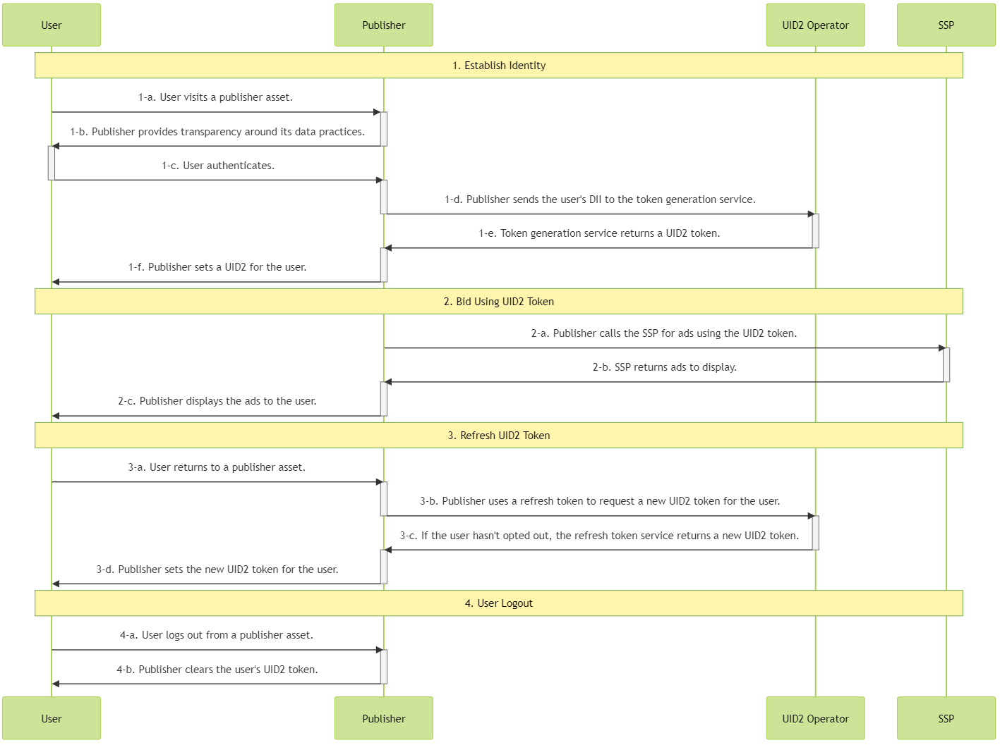

import Link from '@docusaurus/Link';
import IntegratingWithSSO from '../snippets/_integrating-with-sso.mdx';

# Publisher Integration Guide, Server-Side

This guide is for publishers who want to integrate with UID2 to generate <Link href="../ref-info/glossary-uid#gl-uid2-token">UID2 tokens</Link> (advertising tokens) for the RTB <Link href="../ref-info/glossary-uid#gl-bidstream">bidstream</Link>, with all integration activity on the server side.

The following options are available for publishers to integrate with UID2 on the server side:

- SDK for Java (see [Usage for Publishers](../sdks/sdk-ref-java.md#usage-for-publishers) section).
- SDK for Python (see [Usage for Publishers](../sdks/sdk-ref-python.md#usage-for-publishers) section).
- Custom server code to generate and refresh the UID2 token by calling the [POST&nbsp;/token/generate](../endpoints/post-token-generate.md) and [POST&nbsp;/token/refresh](../endpoints/post-token-refresh.md) endpoints.

There is also a sample implementation that demonstrates the workflow. See [Sample Implementation](#sample-implementation).

For a complete summary of publisher integration options, see [Publisher Integrations](summary-guides.md#publisher-integrations).

:::tip
To facilitate the process of establishing client identity using UID2 and retrieving UID2 tokens, consider using the SDK for JavaScript. For details, see [Client-Server Integration Guide for JavaScript](integration-javascript-client-server.md).
:::

## Introduction

The guide outlines the [basic steps](#integration-steps) that you need to consider if you're building an integration without using a client-side or server-side SDK. For example, you need to decide how to do the following:

- Implement opportunities to capture email or phone number: for example, promotional exchanges, sign-ups and subscriptions, or marketing form fills.
- Manage UID2 identity information and use it for targeted advertising
- Refresh UID2 tokens
- Deal with missing identities
- Manage user opt-outs

See also [FAQs](#faqs).

## Integrating with Single Sign-On (SSO)

<IntegratingWithSSO />

## Complete UID2 Account Setup and Configure Account

To integrate with UID2, you'll need to have a UID2 account. If you haven't yet created an account, first follow the steps described on the [Account Setup](../getting-started/gs-account-setup.md) page.

When initial account setup is complete, you'll receive instructions and a link to access the [UID2 Portal](../portal/portal-overview.md), where you can create your [credentials](../getting-started/gs-credentials.md) for the production environment and configure additional values, if needed. For details, see [Getting Started with the UID2 Portal](../portal/portal-getting-started.md).

For a server-side integration you'll need to set up these values, in the UID2 Portal on the [API Keys](../portal/api-keys.md) page:

- <Link href="../ref-info/glossary-uid#gl-api-key">API key</Link>, also called a client key
- <Link href="../ref-info/glossary-uid#gl-client-secret">Client secret</Link>, a value known only to the participant and the UID2 service

:::important
It's very important that you keep these values secure. For details, see [Security of API Key and Client Secret](../getting-started/gs-credentials.md#security-of-api-key-and-client-secret).
:::

## Integration Steps

The following diagram outlines the steps required for a user to establish a UID2 token with a publisher and how the UID2 token integrates with the RTB bidstream.

If you're using a server-side SDK, the SDK takes care of all the steps that mention endpoints: for example, step 1-d, the publisher sends the user's DII to the token generation service.

<!-- diagram source: resource/integration-publisher-server-side-mermaid.md.bak -->

The following sections provide additional details for each step in the diagram:
 
 1. [Establish identity: capture user data](#establish-identity-capture-user-data)
 2. [Bid using a UID2 token](#bid-using-a-uid2-token)
 3. [Refresh a UID2 token](#refresh-a-uid2-token)
 4. [Clear Identity: user logout](#clear-identity-user-logout)

### Establish Identity: Capture User Data

After authentication in step 1-c, which allows the publisher to validate the user's email address or phone number, the publisher can send a request to generate a UID2 token, on the server side. The following table details the token generation steps.

:::tip
Rather than calling this endpoint directly, you could use one of the SDKs to manage it for you. For a summary of options, see [SDKs: Summary](../sdks/summary-sdks.md).
:::

| Step | Endpoint | Description |
| :--- | :--- | :--- |
| 1-d | [POST&nbsp;/token/generate](../endpoints/post-token-generate.md) | Establish identity with UID2 by using the [POST&nbsp;/token/generate](../endpoints/post-token-generate.md) endpoint to generate a UID2 token using the normalized email address or phone number of the user. |
| 1-e | [POST&nbsp;/token/generate](../endpoints/post-token-generate.md) | Return a UID2 token generated from the user's hashed or unhashed email address or phone number, plus associated values such as the refresh token. |
| 1-f | N/A | Place the returned `advertising_token` and `refresh_token` in a store tied to a user. You might consider client-side storage, such as a first-party cookie, or server-side storage. |

### Bid Using a UID2 Token

Consider how you want to manage UID2 identity information and use it for targeted advertising; for example, to pass the returned UID2 token to SSPs.

| Step | Endpoint | Description |
| :--- | :--- | :--- |
| 2-a | N/A| Send the `advertising_token` from step [1-e](#establish-identity-capture-user-data) to the SSP for bidding. Send the value as is. |

:::note
For an example of what a UID2 token might look like in the bidstream, when it's sent from an SSP to a DSP, see [What does a UID2 token look like in the bidstream?](../getting-started/gs-faqs.md#what-does-a-uid2-token-look-like-in-the-bidstream).
:::

### Refresh a UID2 Token

Use the `POST /token/refresh` endpoint to make sure you always have a valid and up-to-date UID2 token. The UID2 token must be refreshed to sync with the UID2 rotation. In addition, the token refresh process checks the user's opt-out status, and if the user has opted out, no new token is sent. This ends the token refresh chain, and you must not use that UID2 token again.

For details about the UID2 opt-out workflow and how users can opt out, see [User Opt-Out](../getting-started/gs-opt-out.md).

| Step | Endpoint | Description |
| :--- | :--- | :--- |
| 3-a |N/A | When a user returns to an asset and becomes active again, refresh the UID2 token before sending it to the SSP. | 
| 3-b | [POST&nbsp;/token/refresh](../endpoints/post-token-refresh.md)  | Send the `refresh_token` obtained in step [1-e](#establish-identity-capture-user-data) as a query parameter. |
| 3-c | [POST&nbsp;/token/refresh](../endpoints/post-token-refresh.md) | The UID2 service issues a new identity token for users that haven't opted out. |
| 3-d | N/A| Place the values returned by the `POST /token/refresh` endpoint, `advertising_token` and `refresh_token`, so that they are linked to the user. You might consider client-side storage, such as a first-party cookie, or server-side storage. |

:::tip
Refresh tokens starting from the `refresh_from` timestamp, which is part of the identity returned by the [POST&nbsp;/token/generate](../endpoints/post-token-generate.md) or [POST&nbsp;/token/refresh](../endpoints/post-token-refresh.md) endpoints.
:::

### Clear Identity: User Logout

If the user logs out, do not use the UID2 token.

| Step | Endpoint | Description |
| :--- | :--- | :--- |
| 4-a | N/A | The user logs out from a publisher asset. |
| 4-b | N/A | Remove the UID2 token you've stored for that user. No interaction with the UID2 service is required. |

## Sample Implementation

A sample implementation is available for server-side integration. See:

- [Server-Only UID2 Integration Example](https://example-srvonly-integ.uidapi.com/login)
- [Server-Only UID2 Integration Example (readme)](https://github.com/IABTechLab/uid2-examples/blob/main/publisher/server_only/README.md)

## FAQs

For a list of frequently asked questions for the publisher audience, see [FAQs for Publishers](../getting-started/gs-faqs.md#faqs-for-publishers).
