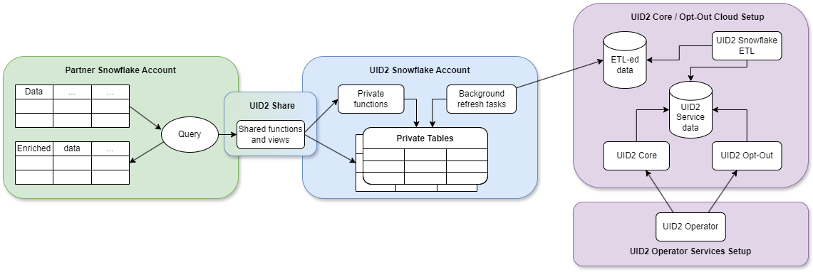

import Link from '@docusaurus/Link';

# Snowflake Integration Guide (Version Prior to February 2025)

[Snowflake](https://www.snowflake.com/) is a cloud data warehousing solution, where you as a partner can store your data and integrate with the UID2 framework. Using Snowflake, UID2 enables you to securely share consumer identifier data without exposing sensitive <Link href="../ref-info/glossary-uid#gl-dii">directly identifying information (DII)</Link>. Even though you have the option to query the Operator Web Services directly for the consumer identifier data, the Snowflake UID2 integration offers a more seamless experience.

:::important
This document is for anyone using the separate advertiser and data provider Snowflake marketplace listings published prior to February 2025. For documentation on the newer, combined listing published in February 2025, see [Snowflake Integration Guide](integration-snowflake.md). If you're using the earlier implementation, we recommend that you migrate to the newer version to take advantage of the updates and enhancements. For migration information, see [Migration Guide](integration-snowflake.md#migration-guide).
:::

The Snowflake marketplace listings for this implementation were separate for advertisers and for data providers. Those listings were removed following the publication of the updated version in February 2025.

If you have a working implementation, you can use this documentation to maintain it; however, we recommend upgrading to the latest version. See [Snowflake Integration Guide](integration-snowflake.md).

:::tip
For a summary of all integration options and steps for advertisers and data providers, see [Advertiser/Data Provider Integration Overview](integration-advertiser-dataprovider-overview.md).
:::

## Functionality

The following table summarizes the functionality available with the UID2 Snowflake integration.

| Encrypt Raw UID2 to UID2 Token for Sharing | Decrypt UID2 Token to Raw UID2 | Generate UID2 Token from DII | Refresh UID2 Token | Map DII to Raw UID2s |
| :--- | :--- | :--- | :--- | :--- |
| &#9989; | &#9989; | &#8212;* | &#8212; | &#9989; |

*You cannot use Snowflake to generate a UID2 token directly from DII. However, you can convert DII to a raw UID2, and then encrypt the raw UID2 into a UID2 token.

:::note
If you are a publisher who is sharing UID2 tokens in the <Link href="../ref-info/glossary-uid#gl-bidstream">bidstream</Link>, see [Tokenized Sharing in the Bidstream](../sharing/sharing-tokenized-from-data-bid-stream.md).
:::

## Workflow Diagram

The following diagram and table illustrate the different parts of the UID2 integration process in Snowflake, and the workflow.



|Partner Snowflake Account|UID2 Snowflake Account|UID2 Core Opt-Out Cloud Setup|
| :--- | :--- | :--- |
|As a partner, you set up a Snowflake account to host your data and engage in UID2 integration by consuming functions and views through the UID2 Share. | UID2 integration, hosted in a Snowflake account, grants you access to authorized functions and views that draw data from private tables. You can’t access the private tables. The UID2 Share reveals only essential data needed for you to perform UID2-related tasks.<br/>**NOTE**: We store <Link href="../ref-info/glossary-uid#gl-salt">salts</Link> and encryption keys in the private tables. No <Link href="../ref-info/glossary-uid#gl-dii">DII</Link> is stored at any point. |ETL (Extract Transform Load) jobs constantly update the UID2 Core/Optout Snowflake storage with internal data that powers the UID2 Operator Web Services. The data used by the Operator Web Services is also available through the UID2 Share. |
|When you use shared functions and views, you pay Snowflake for transactional computation costs.  |These private tables, secured in the UID2 Snowflake account, automatically synchronize with the UID2 Core/Optout Snowflake storage that holds internal data used to complete UID2-related tasks.  | |

## Access the UID2 Shares

Access to the UID2 Share is available through the [Snowflake Data Marketplace](https://www.snowflake.com/data-marketplace/), where you can request specific data sets based on the UID2 personalized listing you select.

There are two personalized listings offered in the Snowflake Data Marketplace for UID2:
- [Unified ID 2.0 Advertiser Identity Solution](https://app.snowflake.com/marketplace/listing/GZT0ZRYXTMV) for advertisers/brands
- [Unified ID 2.0 Data Provider Identity Solution](https://app.snowflake.com/marketplace/listing/GZT0ZRYXTN0) for data providers

:::important
To be able to request data, you must use the `ACCOUNTADMIN` role or another role with the `CREATE DATABASE` and `IMPORT SHARE` privileges in your Snowflake account.
:::

To request access to a UID2 Share, complete the following steps:

1.	Log in to the Snowflake Data Marketplace and select the UID2 solution that you are interested in:
      - [Unified ID 2.0 Advertiser Identity Solution](https://app.snowflake.com/marketplace/listing/GZT0ZRYXTMV)
      - [Unified ID 2.0 Data Provider Identity Solution](https://app.snowflake.com/marketplace/listing/GZT0ZRYXTN0)
2.	In the **Personalized Data** section, click **Request Data**.
3.	Follow the onscreen instructions to verify and provide your contact details and other required information.
4.	If you are an existing client of The Trade Desk and are interested in the *Advertiser* Identity Solution, include your partner and advertiser IDs issued by The Trade Desk in the **Message** field of the data request form.
5.	Submit the form.

After your request is received, a UID2 administrator will contact you with the appropriate access instructions. For details about managing data requests in Snowflake, see the [Snowflake documentation](https://docs.snowflake.com/en/user-guide/data-marketplace-consumer.html).


## Shared Objects

Regardless of the UID2 solution you choose, you can map DII to UID2s by using the following function:

- `FN_T_UID2_IDENTITY_MAP` (See [Map DII](#map-dii))

The following functions are deprecated in favor of `FN_T_UID2_IDENTITY_MAP`. You can still use them, but `FN_T_UID2_IDENTITY_MAP` is better. If you are already using these functions, we recommend upgrading as soon as possible.

- `FN_T_UID2_IDENTITY_MAP_EMAIL` (deprecated)
- `FN_T_UID2_IDENTITY_MAP_EMAIL_HASH` (deprecated)

:::note
If you are using the deprecated functions, and need help migrating to the newer function, see [Migration Guide](#migration-guide).
:::

To identify the UID2s that you must regenerate, use the `UID2_SALT_BUCKETS` view from the UID2 Share. For details, see [Monitor for Salt Bucket Rotation and Regenerate Raw UID2s](#monitor-for-salt-bucket-rotation-and-regenerate-raw-uid2s).

The following functions are also available, for UID2 sharing participants:
- `FN_T_UID2_ENCRYPT` (See [Encrypt Tokens](#encrypt-tokens))
- `FN_T_UID2_DECRYPT` (See [Decrypt Tokens](#decrypt-tokens))

For details, see [Usage for UID2 Sharers](#usage-for-uid2-sharers).

### Database and Schema Names

The following sections include query examples for each solution, which are identical except for the database and schema name variables:

```
{DATABASE_NAME}.{SCHEMA_NAME}
```
For example:
```
select UID2, BUCKET_ID, UNMAPPED from table({DATABASE_NAME}.{SCHEMA_NAME}.FN_T_UID2_IDENTITY_MAP('validate@example.com', 'email'));
```

All query examples use the following default values for each name variable:

| Variable |Advertiser Solution Default Value | Data Provider Solution Default Value| Comments |
| :--- | :--- | :--- | :--- |
| `{DATABASE_NAME}` | `UID2_PROD_ADV_SH` | `UID2_PROD_DP_SH` | If needed, you can change the default database name when creating a new database after you are granted access to the selected UID2 Share. |
| `{SCHEMA_NAME}`| `ADV` | `DP` | This is an immutable name. |

### Map DII

To map all types of <Link href="../ref-info/glossary-uid#gl-dii">DII</Link>, use the `FN_T_UID2_IDENTITY_MAP` function.

If the DII is an email address, the service normalizes the data using the UID2 [Email Address Normalization](../getting-started/gs-normalization-encoding.md#email-address-normalization) rules.

If the DII is a phone number, you must normalize it before sending it to the service, using the UID2 [Phone Number Normalization](../getting-started/gs-normalization-encoding.md#phone-number-normalization) rules.

|Argument|Data Type|Description|
| :--- | :--- | :--- |
| `INPUT` | varchar(256) | The DII to map to the UID2 and salt bucket ID. |
| `INPUT_TYPE` | varchar(256) | The type of DII to map. Allowed values: `email`, `email_hash`, `phone`, and `phone_hash`.

A successful query returns the following information for the specified DII.

|Column Name|Data Type|Description|
| :--- | :--- | :--- |
| `UID2` | TEXT | The value is one of the following:<ul><li>DII was successfully mapped: The UID2 associated with the DII.</li><li>DII was not successfully mapped: `NULL`.</li></ul> |
| `BUCKET_ID` | TEXT | The value is one of the following:<ul><li>DII was successfully mapped: The ID of the salt bucket used to generate the UID2. This ID maps to the bucket ID in the `UID2_SALT_BUCKETS` view.</li><li>DII was not successfully mapped: `NULL`.</li></ul> |
| `UNMAPPED` | TEXT | The value is one of the following:<ul><li>DII was successfully mapped: `NULL`.</li><li>DII was not successfully mapped:  The reason why the identifier was not mapped: `OPTOUT`, `INVALID IDENTIFIER`, or `INVALID INPUT TYPE`.<br/>For details, see [Values for the UNMAPPED Column](#values-for-the-unmapped-column).</li></ul> |

#### Values for the UNMAPPED Column

The following table shows possible values for the `UNMAPPED` column.

| Value | Meaning |
| :-- | :-- |
| `NULL` | The DII was successfully mapped. |
| `OPTOUT` | The user has opted out. |
| `INVALID IDENTIFIER` | The email address or phone number is invalid. |
| `INVALID INPUT TYPE` | The value of `INPUT_TYPE` is invalid. Valid values for INPUT_TYPE are: `email`, `email_hash`, `phone`, `phone_hash`. |

#### Examples

Mapping request examples in this section:

- [Single Unhashed Email](#mapping-request-example---single-unhashed-email)
- [Multiple Unhashed Emails](#mapping-request-example---multiple-unhashed-emails)
- [Single Unhashed Phone Number](#mapping-request-example---single-unhashed-phone-number)
- [Multiple Unhashed Phone Numbers](#mapping-request-example---multiple-unhashed-phone-numbers)
- [Single Hashed Email](#mapping-request-example---single-hashed-email)
- [Multiple Hashed Emails](#mapping-request-example---multiple-hashed-emails)
- [Single Hashed Phone Number](#mapping-request-example---single-hashed-phone-number)
- [Multiple Hashed Phone Numbers](#mapping-request-example---multiple-hashed-phone-numbers)

:::note
The input and output data in these examples is fictitious, for illustrative purposes only. The values provided are not real values.
:::

#### Mapping Request Example - Single Unhashed Email

The following queries illustrate how to map a single email address, using the [default database and schema names](#database-and-schema-names).

Advertiser solution query for a single email:

```
select UID2, BUCKET_ID, UNMAPPED from table(UID2_PROD_ADV_SH.ADV.FN_T_UID2_IDENTITY_MAP('validate@example.com', 'email'));
```

Data provider solution query for a single email:

```
select UID2, BUCKET_ID, UNMAPPED from table(UID2_PROD_DP_SH.DP.FN_T_UID2_IDENTITY_MAP('validate@example.com', 'email'));
```

Query results for a single email:

```
+----------------------------------------------+------------+----------+
| UID2                                         | BUCKET_ID  | UNMAPPED |
+----------------------------------------------+------------+----------+
| 2ODl112/VS3x2vL+kG1439nPb7XNngLvOWiZGaMhdcU= | ad1ANEmVZ  | NULL     |
+----------------------------------------------+------------+----------+
```

#### Mapping Request Example - Multiple Unhashed Emails

The following queries illustrate how to map multiple email addresses, using the [default database and schema names](#database-and-schema-names).

Advertiser solution query for multiple emails:

```
select a.ID, a.EMAIL, m.UID2, m.BUCKET_ID, m.UNMAPPED from AUDIENCE a LEFT JOIN(
    select ID, t.* from AUDIENCE, lateral UID2_PROD_ADV_SH.ADV.FN_T_UID2_IDENTITY_MAP(EMAIL, 'email') t) m
    on a.ID=m.ID;
```

Data provider solution query for multiple emails:

```
select a.ID, a.EMAIL, m.UID2, m.BUCKET_ID, UNMAPPED from AUDIENCE a LEFT JOIN(
    select ID, t.* from AUDIENCE, lateral UID2_PROD_DP_SH.DP.FN_T_UID2_IDENTITY_MAP(EMAIL, 'email') t) m
    on a.ID=m.ID;
```

Query results for multiple emails:

The following table identifies each item in the response, including `NULL` values for `NULL` or improperly formatted emails.

```sh
+----+----------------------+----------------------------------------------+------------+--------------------+
| ID | EMAIL                | UID2                                         | BUCKET_ID  | UNMAPPED           |
+----+----------------------+----------------------------------------------+------------+--------------------+
|  1 | validate@example.com | 2ODl112/VS3x2vL+kG1439nPb7XNngLvOWiZGaMhdcU= | ad1ANEmVZ  | NULL               |
|  2 | test@uidapi.com      | IbW4n6LIvtDj/8fCESlU0QG9K/fH63UdcTkJpAG8fIQ= | a30od4mNRd | NULL               |
|  3 | invalid-email        | NULL                                         | NULL       | INVALID IDENTIFIER |
|  4 | NULL                 | NULL                                         | NULL       | INVALID IDENTIFIER |
+----+----------------------+----------------------------------------------+------------+--------------------+
```

#### Mapping Request Example - Single Unhashed Phone Number

The following queries illustrate how to map a phone number, using the [default database and schema names](#database-and-schema-names).

You must normalize phone numbers using the UID2 [Phone Number Normalization](../getting-started/gs-normalization-encoding.md#phone-number-normalization) rules.

Advertiser solution query for a single phone number:

```
select UID2, BUCKET_ID, UNMAPPED from table(UID2_PROD_ADV_SH.ADV.FN_T_UID2_IDENTITY_MAP('+12345678901', 'phone'));
```

Data Provider solution query for a single phone number:

```
select UID2, BUCKET_ID, UNMAPPED from table(UID2_PROD_DP_SH.DP.FN_T_UID2_IDENTITY_MAP('+12345678901', 'phone'));
```

Query results for a single phone number:

```
+----------------------------------------------+------------+----------+
| UID2                                         | BUCKET_ID  | UNMAPPED |
+----------------------------------------------+------------+----------+
| 2ODl112/VS3x2vL+kG1439nPb7XNngLvOWiZGaMhdcU= | ad1ANEmVZ  | NULL     |
+----------------------------------------------+------------+----------+
```

#### Mapping Request Example - Multiple Unhashed Phone Numbers

The following queries illustrate how to map multiple phone numbers, using the [default database and schema names](#database-and-schema-names).

You must normalize phone numbers using the UID2 [Phone Number Normalization](../getting-started/gs-normalization-encoding.md#phone-number-normalization) rules.

Advertiser solution query for multiple phone numbers:

```
select a.ID, a.PHONE, m.UID2, m.BUCKET_ID, m.UNMAPPED from AUDIENCE a LEFT JOIN(
    select ID, t.* from AUDIENCE, lateral UID2_PROD_ADV_SH.ADV.FN_T_UID2_IDENTITY_MAP(PHONE, 'phone') t) m
    on a.ID=m.ID;
```

Data Provider solution query for multiple phone numbers:

```
select a.ID, a.PHONE, m.UID2, m.BUCKET_ID, UNMAPPED from AUDIENCE a LEFT JOIN(
    select ID, t.* from AUDIENCE, lateral UID2_PROD_DP_SH.DP.FN_T_UID2_IDENTITY_MAP(PHONE, 'phone') t) m
    on a.ID=m.ID;
```

Query results for multiple phone numbers:

The following table identifies each item in the response, including `NULL` values for `NULL` or invalid phone numbers.

```
+----+--------------+----------------------------------------------+------------+--------------------+
| ID | PHONE        | UID2                                         | BUCKET_ID  | UNMAPPED           |
+----+--------------+----------------------------------------------+------------+--------------------+
|  1 | +12345678901 | 2ODl112/VS3x2vL+kG1439nPb7XNngLvOWiZGaMhdcU= | ad1ANEmVZ  | NULL               |
|  2 | +61491570006 | IbW4n6LIvtDj/8fCESlU0QG9K/fH63UdcTkJpAG8fIQ= | a30od4mNRd | NULL               |
|  3 | 1234         | NULL                                         | NULL       | INVALID IDENTIFIER |
|  4 | NULL         | NULL                                         | NULL       | INVALID IDENTIFIER |
+----+--------------+----------------------------------------------+------------+--------------------+
```

#### Mapping Request Example - Single Hashed Email

The following queries illustrate how to map a single email address hash, using the [default database and schema names](#database-and-schema-names).

Advertiser solution query for a single hashed email:

```
select UID2, BUCKET_ID, UNMAPPED from table(UID2_PROD_ADV_SH.ADV.FN_T_UID2_IDENTITY_MAP(BASE64_ENCODE(SHA2_BINARY('validate@example.com', 256)), 'email_hash'));
```

Data provider solution query for a single hashed email:

```
select UID2, BUCKET_ID, UNMAPPED from table(UID2_PROD_DP_SH.DP.FN_T_UID2_IDENTITY_MAP(BASE64_ENCODE(SHA2_BINARY('validate@example.com', 256)), 'email_hash'));
```

Query results for a single hashed email:

```
+----------------------------------------------+------------+----------+
| UID2                                         | BUCKET_ID  | UNMAPPED |
+----------------------------------------------+------------+----------+
| 2ODl112/VS3x2vL+kG1439nPb7XNngLvOWiZGaMhdcU= | ad1ANEmVZ  | NULL     |
+----------------------------------------------+------------+----------+
```

#### Mapping Request Example - Multiple Hashed Emails

The following queries illustrate how to map multiple email address hashes, using the [default database and schema names](#database-and-schema-names).

Advertiser solution query for multiple hashed emails:

```
select a.ID, a.EMAIL_HASH, m.UID2, m.BUCKET_ID, m.UNMAPPED from AUDIENCE a LEFT JOIN(
    select ID, t.* from AUDIENCE, lateral UID2_PROD_ADV_SH.ADV.FN_T_UID2_IDENTITY_MAP(EMAIL_HASH, 'email_hash') t) m
    on a.ID=m.ID;
```

Data provider solution query for multiple hashed emails:

```
select a.ID, a.EMAIL_HASH, m.UID2, m.BUCKET_ID, m.UNMAPPED from AUDIENCE a LEFT JOIN(
    select ID, t.* from AUDIENCE, lateral UID2_PROD_DP_SH.DP.FN_T_UID2_IDENTITY_MAP(EMAIL_HASH, 'email_hash') t) m
    on a.ID=m.ID;
```

Query results for multiple hashed emails:

The following table identifies each item in the response, including `NULL` values for `NULL` hashes.

```
+----+----------------------------------------------+----------------------------------------------+------------+--------------------+
| ID | EMAIL_HASH                                   | UID2                                         | BUCKET_ID  | UNMAPPED           |
+----+----------------------------------------------+----------------------------------------------+------------+--------------------+
|  1 | LdhtUlMQ58ZZy5YUqGPRQw5xUMS5dXG5ocJHYJHbAKI= | 2ODl112/VS3x2vL+kG1439nPb7XNngLvOWiZGaMhdcU= | ad1ANEmVZ  | NULL               |
|  2 | NULL                                         | NULL                                         | NULL       | INVALID IDENTIFIER |
|  3 | /XJSTajB68SCUyuc3ePyxSLNhxrMKvJcjndq8TuwW5g= | IbW4n6LIvtDj/8fCESlU0QG9K/fH63UdcTkJpAG8fIQ= | a30od4mNRd | NULL               |
+----+----------------------------------------------+----------------------------------------------+------------+--------------------+
```

#### Mapping Request Example - Single Hashed Phone Number

The following queries illustrate how to map a single phone number hash, using the [default database and schema names](#database-and-schema-names).

Advertiser solution query for a single hashed phone number:

```
select UID2, BUCKET_ID, UNMAPPED from table(UID2_PROD_ADV_SH.ADV.FN_T_UID2_IDENTITY_MAP(BASE64_ENCODE(SHA2_BINARY('+12345678901', 256)), 'phone_hash'));
```

Data provider solution query for a single hashed phone number:

```
select UID2, BUCKET_ID, UNMAPPED from table(UID2_PROD_DP_SH.DP.FN_T_UID2_IDENTITY_MAP(BASE64_ENCODE(SHA2_BINARY('+12345678901', 256)), 'phone_hash'));
```

Query results for a single hashed phone number:

```
+----------------------------------------------+------------+----------+
| UID2                                         | BUCKET_ID  | UNMAPPED |
+----------------------------------------------+------------+----------+
| 2ODl112/VS3x2vL+kG1439nPb7XNngLvOWiZGaMhdcU= | ad1ANEmVZ  | NULL     |
+----------------------------------------------+------------+----------+
```

#### Mapping Request Example - Multiple Hashed Phone Numbers

The following queries illustrate how to map multiple phone number hashes, using the [default database and schema names](#database-and-schema-names).

Advertiser solution query for multiple hashed phone numbers:

```
select a.ID, a.PHONE_HASH, m.UID2, m.BUCKET_ID, m.UNMAPPED from AUDIENCE a LEFT JOIN(
    select ID, t.* from AUDIENCE, lateral UID2_PROD_ADV_SH.ADV.FN_T_UID2_IDENTITY_MAP(PHONE_HASH, 'phone_hash') t) m
    on a.ID=m.ID;
```

Data provider solution query for multiple hashed phone numbers:

```
select a.ID, a.PHONE_HASH, m.UID2, m.BUCKET_ID, m.UNMAPPED from AUDIENCE a LEFT JOIN(
    select ID, t.* from AUDIENCE, lateral UID2_PROD_DP_SH.DP.FN_T_UID2_IDENTITY_MAP(PHONE_HASH, 'phone_hash') t) m
    on a.ID=m.ID;
```

Query results for multiple hashed phone numbers:

The following table identifies each item in the response, including `NULL` values for `NULL` hashes.

```
+----+----------------------------------------------+----------------------------------------------+------------+--------------------+
| ID | PHONE_HASH                                   | UID2                                         | BUCKET_ID  | UNMAPPED           |
+----+----------------------------------------------+----------------------------------------------+------------+--------------------+
|  1 | LdhtUlMQ58ZZy5YUqGPRQw5xUMS5dXG5ocJHYJHbAKI= | 2ODl112/VS3x2vL+kG1439nPb7XNngLvOWiZGaMhdcU= | ad1ANEmVZ  | NULL               |
|  2 | NULL                                         | NULL                                         | NULL       | INVALID IDENTIFIER |
|  3 | /XJSTajB68SCUyuc3ePyxSLNhxrMKvJcjndq8TuwW5g= | IbW4n6LIvtDj/8fCESlU0QG9K/fH63UdcTkJpAG8fIQ= | a30od4mNRd | NULL               |
+----+----------------------------------------------+----------------------------------------------+------------+--------------------+
```

### Monitor for Salt Bucket Rotation and Regenerate Raw UID2s

The `UID2_SALT_BUCKETS` view query returns the date and time when the salt buckets were last updated. Salt is used when generating UID2s. When the salt in the bucket is updated, the previously generated UID2 becomes outdated and doesn’t match the UID2 generated by other parties for the same user.

To determine which UID2s need regeneration, compare the timestamps of when they were generated to the most recent timestamp of the salt bucket update.

|Column Name|Data Type|Description|
| :--- | :--- | :--- |
| `BUCKET_ID` | TEXT | The ID of the salt bucket. This ID parallels the `BUCKET_ID` returned by the identity map function. Use the `BUCKET_ID` as the key to do a join query between the function call results and results from this view call.  |
| `LAST_SALT_UPDATE_UTC` | TIMESTAMP_NTZ | The last time the salt in the bucket was updated. This value is expressed in UTC. |

The following example shows an input table and the query used to find the UID2s in the table that must be regenerated because the salt was updated.

#### Targeted Input Table

In this example scenario, the advertiser/data provider has stored the UID2s in a table named `AUDIENCE_WITH_UID2`. The last column, `LAST_UID2_UPDATE_UTC`, is used to record the time at which a UID2 was generated. If no UID2 has been generated, the value is `NULL`, as shown in the third example. The advertiser/data provider can use this timestamp value to determine which UID2s need to be regenerated.

```
select * from AUDIENCE_WITH_UID2;
```
```
+----+----------------------+----------------------------------------------+------------+-------------------------+
| ID | EMAIL                | UID2                                         | BUCKET_ID  | LAST_UID2_UPDATE_UTC    |
+----+----------------------+----------------------------------------------+------------+-------------------------+
|  1 | validate@example.com | 2ODl112/VS3x2vL+kG1439nPb7XNngLvOWiZGaMhdcU= | ad1ANEmVZ  | 2021-03-01 00:00:00.000 |
|  2 | test1@uidapi.com     | Q4A5ZBuBCYfuV3Wd8Fdsx2+i33v7jyFcQbcMG/LH4eM= | ad1ANEmVZ  | 2021-03-03 00:00:00.000 |
|  3 | test2@uidapi.com     | NULL                                         | NULL       | NULL                    |
+----+----------------------+----------------------------------------------+------------+-------------------------+
```

To find missing or outdated UID2s, use the following query examples, which use the [default database and schema names](#database-and-schema-names).

Advertiser solution query:

```
select a.*, b.LAST_SALT_UPDATE_UTC
  from AUDIENCE_WITH_UID2 a LEFT OUTER JOIN UID2_PROD_ADV_SH.ADV.UID2_SALT_BUCKETS b
  on a.BUCKET_ID=b.BUCKET_ID
  where a.LAST_UID2_UPDATE_UTC < b.LAST_SALT_UPDATE_UTC or a.UID2 IS NULL;
```

Data provider solution query:

```
select a.*, b.LAST_SALT_UPDATE_UTC
  from AUDIENCE_WITH_UID2 a LEFT OUTER JOIN UID2_PROD_DP_SH.DP.UID2_SALT_BUCKETS b
  on a.BUCKET_ID=b.BUCKET_ID
  where a.LAST_UID2_UPDATE_UTC < b.LAST_SALT_UPDATE_UTC or a.UID2 IS NULL;
```

Query results:

The following table identifies each item in the response. The result includes an email, `UID2`, `BUCKET_ID`, `LAST_UID2_UPDATE_UTC`, and `LAST_SALT_UPDATE_UTC` as shown in the ID 1 example below. No information is returned for ID 2 because the corresponding UID2 was generated after the last bucket update. For ID 3, `NULL` values are returned due to a missing UID2.

```
+----+----------------------+----------------------------------------------+------------+-------------------------+-------------------------+
| ID | EMAIL                | UID2                                         | BUCKET_ID  | LAST_UID2_UPDATE_UTC    | LAST_SALT_UPDATE_UTC    |
+----+----------------------+----------------------------------------------+------------+-------------------------+-------------------------+
|  1 | validate@example.com | 2ODl112/VS3x2vL+kG1439nPb7XNngLvOWiZGaMhdcU= | ad1ANEmVZ  | 2021-03-01 00:00:00.000 | 2021-03-02 00:00:00.000 |
|  3 | test2@uidapi.com     | NULL                                         | NULL       | NULL                    | NULL                    |
+----+----------------------+----------------------------------------------+------------+-------------------------+-------------------------+
```

## Migration Guide

If you are using the `FN_T_UID2_IDENTITY_MAP_EMAIL` and `FN_T_UID2_IDENTITY_MAP_EMAIL_HASH` functions, it's best to migrate to the `FN_T_UID2_IDENTITY_MAP` function as soon as possible. This function does everything that the other two functions do, and has other built-in improvements.

Advantages of the `FN_T_UID2_IDENTITY_MAP` function:

- It supports mapping both phone numbers and hashed phone numbers.
- It supports user opt-out.
- It adds a new column, `UNMAPPED`. In any scenario where the DII cannot be mapped to a UID2 for any reason, this column includes information about the reason.<br/>For details, see [Values for the UNMAPPED Column](#values-for-the-unmapped-column)

This section includes the following information to help you upgrade to the new function:

- [Changing Existing Code](#changing-existing-code) 
- [Using the Values for the UNMAPPED Column](#using-the-values-for-the-unmapped-column) 

### Changing Existing Code

The code snippets in this section are before/after examples of how the earlier functions might be implemented, and how you could update to use the new function.

#### Example for mapping unhashed emails

Before:

```
FN_T_UID2_IDENTITY_MAP_EMAIL(EMAIL)
```

After:

```
FN_T_UID2_IDENTITY_MAP(EMAIL, 'email')
```

#### Example for mapping unhashed emails

Before:

```
FN_T_UID2_IDENTITY_MAP_EMAIL_HASH(EMAIL_HASH)
```

After:

```
FN_T_UID2_IDENTITY_MAP(EMAIL_HASH, 'email_hash')
```

### Using the Values for the UNMAPPED Column
When you have the new function implemented, you can check the `UNMAPPED` column returned by the `FN_T_UID2_IDENTITY_MAP`. If any DII could not be mapped to a UID2, this column gives the reason.

For details about the values and their explanations, see [Values for the UNMAPPED Column](#values-for-the-unmapped-column).

## Usage for UID2 Sharers

A UID2 <Link href="../ref-info/glossary-uid#gl-sharing-participant">sharing participant</Link> is a company that takes part in sharing, either as a sender or a receiver, to share UID2s with another participant.

Advertisers and data providers can share UID2s with other authorized UID2 sharing participants via Snowflake (<Link href="../ref-info/glossary-uid#gl-tokenized-sharing">tokenized sharing</Link>). They can encrypt [raw UID2s](../ref-info/glossary-uid#gl-raw-uid2) into <Link href="../ref-info/glossary-uid#gl-uid2-token">UID2 tokens</Link> and then send them to another participant for sharing in pixels (see [Tokenized Sharing in Pixels](../sharing/sharing-tokenized-from-data-pixel.md)). If you are not sending data in pixels within Snowflake, you can take part in UID2 sharing as long as you follow the requirements laid out in [Security Requirements for UID2 Sharing](../sharing/sharing-security.md).

:::caution
The UID2 token generated during this process is for sharing only&#8212;you cannot use it in the bidstream. There is a different workflow for generating tokens for the bidstream: see [Tokenized Sharing in the Bidstream](../sharing/sharing-tokenized-from-data-bid-stream.md).
:::

If you are not sending data in pixels or in the bidstream within Snowflake, you can also take part in raw UID2 sharing as long as you follow the requirements laid out in [Security Requirements for UID2 Sharing](../sharing/sharing-security.md).

The following activities support tokenized sharing:

- [Encrypt Tokens](#encrypt-tokens)
- [Decrypt Tokens](#decrypt-tokens)

### Encrypt Tokens

To encrypt raw UID2s to UID2 tokens, use the `FN_T_UID2_ENCRYPT` function. Use the applicable prefix to indicate your role:
- For advertisers: `ADV.FN_T_UID2_ENCRYPT`
- For data providers: `DP.FN_T_UID2_ENCRYPT`

|Argument|Data Type|Description|
| :--- | :--- | :--- |
| `RAW_UID2` | varchar(128) | The raw UID2 to encrypt to a UID2 token. |

A successful query returns the following information for the specified raw UID2.

|Column Name|Data Type|Description|
| :--- | :--- | :--- |
| `UID2_TOKEN` | TEXT | The value is one of the following:<ul><li>Encryption successful: The UID2 token containing the raw UID2.</li><li>Encryption not successful: `NULL`.</li></ul> |
| `ENCRYPTION_STATUS` | TEXT | The value is one of the following:<ul><li>Encryption successful: `NULL`.</li><li>Encryption not successful: The reason why the raw UID2 was not encrypted. For example: `INVALID_RAW_UID2` or `INVALID NOT_AUTHORIZED_FOR_MASTER_KEY`.<br/>For details, see [Values for the ENCRYPTION_STATUS Column](#values-for-the-encryption_status-column).</li></ul> |

#### Values for the ENCRYPTION_STATUS Column

The following table shows possible values for the `ENCRYPTION_STATUS` column.

| Value | Meaning |
| :-- | :-- |
| `NULL` | The raw UID2 was successfully encrypted. |
| `MISSING_OR_INVALID_RAW_UID2` | The raw UID2 is `NULL`. |
| `INVALID_RAW_UID2` | The raw UID2 is invalid. |
| `MISMATCHING_IDENTITY_SCOPE` | The raw UID2 belongs to an incorrect identity scope; for example, EUID is passed in where UID2 is expected. |
| `NOT_AUTHORIZED_FOR_MASTER_KEY` | The caller does not have access to the required <a href="../ref-info/glossary-uid#gl-encryption-key">encryption keys</a>. Contact the UID2 administrator. |
| `NOT_AUTHORIZED_FOR_SITE_KEY` | The caller does not have access to the required encryption keys. Contact the UID2 administrator. |

#### Encrypt Token Request Example - Single Raw UID2

The following queries illustrate how to encrypt a single raw UID2 to a UID2 token, using the [default database and schema names](#database-and-schema-names).

Advertiser solution query for a single raw UID2:

```
select UID2_TOKEN, ENCRYPTION_STATUS from table(UID2_PROD_ADV_SH.ADV.FN_T_UID2_ENCRYPT('2ODl112/VS3x2vL+kG1439nPb7XNngLvOWiZGaMhdcU='));
```

Data provider solution query for a single raw UID2:

```
select UID2_TOKEN, ENCRYPTION_STATUS from table(UID2_PROD_DP_SH.DP.FN_T_UID2_ENCRYPT('2ODl112/VS3x2vL+kG1439nPb7XNngLvOWiZGaMhdcU='));
```

Query results for a single raw UID2:

```
+------------------------+-------------------+
| UID2_TOKEN             | ENCRYPTION_STATUS |
+--------------------------------------------+
| A41234<rest of token>  | NULL              |
+--------------------------------------------+
```

#### Encrypt Token Request Example - Multiple Raw UID2s

The following queries illustrate how to encrypt multiple raw UID2s, using the [default database and schema names](#database-and-schema-names).

Advertiser solution query for multiple raw UID2s:

```
select a.RAW_UID2, t.UID2_TOKEN, t.ENCRYPTION_STATUS from AUDIENCE_WITH_UID2 a, lateral UID2_PROD_ADV_SH.ADV.FN_T_UID2_ENCRYPT(a.RAW_UID2) t;
```

Data provider solution query for multiple raw UID2s:

```
select a.RAW_UID2, t.UID2_TOKEN, t.ENCRYPTION_STATUS from AUDIENCE_WITH_UID2 a, lateral UID2_PROD_DP_SH.DP.FN_T_UID2_ENCRYPT(a.RAW_UID2) t;
```

Query results for multiple raw UID2s:

The following table identifies each item in the response, including `NULL` values for `NULL` raw UID2s.

```
+----+----------------------------------------------+-----------------------+-----------------------------+
| ID | RAW_UID2                                     | UID2_TOKEN            | ENCRYPTION_STATUS           |
+----+----------------------------------------------+-----------------------+-----------------------------+
|  1 | 2ODl112/VS3x2vL+kG1439nPb7XNngLvOWiZGaMhdcU= | A41234<rest of token> | NULL                        |
|  2 | NULL                                         | NULL                  | MISSING_OR_INVALID_RAW_UID2 |
|  3 | BXJSTajB68SCUyuc3ePyxSLNhxrMKvJcjndq8TuwW5g5 | B45678<rest of token> | NULL                        |
+----+----------------------------------------------+-----------------------+-----------------------------+
```

### Decrypt Tokens

To decrypt UID2 tokens to raw UID2s, use the `FN_T_UID2_DECRYPT` function. Use the applicable prefix to indicate your role:
- For advertisers: `ADV.FN_T_UID2_DECRYPT`
- For data providers: `DP.FN_T_UID2_DECRYPT`

|Argument|Data Type|Description|
| :--- | :--- | :--- |
| `UID2_TOKEN` | varchar(512) | The UID2 token to decrypt to a raw UID2. |

A successful query returns the following information for the specified UID2 token.

|Column Name|Data Type|Description|
| :--- | :--- | :--- |
| `UID2` | TEXT | The value is one of the following:<ul><li>Decryption successful: The raw UID2 corresponding to the UID2 token.</li><li>Decryption not successful: `NULL`.</li></ul> |
| `SITE_ID` | INT | The value is one of the following:<ul><li>Decryption successful: The identifier of the UID2 participant that encrypted the token.</li><li>Decryption not successful: `NULL`.</li></ul> |
| `DECRYPTION_STATUS` | TEXT | The value is one of the following:<ul><li>Decryption successful: `NULL`.</li><li>Decryption not successful:  The reason why the UID2 token was not decrypted; for example, `EXPIRED_TOKEN`.<br/>For details, see [Values for the DECRYPTION_STATUS Column](#values-for-the-decryption_status-column).</li></ul> |

:::note
In most circumstances where UID2 token cannot be successfully decrypted, the function will not return any rows at all.
:::

#### Values for the DECRYPTION_STATUS Column

Possible values for `DECRYPTION_STATUS` are:

| Value | Meaning |
| :-- | :-- |
| `NULL` | The UID2 token was successfully decrypted. |
| `EXPIRED_TOKEN` | The UID2 token is beyond its designated lifetime&#8212;the token has expired. |

#### Decrypt Token Request Example&#8212;Single UID2 Token

The following queries illustrate how to decrypt a single UID2 token to a raw UID2, using the [default database and schema names](#database-and-schema-names).

Advertiser solution query for a single UID2 token:

```
select UID2, SITE_ID, DECRYPTION_STATUS from table(UID2_PROD_ADV_SH.ADV.FN_T_UID2_DECRYPT('A41234<rest of token>'));
```

Data provider solution query for a single raw UID2:

```
select UID2, SITE_ID, DECRYPTION_STATUS from table(UID2_PROD_DP_SH.DP.FN_T_UID2_DECRYPT('A41234<rest of token>'));
```

Query results for a single UID2 token:

```
+----------------------------------------------+-------------------+
| UID2                                         | DECRYPTION_STATUS |
+----------------------------------------------+-------------------+
| 2ODl112/VS3x2vL+kG1439nPb7XNngLvOWiZGaMhdcU= | NULL              |
+----------------------------------------------+-------------------+
```

#### Decrypt Token Request Example&#8212;Multiple UID2 Tokens

The following queries illustrate how to decrypt multiple UID2 tokens, using the [default database and schema names](#database-and-schema-names).

Advertiser solution query for multiple raw UID2s:

```
select a.ID, b.UID2, b.SITE_ID, CASE WHEN b.UID2 IS NULL THEN 'DECRYPT_FAILED' ELSE b.DECRYPTION_STATUS END as DECRYPTION_STATUS
  from TEST_IMPRESSION_DATA a LEFT OUTER JOIN (
    select ID, t.* from TEST_IMPRESSION_DATA, lateral UID2_PROD_ADV_SH.ADV.FN_T_UID2_DECRYPT(UID2_TOKEN) t) b
  on a.ID=b.ID;
```

Data provider solution query for multiple raw UID2s:

```
select a.ID, b.UID2, b.SITE_ID, CASE WHEN b.UID2 IS NULL THEN 'DECRYPT_FAILED' ELSE b.DECRYPTION_STATUS END as DECRYPTION_STATUS
  from TEST_IMPRESSION_DATA a LEFT OUTER JOIN (
    select ID, t.* from TEST_IMPRESSION_DATA, lateral UID2_PROD_DP_SH.DP.FN_T_UID2_DECRYPT(UID2_TOKEN) t) b
  on a.ID=b.ID;
```

Query results for multiple UID2 tokens:

The following table identifies each item in the response, including `NULL` values for `NULL` and expired UID2 tokens.

```
+----+----------------------------------------------+----------+-------------------+
| ID | UID2                                         | SITE_ID  | DECRYPTION_STATUS |
+----+----------------------------------------------+----------+-------------------+
|  1 | 2ODl112/VS3x2vL+kG1439nPb7XNngLvOWiZGaMhdcU= | 12345    | NULL              |
|  2 | NULL                                         | NULL     | DECRYPT_FAILED    |
|  3 | BXJSTajB68SCUyuc3ePyxSLNhxrMKvJcjndq8TuwW5g5 | 23456    | NULL              |
|  4 | NULL                                         | NULL     | EXPIRED_TOKEN     |
|  5 | 2ODl112/VS3x2vL+kG1439nPb7XNngLvOWiZGaMhdcU= | 12345    | NULL              |
+----+----------------------------------------------+----------+-------------------+
```

### UID2 Sharing Example

The following instructions provide an example of how sharing works for a sender and a receiver both using Snowflake. In this example scenario an advertiser (the sender) has an audience table with raw UID2s
(`AUDIENCE_WITH_UID2`) and wants to make data in the table available to a data provider (the receiver) using the [Snowflake Secure Data Sharing](https://docs.snowflake.com/en/user-guide/data-sharing-intro) feature.

#### Sender Instructions

 1. Create a new table named `AUDIENCE_WITH_UID2_TOKENS`.
 2. Encrypt the raw UID2s in the `AUDIENCE_WITH_UID2S` table and store the result in the `AUDIENCE_WITH_UID2_TOKENS` table. For example, the following query could help achieve this task:
    ```
    insert into AUDIENCE_WITH_UID2_TOKENS select a.ID, t.UID2_TOKEN from AUDIENCE_WITH_UID2S a, lateral UID2_PROD_ADV_SH.ADV.FN_T_UID2_ENCRYPT(a.RAW_UID2) t;
    ```
 3. Create a secure share and grant it access to the `AUDIENCE_WITH_UID2_TOKENS` table.
 4. Grant the receiver access to the secure share.

:::warning
To help prevent UID2 tokens from expiring during sharing, send the newly encrypted UID2 tokens to the receiver as soon as possible.
:::

#### Receiver Instructions

 1. Create a database from the secure share that the sender provided access to.
 2. Create a new table named `RECEIVED_AUDIENCE_WITH_UID2`.
 3. Decrypt tokens from the shared `AUDIENCE_WITH_UID2_TOKENS` table and store the result in the `RECEIVED_AUDIENCE_WITH_UID2` table. For example, the following query could be used to achieve this:
    ```
    insert into RECEIVED_AUDIENCE_WITH_UID2
      select a.ID, b.UID2, CASE WHEN b.UID2 IS NULL THEN 'DECRYPT_FAILED' ELSE b.DECRYPTION_STATUS END as DECRYPTION_STATUS
        from AUDIENCE_WITH_UID2_TOKENS a LEFT OUTER JOIN (
          select ID, t.* from AUDIENCE_WITH_UID2_TOKENS, lateral UID2_PROD_DP_SH.DP.FN_T_UID2_DECRYPT(UID2_TOKEN) t) b
        on a.ID=b.ID;
    ```

:::warning
To help prevent UID2 tokens from expiring, decrypt the UID2 tokens as soon as they become available from the sender.
:::
