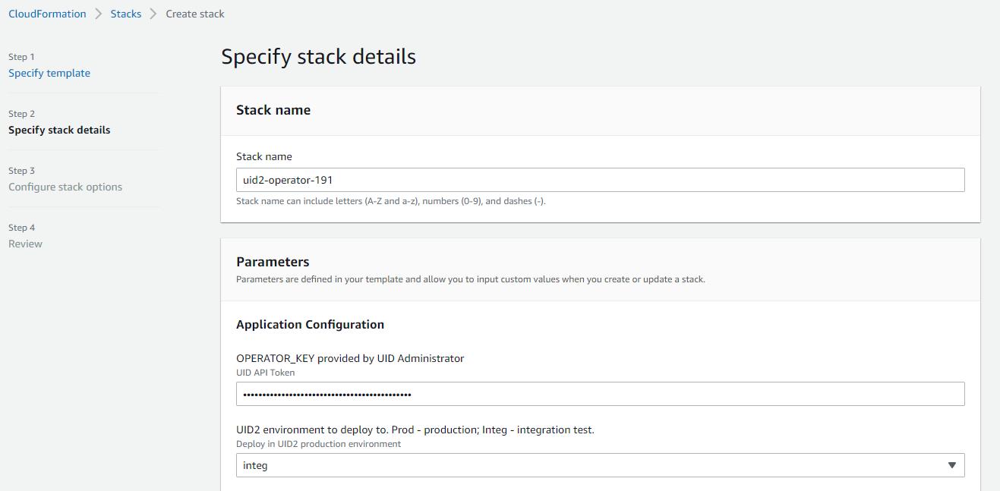
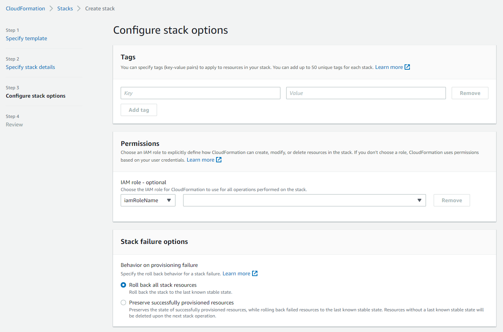

import Link from '@docusaurus/Link';
import ReleaseMatrix from '/docs/snippets/_private-operator-release-matrix.mdx';
import AttestFailure from '/docs/snippets/_private-operator-attest-failure.mdx';

# UID2 Private Operator for AWS Integration Guide

The UID2 Operator is the API server in the UID2 ecosystem. For details, see [The UID2 Operator](../ref-info/ref-operators-public-private.md).

For a <Link href="../ref-info/glossary-uid#gl-private-operator">Private Operator</Link> service running in AWS Marketplace, the UID2 Operator solution is enhanced with [AWS Nitro](https://aws.amazon.com/ec2/nitro/) Enclave technology. This is an additional security measure to help protect UID2 information from unauthorized access.

## UID2 Private Operator for AWS

:::note
[UID2 Private Operator for AWS](https://aws.amazon.com/marketplace/pp/prodview-wdbccsarov5la) is a free product. The cost displayed on the product page is an estimated cost for the necessary infrastructure.
:::

By subscribing to UID2 Private Operator for AWS, you gain access to the following:

- [Amazon Machine Image (AMI)](https://docs.aws.amazon.com/AWSEC2/latest/UserGuide/AMIs.html) with the UID2 Operator service installed and ready to bootstrap:<br/>
    The AMI contains an [Amazon Linux 2023](https://aws.amazon.com/linux/amazon-linux-2023/) operating system with the UID2 Operator service already set up. When an EC2 instance based on the AMI boots up, it automatically fetches the configuration from your AWS account and starts the UID2 Operator server inside an enclave.
- [CloudFormation](https://aws.amazon.com/cloudformation/) template:<br/>
    The template deploys the UID2 Operator AMI.

### Prerequisites

To subscribe and deploy one or more UID2 Operators on AWS, complete the following steps:

1. Register your organization as a UID2 Operator.
2. Create an AWS account with an [IAM](https://aws.amazon.com/iam/) role that has the [minimal privileges](#minimal-iam-role-privileges).

#### Minimal IAM Role Privileges

To succeed in a one-click deployment, your AWS account **must** have the privileges to run the following actions:

```json
{
    "Version": "2012-10-17",
    "Statement": [
        {
            "Sid": "VisualEditor0",
            "Effect": "Allow",
            "Action": [
                "ec2:*",
                "kms:*",
                "autoscaling:*",
                "cloudformation:*",
                "iam:ListRoleTags",
                "secretsmanager:*",
                "iam:PutRolePolicy",
                "iam:AddRoleToInstanceProfile",
                "iam:ListRolePolicies",
                "iam:ListPolicies",
                "iam:GetRole",
                "iam:GetPolicy",
                "iam:DeleteRole",
                "iam:UpdateRoleDescription",
                "iam:TagPolicy",
                "iam:GetRolePolicy",
                "iam:CreateInstanceProfile",
                "iam:UntagRole",
                "iam:TagRole",
                "iam:ListInstanceProfilesForRole",
                "iam:PassRole",
                "iam:DeleteRolePolicy",
                "iam:ListPolicyTags",
                "iam:DeleteInstanceProfile",
                "iam:ListRoles",
                "iam:CreatePolicy",
                "iam:UntagPolicy",
                "iam:UpdateRole",
                "iam:UntagInstanceProfile",
                "iam:TagInstanceProfile",
                "iam:SetDefaultPolicyVersion",
                "iam:UpdateAssumeRolePolicy",
                "iam:GetPolicyVersion",
                "iam:RemoveRoleFromInstanceProfile",
                "iam:CreateRole",
                "iam:AttachRolePolicy",
                "iam:DetachRolePolicy",
                "iam:ListAttachedRolePolicies",
                "iam:DeletePolicy",
                "iam:ListInstanceProfileTags",
                "iam:CreatePolicyVersion",
                "iam:GetInstanceProfile",
                "iam:ListInstanceProfiles",
                "iam:ListPolicyVersions",
                "iam:DeletePolicyVersion",
                "iam:ListUserTags"
            ],
            "Resource": "*"
        }
    ]
}
```

### Resources Created

The following table lists all resources that are created during the [deployment](#deployment).

| Name | Type | Description |
|:------|:------|:-------------|
| `KMSKey` | `AWS::KMS::Key` | The key for secret encryption (for configuration strings). |
| `SSMKeyAlias` | `AWS::KMS::Alias` | An alias that provides an easy way to access the [KMS](https://aws.amazon.com/kms/) key. |
| `TokenSecret` | `AWS::SecretsManager::Secret` | An encrypted configuration that includes the operator key. |
| `WorkerRole` | `AWS::IAM::Role` | The IAM role that your UID2 Operators run as. Roles provide access to configuration keys. |
| `WorkerInstanceProfile` | `AWS::IAM::InstanceProfile` | The instance profile with Worker Role to attach to Operator EC2 instances. |
| `SecurityGroup` | `AWS::EC2::SecurityGroup` | A security group policy that provides rules for operator instances. See also [Security Group Policy](#security-group-policy).|
| `LaunchTemplate` | `AWS::EC2::LaunchTemplate` | A launch template with all configurations in place. You can spawn new UID2 Operator instances from it. |
| `AutoScalingGroup` | `AWS::AutoScaling::AutoScalingGroup` | An auto-scaling group (ASG) to which the launch template is attached. You can use this to update the desired number of instances later, if needed. |

### Customization Options

Here's what you can customize during or after the [deployment](#deployment):

- VPC: You must specify the existing VPC and related VPC Subnet IDs.
- Root volume size (8G Minimum)
- SSH key: This is the SSH key that you use to access the UID2 Operator EC2 instances.
- [Instance type](https://aws.amazon.com/ec2/instance-types/m5/): m5.2xlarge, m5.4xlarge, and so on. If there is no customization, the default value, m5.2xlarge, is recommended.

### Security Group Policy

:::note
To avoid passing certificates associated with your domain into the enclave, inbound HTTP is allowed instead of HTTPS. This also avoids the cost of a secure layer, if used in a private network that is internal to your organization.
:::

| Port Number | Direction | Protocol | Description |
| ----------- | --------- | -------- | ------ |
| 80 | Inbound | HTTP | Serves all UID2 APIs, including the healthcheck endpoint `/ops/healthcheck`.<br/>When everything is up and running, the endpoint returns HTTP 200 with a response body of `OK`. For details, see [Checking UID2 Operator Status](#checking-uid2-operator-status). |
| 9080 | Inbound | HTTP | Serves Prometheus metrics (`/metrics`). |
| 443 | Outbound | HTTPS | Calls the UID2 Core Service; updates opt-out data and key store. |

### VPC Chart

The following diagram illustrates the virtual private cloud that hosts private operators.


## Deployment

To deploy UID2 Operator on AWS Marketplace, complete the following steps:

1. Subscribe to [Unified ID 2.0 Operator on AWS Marketplace](https://aws.amazon.com/marketplace/pp/prodview-wdbccsarov5la). It might take several minutes before AWS completes your subscription.
2. Click **Configuration** and then specify configuration values.

   For software version, see [Operator Version](#operator-version) and choose the value in the AWS Version column.
3. On the Configuration page, click **Launch** and then select the **Launch CloudFormation** action.
4. In the Create Stack wizard, specify the template and then click **Next**. The S3 path for the template file is automatically filled in.
5. Fill in the [stack details](#stack-details) and then click **Next**.
6. Configure the [stack options](#stack-configuration-options) and then click **Next**.
7. Review the information you have entered, and make changes if needed.
8. If you are prompted for permission to create IAM roles, select the **I acknowledge that AWS CloudFormation might create IAM resources** checkbox.
9. Click **Create stack**.

It takes several minutes for the stack to be created. When you see an Auto Scaling Group (ASG) created, you can select it and check the EC2 instances. By default, there is only one instance to start with.

### Operator Version

The latest ZIP file is linked in the Release Notes column in the following table.

<ReleaseMatrix />

### Stack Details

The following images show the **Specify stack details** page in the Create stack wizard ([deployment](#deployment) step 5). The table that follows provides a parameter value reference.

 

Lower part of the page:


The following table explains the parameter values that you need to provide in step 5 during the [deployment](#deployment).

| Parameter | Description |
| :--- |:--- |
|Stack name |Any name of your choice. |
|OPERATOR_KEY |The Operator Key that you received from the UID2 Admin team. |
|UID2 Environment |Select `prod` for production environment or `integ` for the integration test environment. |
|Instance Type |`m5.2xlarge` is recommended. |
|Instance root volume size |15 GB or more is recommended. |
|Key Name for SSH |Your EC2 key pair for SSH access to the deployed EC2 instances. |
|Trusted Network CIDR |The CIDR (Classless Inter-Domain Routing) value determines the IP address range that can access your operator service.<br/>To limit access to the UID2 Operators so that they can only be accessed through an internal network or a load balancer, specify an internal IP range as the CIDR value. |
|VPC |The existing VPC ID. |
|VpcSubnet1 |The existing VPC AZ1 Subnet ID. |
|VpcSubnet2 |The existing VPC AZ2 Subnet ID. |

### Stack Configuration Options

The following image shows the **Configure stack options** page in the Create stack wizard ([deployment](#deployment) step 6).



The following table explains the parameter values that you need to provide in step 6 during the [deployment](#deployment).

| Parameter | Description |
| :--- |:--- |
|Tags | (Optional) Tag your stack. |
|Permissions |If you have separate IAM roles subscribing to AWS marketplace and deploying the stack, enter the name/ARN of the role you will use to deploy the stack. |
|Stack failure options |Choose what happens when deployment fails. The `Roll back all stack resources` option is recommended. |
|Advanced options | These are optional. |

## Creating a Load Balancer

To create a load balancer and a target operator auto-scaling group, complete the following steps:

1. In the AWS Console, navigate to the EC2 dashboard and search for `Load Balancer`.
2. Click **Create Load Balancer**.
3. On the Load balancer types page, in the **Application Load Balancer** section, click **Create**.
4. Enter the UID2 **Load balancer name**. Depending on whether or not you need to access UID2 APIs from public internet, choose the **Internet-facing** or **Internal** scheme.
5. Select the **VPC** for your targets and at least two subnets used in your CloudFormation stack.
6. Under **Security groups**, click **Create new security group** and do the following:
    1. Enter `UID2SGALB` as its **Security group name**, as well as a relevant **Description**.
    2. Under **Inbound rules**, click **Add rule**, then select the **HTTPS** Type and an appropriate **Source** according to your requirements.
    3. Click **Create security group**.
8. Go back to the Load Balancer page and select the newly created `UID2SGALB` security group.
9. Under **Listeners and routing**, click the **Create target group** link and do the following:
    1. On the **Specify group details page**, select **Instances** as the target type, then enter `UID2ALBTG` as the **Target group name**.
    2. Ensure **HTTP1** is selected as the **Protocol version**.
    3. Under **Health checks**, provide `/ops/healthcheck` as the **Health check path**, and then click **Next**.
    4. Select UID2 Operator EC2 Instances created by your auto-scaling group and then click **Include as pending below**. 
    5. Make sure that all the ports for the targets contains `80`.
    6. Click **Create target group**.
10. Go back to the Load Balancer page, and under **Listeners and routing**, select `UID2ALBTG` as the target group to forward to as a default action. Note that you may have to refresh the target groups for your newly created target group to appear. Change the listener **Port** value to `443`.
11. Set up an HTTPS listener by following the instructions in the [AWS user guide](https://docs.aws.amazon.com/elasticloadbalancing/latest/application/create-https-listener.html).
12. Click **Create load balancer**.
13. To verify the status of this load balancer, please continue in the below section: [Checking UID2 Operator Status](#checking-uid2-operator-status)

## Checking UID2 Operator Status

To check the UID2 Operator status of your Load Balancer, complete the following steps:

1. Identify the DNS name of your load balancer by going to **EC2 > Load balancers** and looking at the **DNS name** column of your load balancer.
2. In your browser, go to `https://{dns-name-of-your-load-balancer}/ops/healthcheck`. A response of `OK` indicates good operator status.

### Private Operator Attestation Failure

<AttestFailure />

## Upgrading the UID2 Operator

For each operator version update, each private operator receives an email notification with an upgrade window. After the upgrade window, the old version is deactivated and is no longer supported.

Here's what you need to know about upgrading:

- Information on the availability of new versions is provided on the [Unified ID 2.0 Operator on AWS Marketplace](https://aws.amazon.com/marketplace/pp/prodview-wdbccsarov5la) page.
- To upgrade your UID2 Operators, create a new CloudFormation stack. For details, see [Deployment](#deployment).

:::tip
For a smooth transition, create the new stack first. After the new stack is bootstrapped and ready to serve, delete the old stack. If you are using a load balancer, first get the new instances up and running and then convert the DNS name from the previous one to the new one.
:::

## Managing the Logs
Use the following sections to help you make the best use of your logs:

- [Where to Read Logs](#where-to-read-logs)
- [Default Log Settings](#default-log-settings)
- [Changing the Log Rotation Schedule](#changing-the-log-rotation-schedule)
- [Additional Commands for Logging](#additional-commands-for-logging)

### Where to Read Logs
To access the logs, ssh into the EC2 instance. The logs are located at `/var/logs/` and are in the format `operator.log-<timestamp rotated>`.

### Default Log Settings
The UID2 system uses `syslog-ng` for log generation and employs `logrotate` with cron jobs to manage log rotation and prevent excessive log size. The following sections provide information on the default settings and the reasons behind them, and give guidance for customizing the log rotation configuration to meet your specific requirements:

- [Log Rotation Configuration](#log-rotation-configuration)
- [Log Rotation Default Settings](#log-rotation-default-settings)
- [cronjob Configuration](#cronjob-configuration)

#### Log Rotation Configuration
When the operator instance has been deployed, the default log rotation settings are applied, as follows:
- Logs are rotated daily and 30 log entries are kept, so the log history is equivalent to 30 days of data if the log entries are not abnormally large.
- If log entries are very large, and the log size reaches 30 MB within a 24-hour period, the log is rotated at that point.

#### Log Rotation Default Settings

The following are the default logrotate settings, defined in `/etc/logrotate.d/operator-logrotate.conf`:

```
/var/log/operator.log*
{
        rotate 30
        daily
        maxsize 30M
        dateext dateformat -%Y-%m-%d-%s
        notifempty
        sharedscripts
        postrotate
                /usr/sbin/syslog-ng-ctl reload
        endscript
}
```

For a detailed explanation of this config, see [logrotate(8) - Linux man page](https://linux.die.net/man/8/logrotate), or run `logrotate man` in the Linux environment.

#### cronjob Configuration
The logrotate generates the following script in `/etc/cron.daily` by default:

```
#!/bin/sh
   
/usr/sbin/logrotate -s /var/lib/logrotate/logrotate.status /etc/logrotate.conf
EXITVALUE=$?
if [ $EXITVALUE != 0 ]; then
    /usr/bin/logger -t logrotate "ALERT exited abnormally with [$EXITVALUE]"
fi
exit 0
```

The following script in `/etc/cron.d` ensures that the logrotate check is run every minute:

```
# Run the minutely jobs
SHELL=/bin/bash
PATH=/sbin:/bin:/usr/sbin:/usr/bin
MAILTO=root
* * * * * root /usr/sbin/logrotate -s /var/lib/logrotate/logrotate.status /etc/logrotate.conf
```

These are the default settings for the following reasons:
- The script ensure that the `maxsize` condition is checked frequently.
- The command refers to `/var/lib/logrotate/logrotate.status` to check the log status and see if it has reached the rotation condition, so that it won't make extra rotations when `logrotate` is run every minute.

### Changing the Log Rotation Schedule

To change the log rotation schedule, update the `etc/logrotate.d/operator-logrotate.conf` file.

Follow the instructions in the logrotate documentation: see [logrotate(8) - Linux man](https://linux.die.net/man/8/logrotate) page.

:::note
The service does NOT need to be restarted to pick up the change.
:::

### Additional Commands for Logging

The following table includes some additional commands that might help you manage logs.

| Action | Command |
| :--- | :--- |
| Provides a detailed explanation of what will be rotated. | `sudo logrotate -f /etc/logrotate.conf --debug` |
| Runs one iteration of `logrotate` manually, without changing the scheduled interval. | `sudo logrotate -f /etc/logrotate.conf --force` |
| Reloads `syslog-ng`. | `sudo /usr/sbin/syslog-ng-ctl reload` |

## Technical Support

If you have trouble subscribing to the product, or deploying, [contact us](mailto:aws-mktpl-uid@thetradedesk.com).
