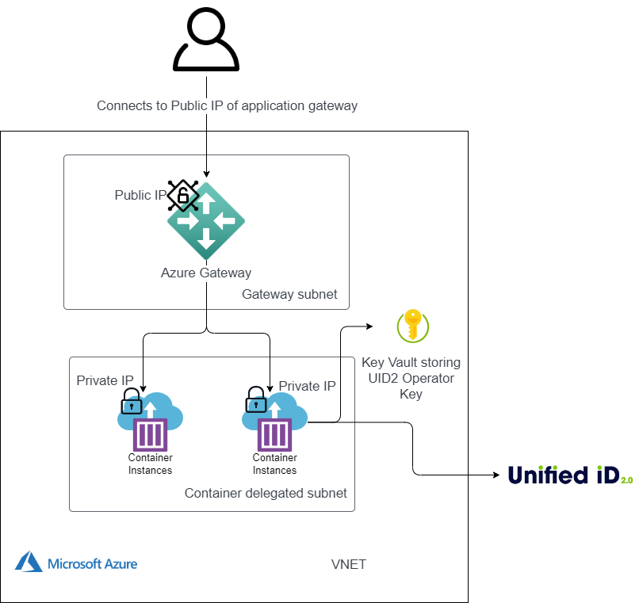

import Link from '@docusaurus/Link';
import UpgradePolicy from '../snippets/_private-operator-upgrade-policy.mdx';

# UID2 Private Operator for Azure Integration Guide

The UID2 Operator is the API server in the UID2 ecosystem. For details, see [The UID2 Operator](../ref-info/ref-operators-public-private.md).

This guide provides information for setting up the UID2 Operator Service as a <Link href="../ref-info/glossary-uid#gl-private-operator">Private Operator</Link> in an instance of [Confidential Containers](https://learn.microsoft.com/en-us/azure/confidential-computing/confidential-containers), a confidential computing option from Microsoft Azure. Confidential Containers instances run in a hardware-backed Trusted Execution Environment (TEE) that provides intrinsic capabilities such as data integrity, data confidentiality, and code integrity.

When the Docker container for the UID2 Operator Confidential Containers instance starts up, it completes the attestation process that allows the UID2 Core Service to verify the authenticity of the Operator Service and the enclave environment that the Operator Service is running in.

When the attestation is successful, the UID2 Core Service provides seed information such as salts and keys to bootstrap the UID2 Operator in the secure UID2 Operator Confidential Containers instance.

:::caution
UID2 Private Operator for Azure is not supported in these areas: Europe, China.
:::

## Operator Version

The latest ZIP file is linked in the Azure Download column in the following table.

| Version Name | Version Number  | Release Notes | Azure Download |  Date | Deprecation Date |
| ------- | ------ | ------ | ------ | ------ | ------ |
| Q2 2025 | v5.55.9 | [v5.55.9](https://github.com/IABTechLab/uid2-operator/releases/tag/v5.55.9-r1) | [azure-cc-deployment-files-5.55.9-r1.zip](https://github.com/IABTechLab/uid2-operator/releases/download/v5.55.9-r1/azure-cc-deployment-files-5.55.9-r1.zip) | July 1, 2025 | July 1, 2026 |

:::note
For information about supported versions and deprecation dates, see [Private Operator Versions](../ref-info/deprecation-schedule.md#private-operator-versions).
:::

## Private Operator Upgrade Policy

<UpgradePolicy />

## Prerequisites

Before deploying the UID2 Private Operator for Azure, complete these prerequisite steps:

- [Set Up UID2 Operator Account](#set-up-uid2-operator-account)
- [Install Azure CLI](#install-azure-cli)
- [Get the Required Azure Permissions](#install-azure-cli)

### Set Up UID2 Operator Account

Ask your UID2 contact to register your organization as a UID2 Operator. If you're not sure who to ask, see [Contact Info](../getting-started/gs-account-setup.md#contact-info).

When the registration process is complete, you'll receive an operator key, exclusive to you, that identifies you with the UID2 service as a Private Operator. During configuration, use this as the value for `OPERATOR_KEY`. This value is both your unique identifier and a password; store it securely and do not share it.

:::note
You'll receive a separate operator key for each deployment environment.
:::

### Install Azure CLI

Install the Azure command-line interface. For details, see [How to install the Azure CLI](https://learn.microsoft.com/en-us/cli/azure/install-azure-cli) in the Azure documentation.

### Get the Required Azure Permissions

You'll need to have subscription owner permission so that you can create a resource group.

When that's done, you only need contributor permission on the resource group level for that resource.

For details, see [Azure roles](https://learn.microsoft.com/en-us/azure/role-based-access-control/rbac-and-directory-admin-roles#azure-roles) in the Azure documentation.

When all prerequisite steps are complete, you're ready to deploy the UID2 Private Operator. See [Deployment](#deployment).

## Deployment Environments

The following environments are available. As a best practice, we recommend that you test and verify your implementation in the integration environment before deploying in the production environment.

:::note
You'll receive separate `{OPERATOR_KEY}` values for each environment. Be sure to use the correct key for the environment you're using. The deployment artifacts and the process flow are the same for both environments.
:::

| Environment | Details |
| :--- | :--- |
| Integration (`integ`) | For testing only. Debug mode is available in the integration environment. |
| Production (`prod`) | For managing production traffic. |

## Deployment

To deploy a new UID2 Private Operator for Azure, you'll need to complete the following high-level steps:

- [Download ZIP File and Extract Files](#download-zip-file-and-extract-files)
- [Create Resource Group](#create-resource-group)
- [Complete Key Vault and Managed Identity Setup](#complete-key-vault-and-managed-identity-setup)
- [Set Up the VPC Network](#set-up-the-vpc-network)
- [Complete the UID2 Private Operator Setup](#complete-the-uid2-private-operator-setup)
- [Set Up the Gateway Load Balancer](#set-up-the-gateway-load-balancer)

### Download ZIP File and Extract Files

The first step is to get set up with the deployment files you'll need:

1. Download the ZIP file linked in the following table, Azure Download column, for the latest version. 

1. Unzip the ZIP file to extract the following files, needed for the deployment:

   - `vault.json` and `vault.parameters.json`
   - `vnet.json` and `vnet.parameters.json`
   - `operator.json` and `operator.parameters.json`
   - `gateway.json` and `gateway.parameters.json`

### Create Resource Group

In Azure, run the following command to create a resource group to run the UID2 operator:

```
az group create --name {RESOURCE_GROUP_NAME} --location {LOCATION}
```

:::info
All the resources are provisioned later under the name you provide as the `{RESOURCE_GROUP_NAME}` value.
:::

There are some limitations with regard to location:
- UID2 Private Operator for Azure is not supported in these areas: Europe, China.

- For Azure virtual network deployment availability, check [Linux container groups](https://learn.microsoft.com/en-us/azure/container-instances/container-instances-resource-and-quota-limits#confidential-container-resources-preview) in the Azure documentation to confirm the availability of Confidential Containers regional support.

- To get the alias for the location, run the following command:

```
az account list-locations -o table
```

### Complete Key Vault and Managed Identity Setup

The next step is to set up a [key vault](https://learn.microsoft.com/en-us/azure/key-vault/general/overview) and save the operator key in it.

When you've created the key vault, you can create a [managed identity](https://learn.microsoft.com/en-us/entra/identity/managed-identities-azure-resources/overview) and grant it permission to access the key vault.

Later [Azure Container Instances](https://azure.microsoft.com/en-us/products/container-instances) (ACIs) will launch as this identity.

Follow these steps:

1. Update the `vault.parameters.json` file with the following required values:

   | Parameter | Description |
   | :--- | :--- |
   | `vaultName` | The name of the key vault for hosting the operator key secret. The name you choose must be globally unique. |
   | `operatorKeyValue` | The `OPERATOR_KEY` secret value, which you received from the UID team as part of account setup (see [Set Up UID2 Operator Account](#set-up-uid2-operator-account)). This value is unique to you, and acts as a password: keep it secure and secret. |

2. (Optional) If you don't want to accept the defaults, update the `vault.parameters.json` file with the following values. These parameters have default values and in most cases you won't need to make any updates.

    Parameter | Description |
   | :--- | :--- |
   | `operatorIdentifier` | The name of the managed identity that will launch the container.<br/>Default: `uid-operator`. |
   | `operatorKeyName` | The operator key secret name.<br/>Default: `operator-key`. |

3. Run the following command to trigger the deployment:

   ```
   az deployment group create --name vault --resource-group {RESOURCE_GROUP_NAME} --parameters vault.parameters.json  --template-file vault.json
   ```

### Set Up the VPC Network

The next step is to set up the VPC network.

The following diagram illustrates the virtual private cloud that hosts a UID2 Private Operator in Microsoft Azure.



Follow these steps:

1. (Optional) If you don't want to accept the defaults, update the `vnet.parameters.json` file with the following values. These parameters have default values and in most cases you won't need to make any updates.

    Parameter | Description |
   | :--- | :--- |
   | `vnetName` | The virtual network name.<br/>Default: `unified-id-network` |
   | `computeSubnetName` | The name of the subnet that runs the UID2 Operator.<br/>Default: `unified-id-subnet-operators` |
   | `gatewaySubnetName` | The name of the subnet that runs the UID2 Gateway.<br/>Default: `unified-id-subnet-gateway` |
   | `VnetAddressPrefix` | The vnet address prefix.<br/>Default: `10.0.0.0/20` |
   | `computeSubnetPrefix` | The vnet address prefix of the subnet that is delegated to run the UID2 Operator.<br/>Default: `10.0.0.0/24` |
   | `gatewaySubnetPrefix` | The vnet address prefix of the subnet that runs the UID2 Gateway.<br/>Default: `10.0.1.0/28` |

2. Run the following command to trigger the deployment:

   ```
   az deployment group create --name vnet --resource-group {RESOURCE_GROUP_NAME} --parameters vnet.parameters.json  --template-file vnet.json
   ```

### Complete the UID2 Private Operator Setup

The next step is to bring up multiple Azure Container Instances (ACIs) in the VPC subnetwork that you created.

Follow these steps:

1. Update the `operator.parameters.json` file with the following required values:

   | Parameter | Description |
   | :--- | :--- |
   | `vaultName` | The name of the key vault for hosting the operator key secret. The value must match the name you created in [Complete Key Vault and Managed Identity Setup](#complete-key-vault-and-managed-identity-setup). |
   | `deploymentEnvironment` | Indicates the environment you're deploying to: `integ` or `prod`. For details, see [Deployment Environments](#deployment-environments). |

2. (Optional) If you don't want to accept the defaults, update the `operator.parameters.json` file with the following values. These parameters have default values and in most cases you won't need to make any updates.

    Parameter | Description |
   | :--- | :--- |
   | `operatorKeyName` | The operator key secret name. The value must match the value specified in [Complete Key Vault and Managed Identity Setup](#complete-key-vault-and-managed-identity-setup). If you accepted the default, the value is `operator-key`. |
   | `operatorIdentifier` | The name of the managed identity that will launch the container. The value must match the value specified in [Complete Key Vault and Managed Identity Setup](#complete-key-vault-and-managed-identity-setup). If you accepted the default, the value is `uid-operator`. |
   | `vnetName` | The virtual network name. The value must match the value specified in [Set Up the VPC Network](#set-up-the-vpc-network). If you accepted the default, the value is `unified-id-network`. |
   | `computeSubnetName` | The name of the subnet that will run the Private Operator. The value must match the value specified in [Set Up the VPC Network](#set-up-the-vpc-network). If you accepted the default, the value is `unified-id-subnet-operators`. |
   | `count` | The count for the number of instances you want to bring up. The default is `2`. |

2. Run the following command to deploy the ACIs:

   ```
   az deployment group create --name operator --resource-group {RESOURCE_GROUP_NAME} --parameters operator.parameters.json  --template-file operator.json
   ```

3. Get the IP addresses of the ACI instances you created by running the following command:

   ```
   az deployment group show -g {RESOURCE_GROUP_NAME} -n operator --query properties.outputs
   ```

   The output should look something like the following:
   
   ```
   { "ipAddress": { "type": "Array", "value": [ "10.0.0.5", "10.0.0.4" ] } }
   ```

### Set Up the Gateway Load Balancer

The next step is to set up the [Gateway Load Balancer](https://learn.microsoft.com/en-us/azure/load-balancer/gateway-overview), which takes the private IP addresses of the ACIs you created and uses them as a [backend pool](https://learn.microsoft.com/en-us/azure/load-balancer/backend-pool-management).

Follow these steps:

1. Update the `gateway.parameters.json` file with the following required value:

   | Parameter | Description |
   | :--- | :--- |
   | `containerGroupIPs` | The IP addresses of the ACI instances you created&#8212;the values output as a result of [Complete the UID2 Private Operator Setup](#complete-the-uid2-private-operator-setup) Step 4. |

   For example, the updated file might look something like the following:
   
   ```
   "containerGroupIPs":{
     "value":[
       "10.0.0.5",
       "10.0.0.4"
     ]
   }
   ```

2. (Optional) If you don't want to accept the defaults, update the `gateway.parameters.json` file with the following values. These parameters have default values and in most cases you won't need to make any updates.

    Parameter | Description |
   | :--- | :--- |
   | `vnetName` | The virtual network name. The value must match the value specified in [Set Up the VPC Network](#set-up-the-vpc-network). If you accepted the default, the value is `unified-id-network`. |
   | `gatewaySubnetName` | The name of the subnet that runs the UID2 Gateway. The value must match the value specified in [Set Up the VPC Network](#set-up-the-vpc-network). If you accepted the default, the value is `unified-id-subnet-gateway`. |
   
2. Run the following command:

   ```
   az deployment group create --name gateway --resource-group {RESOURCE_GROUP_NAME} --parameters gateway.parameters.json  --template-file gateway.json
   ```

3. Get the public IP address of the Gateway Load Balancer by running the following command:
   
   ```
   az deployment group show -g {RESOURCE_GROUP_NAME} -n gateway --query properties.outputs
   ```

   The output should look something like the following:

   ```
   { "gatewayIP": { "type": "String", "value": "20.163.172.56" } }
   ```

:::tip
If you update the container, the Azure backend pool is not automatically updated with the IP address for the new container. For solutions, see [Automate infrastructure reconfiguration by using Azure](https://learn.microsoft.com/en-us/azure/architecture/web-apps/guides/networking/automation-application-gateway) in the Azure documentation.
:::

:::caution
This example deploys a Gateway Load Balancer with HTTP. We strongly recommend you set up SSL. For instructions, see [Tutorial: Configure an Application Gateway with TLS termination using the Azure portal](https://learn.microsoft.com/en-us/azure/application-gateway/create-ssl-portal) in the Azure documentation.
:::

## Running the Health Check

Call the health check endpoint to test the health of your implementation.

Running the health check is the same for the integration and production environments, except for the endpoints.

Follow these steps:

1. Get the public IP address for the Gateway Load Balancer&#8212;the value output as a result of [Set Up the Gateway Load Balancer](#set-up-the-gateway-load-balancer) Step 4.

2. To test operator status, in your browser, go to the health check endpoint: `http://{LB_IP}/ops/healthcheck`.

   An HTTP 200 with a response body of `OK` indicates healthy status.

import AttestFailure from '../snippets/_private-operator-attest-failure.mdx';

<AttestFailure />

### Scraping Metrics
The Private Operator for Azure exposes [Prometheus-formatted metrics](https://prometheus.io/docs/concepts/data_model/) on port 9080 through the `/metrics` endpoint. You can use a Prometheus-compatible scraper to collect and aggregate these metrics for your own needs. 

The scraper must have access to the VNet that the Private Operator is running in. We do not recommend giving the load balancer access to the `/metrics` endpoint.

## Upgrading

When a new version of UID2 Azure Confidential Containers is released, private operators receive an email notification of the update, with a new release link. There is a window of time for upgrade, after which the older version is deactivated and is no longer supported.

To upgrade, complete the following steps:

1. Follow the instructions in [Download ZIP File and Extract Files](#download-zip-file-and-extract-files) to download the deployment file for the new version and then unzip it.

1. Follow the instructions in [Complete the UID2 Private Operator Setup](#complete-the-uid2-private-operator-setup), using the new files, to deploy ACIs with new versions.

2. Follow the instructions in [Set Up the Gateway Load Balancer](#set-up-the-gateway-load-balancer) to add the new ACIs to the backend pool.

3. Check the health of the new ACIs and make sure the status is healthy, as shown in the following example:

   ```
   az network application-gateway show-backend-health --resource-group {RESOURCE_GROUP_NAME} --name uid-operator-gateway
   ```

4. Clean up old ACIs from the Gateway Load Balancer: Follow the instructions in [Set Up the Gateway Load Balancer](#set-up-the-gateway-load-balancer) to remove the old ACIs from the backend pool.

5. Shut down old ACIs by running the following command:

   ```
   for i in {0..COUNT}; az container delete --name uid-operator-OLD-VERSION-$i --resource-group {RESOURCE_GROUP} --yes
   ```

## UID2 Operator Error Codes

The following table lists errors that might occur during a Private Operator's startup sequence.

:::note
Error codes for Private Operator startup issues are applicable only to release v5.49.7 and later.
:::

| Error Code | Issue | Steps to Resolve |
| :--- | :--- | :--- |
| E02 | OperatorKeyNotFoundError | Make sure that the secret vault and secret name that store the operator key are correctly configured. Make sure they are set as `VAULT_NAME` and `OPERATOR_KEY_SECRET_NAME`. |
| E03 | ConfigurationMissingError | Required attributes are missing in the configuration. Refer to the logs for details and update the missing attributes before running the Azure operator. |
| E04 | ConfigurationValueError | A configuration value is invalid. Verify that the configuration values align with the required format and environment. Note: `debug_mode = true` is allowed only in the `integ` environment. Check the logs for more details. |
| E05 | OperatorKeyValidationError | Ensure the operator key is correct for the environment and matches the one provided to you. |
| E06 | UID2ServicesUnreachableError | Allow UID2 core and opt-out service IP addresses in the egress firewall. For IP addresses and DNS details, refer to the logs.  |
| E08 | OperatorKeyPermissionError | The managed identity (specified via the `operatorIdentifier` parameter) that launches the container must have access to the key vault where the operator key is stored. The value of `operatorIdentifier` must be identical across all configuration JSON files. |