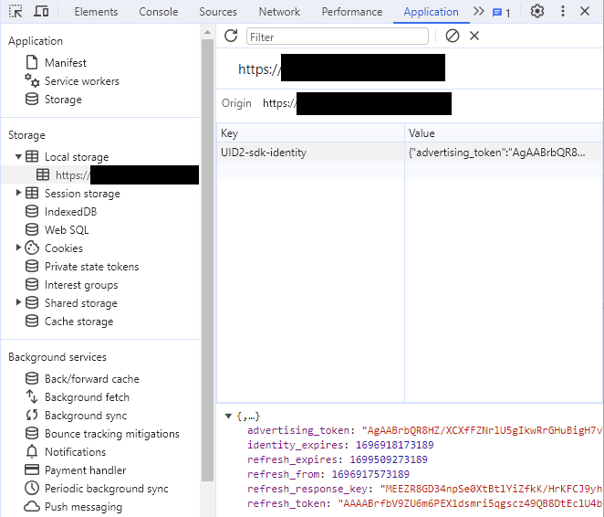

# JavaScript Express Integration Guide

This guide is for publishers who want to integrate with UID2 and generate [UID2 tokens](../ref-info/glossary-uid.md#gl-uid2-token) (advertising tokens) using only JavaScript client-side changes on their website with minimum effort.

This guide does not apply to publishers who want to use a [private operator](../ref-info/glossary-uid.md#gl-private-operator), or who want to generate tokens server-side. Those publishers should follow the [JavaScript Standard Integration Guide](integration-javascript-standard.md).

UID2 provides a UID2 SDK for JavaScript (see [UID2 SDK for JavaScript Reference Guide](../sdks/client-side-identity.md)) with the following features:

- UID2 token generation
- Automatic refreshing of UID2 tokens
- Automatic storage of UID2 tokens in the browser

You'll need to complete the following steps:

1. [Complete UID2 account setup](#complete-uid2-account-setup)
2. [Add UID2 SDK For JavaScript to your site](#add-uid2-sdk-for-javascript-to-your-site)
3. [Configure the UID2 SDK for JavaScript](#configure-the-uid2-sdk-for-javascript)
4. [Check that the token was successfully generated](#check-that-the-token-was-successfully-generated)

## UID2 SDK for JavaScript Version

Support for client-side token generation is available in version 3.2 and above of the SDK. 

The URL for the SDK is:

- [https://cdn.prod.uidapi.com/uid2-sdk-3.2.0.js](https://cdn.prod.uidapi.com/uid2-sdk-3.2.0.js)

In the following code examples, the placeholder `{{ UID2_JS_SDK_URL }}` refers to this URL.

If you want to use a debug build of the SDK, use the following URL instead:

- [https://cdn.integ.uidapi.com/uid2-sdk-3.2.0.js](https://cdn.integ.uidapi.com/uid2-sdk-3.2.0.js)

## Sample Implementation Website

For an example application, see this example:
- Code: [Example JavaScript Express Integration](https://github.com/IABTechLab/uid2-web-integrations/tree/main/examples/cstg)
- Running site: [UID2 SDK Integration Example](https://cstg-integ.uidapi.com/)
  

## Complete UID2 Account Setup

Complete the UID2 account setup by following the steps described in the [Account Setup](../getting-started/gs-account-setup.md) page. As part of the account setup process, you'll need to provide a list of domain names for the sites that you'll be using with this UID2 SDK for JavaScript.

When account setup is complete, you'll receive a **public key** and **subscription ID**. These values are unique to you, and you'll use them to configure the UID2 module.

:::tip
Only root-level domains are required for account setup. For example, if you're going to use UID2 SDK for JavaScript on example.com, shop.example.com, and example.org, you only need to provide the domain names example.com and example.org.
:::

## Add UID2 SDK For JavaScript to Your Site

The following code snippet provides an overview of the code you will need to add to your website. It also illustrates the different events that the SDK can trigger.

For a more detailed code snippet, see [Example Integration Code and When to Pass DII to the UID2 SDK](#example-integration-code-and-when-to-pass-dii-to-the-uid2-sdk).

For the `UID2_JS_SDK_URL` value, see [UID2 SDK for JavaScript Version](#uid2-sdk-for-javascript-version).

```js
<script async src="{{ UID2_JS_SDK_URL }}"></script>
 
<script>
 
// When the UID2 SDK is executed, it looks for these callbacks and invokes them.
window.__uid2 = window.__uid2 || {};
window.__uid2.callbacks = window.__uid2.callbacks || [];
window.__uid2.callbacks.push((eventType, payload) => {
  switch (eventType) {
    case "SdkLoaded":
      // The SdkLoaded event occurs just once.
      __uid2.init({});
      break;
 
    case "InitCompleted":
      // The InitCompleted event occurs just once.
      //
      // If there is a valid UID2 token, it is in payload.identity.
      break;
 
    case "IdentityUpdated":
      // The IdentityUpdated event happens when a UID2 token is generated or refreshed.
      // payload.identity contains the resulting latest identity.
      break;
  }
});
 
</script>
```

For more information about the SDK, see [UID2 SDK for JavaScript Reference Guide](../sdks/client-side-identity.md).

### Using the UID2 Integration Environment

By default, the SDK is configured to work with the UID2 production environment `https://prod.uidapi.com`. If you want to use the UID2 integration environment instead, provide the following URL in your call to `init`:

```js
__uid2.init({
  baseUrl: "https://operator-integ.uidapi.com",
});
```
:::note
Tokens from the UID2 integration environment are not valid for passing to the bid stream. For the integration environment, you will have different **subscription ID** and **public key** values.
:::

### Optional: Reduce Latency by Setting the API Base URL

By default, in the production environment, the JS SDK makes API calls to a UID2 server in the USA. Depending on where your users are based, you might consider choosing a server closer to your users in order to reduce latency.

For example, a publisher in Singapore can set the base URL to `https://sg.prod.uidapi.com`. This is still the UID2 production environment, but the servers are in Singapore.

For the list of possible base URLs, see [Environments](../getting-started/gs-environments.md).

A publisher can also set the base URL to `https://global.prod.uidapi.com`. This URL directs readers to a region geographically close to them, which is ideal if your audience is geographically distributed.

To specify a different UID2 server, you can change it in the `init` call:

```js
__uid2.init({
  baseUrl: "https://global.prod.uidapi.com",
});
```

## Configure the UID2 SDK for JavaScript

UID2 provides the publisher with the following values required to use the client-side token generation feature:

* A subscription ID
* A public key

You'll have one set of these values for your publisher testing environment, and a separate set for your production environment.

To configure the SDK, call one of the following methods, with an object containing the **public key** and **subscription ID** that you received during account setup, as well as the user's hashed or unhashed [DII](../ref-info/glossary-uid.md#gl-dii) (email address or phone number):

*  `__uid2.setIdentityFromEmail`
*  `__uid2.setIdentityFromEmailHash`
*  `__uid2.setIdentityFromPhone`
*  `__uid2.setIdentityFromPhoneHash`

The following sections include coding examples for each scenario.

Once it's configured, the UID2 SDK takes care of the following:
- Generates a UID2 token for the user.
- Stores the token in the user's browser.
- Automatically refreshes the token as required while your site is open in the user's browser.

You can pass the user's DII to the UID2 SDK either hashed or unhashed. If you pass the DII unhashed, the UID2 SDK hashes it for you. If you want to pass the DII to the SDK already hashed, you must normalize it before hashing. For details, see [Normalization and Encoding](../getting-started/gs-normalization-encoding.md). 

The SDK encrypts the hashed DII before sending it to the UID2 service.

You can configure the SDK using any one of the four accepted DII formats, for any specific user. The DII format might vary per user but you can only send one value per user.

The following sections demonstrate the different ways that you can configure the UID2 SDK and list the requirements for the DII passed to the SDK:

- [Configure for Email Address](#configure-for-email-address)
- [Configure for Hashed Email Address](#configure-for-hashed-email-address)
- [Configure for Phone Number](#configure-for-phone-number)
- [Configure for Hashed Phone Number](#configure-for-hashed-phone-number)

If the SDK is configured multiples times, it uses the most recent configuration values.

For an example of how to generate email and phone hashes in JavaScript, see [Example Code: Hashing and Base-64 Encoding](#example-code-hashing-and-base-64-encoding).

### Configure for Email Address

Configure the UID2 SDK with an email address:

```js
await __uid2.setIdentityFromEmail(
    "test@example.com",
    {
        subscriptionId: subscriptionId,
        serverPublicKey: publicKey,
    }
);
```

No normalization or hashing is required by the publisher.

The UID2 SDK normalizes and hashes the email address before sending the encrypted hash to the UID2 service.

### Configure for Hashed Email Address

Configure the UID2 SDK with a hashed email address:

```js
await __uid2.setIdentityFromEmailHash(
    'eVvLS/Vg+YZ6+z3i0NOpSXYyQAfEXqCZ7BTpAjFUBUc=',
    {
        subscriptionId: subscriptionId,
        serverPublicKey: publicKey,
    }
);
```

**The publisher is responsible for normalizing and hashing the email address**. For details, see [Normalization and Encoding](../getting-started/gs-normalization-encoding.md).

The UID2 SDK encrypts the hash before sending it to the UID2 service.

### Configure for Phone Number

Configure the UID2 SDK with a phone number:

```js
await __uid2.setIdentityFromPhone(
    '+1111111111',
    {
        subscriptionId: subscriptionId,
        serverPublicKey: publicKey,
    }
);
```

**The publisher is responsible for normalizing the phone number**. For details, see [Phone Number Normalization](../getting-started/gs-normalization-encoding.md#phone-number-normalization).

The UID2 SDK hashes the phone number before sending the encrypted hash to the UID2 service.

### Configure for Hashed Phone Number

Configure the UID2 SDK with a hashed phone number:

```js
await __uid2.setIdentityFromPhoneHash(
    'eVvLS/Vg+YZ6+z3i0NOpSXYyQAfEXqCZ7BTpAjFUBUc=',
    {
        subscriptionId: subscriptionId,
        serverPublicKey: publicKey,
    }
);
```

**The publisher is responsible for normalizing and hashing the phone number**. For details, see [Normalization and Encoding](../getting-started/gs-normalization-encoding.md).

The UID2 SDK encrypts the hash before sending it to the UID2 service.

## Token Storage and Refresh

After calling one of the methods listed in [Configure the UID2 SDK for JavaScript](#configure-the-uid2-sdk-for-javascript) successfully, an [identity](../ref-info/glossary-uid.md#gl-identity) is generated and stored in local storage, under the key `UID2-sdk-identity`. The SDK refreshes the UID2 token periodically.

:::danger
The format of the object stored in local storage could change without notice. We recommend that you do **not** read and update the object in local storage directly. 
:::

## Example Integration Code and When to Pass DII to the UID2 SDK

When this is the first page load with no [identity](../ref-info/glossary-uid.md#gl-identity), to start the token generation call you'll need to call one of the `setIdentity` methods with DII. Once an identity is generated, the advertising token ([UID2 token](../ref-info/glossary-uid.md#gl-uid2-token)) that you would send to the bid stream will be available by waiting for the `IdentityUpdated` event from the SDK. For an example, see how the value for `advertising_token_to_use` is set in the following code snippet.

In some cases, the user's DII is not available on page load, and getting the DII has some associated cost. For example, an API call might be required to fetch the DII, or the user has to be prompted to provide the DII information.

You can potentially avoid that cost by checking for an existing token that you can use or refresh. To do this, call
[__uid2.isLoginRequired](../sdks/client-side-identity#isloginrequired-boolean) which returns a Boolean value. If it returns `true`, this means that the UID2 SDK cannot create a new advertising token with the existing resource and DII is required to generate a brand new UID2 token.

The following code snippet demonstrates how you might integrate with the UID2 SDK for JavaScript for the two scenarios above&#8212;starting with no token as well as reusing/refreshing any existing UID2 token if found. 

```js
<script async src="{{ UID2_JS_SDK_URL }}"></script>
 
<script>
 
// UID2 provides these configuration values to the publisher.
const clientSideConfig = {
  subscriptionId: "...",
  serverPublicKey: "...",
};
  
// Example of a base-64 encoded SHA-256 hash of an email address.
const emailHash = "tMmiiTI7IaAcPpQPFQ65uMVCWH8av9jw4cwf/F5HVRQ=";

// When the UID2 SDK is executed, it looks for these callbacks and invokes them.
window.__uid2 = window.__uid2 || {};
window.__uid2.callbacks = window.__uid2.callbacks || [];
window.__uid2.callbacks.push(async (eventType, payload) => {
  switch (eventType) {
    case "SdkLoaded":
      // The SdkLoaded event occurs just once.
      __uid2.init({});
      break;
 
    case "InitCompleted":
      // The InitCompleted event occurs just once.
      //
      // If there is a valid UID2 token, it is in payload.identity.
      if (payload.identity) {
        //
        // payload looks like this:
        // {
        //   "identity": {
        //     "advertising_token": "A4A...MqA",
        //     "refresh_token": "A3A...pdg==",
        //     "identity_expires": 1692257038260,
        //     "refresh_expires": 1692339838260,
        //     "refresh_from": 1692254338260
        //     "refresh_response_key": "z0v...zL0="
        //   }
        // }
        var advertising_token_to_use = payload.identity.advertising_token;
      } else {
          if (__uid2.isLoginRequired()) {
            // Call one of the setIdentityFrom functions to generate a new UID2 token.
            // Add any retry logic around this call as required.
            await __uid2.setIdentityFromEmailHash(
                emailHash,
                clientSideConfig
          );
          else {
            // there is a token generation API call in flight which triggers
            // a IdentityUpdated event 
          }
        }
      }
      break;
 
    case "IdentityUpdated":
      // The IdentityUpdated event happens when a UID2 token is generated or refreshed.
      // See previous comment for an example of how the payload looks.
      var advertising_token_to_use = payload.identity.advertising_token;
      break;
  }
});
 
</script>
```

## Check that the Token Was Successfully Generated

To check that the token was successfully generated, use the browser's developer tools to look for the token in local storage.



If there was a problem generating the token, find the request in the **Network** tab. You can find the request by filtering for the string `client-generate`. Information about why the request failed should be available in the response.


## Example Code: Hashing and Base-64 Encoding

The following code example demonstrates how to generate email and phone hashes in JavaScript.

```js
async function hash(value) {
  const hash = await window.crypto.subtle.digest(
    "SHA-256",
    new TextEncoder().encode(value)
  );
  return bytesToBase64(new Uint8Array(hash));
}
 
function bytesToBase64(bytes) {
  const binString = Array.from(bytes, (x) => String.fromCodePoint(x)).join("");
  return btoa(binString);
}
```