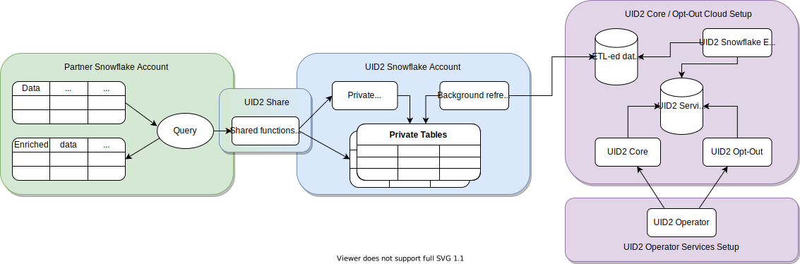

# Snowflake Integration Guide

<!-- This guide includes the following information:

- [Access the UID2 Shares](#access-the-uid2-shares)
- [Shared Objects](#shared-objects)
  -  [Database and Schema Names](#database-and-schema-names)
  -  [Map DII](#map-dii)
  -  [Regenerated UID2s](#regenerate-uid2s) 
- [Migration Guide](#migration-guide)  -->

[Snowflake](https://www.snowflake.com/) is a cloud data warehousing solution, where you as a partner can store your data and integrate with the UID2 framework. Using Snowflake, UID2 enables you to securely share authorized consumer identifier data without exposing sensitive [directly identifying information (DII)](../ref-info/glossary-uid.md#gl-dii). Even though you have the option to query the Operator Web Services directly for the consumer identifier data, the Snowflake UID2 integration offers a more seamless experience.

The following diagram illustrates how you engage with the UID2 integration process in Snowflake:



|Partner Snowflake Account|UID2 Snowflake Account|UID2 Core Opt-Out Cloud Setup|
| :--- | :--- | :--- |
|As a partner, you set up a Snowflake account to host your data and engage in UID2 integration by consuming functions and views through the UID2 Share. | UID2 integration, hosted in a Snowflake account, grants you access to authorized functions and views that draw data from private tables. You can’t access the private tables. The UID2 Share reveals only essential data needed for you to perform UID2-related tasks. |ETL (Extract Transform Load) jobs constantly update the UID2 Core/Optout Snowflake storage with internal data that powers the UID2 Operator Web Services. The data used by the Operator Web Services is also available through the UID2 Share. |
|When you use shared functions and views, you pay Snowflake for transactional computation costs.  |These private tables, secured in the UID2 Snowflake account, automatically synchronize with the UID2 Core/Optout Snowflake storage that holds internal data used to complete UID2-related tasks.  | |

## Access the UID2 Shares

Access to the UID2 Share is available through the [Snowflake Data Marketplace](https://www.snowflake.com/data-marketplace/), where you can request specific data sets based on the UID2 personalized listing you select.

There are two personalized listings offered in the Snowflake Data Marketplace for UID2:
- [Unified ID 2.0 Advertiser Identity Solution](https://app.snowflake.com/marketplace/listing/GZT0ZRYXTMV) for advertisers/brands
- [Unified ID 2.0 Data Provider Identity Solution](https://app.snowflake.com/marketplace/listing/GZT0ZRYXTN0) for data providers

>IMPORTANT: To be able to request data, you must have the `ACCOUNTADMIN` role privileges in your Snowflake account.

To request access to a UID2 Share, complete the following steps:

1.	Log in to the Snowflake Data Marketplace and select the UID2 solution that you are interested in:
      - [Unified ID 2.0 Advertiser Identity Solution](https://app.snowflake.com/marketplace/listing/GZT0ZRYXTMV)
      - [Unified ID 2.0 Data Provider Identity Solution](https://app.snowflake.com/marketplace/listing/GZT0ZRYXTN0)
2.	In the **Personalized Data** section, click **Request Data**.
3.	Follow the onscreen instructions to verify and provide your contact details and other required information.
4.	If you are an existing client of The Trade Desk and are interested in the *Advertiser* Identity Solution, include your partner and advertiser IDs issued by The Trade Desk in the **Message** field of the data request form.
5.	Submit the form.

After your request is received, a UID2 administrator will contact you with the appropriate access instructions. For details about managing data requests in Snowflake, see the [Snowflake documentation](https://docs.snowflake.com/en/user-guide/data-marketplace-consumer.html).


## Shared Objects

Regardless of the UID2 solution you choose, you can map DII to UID2s by using the following function:

- `FN_T_UID2_IDENTITY_MAP` (See [Map DII](#map-dii))

The following functions are deprecated in favor of `FN_T_UID2_IDENTITY_MAP`. You can still use them, but `FN_T_UID2_IDENTITY_MAP` is better. If you are already using these functions, we recommend ugrading as soon as possible.

- `FN_T_UID2_IDENTITY_MAP_EMAIL` (deprecated)
- `FN_T_UID2_IDENTITY_MAP_EMAIL_HASH` (deprecated)

>NOTE: If you are using the deprecated functions, and need help migrating to the newer function, see [Migration Guide](#migration-guide).

To identify the UID2s that you must regenerate, use the `UID2_SALT_BUCKETS` view from the UID2 Share. For details, see [Regenerate UID2s](#regenerate-uid2s).

### Database and Schema Names

The following sections include query examples for each solution, which are identical except for the database and schema name variables:

```
{DATABASE_NAME}.{SCHEMA_NAME}
```
For example:
```
select UID2, BUCKET_ID, UNMAPPED from table({DATABASE_NAME}.{SCHEMA_NAME}.FN_T_UID2_IDENTITY_MAP('validate@email.com', 'email'));
```

All query examples use the following default values for each name variable:

| Variable |Advertiser Solution Default Value | Data Provider Solution Default Value| Comments |
| :--- | :--- | :--- | :--- |
| `{DATABASE_NAME}` | `UID2_PROD_ADV_SH` | `UID2_PROD_DP_SH` | If needed, you can change the default database name when creating a new database after you are granted access to the selected UID2 Share. |
| `{SCHEMA_NAME}`| `ADV` | `DP` | This is an immutable name. |

### Map DII

To map all types of [DII](../ref-info/glossary-uid.md#gl-dii), use the `FN_T_UID2_IDENTITY_MAP` function.

If the DII is an email address, the service normalizes the data using the UID2 [Email Address Normalization](../getting-started/gs-normalization-encoding.md#email-address-normalization) rules.

If the DII is a phone number, it must be normalized before being sent to the service, using the UID2 [Phone Number Normalization](../getting-started/gs-normalization-encoding.md#phone-number-normalization) rules.

|Argument|Data Type|Description|
| :--- | :--- | :--- |
| `INPUT` | varchar(256) | The DII to map to the UID2 and second-level bucket ID. |
| `INPUT_TYPE` | varchar(256) | The type of DII to map. Allowed values: `email`, `email_hash`, `phone`, and `phone_hash`.

A successful query returns the following information for the specified DII.

|Column Name|Data Type|Description|
| :--- | :--- | :--- |
| `UID2` | TEXT | DII was successfully mapped: The UID2 associated with the DII.<br/>DII was not successfully mapped: `NULL`. |
| `BUCKET_ID` | TEXT | DII was successfully mapped: The ID of the second-level salt bucket used to generate the UID2. This ID maps to the bucket ID in the `UID2_SALT_BUCKETS` view.<br/>DII was not successfully mapped: `NULL`. |
| `UNMAPPED` | TEXT | DII was successfully mapped: `NULL`.<br/>DII was not successfully mapped:  The reason why an identifier was not mapped: `OPTOUT`, `INVALID IDENTIFIER`, or `INVALID INPUT TYPE`. For details, see [Values for the UNMAPPED Column](#values-for-the-unmapped-column).  |

### Values for the UNMAPPED Column

Possible values for `UNMAPPED` are:

| Value | Meaning |
| :-- | :-- |
| `NULL` | The DII was successfully mapped. |
| `OPTOUT` | The user has opted out. |
| `INVALID IDENTIFIER` | The email address or phone number is invalid. |
| `INVALID INPUT TYPE` | The value of `INPUT_TYPE` is invalid. Valid value for INPUT_TYPE must be one of the following: `email`, `email_hash`, `phone`, `phone_hash`. |

Mapping request examples in this section:

- [Single Unhashed Email](#mapping-request-example---single-unhashed-email)
- [Multiple Unhashed Emails](#mapping-request-example---multiple-unhashed-emails)
- [Single Unhashed Phone Number](#mapping-request-example---single-unhashed-phone-number)
- [Multiple Unhashed Phone Numbers](#mapping-request-example---multiple-unhashed-phone-numbers)
- [Single Hashed Email](#mapping-request-example---single-hashed-email)
- [Multiple Hashed Emails](#mapping-request-example---multiple-hashed-emails)
- [Single Hashed Phone Number](#mapping-request-example---single-hashed-phone-number)
- [Multiple Hashed Phone Numbers](#mapping-request-example---multiple-hashed-phone-numbers)

>NOTE: The input and output data in these examples is fictitious, for illustrative purposes only. The values provided are not real values.

#### Mapping Request Example - Single Unhashed Email

The following queries illustrate how to map a single email address, using the [default database and schema names](#database-and-schema-names).

Advertiser solution query for a single email:

```
select UID2, BUCKET_ID, UNMAPPED from table(UID2_PROD_ADV_SH.ADV.FN_T_UID2_IDENTITY_MAP('validate@email.com', 'email'));
```

Data provider solution query for a single email:

```
select UID2, BUCKET_ID, UNMAPPED from table(UID2_PROD_DP_SH.DP.FN_T_UID2_IDENTITY_MAP('validate@email.com', 'email'));
```

Query results for a single email:

```
+----------------------------------------------+------------+----------+
| UID2                                         | BUCKET_ID  | UNMAPPED |
+----------------------------------------------+------------+----------+
| 2ODl112/VS3x2vL+kG1439nPb7XNngLvOWiZGaMhdcU= | ad1ANEmVZ  | NULL     |
+----------------------------------------------+------------+----------+
```

#### Mapping Request Example - Multiple Unhashed Emails

The following queries illustrate how to map multiple email addresses, using the [default database and schema names](#database-and-schema-names).

Advertiser solution query for multiple emails:

```
select a.ID, a.EMAIL, m.UID2, m.BUCKET_ID, m.UNMAPPED from AUDIENCE a LEFT JOIN(
    select ID, t.* from AUDIENCE, lateral UID2_PROD_ADV_SH.ADV.FN_T_UID2_IDENTITY_MAP(EMAIL, 'email') t) m
    on a.ID=m.ID;
```

Data provider solution query for multiple emails:

```
select a.ID, a.EMAIL, m.UID2, m.BUCKET_ID, UNMAPPED from AUDIENCE a LEFT JOIN(
    select ID, t.* from AUDIENCE, lateral UID2_PROD_DP_SH.DP.FN_T_UID2_IDENTITY_MAP(EMAIL, 'email') t) m
    on a.ID=m.ID;
```

Query results for multiple emails:

The following table identifies each item in the response, including `NULL` values for `NULL` or improperly formatted emails.

```sh
+----+--------------------+----------------------------------------------+------------+--------------------+
| ID | EMAIL              | UID2                                         | BUCKET_ID  | UNMAPPED           |
+----+--------------------+----------------------------------------------+------------+--------------------+
|  1 | validate@email.com | 2ODl112/VS3x2vL+kG1439nPb7XNngLvOWiZGaMhdcU= | ad1ANEmVZ  | NULL               |
|  2 | test@uidapi.com    | IbW4n6LIvtDj/8fCESlU0QG9K/fH63UdcTkJpAG8fIQ= | a30od4mNRd | NULL               |
|  3 | invalid-email      | NULL                                         | NULL       | INVALID IDENTIFIER |
|  4 | NULL               | NULL                                         | NULL       | INVALID IDENTIFIER |
+----+--------------------+----------------------------------------------+------------+--------------------+
```

#### Mapping Request Example - Single Unhashed Phone Number

The following queries illustrate how to map a phone number, using the [default database and schema names](#database-and-schema-names).

Phone numbers must be normalized using the UID2 [Phone Number Normalization](../getting-started/gs-normalization-encoding.md#phone-number-normalization) rules.

Advertiser solution query for a single phone number:

```
select UID2, BUCKET_ID, UNMAPPED from table(UID2_PROD_ADV_SH.ADV.FN_T_UID2_IDENTITY_MAP('+12345678901', 'phone'));
```

Data Provider solution query for a single phone number:

```
select UID2, BUCKET_ID, UNMAPPED from table(UID2_PROD_DP_SH.DP.FN_T_UID2_IDENTITY_MAP('+12345678901', 'phone'));
```

Query results for a single phone number:

```
+----------------------------------------------+------------+----------+
| UID2                                         | BUCKET_ID  | UNMAPPED |
+----------------------------------------------+------------+----------+
| 2ODl112/VS3x2vL+kG1439nPb7XNngLvOWiZGaMhdcU= | ad1ANEmVZ  | NULL     |
+----------------------------------------------+------------+----------+
```

#### Mapping Request Example - Multiple Unhashed Phone Numbers

The following queries illustrate how to map multiple phone numbers, using the [default database and schema names](#database-and-schema-names).

Phone numbers must be normalized using the UID2 [Phone Number Normalization](../getting-started/gs-normalization-encoding.md#phone-number-normalization) rules.

Advertiser solution query for multiple phone numbers:

```
select a.ID, a.PHONE, m.UID2, m.BUCKET_ID, m.UNMAPPED from AUDIENCE a LEFT JOIN(
    select ID, t.* from AUDIENCE, lateral UID2_PROD_ADV_SH.ADV.FN_T_UID2_IDENTITY_MAP(PHONE, 'phone') t) m
    on a.ID=m.ID;
```

Data Provider solution query for multiple phone numbers:

```
select a.ID, a.PHONE, m.UID2, m.BUCKET_ID, UNMAPPED from AUDIENCE a LEFT JOIN(
    select ID, t.* from AUDIENCE, lateral UID2_PROD_DP_SH.DP.FN_T_UID2_IDENTITY_MAP(PHONE, 'phone') t) m
    on a.ID=m.ID;
```

Query results for multiple phone numbers:

The following table identifies each item in the response, including `NULL` values for `NULL` or invalid phone numbers.

```
+----+--------------+----------------------------------------------+------------+--------------------+
| ID | PHONE        | UID2                                         | BUCKET_ID  | UNMAPPED           |
+----+--------------+----------------------------------------------+------------+--------------------+
|  1 | +12345678901 | 2ODl112/VS3x2vL+kG1439nPb7XNngLvOWiZGaMhdcU= | ad1ANEmVZ  | NULL               |
|  2 | +61491570006 | IbW4n6LIvtDj/8fCESlU0QG9K/fH63UdcTkJpAG8fIQ= | a30od4mNRd | NULL               |
|  3 | 1234         | NULL                                         | NULL       | INVALID IDENTIFIER |
|  4 | NULL         | NULL                                         | NULL       | INVALID IDENTIFIER |
+----+--------------+----------------------------------------------+------------+--------------------+
```

#### Mapping Request Example - Single Hashed Email

The following queries illustrate how to map a single email address hash, using the [default database and schema names](#database-and-schema-names).

Advertiser solution query for a single hashed email:

```
select UID2, BUCKET_ID, UNMAPPED from table(UID2_PROD_ADV_SH.ADV.FN_T_UID2_IDENTITY_MAP(BASE64_ENCODE(SHA2_BINARY('validate@email.com', 256)), 'email_hash'));
```

Data provider solution query for a single hashed email:

```
select UID2, BUCKET_ID, UNMAPPED from table(UID2_PROD_DP_SH.DP.FN_T_UID2_IDENTITY_MAP(BASE64_ENCODE(SHA2_BINARY('validate@email.com', 256)), 'email_hash'));
```

Query results for a single hashed email:

```
+----------------------------------------------+------------+----------+
| UID2                                         | BUCKET_ID  | UNMAPPED |
+----------------------------------------------+------------+----------+
| 2ODl112/VS3x2vL+kG1439nPb7XNngLvOWiZGaMhdcU= | ad1ANEmVZ  | NULL     |
+----------------------------------------------+------------+----------+
```

#### Mapping Request Example - Multiple Hashed Emails

The following queries illustrate how to map multiple email address hashes, using the [default database and schema names](#database-and-schema-names).

Advertiser solution query for multiple hashed emails:

```
select a.ID, a.EMAIL_HASH, m.UID2, m.BUCKET_ID, m.UNMAPPED from AUDIENCE a LEFT JOIN(
    select ID, t.* from AUDIENCE, lateral UID2_PROD_ADV_SH.ADV.FN_T_UID2_IDENTITY_MAP(EMAIL_HASH, 'email_hash') t) m
    on a.ID=m.ID;
```

Data provider solution query for multiple hashed emails:

```
select a.ID, a.EMAIL_HASH, m.UID2, m.BUCKET_ID, m.UNMAPPED from AUDIENCE a LEFT JOIN(
    select ID, t.* from AUDIENCE, lateral UID2_PROD_DP_SH.DP.FN_T_UID2_IDENTITY_MAP(EMAIL_HASH, 'email_hash') t) m
    on a.ID=m.ID;
```

Query results for multiple hashed emails:

The following table identifies each item in the response, including `NULL` values for `NULL` hashes.

```
+----+----------------------------------------------+----------------------------------------------+------------+--------------------+
| ID | EMAIL_HASH                                   | UID2                                         | BUCKET_ID  | UNMAPPED           |
+----+----------------------------------------------+----------------------------------------------+------------+--------------------+
|  1 | LdhtUlMQ58ZZy5YUqGPRQw5xUMS5dXG5ocJHYJHbAKI= | 2ODl112/VS3x2vL+kG1439nPb7XNngLvOWiZGaMhdcU= | ad1ANEmVZ  | NULL               |
|  2 | NULL                                         | NULL                                         | NULL       | INVALID IDENTIFIER |
|  3 |/XJSTajB68SCUyuc3ePyxSLNhxrMKvJcjndq8TuwW5g=  | IbW4n6LIvtDj/8fCESlU0QG9K/fH63UdcTkJpAG8fIQ= | a30od4mNRd | NULL               |
+----+----------------------------------------------+----------------------------------------------+------------+--------------------+
```

#### Mapping Request Example - Single Hashed Phone Number

The following queries illustrate how to map a single phone number hash, using the [default database and schema names](#database-and-schema-names).

Advertiser solution query for a single hashed phone number:

```
select UID2, BUCKET_ID, UNMAPPED from table(UID2_PROD_ADV_SH.ADV.FN_T_UID2_IDENTITY_MAP(BASE64_ENCODE(SHA2_BINARY('+12345678901', 256)), 'phone_hash'));
```

Data provider solution query for a single hashed phone number:

```
select UID2, BUCKET_ID, UNMAPPED from table(UID2_PROD_DP_SH.DP.FN_T_UID2_IDENTITY_MAP(BASE64_ENCODE(SHA2_BINARY('+12345678901', 256)), 'phone_hash'));
```

Query results for a single hashed phone number:

```
+----------------------------------------------+------------+----------+
| UID2                                         | BUCKET_ID  | UNMAPPED |
+----------------------------------------------+------------+----------+
| 2ODl112/VS3x2vL+kG1439nPb7XNngLvOWiZGaMhdcU= | ad1ANEmVZ  | NULL     |
+----------------------------------------------+------------+----------+
```

#### Mapping Request Example - Multiple Hashed Phone Numbers

The following queries illustrate how to map multiple phone number hashes, using the [default database and schema names](#database-and-schema-names).

Advertiser solution query for multiple hashed phone numbers:

```
select a.ID, a.PHONE_HASH, m.UID2, m.BUCKET_ID, m.UNMAPPED from AUDIENCE a LEFT JOIN(
    select ID, t.* from AUDIENCE, lateral UID2_PROD_ADV_SH.ADV.FN_T_UID2_IDENTITY_MAP(PHONE_HASH, 'phone_hash') t) m
    on a.ID=m.ID;
```

Data provider solution query for multiple hashed phone numbers:

```
select a.ID, a.PHONE_HASH, m.UID2, m.BUCKET_ID, m.UNMAPPED from AUDIENCE a LEFT JOIN(
    select ID, t.* from AUDIENCE, lateral UID2_PROD_DP_SH.DP.FN_T_UID2_IDENTITY_MAP(PHONE_HASH, 'phone_hash') t) m
    on a.ID=m.ID;
```

Query results for multiple hashed phone numbers:

The following table identifies each item in the response, including `NULL` values for `NULL` hashes.

```
+----+----------------------------------------------+----------------------------------------------+------------+--------------------+
| ID | PHONE_HASH                                   | UID2                                         | BUCKET_ID  | UNMAPPED           |
+----+----------------------------------------------+----------------------------------------------+------------+--------------------+
|  1 | LdhtUlMQ58ZZy5YUqGPRQw5xUMS5dXG5ocJHYJHbAKI= | 2ODl112/VS3x2vL+kG1439nPb7XNngLvOWiZGaMhdcU= | ad1ANEmVZ  | NULL               |
|  2 | NULL                                         | NULL                                         | NULL       | INVALID IDENTIFIER |
|  3 |/XJSTajB68SCUyuc3ePyxSLNhxrMKvJcjndq8TuwW5g=  | IbW4n6LIvtDj/8fCESlU0QG9K/fH63UdcTkJpAG8fIQ= | a30od4mNRd | NULL               |
+----+----------------------------------------------+----------------------------------------------+------------+--------------------+
```

### Regenerate UID2s

The `UID2_SALT_BUCKETS` view query returns the date and time when the second-level salt buckets were last updated. Second-level salt is used when generating UID2s. When the salt in the bucket is updated, the previously generated UID2 becomes outdated and doesn’t match the UID2 generated by other parties for the same user.

To determine which UID2s need regeneration, compare the timestamps of when they were generated to the most recent timestamp of the second-level salt bucket update.

|Column Name|Data Type|Description|
| :--- | :--- | :--- |
| `BUCKET_ID` | TEXT | The ID of the second-level salt bucket. This ID parallels the `BUCKET_ID` returned by the identity map function. Use the `BUCKET_ID` as the key to do a join query between the function call results and results from this view call.  |
| `LAST_SALT_UPDATE_UTC` | TIMESTAMP_NTZ | The last time the salt in the bucket was updated. This value is expressed in UTC. |

The following example shows an input table and the query used to find the UID2s in the table that must be regenerated because the second-level salt was updated.

#### Targeted Input Table
```
select * from AUDIENCE_WITH_UID2;
```
```
+----+--------------------+----------------------------------------------+------------+-------------------------+
| ID | EMAIL              | UID2                                         | BUCKET_ID  | LAST_UID2_UPDATE_UTC    |
+----+--------------------+----------------------------------------------+------------+-------------------------+
|  1 | validate@email.com | 2ODl112/VS3x2vL+kG1439nPb7XNngLvOWiZGaMhdcU= | ad1ANEmVZ  | 2021-03-01 00:00:00.000 |
|  2 | test1@uidapi.com   | Q4A5ZBuBCYfuV3Wd8Fdsx2+i33v7jyFcQbcMG/LH4eM= | ad1ANEmVZ  | 2021-03-03 00:00:00.000 |
|  3 | test2@uidapi.com   | NULL                                         | NULL       | NULL                    |
+----+--------------------+----------------------------------------------+------------+-------------------------+
```

To find missing or outdated UID2s, use the following query examples, which use the [default database and schema names](#database-and-schema-names).

Advertiser solution query:

```
select a.*, b.LAST_SALT_UPDATE_UTC
  from AUDIENCE_WITH_UID2 a LEFT OUTER JOIN UID2_PROD_ADV_SH.ADV.UID2_SALT_BUCKETS b
  on a.BUCKET_ID=b.BUCKET_ID
  where a.LAST_UID2_UPDATE_UTC < b.LAST_SALT_UPDATE_UTC or a.UID2 IS NULL;
```

Data provider solution query:

```
select a.*, b.LAST_SALT_UPDATE_UTC
  from AUDIENCE_WITH_UID2 a LEFT OUTER JOIN UID2_PROD_DP_SH.DP.UID2_SALT_BUCKETS b
  on a.BUCKET_ID=b.BUCKET_ID
  where a.LAST_UID2_UPDATE_UTC < b.LAST_SALT_UPDATE_UTC or a.UID2 IS NULL;
```

Query results:

The following table identifies each item in the response. The result includes an email, `UID2`, `BUCKET_ID`, `LAST_UID2_UPDATE_UTC`, and `LAST_SALT_UPDATE_UTC` as shown in the ID 1 example below. No information is returned for ID 2 because the corresponding UID2 was generated after the last bucket update. For ID 3, `NULL` values are returned due to a missing UID2.

```
+----+--------------------+----------------------------------------------+------------+-------------------------+-------------------------+
| ID | EMAIL              | UID2                                         | BUCKET_ID  | LAST_UID2_UPDATE_UTC    | LAST_SALT_UPDATE_UTC    |
+----+--------------------+----------------------------------------------+------------+-------------------------+-------------------------+
|  1 | validate@email.com | 2ODl112/VS3x2vL+kG1439nPb7XNngLvOWiZGaMhdcU= | ad1ANEmVZ  | 2021-03-01 00:00:00.000 | 2021-03-02 00:00:00.000 |
|  3 | test2@uidapi.com   | NULL                                         | NULL       | NULL                    | NULL                    |
+----+--------------------+----------------------------------------------+------------+-------------------------+-------------------------+
```

## Migration Guide

If you are using the `FN_T_UID2_IDENTITY_MAP_EMAIL` and `FN_T_UID2_IDENTITY_MAP_EMAIL_HASH` functions, it's best to migrate to the `FN_T_UID2_IDENTITY_MAP` function as soon as possible. This function does everything that the other two functions do, and has other built-in improvements.

Advantages of the `FN_T_UID2_IDENTITY_MAP` function:

- It supports mapping both phone numbers and hashed phone numbers.
- It supports user opt-out.
- It adds a new column, `UNMAPPED`. In any scenario where the DII cannot be mapped to a UID2 for any reason, this column includes information about the reason. For details, see [Values for the UNMAPPED Column](#values-for-the-unmapped-column)

This section includes the following information to help you upgrade to the new function:

- [Changing Existing Code](#changing-existing-code) 
- [Using the Values for the UNMAPPED Column](#using-the-values-for-the-unmapped-column) 

### Changing Existing Code

The code snippets in this section are before/after examples of how the earlier functions might be implemented, and how you could update to use the new function.

#### Example for mapping unhashed emails

Before:

```
FN_T_UID2_IDENTITY_MAP_EMAIL(EMAIL)
```

After:

```
FN_T_UID2_IDENTITY_MAP(EMAIL, 'email')
```

#### Example for mapping unhashed emails

Before:

```
FN_T_UID2_IDENTITY_MAP_EMAIL_HASH(EMAIL_HASH)
```

After:

```
FN_T_UID2_IDENTITY_MAP(EMAIL_HASH, 'email_hash')
```

### Using the Values for the UNMAPPED Column
When you have the new function implemented, you can check the `UNMAPPED` column returned by the `FN_T_UID2_IDENTITY_MAP`. If any DII could not be mapped to a UID2, this column gives the reason.

For details about the values and their explanations, see [Values for the UNMAPPED Column](#values-for-the-unmapped-column).
