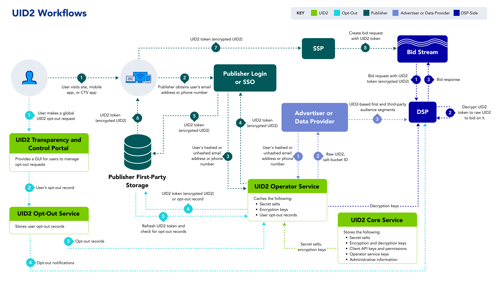

import Link from '@docusaurus/Link';

# Unified ID 2.0 Overview

<!-- It includes the following:

- [Introduction](#introduction)
  - [Guiding Principles](#guiding-principles)
  - [Technical Design Principles](#technical-design-principles)
- [Elements of the UID2 Infrastructure](#elements-of-the-uid2-infrastructure)
  - [UID2 Identifier Types](#uid2-identifier-types)
  - [Components](#components)
  - [Participants](#participants)
  - [Workflows](#workflows)
- [FAQs](#faqs)
- [License](#license) -->

UID2 is a framework that enables deterministic identity for advertising opportunities on the open internet for many [participants](#participants) across the advertising ecosystem. The UID2 framework enables logged-in experiences from publisher websites, mobile apps, and Connected TV (CTV) apps to monetize through programmatic workflows. Built as an open-source, standalone solution with its own unique namespace, the framework offers the user transparency and privacy controls designed to meet local market requirements. 

>NOTE: The term "UID2" can refer to either the framework or an actual identifier. Unless otherwise indicated, this page provides an overview of the UID2 framework. 

### Guiding Principles

The UID2 framework has the following principles as its foundation:

- **First-party relationships**: UID2 enables advertisers to activate their first-party data on publisher websites across the open internet.

- **Non-proprietary (universal) standard**: All [participants](#participants) in the advertising ecosystem who agree to abide by the code of conduct can access UID2.

- **Open source**: The source code for the UID2 [components](#components) is publicly available.

- **Interoperable**: The framework allows other identity solutions (commercial and proprietary) to integrate and provide UID2 tokens with their offerings.

- **Secure and encrypted data**: UID2 leverages multiple layers of security to help protect user and other participant data.

- **Consumer control**: Consumers can opt out of UID2 at any time through the [Transparency and Control Portal](https://www.transparentadvertising.com/).

### Technical Design Principles

The UID2 framework is built on the following technical principles:

- **Distributed integration**: Multiple certified integration paths provide options for publishers, advertisers, and third-party data providers to manage and exchange UID2 tokens.

- **Decentralized storage**: The framework does not have a centralized storage for personal data mappings. All participants maintain only their own data.

- **Lean infrastructure**: The UID2 system is light and inexpensive to operate.

- **Internet scale**: The UID2 infrastructure can scale to address the continuously increasing needs of [participants](#participants) and to meet the performance demands of specific geographic regions.

- **Self-reliant**: UID2 does not rely on external services for processing of real-time bidding (RTB) data.

## Elements of the UID2 Infrastructure

The following sections explain and illustrate the key elements of the UID2 framework infrastructure:

- [UID2 Identifier Types](#uid2-identifier-types)
- [Components](#components)
- [Participants](#participants)
- [Workflows](#workflows)

### UID2 Identifier Types

UID2 is a deterministic ID that is based on <Link href="ref-info/glossary-uid#gl-dii">directly identifying information (DII)</Link>, such as email address or phone number. There are two types of UID2s: raw UID2s and UID2 tokens (also known as advertising tokens). The following table explains each type.

| ID Type | Shared in Bid Stream? | Description |
| :--- | :--- | :--- |
| **Raw UID2** | No | An unencrypted alphanumeric identifier created through the UID2 APIs or SDKs with the user's verifiable personal data, such as a hashed or unhashed email address or a phone number, as input. To prevent re-identification of the original personal data, the input value is hashed if it was not already hashed, then salted, and then hashed again to create the raw UID2. The process that creates the raw UID2 is designed to create a secure, opaque value that can be stored by advertisers, third-party data providers, and demand-side platforms (DSPs). Raw UID2s are case sensitive. Example: A request for the raw UID2 for the fictitious email address `user@example.com` resulted in this value:  `E2dxEv3oMBzNHPw5iUVmwH2Hv+60D4AXYe+2ge9U0No=`. |
| **UID2 Token (Advertising Token)** | Yes | An encrypted form of a raw UID2. UID2 tokens are generated from hashed or unhashed email addresses or phone numbers that are converted to raw UID2s and then encrypted to help ensure protection in the bid stream. UID2 tokens are designed to be used by publishers or publisher service providers. Supply-side platforms (SSPs) pass UID2 tokens in the bid stream and DSPs decrypt them at bid request time.  UID2 tokens are case sensitive. Example: A request for a UID2 token for the fictitious email address `user@example.com` resulted in this value:  `A4AAAAs6ZBcEbwAPoFhVV7CNW5W-4R-9TKDNL4RS0ctkw1U-IkNOXSnWczvwOMgCQaXHPf3Gd1o1W6IBmlZBFIloM67XOsOgwP5jUrQrclGkq1zBJJUJmOFTe6sJJA7pM1GP9gLd-hz5did6baZvcKd8DXkUYM-WALRZFnzHivu_1YEsC_CeXNdMexKDN7EwSQ6L5eZvOd1F1RkF_nLy_J0twg`. |

NOTE: For the fictitious email address `user@example.com` used in these examples, the corresponding refresh token was: `AAAABrexFHvQVhNJqu+y/ua7rsgShF8e9NUXUJOZFmeFRD8TAsJadaLfOlLkwC5iSxcOKWFD9YwMBzbbcPa92CInba+bcPTaAFNmM2ZpIHgGy6lDcNPzvEnPQh/5fyZ3MD44SX/tHyIXa0R2OBAOLBA1A81r3jefhSsxZdyyBF58KtnaX6UbaeOEaguOfMnJdmhaPeWKj33v7vGfROWtxDWmi6wvGL5lHTX9H6iIZ9i1WSsemYPUgmoDOQeT7nzllJK968OECFj5LkCazDN3pCrYSeuJby9o0fMuSZNxzp6EVzi6XVED4ETtzpcaY0AArzzdh0IXV9MgH8jyg7bJSUWXQG+8kMPZzwbs9EB+7ddAUOLZL/GBna8Hm3Im03EjN3sJ`.

### Components

The UID2 framework consists of the following components, all of which are currently managed by The Trade Desk.

| Component | Description |
| :--- | :--- |
| **Core Service** | A centralized service that manages access to <a href="ref-info/glossary-uid#gl-salt">salts</a>, encryption keys, and other relevant data in the UID2 ecosystem. | 
| **Operator Service** | A service that enables the management and storage of encryption keys and salts from the UID2 Core Service, hashing of users' personal data, encryption of raw UID2s, and decryption of UID2 tokens. There can be multiple instances of the service (public or private) operated by multiple [participants](#participants), known as operators. Open operators run publicly available instances of the Operator Service and make them available to all relevant UID2 participants. There might also be private operators that run private instances of the Operator Service exclusively for their own use. All instances are designed with protections to keep critical UID2 data secure and interoperable, regardless of who operates the service. | 
| **Opt-Out Service** | A global service that manages and stores user opt-out requests and disseminates them to publishers, operator service instances, and DSPs. | 
| **Transparency and Control Portal** | A user-facing website, [https://www.transparentadvertising.com/](https://www.transparentadvertising.com/), that allows consumers to opt out of UID2 at any time. | 

### Participants 

With its transparent and interoperable approach, UID2 provides a collaborative framework for many participants across the advertising ecosystem—advertisers, publishers, DSPs, SSPs, single sign-on (SSO) providers, customer data platforms (CDPs), consent management providers (CMPs), identity providers, third-party data providers, and measurement providers.

The following table lists the key participants and their roles in the UID2 [workflows](#workflows).

| Participant | Role Description |
| :--- | :--- |
| **Core Administrator** | An organization (currently, The Trade Desk) that manages the UID2 Core Service and other [components](#components). For example, it distributes encryption keys and salts to UID2 operators and sends user opt-out requests to operators and DSPs. |
| **Operators** | Organizations that run the Operator Service (via the UID2 APIs). Operators receive and store encryption keys and salts from the UID2 Core Service, salt and hash personal data to return raw UID2s, encrypt raw UID2s to generate UID2 tokens, and distribute UID2 token decryption keys. Open operators run public instances of the Operator Service. For example, The Trade Desk currently serves as an open operator for the UID2 framework, available to all participants. If other open operators are available, a participant can choose which operator to work with. Any participant can also choose to become a private operator to generate and manage UID2s. | 
| **DSPs** | DSPs integrate with the UID2 system to receive UID2s from advertisers (as first-party data) and third-party data providers (as third-party data) and leverage them to inform bidding on UID2s in the bid stream. | 
| **Data Providers** | Organizations that collect user data and push it to DSPs—for example, advertisers, identity graph providers, and third-party data providers. | 
| **Advertisers** | Organizations that buy impressions across a range of publisher sites and use DSPs to decide which ad impressions to purchase and how much to bid on them. | 
| **Publishers** | Organizations that propagate UID2 tokens to the bid stream via SSPs—for example, identity providers, publishers, and SSO providers. Publishers can choose to work with an SSO provider or an independent ID provider that is interoperable with UID2. Independent ID providers can handle the UID2 integration on behalf of publishers. | 
| **Consumers** | Users who engage with publishers or their identity providers. Consumers can opt out of UID2 in the [Transparency and Control Portal](https://www.transparentadvertising.com/). | 

### Workflows

The following table lists four key workflows in the UID2 framework with links to their high-level overviews. It also provides links to the respective integration guides, which include diagrams, integration steps, FAQs, and other relevant information for each workflow.

| Workflow | Intended Primary Participants | Integration Guides |
| :--- |:--- |:--- |
| [Workflow for DSPs](overviews/overview-dsps.md#workflow-for-dsps) (Buy-Side) | DSPs who transact on UID2 tokens in the bid stream. | See [DSP Integrations](guides/summary-guides#dsp-integrations) |
| [Workflow for Advertisers](overviews/overview-advertisers.md#workflow-for-advertisers) and [Workflow for Data Providers](overviews/overview-data-providers.md#workflow-for-data-providers) | Organizations that collect user data and push it to DSPs. | See [Advertiser/Data Provider Integrations](guides/summary-guides#advertiserdata-provider-integrations) |
| [Workflow for Publishers](overviews/overview-publishers.md#workflow-for-publishers) | Organizations that propagate UID2 tokens to the bid stream via SSPs.  NOTE: Publishers can choose to integrate using Prebid, leverage the UID2 SDK for JavaScript, or complete their own server-only integration without using an SDK. | See [Publisher Integrations](guides/summary-guides#publisher-integrations) |
| [Opt-Out Workflow](getting-started/gs-opt-out.md#opt-out-workflow) | Consumers who engage with publishers or their SSO providers and other identity providers. | N/A |

The following diagram summarizes all four workflows. For each workflow, the [participants](#participants), [components](#components), [UID2 identifier types](#uid2-identifier-types), and numbered steps are color-coded.

## FAQs

See [Frequently Asked Questions](getting-started/gs-faqs.md).

## License
All work and artifacts are licensed under the [Apache License, Version 2.0](http://www.apache.org/licenses/LICENSE-2.0.txt).
