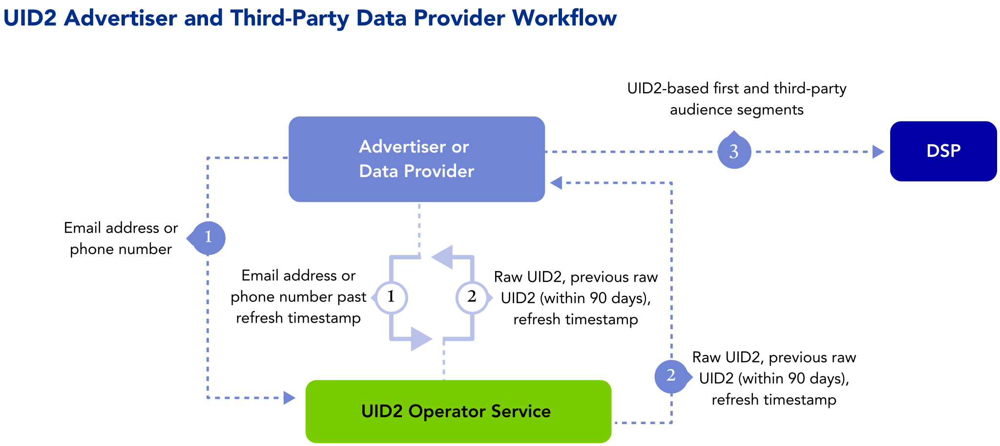

import Link from '@docusaurus/Link';

As an advertiser, you can upgrade your first-party data tactics with Unified ID 2.0 (UID2) to deliver omnichannel campaigns across devices with one identifier, for more durable identity strategies and better addressability.

Learn about benefits, workflow, documentation, and other resources for advertisers adopting UID2, as well as instructions for getting started.

:::note
If you want access in the left sidebar to the full set of UID2 documentation, see [Unified ID 2.0 Overview](../intro.md).
:::

## Benefits of UID2 for Advertisers

Here are just some of the intended benefits of using UID2 as part of your advertising strategy:
- Use a privacy-conscious form of CRM data in media-buying platforms.
- Simplify identity resolution at the household and individual level.
- Manage frequency and suppress audiences across channels and devices.
- Support identity use cases on Connected TV and on mobile apps where cookies don’t exist.
- Target and measure campaigns more holistically.
- Offer opt-out, with the goal of improving consumer privacy controls.

## Workflow for Advertisers

The following steps provide a high-level outline of the workflow intended for organizations that collect user data and push it to DSPs—for example, advertisers, identity graph providers, and third-party data providers.

The following process occurs in the background:
* The advertiser or data provider monitors the UID2 Operator for rotated salt buckets and updates UID2s as needed.

The following steps are an example of how an advertiser can integrate with UID2:

1. The advertiser sends a user’s <Link href="../ref-info/glossary-uid#gl-dii">directly identifying information (DII)</Link> to the UID2 Operator.
2. The UID2 Operator generates and returns a raw UID2 and salt bucket ID.
3. The advertiser stores the UID2 and salt bucket ID and sends the UID2-based first-party and third-party audience segments to the DSP. 

   Server-side: The advertiser stores the UID2 in a mapping table, DMP, data lake, or other server-side application.

## Getting Started

To get started, follow these steps:

1. Request access to UID2 by filling out the form on the [Request Access](/request-access) page.

   Someone will contact you to discuss your needs and advise on appropriate next steps.
1. Decide on your [participant](../intro.md#participants) role or roles.
1. Decide which implementation option you want to use.
1. Receive your credentials (see [UID2 Credentials](../getting-started/gs-credentials.md)) and follow the instructions in the implementation guide for the option you chose.

   :::note
   Be sure to encrypt request messages to UID2. For details, see [Encrypting Requests and Decrypting Responses](../getting-started/gs-encryption-decryption.md).
   :::
1. Test.
1. Go live.

## Implementation Resources

The following documentation resources are available for advertisers and data providers to implement UID2.

| Integration Type| Documentation | Content Description |
| :--- | :--- | :--- |
| Integration steps for organizations that collect user data and push it to other UID2 participants | [Advertiser/Data Provider Integration Guide](../guides/integration-advertiser-dataprovider-overview.md) | This guide covers integration workflows for mapping identity for audience-building and targeting. |
| Integration steps for advertisers and data providers who want to use the client-side JavaScript SDK for adding a UID2 token to their tracking pixels. | [Client-Side Integration Guide for JavaScript](../guides/integration-javascript-client-side.md) | This guide provides instructions for generating UID2 tokens (advertising tokens) using only JavaScript client-side changes.<!-- UID2_only: Not applicable for EUID --> |
| Snowflake | [Snowflake Integration Guide](../guides/snowflake_integration.md) | This guide provides instructions for generating UID2s from emails within Snowflake. |
| AWS Entity Resolution | [AWS Entity Resolution Integration Guide](../guides/integration-aws-entity-resolution.md) | This guide provides instructions for integrating with the UID2 framework using AWS Entity Resolution. |

## FAQs for Advertisers

For a list of frequently asked questions for advertisers using the UID2 framework, see [FAQs for Advertisers and Data Providers](../getting-started/gs-faqs.md#faqs-for-advertisers-and-data-providers).
