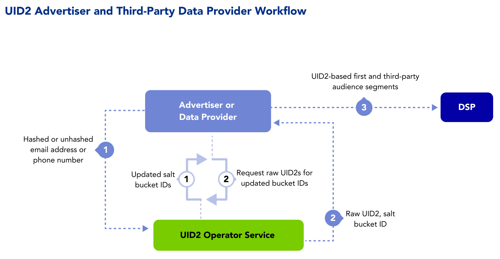

import Link from '@docusaurus/Link';

As a data and measurement provider, you can reduce identity fragmentation by adopting Unified ID 2.0 (UID2) to connect data with a more durable, omnichannel, and cross-device identifier to fulfil your customer use cases.

This solution is for you if you're offering data or related services for online or offline advertising, such as a provider of the following:
- Data onboarding
- Third-party audiences
- Identity resolution and graphs
- Measurement and attribution

Learn about the benefits, workflow, documentation, and other resources for data providers adopting UID2, as well as instructions for getting started.

:::note
If you want access in the left sidebar to the full set of UID2 documentation, see [Unified ID 2.0 Overview](../intro.md).
:::

## Benefits of UID2 for Data Providers

Here are just some of the intended benefits available to you as a data provider using UID2. You can:
- Upgrade to a more privacy-conscious identifier that offers opt-out for consumer privacy control.
- Facilitate the use of a connective identity thread between platforms and channels for resolution, activation, and measurement.
- Aim to future-proof audience segments with deterministic IDs for advertisers.
- Connect online and offline data with a common ID to aim for more precision.
- More accurately measure campaigns with or without third-party cookies.

## Workflow for Data Providers

The following steps provide a high-level outline of the workflow intended for organizations that collect user data and push it to DSPs—for example, advertisers, identity graph providers, and third-party data providers.

The following process occurs in the background:
* The advertiser or data provider monitors the UID2 Operator for rotated salt buckets, and updates UID2s as needed.

The following steps are an example of how a data provider can integrate with UID2:

1. The data provider sends a user’s <Link href="../ref-info/glossary-uid#gl-dii">directly identifying information (DII)</Link> to the UID2 Operator.

   <!-- euid_only_ep_20240312 ("consented" in above line DP only EUID only) -->

2. The UID2 Operator generates and returns a raw UID2 and salt bucket ID.
3. The data provider stores the UID2 and salt bucket ID and sends the UID2-based first-party and third-party audience segments to the DSP. 

   Server-side: The data provider stores the UID2 in a mapping table, DMP, data lake, or other server-side application.

## Getting Started

To get started, follow these steps:

1. Request access to UID2 by filling out the form on the [Request Access](/request-access) page.

   Someone will contact you to discuss your needs and advise on appropriate next steps.
1. Decide on your [participant](../intro.md#participants) role or roles.
1. Decide which implementation option you want to use.
1. Receive your credentials (see [UID2 Credentials](../getting-started/gs-credentials.md)) and follow the instructions in the implementation guide for the option you chose.

   :::note
   Be sure to encrypt request messages to UID2. For details, see [Encrypting Requests and Decrypting Responses](../getting-started/gs-encryption-decryption.md).
   :::
1. Test.
1. Go live.

## Implementation Resources

The following documentation resources are available for advertisers and data providers to implement UID2.

| Integration Type| Documentation | Content Description |
| :--- | :--- | :--- |
| Integration steps for organizations that collect user data and push it to other UID2 participants | [Advertiser/Data Provider Integration Guide](../guides/advertiser-dataprovider-guide.md) | This guide covers integration workflows for mapping identity for audience-building and targeting. |
| Snowflake | [Snowflake Integration Guide](../guides/snowflake_integration.md) | This guide provides instructions for generating UID2s from emails within Snowflake. |
| AWS Entity Resolution | [AWS Entity Resolution Integration Guide](../guides/integration-aws-entity-resolution.md) | This guide provides instructions for integrating with the UID2 framework using AWS Entity Resolution. |

## FAQs for Data Providers

For a list of frequently asked questions for data providers using the UID2 framework, see [FAQs for Advertisers and Data Providers](../getting-started/gs-faqs.md#faqs-for-advertisers-and-data-providers).
