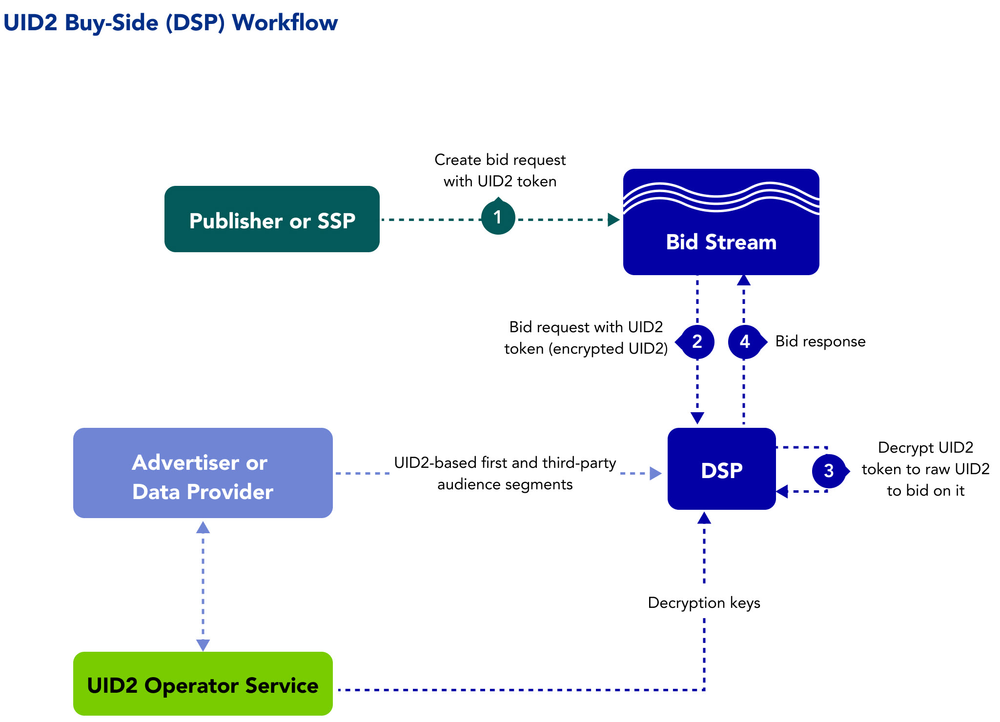

As a demand-side platform (DSP, media-buying platform), you can facilitate identity strategies that leverage Unified ID 2.0 (UID2) to facilitate the following:

- First-party data activation for advertisers
- Inventory monetization for publishers

Learn about benefits, workflow, documentation, and other resources for DSPs adopting UID2, as well as instructions for getting started.

:::note
If you want access in the left sidebar to the full set of UID2 documentation, see [Unified ID 2.0 Overview](../intro.md).
:::

## Benefits of UID2 for DSPs

Here are just some of the intended benefits for DSPs using UID2. You can:
- Upgrade identity resolution with an authenticated ID.
- Reduce dependency on third-party cookies.
- Execute omnichannel and cross-device frequency management and suppression.
- Facilitate first-party data activation with a more privacy-conscious standard for ID encryption.
- Aim to develop future-proof models with deterministic data.
- Maintain addressable audience targeting.
- Offer opt-out, with the goal of improving consumer privacy controls.
- More accurately measure campaigns with or without third-party cookies.

## Workflow for DSPs

The following steps provide a high-level outline of the workflow intended for DSPs that transact on UID2s in the bid stream.

The following processes occur in the background:
- The advertiser and/or data provider passes first-party and third-party audience segments to the DSP.
- The DSP syncs with the UID2 Operator to receive decryption keys.
- The DSP listens to opt-out requests from the UID2 Operator.

The following steps occur for each bid/ad impression:

1. A bid request is passed into the bid stream with the UID2 token.
2. The DSP receives the bid request with the UID2 token from the bid stream.
3. The DSP:
   - Decrypts the UID2 token into a raw UID2.
   - Checks to see if the user opted out and, if so, does not bid.
   - Matches the raw UID2 to an audience segment. 
4. The DSP sends a bid response to the bid stream with the UID2 token.

## Getting Started

To get started, follow these steps:

1. Request access to UID2 by filling out the form on the [Request Access](/request-access) page.
2. Implement a webhook to receive UID2 opt-out information, and share the webhook with the UID2 administrator.
3. Confirm that you are receiving the opt-out feed via the webhook.

    When the webhook is in place, you'll receive your credentials (see [UID2 Credentials](../getting-started/gs-credentials.md)).
4. Decide which implementation option you want to use.
5. If you're using an SDK, download the SDK. Refer to the applicable SDK guide.
6. Follow the instructions in the implementation guide for the option you chose.

   :::note
   Be sure to encrypt request messages to UID2. For details, see [Encrypting Requests and Decrypting Responses](../getting-started/gs-encryption-decryption.md).
   :::
7. (Conditional) If you want to implement a CRM onboarding solution, request a separate set of credentials for the data provider workflow. See [UID2 Credentials](../getting-started/gs-credentials.md).
8. Test.
9. Go live.

## Implementation Resources

The following documentation resources are available for DSPs to implement UID2.

| Type| Documentation | Content Description |
| :--- | :--- | :--- |
|UID2 SDK for Java | [UID2 SDK for Java Reference Guide](../sdks/uid2-sdk-ref-java.md) | An SDK for anyone using Java server-side and who wants to decrypt UID2 advertising tokens to access the raw UID2.|
|UID2 SDK for Python | [UID2 SDK for Python Reference Guide](../sdks/uid2-sdk-ref-python.md) | An SDK for anyone using Python server-side and who wants to decrypt UID2 advertising tokens to access the raw UID2.|
|UID2 SDK for C# / .NET | [UID2 SDK for C# / .NET Reference Guide](../sdks/uid2-sdk-ref-csharp-dotnet.md) | An SDK for anyone using .NET server-side and who wants to decrypt UID2 advertising tokens to access the raw UID2.|
|UID2 SDK for C++ | [UID2 SDK for C++ Reference Guide](../sdks/uid2-sdk-ref-cplusplus.md) | An SDK for anyone using C++ server-side and who wants to decrypt UID2 advertising tokens to access the raw UID2.|
| Integration Guide | [DSP Integration Guide](../guides/dsp-guide.md) | This integration guide for DSPs covers handling UID2s for bidding and honoring user opt-outs. |

<!-- ## Integration Requirements

To integrate with UID2 to receive UID2s from brands (as first-party data) and data providers (as third-party data) and leverage them to inform bidding on UID2s in the bid stream, the buy-side participants must meet the following requirements:

- Accept data in the form of UID2s
- Bid on data in the form of UID2s
- Build a webhook for honoring opt-out requests
- Sync encryption keys daily with the UID2 Administrator

For details, see [DSP Integration Guide](../guides/dsp-guide.md).

Optionally, if DSPs want to generate UID2s themselves from DII, they can also follow the [Third-Party Data Provider Workflow](overview-data-providers.md#workflow-for-data-providers). -->

## FAQs for DSPs

For a list of frequently asked questions for DSPs using the UID2 framework, see [FAQs for DSPs](../getting-started/gs-faqs.md#faqs-for-dsps).
