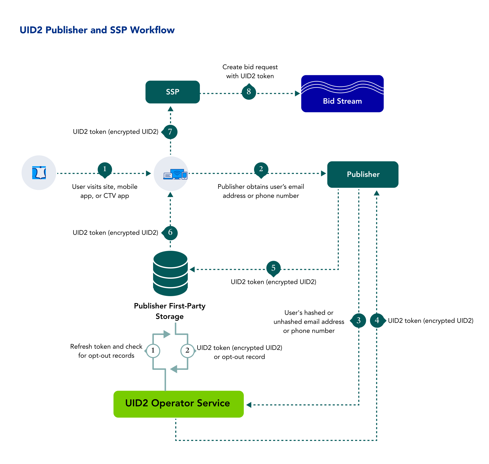

import Link from '@docusaurus/Link';

As a publisher, you can benefit from the cross-device presence of Unified ID 2.0 (UID2) and take advantage of a consistent identity fabric on all your inventory.

Learn about benefits, workflow, documentation, and other resources for publishers adopting UID2, as well as instructions for getting started.

:::note
If you want access in the left sidebar to the full set of UID2 documentation, see [Unified ID 2.0 Overview](../intro.md).
:::

## Benefits of UID2 for Publishers

Here are just some of the intended benefits for publishers integrating with UID2:
- Addressable audience targeting on desktop, mobile, and CTV with a single identifier.
- Frequency management across devices.
- More relevant content recommendations.
- The ability to provide personalized ad experiences with relevant content.
- The ability to offer opt-out, with the goal of improving consumer privacy controls.

## Workflow for Publishers

The following steps provide a high-level outline of the workflow intended for organizations that propagate UID2 tokens to the <Link href="../ref-info/glossary-uid#gl-bidstream">bidstream</Link> via SSPs&#8212;for example, identity providers, publishers, and SSO providers. Publishers can choose to work with an SSO provider or an independent ID provider that is interoperable with UID2 and can handle the UID2 integration on behalf of publishers.

1. A user visits a publisher website, mobile app, or CTV app.
2. The publisher provides transparency around its data practices and asks the user to provide an email address or phone number.
3. Once the user has provided an email address or phone number, the publisher sends it to the UID2 Operator via an SDK or direct API integration.

   A publisher can authorize an SSO provider or identity provider to pass <Link href="../ref-info/glossary-uid#gl-dii">DII</Link> on their behalf.
4. The UID2 Operator:
   - Takes the email or phone number.
   - Performs the salt, hash, and encryption process.
   - Returns the UID2 token.
5. The publisher stores the UID2 token to share with SSPs during real-time bidding.
   - Server-side: The publisher stores the token in a mapping table, DMP, data lake, or other server-side application.
   - Client-side: The publisher stores the token in a client-side app or in the user’s browser as a first-party cookie.
6. The publisher retrieves the UID2 token from storage.
6. The publisher sends the UID2 token to the SSP.
7. The SSP puts the bid request, with the UID2 token, into the bidstream.

<!-- The publisher requests updated UID2 tokens using a refresh token. When applicable, the refresh token includes a user’s opt-out request. -->

## Getting Started

To get started, follow these steps:

1. Request access to UID2 by filling out the form on the [Request Access](/request-access) page.
1. Identify the properties that you want to integrate with UID2.
1. Sign the UID2 contract.
1. Determine whether you want a <Link href="../ref-info/glossary-uid#gl-client-side">client-side</Link>, <Link href="../ref-info/glossary-uid#gl-server-side">server-side</Link>, or <Link href="../ref-info/glossary-uid#gl-client-server">client-server</Link> integration, and tell your UID2 contact. <!-- (**GWH_KK new page coming that we will link to**) -->
1. Receive the [UID2 credentials](../getting-started/gs-credentials.md).
1. Build your integration to UID2 via an SDK or direct integration with the UID2 APIs, using the applicable [implementation resources](#implementation-resources).

   :::note
   Be sure to encrypt request messages to UID2. For details, see [Encrypting Requests and Decrypting Responses](../getting-started/gs-encryption-decryption.md).
   :::

1. Test: 

    - Confirm that UID2 tokens are being generated and passed correctly within the bid request.
    - Troubleshoot as needed, and work with SSPs to properly pass UID2 tokens in bid requests.
1. Go live.

## Implementation Resources

The following resources are available for publishers to implement UID2:

- [Web Integrations](#web-integrations)
- [Mobile Integrations](#mobile-integrations)
- [CTV Integrations](#ctv-integrations)
- [Prebid Integrations](#prebid-integrations)
- [Google Ad Manager Integrations](#google-ad-manager-integrations)

### Web Integrations

The following resources are available for publisher web integrations.

:::tip
For a detailed summary of web integration options, see [Web Integration Overview](../guides/integration-options-publisher-web.md).
:::

| Integration Type| Documentation | Content Description |
| :--- | :--- | :--- |
| Prebid.js (Overview) | [UID2 Integration Overview for Prebid.js](../guides/integration-prebid.md) | An overview of options for publishers who want to integrate with UID2 and generate UID2 tokens to be passed by Prebid.js in the RTB bidstream. |
| Prebid.js Client-Side Integration | [UID2 Client-Side Integration Guide for Prebid.js](../guides/integration-prebid-client-side.md) | A guide for publishers who want to request UID2 tokens client-side, which is the easiest implementation approach, and choose to have Prebid.js manage the following: <ul><li>Token generation and token refresh.</li><li>Passing the tokens into the RTB bidstream.</li></ul> |
| Prebid.js Client-Server Integration | [UID2 Client-Server Integration Guide for Prebid.js](../guides/integration-prebid-server-side.md) | A guide for publishers who want to integrate with UID2 and generate <Link href="../ref-info/glossary-uid#gl-uid2-token">UID2 tokens</Link> (advertising tokens) to be passed by Prebid.js in the RTB bidstream, but want to generate tokens server-side: for example, publishers who are using a Private Operator. |
| JavaScript (Overview) | [UID2 Integration Overview for JavaScript](../guides/integration-javascript.md) | An overview of options for publishers who want to integrate with UID2 using the JavaScript SDK. |
| JavaScript Client-Side Integration | [Client-Side Integration Guide for JavaScript](../guides/publisher-client-side.md) | A guide for publishers who want to integrate with UID2 using only client-side JavaScript changes, which is the easiest implementation approach. The UID2 SDK for JavaScript manages token generation and token refresh automatically. |
| JavaScript Client-Server Integration | [Client-Server Integration Guide for JavaScript](../guides/integration-javascript-server-side.md) | A publisher guide covering standard web integration scenarios that use the UID2 SDK for JavaScript and require tokens to be generated on the server side and passed to the publisher web pages. |
| Server-Side Integration | [Publisher Integration Guide, Server-Side](../guides/custom-publisher-integration.md) | A guide for publishers who do not use the [UID2 SDK for JavaScript](../sdks/client-side-identity.md). |
| Publisher/SSP Integration with GAM | [Google Ad Manager Secure Signals Integration Guide](../guides/google-ss-integration.md) | A guide covering the additional steps needed for publishers using UID2 with the Google Ad Manager Secure Signals feature (previously known as Encrypted Signals for Publishers, ESP). |

### Mobile Integrations

The following resources are available for publisher integrations supporting Android or iOS devices.

| Integration Type| Documentation | Content Description |
| :--- | :--- | :--- |
| Android/iOS (Overview) | [Mobile Integration Overview for Android and iOS](../guides/integration-mobile-overview.md) | An overview of options for mobile app publishers who want to integrate with UID2 using the UID2 SDK for Android or the UID2 SDK for iOS. |
| Android/iOS, Client-Side Integration | [Client-Side Integration Guide for Mobile](../guides/integration-mobile-client-side.md) | An integration guide for mobile app publishers who want to integrate with UID2 with changes only within the mobile app (no server-side changes). |
| Android/iOS, Client-Server Integration | [Client-Server Integration Guide for Mobile](../guides/integration-mobile-client-server.md) | An integration guide for mobile app publishers who want to integrate with UID2 by doing the following:<ol><li>Generating UID2 tokens server-side via either a Public or Private Operator.</li><li>Passing the resulting <Link href="../ref-info/glossary-uid#gl-identity">identities</Link> to a mobile app for passing into the bidstream.</li></ol> |

### CTV Integrations

The following resources are available for publisher integrations supporting CTV.

| Integration Type| Documentation | Content Description |
| :--- | :--- | :--- |
| CTV | [CTV Integration Guide](../guides/integration-ctv-guide.md) | A summary of CTV integration options, with links to additional information and instructions. |

### Prebid Integrations

The following resources are available for publishers integrating with Prebid.

| Integration Type| Documentation | Content Description |
| :--- | :--- | :--- |
| Prebid.js (Overview) | [UID2 Integration Overview for Prebid.js](../guides/integration-prebid.md) | An overview of options for publishers who want to integrate with UID2 and generate UID2 tokens to be passed by Prebid.js in the RTB bidstream. |
| Prebid.js Client-Side Integration | [UID2 Client-Side Integration Guide for Prebid.js](../guides/integration-prebid-client-side.md) | A guide for publishers who want to request UID2 tokens client-side, which is the easiest implementation approach, and choose to have Prebid.js manage the following: <ul><li>Token generation and token refresh.</li><li>Passing the tokens into the RTB bidstream.</li></ul> |
| Prebid.js Client-Server Integration | [UID2 Client-Server Integration Guide for Prebid.js](../guides/integration-prebid-server-side.md) | A guide for publishers who want to integrate with UID2 and generate UID2 tokens to be passed by Prebid.js in the RTB bidstream, but want to generate tokens server-side: for example, publishers who are using a Private Operator. |

### Google Ad Manager Integrations

The following resources are available for publishers integrating with Google Ad Manager.

| Integration Type| Documentation | Content Description |
| :--- | :--- | :--- |
| Publisher/SSP Integration with GAM | [Google Ad Manager Secure Signals Integration Guide](../guides/google-ss-integration.md) | A guide covering the additional steps needed for publishers using UID2 with the Google Ad Manager Secure Signals feature (previously known as Encrypted Signals for Publishers, ESP). |
| GMA for Android | [UID2 GMA Plugin for Android Integration Guide](../guides/mobile-plugin-gma-android.md) | A guide that enables publishers using the Google Mobile Ads (GMA) SDK to include UID2 tokens in ad requests from their Android apps. |
| GMA for iOS | [UID2 GMA Plugin for iOS Integration Guide](../guides/mobile-plugin-gma-ios.md) | A guide that enables publishers using the Google Mobile Ads (GMA) SDK to include UID2 tokens in ad requests from their iOS apps. |
| IMA for Android | [UID2 IMA Plugin for Android Integration Guide](../guides/mobile-plugin-ima-android.md) | A guide that enables publishers using the Google Interactive Media Ads (IMA) SDK to include UID2 tokens in ad requests from their Android apps. |
| IMA for iOS | [UID2 IMA Plugin for iOS Integration Guide](../guides/mobile-plugin-ima-ios.md) | A guide that enables publishers using the Google Interactive Media Ads (IMA) SDK to include UID2 tokens in ad requests from their iOS apps. |

## FAQs for Publishers

For a list of frequently asked questions for publishers using the UID2 framework, see [FAQs for Publishers](/docs/getting-started/gs-faqs.md#faqs-for-publishers).
