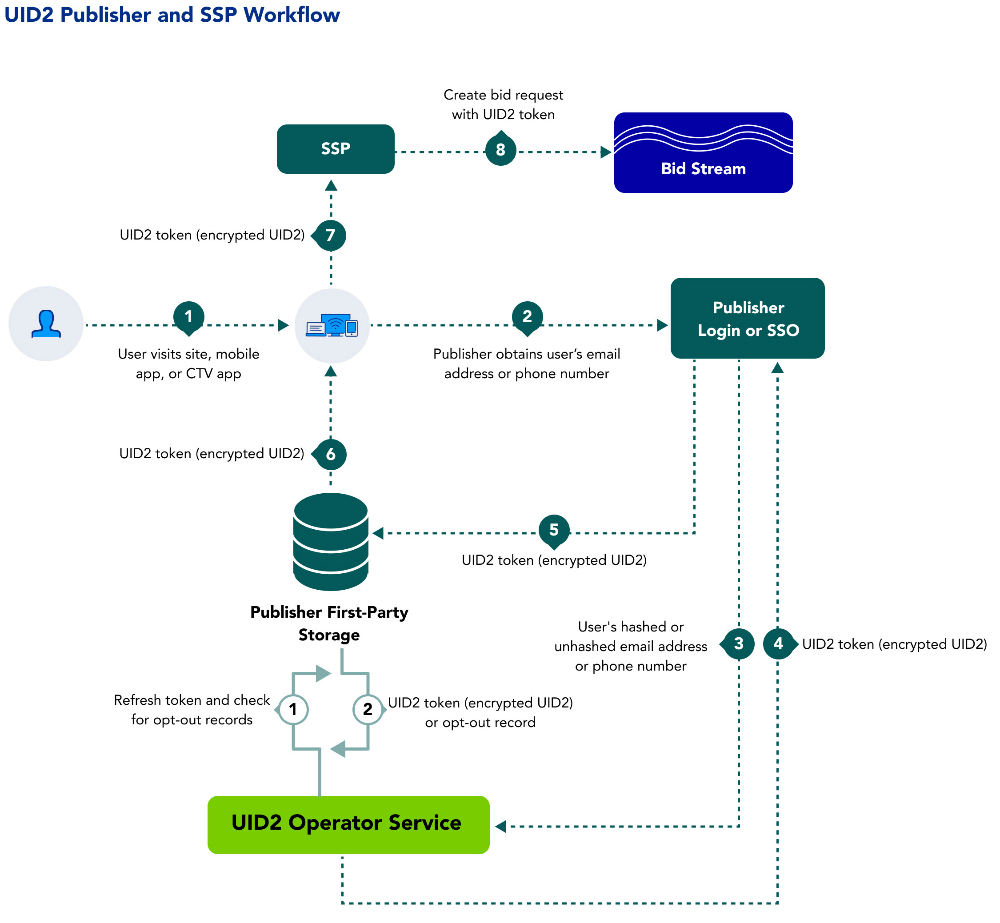

Publishers can benefit from the cross-device presence of Unified ID 2.0 and take advantage of a consistent identity fabric on all of their inventory.

The following sections provide information about benefits, workflow, documentation, and other resources for publishers adopting UID2.

## Audience

This page is for the following UID2 participants:

- Publishers with web assets who want to use UID2 to generate identity tokens for the RTB bid stream, while integrating directly with UID2 rather than UID2-enabled single-sign-on or identity providers.
- Any organizations that propagate [UID2 tokens](../ref-info/glossary-uid.md#gl-uid2-token) to the bid stream via SSPs&#8212;for example, identity providers and SSO providers.
<!-- - Data clean rooms. -->

Publishers can choose to integrate with UID2 in a number of different ways:

- By integrating directly with UID2, either by using an SDK or via the UID2 API.
- By using an SSO provider.
- By working with an independent ID provider that manages the UID2 integration on behalf of the publisher.

## Benefits of UID2 for Publishers

Here are just some of the intended benefits of integrating with UID2:
- Addressable audience targeting on desktop, mobile, and CTV with a single identifier.
- Frequency management across devices.
- More relevant content recommendations.
- The ability to provide personalized ad experiences with relevant content.
- The ability to offer opt-out, with the goal of improving consumer privacy controls.

## Workflow for Publishers

The following steps provide a high-level outline of the workflow intended for organizations that propagate UID2 tokens to the bid stream via SSPs—for example, identity providers, publishers, and SSO providers. Publishers can choose to work with an SSO provider or an independent ID provider that is interoperable with UID2 and can handle the UID2 integration on behalf of publishers.

1. A user visits a publisher website, mobile app, or CTV app.
2. The publisher explains the value exchange of the open internet and requests the user to provide an email address or phone number, by login or other means.
3. Once the user logs in, the publisher sends the email or phone number to the UID2 Operator via an SDK or direct API integration.

   A publisher can authorize an SSO provider or identity provider to pass DII and privacy settings on their behalf.
4. The UID2 Operator:
   - Takes the email or phone number.
   - Performs the salt, hash, and encryption process.
   - Returns the UID2 Token.
5. The publisher stores the UID2 token to share with SSPs during real-time bidding.
   - Server-side: The publisher stores the token in a mapping table, DMP, data lake, or other server-side application.
   - Client-side: The publisher stores the token in a client-side app or in the user’s browser as a first-party cookie.
6. The publisher retrieves the UID2 token from storage.
6. The publisher sends the UID2 token to the SSP.
7. The SSP put the bid request, with the UID2 token, into the bid stream.

<!-- The publisher requests updated UID2 tokens using a refresh token. When applicable, the refresh token includes a user’s opt-out request. -->

## Getting Started

To get started, follow these steps:

1. Request access to UID2 by filling out the form on the [Request Access](/request-access) page.
1. Identify the properties that you want to integrate with UID2.
1. Sign the UID2 contract.
1. Receive the UID2 authentication keys ([API keys](../getting-started/gs-api-keys.md)).
1. Build your integration to UID2 via an SDK or direct integration with the UID2 APIs, using the applicable documentation.

     NOTE: Be sure to encrypt request messages to UID2. For details, see [Encrypting Requests and Decrypting Responses](../getting-started/gs-encryption-decryption.md).
1. Test: 

    Work with SSPs to properly pass UID2s in bid requests.
    
    Confirm that UID2s are being generated and passed correctly in requests.
1. Go live.

## Resources

The following documentation resources are available for publishers to implement UID2:

- [Web Integrations](#web-integrations)
- [Mobile Integrations](#mobile-integrations)
- [Prebid Integrations](#prebid-integrations)
- [Google Ad Manager Integrations](#google-ad-manager-integrations)

### Web Integrations

The following resources are available for publisher web integrations.

| Integration Type                    | Integration Guide                                                                                     | Content Description                                                                                                                                                                                                                                                    | Audience |
|:------------------------------------|:------------------------------------------------------------------------------------------------------|:-----------------------------------------------------------------------------------------------------------------------------------------------------------------------------------------------------------------------------------------------------------------------| :--- |
| Prebid                              | [Prebid.js Express Integration Guide](../guides/integration-prebid.md)                                | An integration guide for publishers who want to integrate with UID2 and generate identity tokens to be passed by Prebid in the RTB bid stream. This guide is for publishers who want to request UID2 tokens client-side, which is the easiest implementation approach. | Publishers |
| JavaScript Client-Side Integration  | [JavaScript Express Integration Guide](../guides/publisher-client-side.md)                            | An integration guide for publishers who wants to integrate with UID2 using client-side only JavaScript changes with minimum effort. UID2 SDK for JavaScript will manage token generation and refresh automatically.                                                    | Publishers |
| Prebid                              | [Prebid.js Advanced Integration Guide](../guides/integration-prebid-advanced.md)                      | An integration guide for publishers who want to integrate with UID2 and generate identity tokens to be passed by Prebid in the RTB bid stream. This guide is for publishers who are using a private operator or who want to generate tokens server-side.               | Publishers |
| JavaScript Client-Side Integration  | [Advanced Client-Side JavaScript SDK Integration Guide](../guides/integration-javascript-advanced.md) | This integration guide for publishers covers web integration without using the Express Integration method, such as generating UID2 tokens on the server side.                                                                                                          | Publishers |
| Server-Side Integration             | [Publisher Integration Guide, Server-Only](../guides/custom-publisher-integration.md)                 | This integration guide is for publishers that do not use the [UID2 SDK for JavaScript Reference Guide](../sdks/client-side-identity.md).                                                                                                                               | Publishers |
| Publisher/SSP Integration with GAM  | [Publisher - Google Ad Manager Secure Signals](../guides/google-ss-integration.md)                    | This integration guide covers the additional steps needed for publishers using UID2 with the Google Ad Manager Secure Signals feature (previously known as Encrypted Signals for Publishers, ESP).                                                                     | Publishers |

### Mobile Integrations

The following resources are available for publishers integrating with Android or iOS devices.

| Integration Type| Documentation | Content Description | Audience |
| :--- | :--- | :--- | :--- |
| Android | [UID2 SDK for Android Reference Guide](../sdks/uid2-sdk-ref-android.md) |  This integration guide is for publishers who want to establish client identity using UID2 and retrieve advertising tokens on Android devices. | Publishers |
| iOS  | [UID2 SDK for iOS Reference Guide](../sdks/uid2-sdk-ref-ios.md) | This integration guide is for publishers who want to establish client identity using UID2 and retrieve advertising tokens on iOS devices. | Publishers |

### Prebid Integrations

The following resources are available for publishers integrating with Google Ad Manager.

| Integration Type| Documentation | Content Description | Audience |
| :--- | :--- | :--- | :--- |
| Prebid | [Prebid.js Integration Guide](../guides/integration-prebid.md) | An integration guide for publishers who want to integrate with UID2 and generate identity tokens to be passed by Prebid in the RTB bid stream. This guide is for publishers who want to request UID2 tokens client-side, which is the easiest implementation approach. | Publishers |
| Prebid | [Prebid.js Advanced Integration Guide](../guides/integration-prebid-advanced.md) | An integration guide for publishers who want to integrate with UID2 and generate identity tokens to be passed by Prebid in the RTB bid stream. This guide is for publishers who are using a private operator or who want to generate tokens server-side. | Publishers |

### Google Ad Manager Integrations

The following resources are available for publishers integrating with Google Ad Manager.

| Integration Type| Documentation | Content Description | Audience |
| :--- | :--- | :--- | :--- |
| Publisher/SSP Integration with GAM | [Publisher - Google Ad Manager Secure Signals](../guides/google-ss-integration.md) | This integration guide covers the additional steps needed for publishers using UID2 with the Google Ad Manager Secure Signals feature (previously known as Encrypted Signals for Publishers, ESP). | Publishers |
| GMA for Android | [UID2 GMA Plugin for Android Integration Guide](../guides/mobile-plugin-gma-android.md) | This integration guide enables publishers that use the Google Mobile Ads (GMA) SDK to include UID2 tokens in ad requests from their Android apps. | Publishers |
| GMA for iOS | [UID2 GMA Plugin for iOS Integration Guide](../guides/mobile-plugin-gma-ios.md) | This integration guide enables publishers that use the Google Mobile Ads (GMA) SDK to include UID2 tokens in ad requests from their iOS apps. | Publishers |
| IMA for Android | [UID2 IMA Plugin for Android Integration Guide](../guides/mobile-plugin-ima-android.md) | This integration guide enables publishers that use the Google Interactive Media Ads (IMA) SDK to include UID2 tokens in ad requests from their Android apps. | Publishers |
| IMA for iOS | [UID2 IMA Plugin for iOS Integration Guide](../guides/mobile-plugin-ima-ios.md) | This integration guide enables publishers that use the Google Interactive Media Ads (IMA) SDK to include UID2 tokens in ad requests from their iOS apps. | Publishers |

<!-- ## Integrations 

For integration scenarios, token management, and other details, see [Publisher Integration Guides](../guides/summary-guides.md). See also [Endpoints](../endpoints/summary-endpoints.md).

### Direct Integration Requirements

Publishers who want to send users' DII and generate UID2s must meet the following requirements:

- Have access to the UID2 Operator API.
- Integrate with UID2 Operator API to generate UID2 tokens.
- Maintain refresh tokens or use the JavaScript client-side SDK provided by UID2 to manage the refresh token.
- Enable sending the UID2 token to SSPs and other integrating organizations.

### Integration Through SSO or Identity Providers

Publishers can choose to work with an SSO or independent ID provider who is interoperable with UID2. The provider can handle the UID2 integration on their behalf. -->

## FAQs for Publishers

For a list of frequently asked questions for publishers using the UID2 framework, see [FAQs for Publishers](/docs/getting-started/gs-faqs.md#faqs-for-publishers).