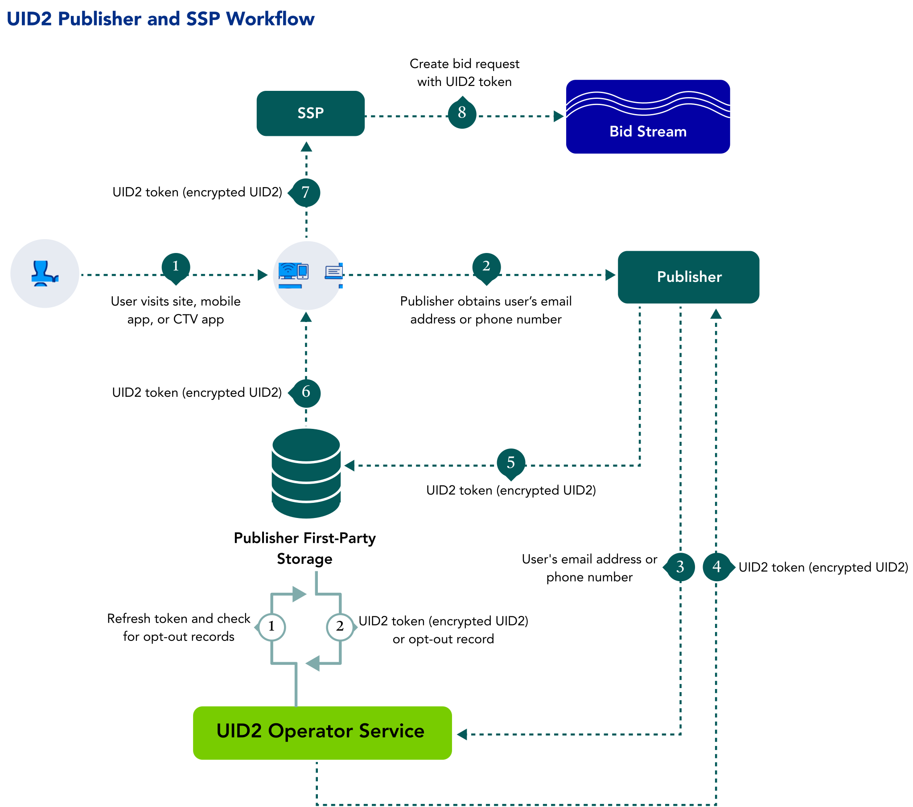

import Link from '@docusaurus/Link';
import SnptIntegratingWithSSO from '../snippets/_snpt-integrating-with-sso.mdx';
import SnptPrivateOperatorOption from '../snippets/_snpt-private-operator-option.mdx';
import SnptPublisherImplementationResources from '../snippets/_snpt-publisher-implementation-resources.mdx';

As a publisher, you can benefit from the cross-device presence of Unified ID 2.0 (UID2) and take advantage of a consistent identity fabric on all your inventory.

Learn about benefits, workflow, documentation, and other resources for publishers adopting UID2, as well as instructions for getting started.

:::note
If you want access in the left sidebar to the full set of UID2 documentation, see [Unified ID 2.0 Overview](../intro.md).
:::

## Benefits of UID2 for Publishers

Here are just some of the intended benefits for publishers integrating with UID2:
- Addressable audience targeting on desktop, mobile, and CTV with a single identifier.
- Frequency management across devices.
- More relevant content recommendations.
- The ability to provide personalized ad experiences with relevant content.
- The ability to offer opt-out, with the goal of improving consumer privacy controls.

## Workflow for Publishers

The following steps provide a high-level outline of the workflow intended for organizations that propagate UID2 tokens to the <Link href="../ref-info/glossary-uid#gl-bidstream">bidstream</Link> via SSPs&#8212;for example, identity providers, publishers, and SSO providers. Publishers can choose to work with an SSO provider or an independent ID provider that is interoperable with UID2 and can handle the UID2 integration on behalf of publishers.

1. A user visits a publisher website, mobile app, or CTV app.

1. The publisher provides transparency around its data practices and asks the user to provide an email address or phone number, by [SSO login](#integrating-with-single-sign-on-sso) or other means.

1. Once the user has provided an email address or phone number, the publisher sends it to the UID2 Operator via an SDK or direct API integration.
   :::tip
    A publisher can authorize an SSO provider or identity provider to pass <Link href="../ref-info/glossary-uid#gl-dii">DII</Link> on their behalf.
    :::

1. The UID2 Operator:
   - Takes the email or phone number.
   - Performs the salt, hash, and encryption process.
   - Returns the UID2 token.

1. The publisher stores the UID2 token to share with SSPs during real-time bidding.
   - Server-side: The publisher stores the token in a mapping table, DMP, data lake, or other server-side application.
   - Client-side: The publisher stores the token in a client-side app or in the user’s browser as a first-party cookie.

1. The publisher retrieves the UID2 token from storage.

1. The publisher sends the UID2 token to the SSP.

1. The SSP puts the bid request, with the UID2 token, into the bidstream.

<!-- The publisher requests updated UID2 tokens using a refresh token. When applicable, the refresh token includes a user’s opt-out request. -->

## Integrating with Single Sign-On (SSO)

<SnptIntegratingWithSSO />

## Private Operator Option

<SnptPrivateOperatorOption />

## Getting Started

To get started, follow these steps:

1. Request access to UID2 by filling out the form on the [Request Access](/request-access) page.
1. Identify the properties that you want to integrate with UID2.
1. Sign the UID2 contract.
1. Determine whether you want a <Link href="../ref-info/glossary-uid#gl-client-side">client-side</Link>, <Link href="../ref-info/glossary-uid#gl-client-server">client-server</Link>, or <Link href="../ref-info/glossary-uid#gl-server-side">server-side</Link> integration, and tell your UID2 contact.

   For more information about these options, see [Integration Approaches](../ref-info/ref-integration-approaches.md).
   
1. Receive the [UID2 credentials](../getting-started/gs-credentials.md).
1. Build your integration to UID2 via an SDK or direct integration with the UID2 APIs, using the applicable [implementation resources](#implementation-resources).

   :::note
   Be sure to encrypt request messages to UID2. For details, see [Encrypting Requests and Decrypting Responses](../getting-started/gs-encryption-decryption.md).
   :::

1. Test: 

    - Confirm that UID2 tokens are being generated and passed correctly within the bid request.
    - Troubleshoot as needed, and work with SSPs to properly pass UID2 tokens in bid requests.
1. Go live.

## Implementation Resources

<SnptPublisherImplementationResources />

## FAQs for Publishers

For a list of frequently asked questions for publishers using the UID2 framework, see [FAQs for Publishers](/docs/getting-started/gs-faqs.md#faqs-for-publishers).
