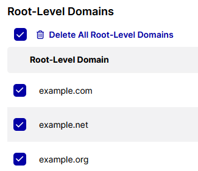

# Client-Side Integration

In the UID2 Portal, if you want to use an implementation option that generates UID2 tokens on the client side, you'll need to define the following values that are applicable to your implementation type:

| Value | Implementation Type | Details | Documentation Link |
| :--- | :--- | :---| :---|
| Key pair | All (web or mobile) | At least one. In your implementation, you'll share the public key. | [Subscription ID and Public Key](../getting-started/gs-credentials.md#subscription-id-and-public-key) |
| Domain | Web | At least one. Provide a complete list of your root-level domains. | [Client-Side Web Integrations](../getting-started/gs-account-setup.md#client-side-web-integrations) |
| Mobile App ID | Mobile | Any IDs that apply to your mobile apps, such as Android App ID, iOS/tvOS Bundle ID, or iOS App Store ID. | [Client-Side Mobile Integrations](../getting-started/gs-account-setup.md#client-side-mobile-integrations) |

:::important
It's important to provide a complete list of root-level domain names for your sites, and mobile app IDs for your apps. This is a security measure, for client-side implementation only. If a domain or app is not defined in the UID2 Portal, UID2 token requests from that domain or app will fail.
:::

On the Client-Side Integration page you can perform all activities relating to setting up and managing these values, including the following:
- [Adding and Managing Key Pairs](#adding-and-managing-key-pairs)
- [Adding and Managing Root-Level Domains](#adding-and-managing-root-level-domains)
- [Adding and Managing Mobile App IDs](#adding-and-managing-mobile-app-ids)

:::note
When you go into the Client-Side Integration page, you'll be prompted to provide missing configuration items if you haven't yet created at least one key pair and at least one root-level domain or mobile app ID.
:::

## Client-Side Implementation Options

Client-side implementation options are shown in the following table. The options available to you depend on your role.

| Client-Side Implementation Option | Available For (Role) | Documentation Link |
| :--- | :--- | :---|
| UID2 JavaScript SDK | Publishers, Advertisers | [Client-Side Integration Guide for JavaScript](../guides/integration-javascript-client-side.md) |
| Prebid.js client-side integration | Publishers only |[UID2 Client-Side Integration Guide for Prebid.js](../guides/integration-prebid-client-side.md) |
| UID2 Mobile SDK | Publishers only |[UID2 Client-Side Integration Guide for Mobile](../guides/integration-mobile-client-side.md) |

## Adding and Managing Key Pairs

On the Client-Side Integration page, you can perform the following activities relating to setting up and managing key pairs:

- [Adding a Key Pair](#adding-a-key-pair)
- [Copying or Viewing a Public Key](#copying-or-viewing-a-public-key)
- [Changing the Name of a Key Pair](#changing-the-name-of-a-key-pair)
- [Deleting a Key Pair](#deleting-a-key-pair)

### Adding a Key Pair

To add a key pair, complete the following steps:

1. Log in to your UID2 Portal account.
1. On the **Client-Side Integration** page, click **Add Key Pair**.
1. In the **Add Key Pair** overlay, provide a name, and then click **Add Key Pair**.

   On the **Client-Side Integration** page, the new key pair is displayed with the name, Subscription ID, public key, and the date it was created.

### Copying or Viewing a Public Key

When you create a key pair in the Client-Side Integration page, you can share your public key. The UID2 service uses the corresponding private key, plus other values, to authenticate your messages.

To view or copy a public key, follow these steps:

1. In the UID2 Portal, go to the **Client-Side Integration** page.
1. Find the key pair on the list and then, in the Public Key column, do one of the following:

   - Click  (the View Public Key icon) to view the key in a popup.
   - Click   (the Copy Public Key to Clipboard icon).

     Save the public key in a safe place.

### Changing the Name of a Key Pair

When you've created a key pair, the only value you can change is the name. To change the value, you'll need to create a new key pair.

To change the name of a key pair, complete the following steps:

1. In the UID2 Portal, go to the **Client-Side Integration** page.
1. Find the key pair on the list.
1. In the Actions column, click  (the Edit icon).
1. Update the name, and then click **Save Key Pair**.

### Deleting a Key Pair

To delete a key pair, follow these steps:

1. Find the key on the list and then, in the Actions column, click  (the Delete icon).
1. At the confirmation message, type the Subscription ID to confirm that you want to delete the key pair. You can copy and paste from the display.
1. Click **Delete Key Pair**.

   The key pair is removed from the display and is no longer valid.

## Adding and Managing Root-Level Domains

On the Client-Side Integration page, you can perform the following activities relating to setting up and managing domains:

- [Adding Domains](#adding-domains)
- [Updating a Domain](#updating-a-domain)
- [Deleting a Domain](#deleting-a-domain)
- [Deleting Multiple Domains](#deleting-multiple-domains)

### Adding Domains

It's important to provide a complete list of root-level domain names. UID2 token requests are accepted only from domains that are set up in the UID2 Portal.

:::tip
Only root-level domains are required for account setup. For example, if you're going to implement UID2 to generate tokens on the client side on example.com, shop.example.com, and example.org, you only need to provide the domain names example.com and example.org.
:::

To add one or more root-level domains, complete the following steps:

1. Log in to your UID2 Portal account.
1. On the **Client-Side Integration** page, click **Add Domains**.
1. In the **Add Domains** overlay, type or paste the list of domains. Note:

   - The following are valid as separators for values in the list: comma, semicolon, space, tab, or new line.
   - By default, the domains you add are appended to the list. To replace the existing list, check **Replace all existing domains with the new ones.**

1. Click **Add Domains**.

   On the **Client-Side Integration** page, the list is updated.

### Updating a Domain

To update the name of a domain on the list, complete the following steps:

1. In the UID2 Portal, go to the **Client-Side Integration** page.
1. In the **Root-Level Domains** section, find the domain that you want to update. If necessary, use the Search tool to locate it on the list.
1. In the Actions column, click  (the Edit icon).
1. Update the name, and then click **Save Domain**.

### Deleting a Domain

To delete a domain from your list, follow these steps:

1. In the UID2 Portal, go to the **Client-Side Integration** page.
1. In the **Root-Level Domains** section, find the domain that you want to delete. If necessary, use the Search tool to locate it on the list.
1. In the Actions column, click  (the Delete icon).
1. At the confirmation message, click **Delete Domain**.

   The domain is removed from your domains list.

### Deleting Multiple Domains

There are two ways that you can delete more than one domain at a time:

- Choose multiple individual values from the list and then delete the selected domains.
- Replace your existing list with an updated list that you are adding. See [Adding Domains](#adding-domains).

To multi-select domains for deletion:

1. In the UID2 Portal, go to the **Client-Side Integration** page.
1. In the **Root-Level Domains** section of the page, check the box below the heading.

   A Delete icon appears, and all domains are selected for deletion.

   

1. Conditional: if you want to keep some of the domains, clear the checkboxes for those domains.

1. Above the list, click  Delete Root-Level Domain/Delete Root-Level Domains/Delete All Root-Level Domains (depending on your selections).

1. At the confirmation message, click **Delete Domains**.

   The domains are removed from your domains list.

## Adding and Managing Mobile App IDs

On the Client-Side Integration page, you can perform the following activities relating to setting up and managing mobile app IDs:

- [Adding Mobile App IDs](#adding-mobile-app-ids)
- [Updating a Mobile App ID](#updating-a-mobile-app-id)
- [Deleting a Mobile App ID](#deleting-a-mobile-app-id)
- [Deleting Multiple Mobile App IDs](#deleting-multiple-mobile-app-ids)

### Adding Mobile App IDs

It's important to provide a complete list of all your mobile app IDs, including:
- Android App ID: any that apply.
- iOS/tvOS Bundle ID and corresponding iOS App Store ID: any that apply.

:::important
UID2 token requests are accepted only from sources where the applicable IDs have been added in the UID2 Portal.
:::

To add one or more mobile app IDs, complete the following steps:

1. Log in to your UID2 Portal account.
1. On the **Client-Side Integration** page, in the **Mobile App IDs** section, click **Add Mobile App IDs**.
1. In the **Add Mobile App IDs** overlay, type or paste the list of mobile app IDs. Note:

   - The following are valid as separators for values in the list: comma, semicolon, space, tab, or new line.
   - By default, the IDs you add are appended to the list. To replace the existing list, check **Replace all existing mobile app IDs with the new ones.**

1. Click **Add Mobile App IDs**.

   On the **Client-Side Integration** page, the list is updated.

### Updating a Mobile App ID

To change the name of a mobile app ID on the list, complete the following steps:

1. In the UID2 Portal, go to the **Client-Side Integration** page.
1. In the **Mobile App IDs** section, find the ID that you want to update. If necessary, use the Search tool to locate it on the list.
1. In the Actions column, click  (the Edit icon).
1. Update the name, and then click **Save Mobile App ID**.

### Deleting a Mobile App ID

To delete a mobile app ID from your list, follow these steps:

1. In the UID2 Portal, go to the **Client-Side Integration** page.
1. In the **Mobile App IDs** section, find the ID that you want to delete. If necessary, use the Search tool to locate it on the list.
1. In the Actions column, click  (the Delete icon).
1. At the confirmation message, click **Delete Mobile App ID**.

   The entry is removed from your Mobile App IDs list.

### Deleting Multiple Mobile App IDs

There are two ways that you can delete more than one mobile app ID at a time:

- Choose multiple individual values from the list and then delete the selected mobile app IDs.
- Replace your existing list with an updated list that you are adding. See [Adding Mobile App IDs](#adding-mobile-app-ids).

To multi-select mobile app IDs for deletion:

1. In the UID2 Portal, go to the **Client-Side Integration** page.
1. In the **Mobile App IDs** section of the page, check the box below the heading.

   A Delete icon appears, and all mobile app IDs are selected for deletion:

   

1. Conditional: if you want to keep some of the mobile app IDs, clear the checkboxes for those entries.

1. Above the list, click  Delete Mobile App ID/Delete Mobile App IDs/Delete All Mobile App IDs (depending on your selections).

1. At the confirmation message, click **Delete Mobile App IDs**.
