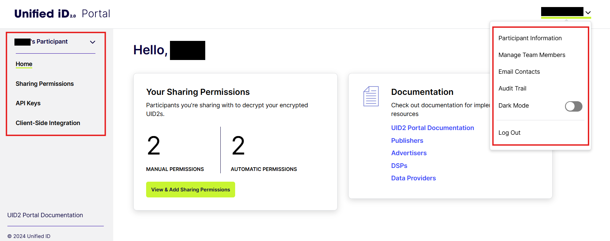

import Link from '@docusaurus/Link';

# UID2 Portal: Overview

The UID2 Portal is your one-stop shop for setting up and configuring your UID2 account. In this self-serve portal, you can complete all basic setup steps for UID2 participation. Click through on the links for more information about each activity.

| Activity | Documentation Link |
| :--- | :--- | 
| Request an account, configure basic account information such as name and location, log in for the first time, and reset your password. | [Getting Started with the UID2 Portal](portal-getting-started.md) |
| Review your profile. | [Participant Information](participant-info.md) |
| Server-side or client/server integrations: Manage API keys for your account, including adding, modifying, or deleting keys. | [API Keys](api-keys.md) |
| Client-side integrations only: Set up and manage the values needed for generating UID2 tokens on the client side. | [Client-Side Integration](client-side-integration.md) |
| Configure permissions for individual <Link href="../ref-info/glossary-uid#gl-sharing-participant">sharing participants</Link> or groups of sharing participants. NOTE: Use of sharing requires an API key (see [API Keys](api-keys.md)) or client-side key pair (see [Client-Side Integration](client-side-integration.md)). Configure these values before setting up sharing permissions. | [Sharing Permissions](sharing-permissions.md) |
| Add team members who will have permission to manage your account. | [Team Members](team-members.md) |
| Set up designated email contacts who will be notified of news or updates. | [Email Contacts](email-contacts.md) |
| View a detailed log of all past actions performed by, or on behalf of, the current participant. | [Audit Trail](audit-trail.md) |
| Change password when required by the Portal. | [Password Change Requirement](portal-getting-started.md#password-change-requirement) |

## Access the UID2 Portal

To get access to the portal, ask your UID2 contact for permission to create an account. You'll need to include some information in your request: see [Request an Account](portal-getting-started.md#request-an-account).

Your contact will send you a link to get started.

### UID2 Portal Structure

The UID2 Portal is structured for easy navigation.

There are two main ways to access the pages, as shown in the following image:

The name of the current participant is displayed at the top of the left sidebar. If your account has access to multiple participants, you'll see a drop-down list of the participants that you have access to. You can use this to switch between participants.

:::important
Any actions that you perform in the UID2 Portal, such as adding team members, domains, or API keys, are in the context of the participant currently displayed on the left. If you have access to more than one participant, make sure you perform actions in the correct context. For details, see [Participant Switcher](#participant-switcher).
:::

Continuing down the left sidebar, you can access the following pages relating to configuring your account:

- Home: link to home page, always present.
- [Sharing Permissions](sharing-permissions.md)
- [API Keys](api-keys.md)
- [Client-Side Integration](client-side-integration.md)

From the link at the top right, your name is displayed.

From here, you can access the following pages relating to your personal account settings and your daily activities:

- [Participant Information](participant-info.md)
- [Manage Team Members](team-members.md)
- [Email Contacts](email-contacts.md)
- [Audit Trail](audit-trail.md) (Admin users only)
- Dark Mode: Toggles dark mode on and off. Dark mode preference is applied to subsequent sessions.
- [Log Out](portal-getting-started.md#log-out)

## Set Up Your Account

To set up your account, see [Getting Started with the UID2 Portal](portal-getting-started.md).

## Participant Switcher

In most cases, each user has access to the data for one UID2 sharing participant. However, in some cases, an individual user might be on the team for more than one participant. In this scenario, the user can switch between participants.

The current participant is displayed at the top of the left sidebar. If the current user is on the team for more than one participant, an arrow indicates that the user can switch between participants, to perform actions in the context of the correct participant. 

For an illustration, see [UID2 Portal Structure](#uid2-portal-structure).

When the user logs out, the most recent participant choice is stored and is applied the next time the user logs in.
