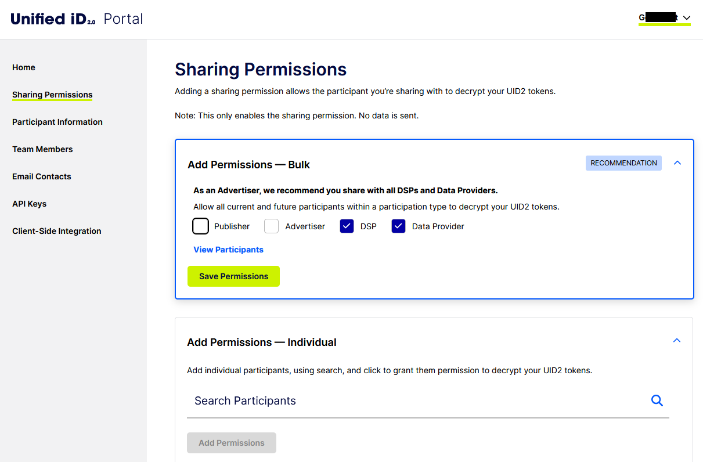

import Link from '@docusaurus/Link';

# Sharing Permissions

Configuring your sharing permissions opens the door to you being able to share UID2s with other UID2 participants.

There are many options to help you create the exact sharing relationships that you want:

- **Recommendations**: You can accept recommendations, with one click, to share with all current and future participants in one or more categories (Publishers, Advertisers, DSPs, or Data Providers). See [Bulk Add Sharing Permissions](#bulk-add-sharing-permissions).

  Recommendations are based on the participant type specified in your account setup.
- **Sharing Categories**: You can share with all current and future participants in one or more specific categories that you configure (Publishers, Advertisers, DSPs, or Data Providers).
- **Individual Sharing Relationships**: You can create a sharing relationship with one or more current participants. With this option, you must manually add any future sharing permissions.

:::note
Configuring a sharing permission with another participant doesn't mean that data is shared. It only makes it possible for the receiver to decrypt your UID2 tokens into raw UID2s. Information is only shared when you explicitly send it to another participant, or another participant sends it to you.
:::

## Sharing Permissions Overview

The sender must grant permission to the receiver, so that the intended receiver of UID2 tokens can decrypt them into raw UID2s. Sharing permissions are defined through the UID2 Portal.

For UID2 Portal access, ask your UID2 contact. For details, see [Request an Account](portal-getting-started.md#request-an-account). If you're completely new to UID2, see [Account Setup](../getting-started/gs-account-setup.md).

:::note
Use of sharing requires an API key (see [API Keys](api-keys.md)) or client-side key pair (see [Client-Side Integration](client-side-integration.md)). Configure these values before setting up sharing permissions.
:::

## Sharing Options

The following sharing options are available via the UID2 Portal. These options are not mutually exclusive&#8212;you can mix and match as needed:

- You can automatically grant permission to all participants of a specific type, such as all publishers, advertisers, DSPs, or data providers. For example, we recommend that publishers grant sharing permission to all DSPs.

  If you choose this option, all new participants of the selected participant type will automatically have permission to decrypt any data that you send to them. See [Bulk Add Sharing Permissions](#bulk-add-sharing-permissions).

- You can grant permission to one or more specific participants. See [Using Search to Add Sharing Relationships](#using-search-to-add-sharing-relationships).
 
You can update your sharing permission in the UID2 Portal at any point.

## Bulk Add Sharing Permissions

The UID2 Portal makes recommendations based on your role. For example:
- If you're a publisher, you could share with all DSPs (current and future).
- If you're an advertiser, you could share with all data providers (current and future).
- If you’re a DSP, you could share with all advertisers and all data providers (current and future). 
- If you’re a data provider, you could share with all advertisers, all publishers, and all DSPs (current and future).  

The following image shows the recommendations for an advertiser.

Accepting the recommendations is the fastest and easiest way to configure your sharing options.

For example, let's say you choose to share with all of 20 existing DSPs. The next day, when DSP 21 signs up for sharing, DSP 21 will automatically have permission to decrypt data that you send. To share with DSP 21, just send one or more UID2 tokens, and DSP 21 will be able to decrypt the tokens into raw UID2s. Because you chose automatic sharing, you do not need to log in to explicitly update your sharing permissions to include DSP 21, or any future DSPs that sign up for the UID2 ecosystem.

If you prefer, you can set up individual sharing relationships with one or more sharing participants.

## Using Search to Add Sharing Relationships

If you prefer to create specific sharing relationships, click **Add Permissions** to find sharing participants and add them.

The following filters are available on the list of available sharing participants:
- Publishers
- Advertisers
- Data Providers
- DSPs

:::note
When you manually create your sharing relationships using the search feature, you create current permissions, but not future ones. The only way to configure your sharing permissions to include future participants is to accept the recommendations. Alternatively, to add future participants, you must log in to the UID2 Portal again and search for the additional sharing participants.
:::

## Steps for Granting Sharing Permission

Enabling sharing permissions includes the following steps.

:::note
As well as granting sharing permission in the UID2 Portal, you'll also need to integrate an SDK, or Snowflake functionality, into your code. See [Tokenized Sharing Overview](../sharing/sharing-tokenized-overview.md).
:::

1. Log in to your UID2 Portal account.
1. Click **Sharing Permissions**.
1. Do one of the following:

   - **Bulk Add Permission to Sharing Categories**: You can share with all current and future participants in one or more specific categories that you configure (Publishers, Advertisers, DSPs, or Data Providers). 

   - **Review and Accept Recommendations**: Review the recommendations, add or clear recommendation categories as needed, and then click **Add Permissions**.

     If you accept a participant category, such as Advertisers or DSPs, sharing is enabled for current participants of that type, and also future participants of that type that join the UID2 ecosystem.
   
   - **Add Permissions**: If you prefer, you can search for individual participants to share with. For details, see [Using Search to Add Sharing Relationships](#using-search-to-add-sharing-relationships).
1. Save changes.

:::note
When you enable sharing permission, this allows the selected sharing participants to access your decryption keys. Each participant that you enable for sharing can use your keys, via a UID2 SDK or Snowflake integration, to decrypt a UID2 token into a raw UID2. However, granting permission is just the first step. In order for sharing to occur, you must send the tokens to the participant. The UID2 Portal enables the permissions. It does not send any data&#8212;that is up to you.
:::
