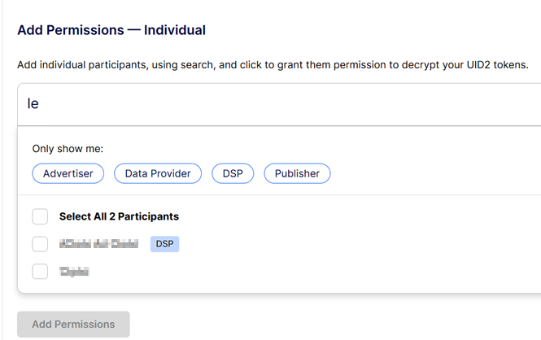

import Link from '@docusaurus/Link';

# Sharing Permissions

Configuring your sharing permissions opens the door to you being able to share UID2s with other UID2 <Link href="../ref-info/glossary-uid#gl-sharing-participant">sharing participants</Link>: adding a sharing permission allows the participant you’re sharing with to decrypt your UID2 tokens into <Link href="../ref-info/glossary-uid#gl-raw-uid2">raw UID2s</Link>.

:::tip
Configuring sharing permissions in the UID2 Portal is for <Link href="../ref-info/glossary-uid#gl-tokenized-sharing">tokenized sharing</Link>, not for sharing raw UID2s. For details, see [UID2 Sharing Approaches](../sharing/sharing-overview.md#uid2-sharing-approaches).
:::

There are many options to help you create the exact sharing relationships that you want:

- **Bulk Recommendations**: You can accept recommendations, with one click, to share with all current and future participants in one or more categories (Publisher, Advertiser, DSP, or Data Provider). For details, see [Add Sharing Permissions&#8212;Bulk](#add-permissionsbulk).

  Recommendations are based on your participant type, as specified in your account setup. For details, see [Participant Information](participant-info.md).
- **Sharing Categories**: You can adjust the bulk recommendations and choose to share with all current and future participants in one or more specific categories that you configure (Publisher, Advertiser, DSP, or Data Provider).
- **Individual Sharing Relationships**: You can create a sharing relationship with one or more current participants. With this option, you must manually add any future sharing permissions.

:::note
Configuring a sharing permission with another participant doesn't mean that data is shared. It only makes it possible for the receiver to decrypt your UID2 tokens into raw UID2s. Information is only shared when you explicitly send it to another participant, or another participant sends it to you.
:::

## Sharing Permissions Overview

Here's some key information about sharing permissions:

- When you configure sharing permissions, no data is shared. 
- When you enable sharing permission, this allows the selected sharing participants to access your decryption keys. Each participant that you enable for sharing can use your keys, via a UID2 SDK or Snowflake integration, to decrypt UID2 tokens, that you send, into raw UID2s.
- You can update your sharing permissions at any time. When you delete sharing permissions, your decryption keys are no longer shared with those participants the next time they update their decryption keys. For details, see [Deleting Sharing Permissions](#deleting-sharing-permission).
- When you choose bulk settings, you're choosing to share with a group of sharing participants, defined by role. if you configure bulk permissions, you'll automatically share with any new members of a group you've selected.
- When you configure individual sharing permissions, future participants are not affected. To create relationships with future participants, you'll need to update your sharing permissions manually.

## Getting Started

The sender must grant permission to the receiver, so that the intended receiver of UID2 tokens can decrypt them into raw UID2s. Sharing permissions are defined through the UID2 Portal.

For UID2 Portal access, ask your UID2 contact. For details, see [Request an Account](portal-getting-started.md#request-an-account). If you're completely new to UID2, see [Account Setup](../getting-started/gs-account-setup.md).

:::note
Use of sharing requires an API key (see [API Keys](api-keys.md)) or client-side key pair (see [Client-Side Integration](client-side-integration.md)). Configure these values before setting up sharing permissions.
:::

## Sharing Options

The following sharing options are available via the UID2 Portal. These options are not mutually exclusive&#8212;you can mix and match as needed:

- You can automatically grant permission to all participants of a specific type, such as all publishers, advertisers, DSPs, or data providers. For example, we recommend that publishers grant sharing permission to all DSPs.

  If you choose this option, all new participants of the selected participant type automatically get permission to decrypt any data that you send to them. See [Add Sharing Permissions&#8212;Bulk](#add-permissionsbulk).

- You can grant permission to one or more specific participants. See [Add Permissions&#8212;Individual](#add-permissionsindividual).
 
You can update your sharing permissions in the UID2 Portal at any point.

:::note
When you enable sharing permission, this allows the selected sharing participants to access your decryption keys. Each participant that you enable for sharing can use your keys, via a UID2 SDK or Snowflake integration, to decrypt a UID2 token into a raw UID2. However, granting permission is just the first step. In order for sharing to occur, you must send the tokens to the participant. The UID2 Portal enables the permissions. It does not send any data&#8212;that is up to you.
:::

## Add Permissions&#8212;Bulk

:::tip
If you configure bulk permissions, you'll automatically share with any new members of a group you've chosen to share with.
:::

The UID2 Portal makes the following recommendations based on your role:

- Publishers: share with DSPs
- Advertisers: share with DSPs and Data Providers
- DSPs: share with Advertisers and Data Providers
- Data Providers: share with Publishers, Advertisers, and DSPs

<!-- The UID2 Portal makes recommendations based on your role. For example:
- If you're a publisher, you could share with all DSPs (current and future).
- If you're an advertiser, you could share with all data providers (current and future).
- If you’re a DSP, you could share with all advertisers and all data providers (current and future). 
- If you’re a data provider, you could share with all advertisers, all publishers, and all DSPs (current and future).   -->

The following illustration shows the recommendations for an advertiser.

### Configure Current and Future Permissions

Accepting the recommendations is the fastest and easiest way to configure your sharing options.

For example, let's say you choose to share with all of 20 existing DSPs. The next day, when DSP 21 signs up for sharing, DSP 21 automatically gets permission to decrypt data that you send. To share with DSP 21, just send one or more UID2 tokens, and DSP 21 can decrypt the tokens into raw UID2s. Because you chose automatic sharing, you do not need to log in to explicitly update your sharing permissions to include DSP 21, or any future DSPs that sign up for the UID2 ecosystem.

### View Participants

If needed, you can click **View Participants** to see the list of participants you're choosing to share with. As you make changes, the list is updated to show your choices. When done, click **Hide Participants** to close the list.

The following example shows a subset of the **View Participants** list.

If you prefer, you can set up individual sharing relationships with one or more sharing participants.

## Add Permissions&#8212;Individual

If you prefer to create specific sharing relationships, click **Add Permissions&#8212;Individual** to find sharing participants and add them.

Here's some general information about configuring individual permissions:
- If you've specified bulk permissions for one or more participant types, you cannot configure those permissions as individual sharing permissions.
- For any participant types that you haven't chosen in bulk permissions, you can add one or more participants of this type as individual permissions.
- If you configure individual sharing permissions rather than bulk, future participants are not affected. To create relationships with future participants, you'll need to update your sharing permissions manually.
- To add individual participants by name, use search. See [Use Search to Add Individual Permissions](#use-search-to-add-individual-permissions).
- To view a list of potential individual sharing participants of a particular type, use filters. See [Use Filters to Add Individual Permissions](#use-filters-to-add-individual-permissions).

### Use Search to Add Individual Permissions

If there's a specific participant that you want to find, for creating a sharing relationship, use the search feature.

Click  (the Search icon) and start typing the name of the participant. As you type, you'll see the results that match.

The following example shows matches in a search, after typing the first two letters:

When you make changes to your selections, the **Add Permissions** button is enabled.

You can also use filters to limit your search to a participant type: see [Use Filters to Add Individual Permissions](#use-filters-to-add-individual-permissions).

### Use Filters to Add Individual Permissions

When you're configuring individual permissions you can use filters, with or without text search, to define one or more individual participants for sharing. 

The following filters are available on the list of available sharing participants:
- Advertiser
- Data Provider
- DSP
- Publisher

Here are a couple of scenarios:
- You want to share with all data providers except one. To do this, follow these steps:
  1. Go to Individual Permissions.
  2. Click in the **Search Participants** bar, then click on the **Data Provider** filter.
  3. Click the top checkbox to select all data providers.
  4. Clear the checkbox for the one you don't want to share with.
  5. Save: see [Saving Your Choices](#saving-your-choices).
- You want to share with a specific list of advertisers and DSPs. To do this, follow these steps:
  1. Go to Individual Permissions.
  2. Click on the **Advertiser** and **DSP** filters. All advertisers and DSPs are displayed.
  3. Click individual checkboxes to choose your sharing partners.
  4. Save: see [Saving Your Choices](#saving-your-choices).

### Saving Your Choices

To save your choices, click **Add Permissions**. You'll see a review list so that you can check your changes, as shown in the following example (actual participant names are obscured):

To confirm your changes, click **Save**.

You can update your sharing permissions at any time.

:::note
When you manually create your sharing relationships by configuring individual permissions, you create current permissions but not future ones. The only way to configure your sharing permissions to include future participants is with bulk permissions.
:::

## Deleting Sharing Permission

There are several ways to delete sharing permissions:

- Bulk permissions:

  In the **Add Permissions&#8212;Bulk** section of the page, clear the box for the participant group you no longer want to share with, and then click **Save Permissions**.
- Individual permissions, by group:

  In the **Add Permissions&#8212;Individual** section of the page, under **Your Sharing Permissions**, click the **Participant Type** drop-down and choose one or more participant types:
  
  

  Check the top checkbox and/or customize the list as needed to specify the participants you want to delete, and then click **Delete Permissions**, as shown in the following example.

  
  
  At the **Are you sure...** prompt, click **Delete Permissions** to confirm.
- Individual permissions, by sharer:

  In the **Add Permissions&#8212;Individual** section of the page, locate one or more participants you no longer want to share with and then, in the Actions column, click  (the Delete icon). At the **Are you sure...** prompt, click **Delete Permissions** to confirm.

:::note
 When you delete sharing permissions, your decryption keys are no longer shared with those participants the next time they update their decryption keys. It isn't instant, but should be swift. For details, see [Decryption Key Refresh Cadence for Sharing](../sharing/sharing-best-practices.md#decryption-key-refresh-cadence-for-sharing).
:::
