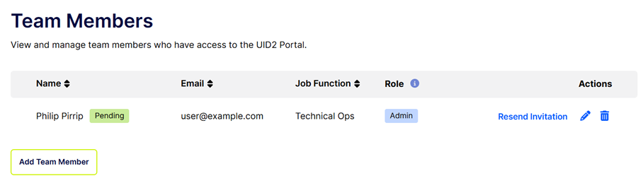

import Link from '@docusaurus/Link';

# Team Members

In the UID2 Portal, on the **Team Members** page, users with the Admin role can perform all activities relating to configuring individuals who you want to authorize for access to your account, including the following:

- [Add a Team Member](#add-a-team-member)
- [Resend an Invitation to a Team Member](#resend-an-invitation-to-a-team-member) 
- [Edit Information for a Team Member](#edit-information-for-a-team-member) 
- [Remove a Team Member](#remove-a-team-member)

## Accessing the Team Members Page

To access the Team Members page, go to the top right of the UID2 Portal user interface where your name is displayed. Click the down arrow and choose **Manage Team Members**.

For each team member, the following information is displayed:
- Name

  If the user has been invited but has not yet accepted, there is a **Pending** tag after the person's name.
- Email
- Job Function
- Role
- Actions: 
  - Available for all:  (Edit) and  (Delete).
  - If the user has been invited but has not yet accepted, a **Resend Invitation** link is also available.

For an illustration, see [Resend an Invitation to a Team Member](#resend-an-invitation-to-a-team-member).

## User Roles

Each team member has one of the roles shown in the following table.

| Role | Actions |
| :--- | :--- |
| Admin | Users with the Admin role can perform all activities related to UID2 participation, as summarized in the [UID2 Portal Overview](portal-overview.md), for the current participant organization. |
| Operations | Users with the Operations role can perform most of the same actions as Admin users. However, there are some limitations:<ul><li>They cannot add, modify, or remove team members. Instead, they have read-only access to the [Team Members](team-members.md) page.</li><li>They cannot view the [Audit Trail](audit-trail.md) page.</li></ul> |

User roles can only be modified by users with the Admin role. For details, see [Edit Information for a Team Member](#edit-information-for-a-team-member). 

## Add a Team Member

To add a team member, complete the following steps:

1. Log in to your UID2 Portal account.
1. At the top right, click the down arrow and choose **Manage Team Members**.
1. Click **Add Team Member**.
1. Enter the first name, last name, email, job function and role.
1. Click **Save Team Member**.

   The team member is added to the list, with Pending status, and an invitation email is sent to the invited person.

:::note
Team members can be added to more than one participant. Team members who belong to multiple participants can switch between participants, as shown in [UID2 Portal Structure](portal-overview.md#uid2-portal-structure).
:::

## Resend an Invitation to a Team Member

If you added a team member, you might need to resend the invitation. For example, perhaps the team member didn't receive the invitation or accidentally deleted it, or the invitation has expired.

If the user has been invited but has not yet accepted, the Team Members list includes the following additional information, as shown in the illustration:

- A Pending label after the person's name.
- A **Resend Invitation** link.

To re-send the invitation for a team member, complete the following steps:

1. Log in to your UID2 Portal account.
1. At the top right, click the down arrow and choose **Manage Team Members**.
1. Find the team member on the list and then, in the Actions column, click **Resend Invitation**.

   The status updates to **Invitation Sent**, and a new invitation email is sent.

:::note
The Resend Invitation link only appears if the user has been invited, but has not yet accepted.
:::

## Edit Information for a Team Member

Notes re role:
- Users with the Admin role can update any of these values, for any team member in their participant organization.
- Users with the Operations role can view the Team Members page, but cannot change the information.

To edit information for a team member, complete the following steps:

1. Log in to your UID2 Portal account.
1. At the top right, click the down arrow and choose **Manage Team Members**.
1. Find the team member on the list and then, in the Actions column, click  (the Edit icon).
1. Update any of these values:
   - First Name
   - Last Name
   - Job Function
   - Role: For information about roles, see [User Roles](#user-roles).
   
   **Note**: You cannot update the email for an existing team member. If you need to change the email, add a new team member using the new email. This ensures that the email verification process is correctly followed. In this scenario, remember to also delete the existing entry with the old email address.
1. Save the changes.

## Remove a Team Member

To remove someone from the team, follow these steps:

1. Log in to your UID2 Portal account.
1. At the top right, click the down arrow and choose **Manage Team Members**.
1. Find the team member on the list and then, in the Actions column, click  (the Delete icon).
1. At the confirmation message, click **Remove Team Member**.

   The team member is removed from the team.

## Log In for the First Time as a Team Member

If someone added you as a new team member, we send you a confirmation email so that you can validate your address. Follow these steps:

1. Click in the email to accept the invitation.
1. Click through to update your password from the initial default.
1. Log in to the UID2 Portal using your email and your new password. This confirms your account.
1. On first login, review and accept the UID2 Sharing Portal Terms of Service.
