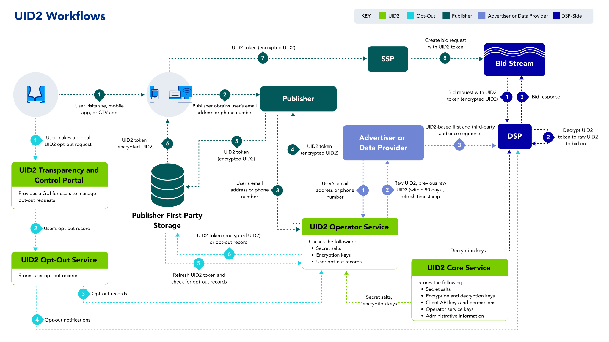

import Link from '@docusaurus/Link';

# UID2 Workflows

The following table lists four key workflows in the UID2 framework with links to their high-level overviews. It also provides links to the respective integration guides, which include diagrams, integration steps, FAQs, and other relevant information for each workflow.

| Workflow | Intended Primary Participants | Integration Guides |
| :--- |:--- |:--- |
| [Workflow for DSPs](../overviews/overview-dsps.md#workflow-for-dsps) (Buy-Side) | DSPs who transact on UID2 tokens in the bidstream. | See [DSP Integrations](../guides/summary-guides#dsp-integrations) |
| [Workflow for Advertisers](../overviews/overview-advertisers.md#workflow-for-advertisers) and [Workflow for Data Providers](../overviews/overview-data-providers.md#workflow-for-data-providers) | Organizations that collect user data and push it to DSPs. | See [Advertiser/Data Provider Integrations](../guides/summary-guides#advertiserdata-provider-integrations) |
| [Workflow for Publishers](../overviews/overview-publishers.md#workflow-for-publishers) | Organizations that propagate UID2 tokens to the bidstream via SSPs.  NOTE: Publishers can choose to integrate using Prebid, leverage the SDK for JavaScript, or complete their own server-side integration without using an SDK. | See [Publisher Integrations](../guides/summary-guides#publisher-integrations) |
| [Opt-Out Workflow](../getting-started/gs-opt-out.md#opt-out-workflow) | Consumers who engage with publishers or their SSO providers and other identity providers. | N/A |

The following diagram summarizes all four workflows. For each workflow, the [external participants](../overviews/participants-overview.md#uid2-external-participants), [components](../ref-info/uid-components.md), [UID2 identifier types](../ref-info/uid-identifier-types.md), and numbered steps are color-coded.

