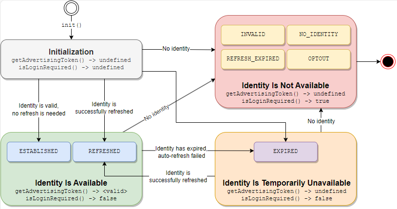

import Link from '@docusaurus/Link';
import ExampleUid2Cookie from '/docs/snippets/_example-uid2-cookie.mdx';
import ExampleJavaScriptV2Init from '/docs/snippets/_example-javascript-v2-init.mdx';

# SDK for JavaScript Reference Guide (2.x and earlier versions)

:::tip
This documentation is for earlier versions of the SDK for JavaScript. If you're using an earlier version, we recommend upgrading. See [SDK for JavaScript Reference Guide](sdk-ref-javascript.md), which includes a migration guide.
:::

Use this SDK to facilitate the process of establishing client identity using UID2 and retrieving advertising tokens. The following sections describe the high-level [workflow](#workflow-overview) for establishing UID2 identity, provide the SDK [API reference](#api-reference), and explain the [UID2 cookie format](#uid2-cookie-format). 

- For integration steps for content publishers, see [Client-Server Integration Guide for JavaScript](../guides/integration-javascript-client-server.md).
- For an [example application](https://example-jssdk-integ.uidapi.com/), with associated documentation, see the [UID2 SDK Integration Example](https://github.com/IABTechLab/uid2-examples/blob/main/publisher/standard/README.md) guide.

## Functionality

This SDK simplifies integration with UID2 for any publishers who want to support UID2. The following table shows the functions it supports.

| Encrypt Raw UID2 to UID2 Token | Decrypt UID2 Token to Raw UID2 | Generate UID2 Token from DII | Refresh UID2 Token | Map DII to Raw UID2s |
| :--- | :--- | :--- | :--- | :--- |
| &#8212; | &#8212; | &#8212; | &#9989; | &#8212; |

## API Permissions

To use this SDK, you'll need to complete the UID2 account setup by following the steps described in the [Account Setup](../getting-started/gs-account-setup.md) page.

You'll be granted permission to use specific functions offered by the SDK, and given credentials for that access. Bear in mind that there might be functions in the SDK that you don't have permission to use. For example, publishers get a specific API permission to generate and refresh tokens, but the SDK might support other activities that require a different API permission.

For details, see [API Permissions](../getting-started/gs-permissions.md).

## SDK Version

This documentation is for version 2 of the SDK for JavaScript.

## GitHub Repository

This SDK is in the following open-source GitHub repository:

- [https://github.com/iabtechlab/uid2-web-integrations](https://github.com/iabtechlab/uid2-web-integrations)

<!-- The binary is published in these locations:

- NPM: [https://www.npmjs.com/package/@uid2/uid2-sdk](https://www.npmjs.com/package/@uid2/uid2-sdk)
- CDN: [https://cdn.prod.uidapi.com/uid2-sdk-${VERSION_ID}.js](https://cdn.prod.uidapi.com/uid2-sdk-${VERSION_ID}.js) (** v3 JS SDK: stash per SW 8/15/23**) -->

## Terminology

In this document, the following terms apply:
- **Identity** refers to a package of values, returned by the [POST&nbsp;/token/generate](../endpoints/post-token-generate.md) or [POST&nbsp;/token/refresh](../endpoints/post-token-refresh.md) endpoint, that includes the UID2 token, the refresh token, and associated values such as timestamps.
- **Advertising token** refers to the UID2 token.

## Include the SDK Script

On every page where you want to use UID2 for targeted advertising, include the following SDK script:

```html
<script src="https://prod.uidapi.com/static/js/uid2-sdk-2.0.0.js" type="text/javascript"></script> 
```

## Workflow Overview

The high-level client-side workflow for establishing UID2 identity using the SDK consists of the following steps:

1. Publisher: Initialize the SDK using the [init](#initopts-object-void) function and specify a [callback function](#callback-function) to be called upon successful completion of the step.
2. Publisher: Wait for the SDK to invoke the callback function. The callback function indicates the identity availability:
	- If the identity is available, the SDK sets up a [background token auto-refresh](#background-token-auto-refresh).
	- If the identity is unavailable, the reason for its unavailability is specified in the object passed to the callback function.
3. SDK: Based on the identity [state](#workflow-states-and-transitions), the SDK does the following:
	- If a valid identity is available, the SDK ensures that the identity is available in a [first-party cookie](#uid2-cookie-format).
	- If the identity is unavailable, the SDK takes the appropriate action based on whether the identity is refreshable or not. For details, see [Workflow States and Transitions](#workflow-states-and-transitions).
4. Publisher: Handle the identity based on its state:
	- If the advertising token is available, use it to initiate requests for targeted advertising.
	- If the advertising token is not available, either use untargeted advertising or redirect the user to the data capture with the consent form.

For web integration steps, see [Client-Server Integration Guide for JavaScript](../guides/integration-javascript-client-server.md).

### Workflow States and Transitions

The following table outlines the four main states that the SDK can be in, based on the combination of values returned by two main functions, [getAdvertisingToken()](#getadvertisingtoken-string) and [isLoginRequired()](#isloginrequired-boolean), and indicates the appropriate action that you, as a developer, can take in each state. 

| Workflow State | Advertising Token | Login Required | Description| Identity Status Value |
| :--- | :--- | :---| :---| :---|
| Initialization | `undefined`| `undefined`| Initial state until the callback is invoked. | N/A |
| Identity Is Available | available |`false` | A valid identity has been successfully established or refreshed. You can use the advertising token in targeted advertising. |`ESTABLISHED` or `REFRESHED` |
| Identity Is Temporarily Unavailable |`undefined` | `false`| The advertising token has expired, therefore automatic refresh failed. [Background auto-refresh](#background-token-auto-refresh) attempts will continue until the refresh token expires or the user opts out.<br/>You can do either of the following:<br/>- Redirect the user, asking for the email or phone number.<br/>- Use untargeted advertising.<br/>NOTE: Identity might be successfully refreshed at a later time&#8212;for example, if the UID2 service is temporarily unavailable.| `EXPIRED` |
| Identity Is Not Available  | `undefined`| `false`| The identity is not available and cannot be refreshed. The SDK clears the first-party cookie.<br/>To use UID2-based targeted advertising again, you must obtain the email or phone number from the consumer. | `INVALID`, `NO_IDENTITY`, `REFRESH_EXPIRED`, or `OPTOUT` |

The following diagram illustrates the four states, including the corresponding identity [status values](#identity-status-values) and possible transitions between them. The SDK invokes the [callback function](#callback-function) on each transition.



### Background Token Auto-Refresh

As part of the SDK [initialization](#initopts-object-void), a token auto-refresh for the identity is set up, which is triggered in the background by the timestamps on the identity or by failed refresh attempts due to intermittent errors.

Here's what you need to know about the token auto-refresh:


- Only one token refresh call can be active at a time. 
- If the [POST&nbsp;/token/refresh](../endpoints/post-token-refresh.md) response is unsuccessful because the user has opted out, or because the refresh token has expired, this suspends the background auto-refresh process. To use UID2-based targeted advertising again, you must obtain the email or phone number from the consumer ([isLoginRequired()](#isloginrequired-boolean) returns `true`). In all other cases, auto-refresh attempts continue in the background.
- The [callback function](#callback-function) specified during the SDK initialization is invoked in the following cases:
	- After each successful refresh attempt.
	- After an initial failure to refresh an expired advertising token.
	- When identity has become invalid&#8212;for example, because the user has opted out.<br/>NOTE: The callback is *not* invoked when identify is temporarily unavailable and the auto-refresh keeps failing. In this case, the SDK continues using the existing advertising token.
- A [disconnect()](#disconnect-void) call cancels the active timer. 

## API Reference

All interactions with the Client-Side JavaScript SDK are done through the global `__uid2` object, which is a member of the `UID2` class. All of the following JavaScript functions are members of the `UID2` class:

- [constructor()](#constructor)
- [init()](#initopts-object-void)
- [getAdvertisingToken()](#getadvertisingtoken-string)
- [getAdvertisingTokenAsync()](#getadvertisingtokenasync-promise)
- [isLoginRequired()](#isloginrequired-boolean)
- [disconnect()](#disconnect-void)
- [abort()](#abort-void)

### constructor()

Constructs a UID2 object.

:::tip
Instead of calling this function, you can just use the global `__uid2` object.
:::

### init(opts: object): void

Initializes the SDK and establishes user identity for targeted advertising. 

Here's what you need to know about this function:

- You can call `init()` any time after the SDK has been loaded by the corresponding script tag, typically during page loading.
- Initialization calls require a [callback function](#callback-function) that is invoked after the SDK is initialized.
- When creating an instance for the UID2 lifecycle on the client, the `identity` property in the `init()` call refers to the `body` property of the response JSON object returned from a successful [POST&nbsp;/token/generate](../endpoints/post-token-generate.md) or [POST&nbsp;/token/refresh](../endpoints/post-token-refresh.md) call with the server-side generated identity.
- Since the SDK relies on [first-party cookies](#uid2-cookie-format) to store the passed UID2 information for the session, a call to `init()` made by a page on a different domain might not be able to access the cookie. You can adjust the settings used for the cookie with the `cookieDomain` and `cookiePath` options.
- To tune specific behaviors, initialization calls might include optional configuration [parameters](#parameters).

The following is a template of an `init()` call with the server-side generated identity included.

```html
<script>
 __uid2.init({
   callback : function (state) {...}, // Check advertising token and its status within the passed state and initiate targeted advertising. 
   identity : {...} // The `body` property value from the token/generate or token/refresh API response.
 });
</script>
```

For example:

<ExampleJavaScriptV2Init />

The following is an example of an `init()` call that uses identity from a first-party cookie. You can put a script like this on any page that the user might visit after the identity has been established.

```html
<script>
 __uid2.init({
   callback : function (state) {...} // Check advertising token and its status within the passed state and initiate targeted advertising. 
 });
</script>
```

#### Parameters

The `opts` object supports the following properties.

| Property | Data Type | Attribute | Description | Default Value |
| :--- | :--- | :--- | :--- | :--- |
| `callback` | `function(object): void` | Required | The function that the SDK should invoke after validating the passed identity. For details, see [Callback Function](#callback-function).| N/A |
| `identity` | object | Optional | The `body` property value from a successful [POST&nbsp;/token/generate](../endpoints/post-token-generate.md) or [POST&nbsp;/token/refresh](../endpoints/post-token-refresh.md) call that has been run on the server to generate an identity.<br/>To use the identity from a [first-party cookie](#uid2-cookie-format), leave this property empty. | N/A |
| `baseUrl` | string | Optional | The custom base URL of the UID2 operator to use when invoking the [POST&nbsp;/token/refresh](../endpoints/post-token-refresh.md) endpoint.<br/>For example: `https://my.operator.com`.  | `https://prod.uidapi.com`. |
| `refreshRetryPeriod` | number | Optional | The number of seconds after which to retry refreshing tokens if intermittent errors occur. | 5 |
| `cookieDomain` | string | Optional | The domain name string to apply to the [UID2 cookie](#uid2-cookie-format).<br/>For example, if the `baseUrl` is `https://my.operator.com`, the `cookieDomain` value might be `operator.com`. | `undefined` |
| `cookiePath` | string | Optional | The path string to apply to the [UID2 cookie](#uid2-cookie-format). | `/` |


#### Errors

The `init()` function can throw the following errors.

| Error | Description |
| :--- | :--- |
| `TypeError` | One of the following issues has occurred:<br/>- The function has already been called.<br/>- The `opts` value is not an object.<br/>- There is no callback function specified.<br/>-  The `callback` value is not a function. |
| `RangeError` | The refresh retry period is less than 1. |

#### Callback Function

The `function(object): void` callback function indicates that the initialization is complete. From that point onwards, the SDK invokes the callback when it successfully refreshes the established identity.

For details on when the callback function is called, see [Background Token Auto-Refresh](#background-token-auto-refresh).

The `object` parameter includes the following properties.

| Property | Data Type | Description |
| :--- | :--- | :--- |
| `advertisingToken` | string | The token to be passed to SSPs for targeted advertising. If the token/identity is invalid or unavailable, the value is `undefined`. |
| `status` | `UID2.IdentityStatus` enum | The numeric value that indicates the status of the identity. For details, see [Identity Status Values](#identity-status-values). |
| `statusText` | string | Additional information about the identity status. |

#### Identity Status Values

The [callback function](#callback-function) returns the `status` field values as numbers from the `UID2.IdentityStatus` enum, which can be turned into the corresponding strings by calling `UID2.IdentityStatus[state.status]`. The following table lists the string values for the `status` enum.

:::important
The following values are intended only to inform you of identity availability. Do not use them in conditional logic.
:::

| Status | Advertising Token Availability | Description |
| :--- | :--- | :--- |
| `ESTABLISHED` | Available | The identity is valid, was set from the passed value or the first-party cookie, and is now available for targeted advertising. |
| `REFRESHED` | Available | The identity was successfully refreshed by a call to the UID2 operator, and is now available for targeted advertising. |
| `EXPIRED` | Not available | No identity is available for targeted advertising, as the SDK failed to refresh the token. Since there is still a valid refresh token available, auto-refresh attempts will continue. |
| `REFRESH_EXPIRED` | Not available | No identity is available for targeted advertising, because the refresh token on the first-party cookie or the passed identity has expired.  |
| `NO_IDENTITY` | Not available | No identity is available for targeted advertising, because a first-party cookie was not set and no identity has been passed to the `init()` function.  |
| `INVALID` | Not available | No identity is available for targeted advertising, because the SDK failed to parse the first-party cookie or the passed identity. |
| `OPTOUT` | Not available | No identity is available for targeted advertising, because the user has opted out and therefore the identity cannot be refreshed. |

If the identity is not available, use the [isLoginRequired()](#isloginrequired-boolean) function to determine the best course of action.

### getAdvertisingToken(): string

Gets the current advertising token. 

Before calling this function, be sure to call [init()](#initopts-object-void) and wait until the callback you supply has been invoked, as shown in the following example. 

```html
<script>
  let advertisingToken = __uid2.getAdvertisingToken();
</script>
```

The `getAdvertisingToken()` function allows you to access the advertising token from anywhere&#8212;not just from the callback that's done when initialization is complete. This function returns `undefined` if any of the following conditions apply:

- The [callback function](#callback-function) has not yet been called, which means that the SDK initialization is not yet complete.
- The SDK initialization is complete, but there is no valid identity to use.
- The SDK initialization is complete, but the auto-refresh has cleared the identity&#8212;for example, because the user has opted out.

If the identity is not available, use the [isLoginRequired()](#isloginrequired-boolean) function to determine the best course of action.

### getAdvertisingTokenAsync(): Promise

Gets a `Promise` string for the current advertising token.

This function can be called before or after the [init()](#initopts-object-void) call. The returned promise is settled after the initialization is complete and the [callback function](#callback-function) is invoked, based on the availability of the advertising token:

- If the advertising token is available, the promise is fulfilled with the current advertising token.
- If the advertising token is not available, even temporarily, the promise is rejected with an instance of `Error`. To determine the best course of action in this case, you can use [isLoginRequired()](#isloginrequired-boolean).

:::note
If the `getAdvertisingTokenAsync()` function is called *after* the initialization is complete, the promise is settled immediately based on the current state.
:::

```html
<script>
  __uid2.getAdvertisingTokenAsync()
    .then(advertisingToken => { /* initiate targeted advertising */ })
    .catch(err => { /* advertising token not available */ });
</script>
```

:::tip
You can use this function to be notified of the completion of the Client-Side JavaScript SDK initialization from a component that might not be the one that called `init()`.
:::

### isLoginRequired(): boolean

Specifies whether a UID2 [POST&nbsp;/token/generate](../endpoints/post-token-generate.md) call is required. 

This function can also provide additional context for handling missing identities, as shown in [Workflow States and Transitions](#workflow-states-and-transitions).

```html
<script>
  __uid2.isLoginRequired();
</script>
```

#### Return Values

| Value | Description |
| :--- | :--- |
| `true` | The identity is not available. This value indicates any of the following:<br/>- The user has opted out.<br/>- The refresh token has expired.<br/>- A first-party cookie is not available and no server-generated identity has been supplied. |
| `false` | This value indicates one of the following:<br/>- The identity is present and valid.<br/>- The identity has expired, and the token was not refreshed due to an intermittent error. The identity might be restored after a successful auto-refresh attempt. |
| `undefined` | The SDK initialization is not yet complete. |


### disconnect(): void

Clears the UID2 identity from the [first-party cookie](#uid2-cookie-format). This closes the client's identity session and disconnects the client lifecycle.

When a user logs out of the publisher's site, make the following call:

```html
<script>
  __uid2.disconnect();
</script>
```

After this function is executed, the [getAdvertisingToken()](#getadvertisingtoken-string) function returns `undefined` and the [isLoginRequired()](#isloginrequired-boolean) function returns `true`.

### abort(): void
	
Terminates any background timers or requests. The UID2 object remains in an unspecified state and cannot be used anymore. 

This function is intended for use in advanced scenarios where you might want to replace the existing UID2 object with a new instance. For example, a single-page application could use this to clear the current UID2 object and construct or initialize a new one after receiving a new identity from the server in the [POST&nbsp;/token/generate](../endpoints/post-token-generate.md) response.

## UID2 Cookie Format

The SDK uses a first-party cookie to store the user's identity.

### Properties

The following table lists the cookie properties.

| Properties | Default Value | Comments |
| :--- | :--- | :--- |
| `Name` | `__uid_2` | N/A |
| `Expiry` | N/A | The value is the refresh token expiration timestamp as specified in the [POST&nbsp;/token/generate](../endpoints/post-token-generate.md) or [POST&nbsp;/token/refresh](../endpoints/post-token-refresh.md) response. |
| `Path` | `/` | If you want to use a different value, you can set it during SDK initialization using the `cookiePath` [init() parameter](#parameters).  |
| `Domain` | `undefined` | If you want to use a different value, you can set it during SDK initialization using the `cookieDomain` [init() parameter](#parameters). |

### Contents Structure

The UID2 cookie contents are a URI-encoded string representation of a JSON object with the structure identical to that of the `body` property in a [POST&nbsp;/token/generate](../endpoints/post-token-generate.md) or [POST&nbsp;/token/refresh](../endpoints/post-token-refresh.md) response, with the exception of the `private` object. 

The following is an example of the UID2 cookie structure:

<ExampleUid2Cookie />

:::important
The contents of the `private` object are explicitly unspecified and are left for the SDK to interpret. Do not make any assumptions about the structure, semantics, or compatibility of this object. Any updates to the cookie must retain its structure.
:::
