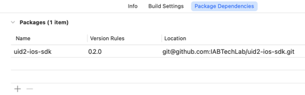

# UID2 SDK for iOS Reference Guide

<!-- This guide includes the following information:

- [Functionality](#functionality)
- [API Permissions](#api-permissions)
- [SDK Version](#sdk-version)
- [Features](#features)
- [GitHub Open-Source Repository](#github-open-source-repository)
- [Minimum Requirements](#minimum-requirements)
- [Installation](#installation)
  -  [Installing with Gradle](#installing-with-gradle)
  -  [Installing with Maven](#installing-with-maven)
- [Usage Guidelines](#usage-guidelines)
- [UID2Manager API](#uid2manager-api)
  -  [Functions](#functions)
  -  [Variables](#variables)
- [Android Initialization](#android-initialization)
- [Code Samples](#code-samples) -->

You can use the UID2 SDK for iOS to facilitate the process of establishing client identity using UID2 and retrieving advertising tokens on iOS devices.

The following iOS-related plugins, and associated documentation, are also available:

| Purpose | Product/Documentation |
| :--- | :--- |
| To use the Google Mobile Ads (GMA) SDK to send [UID2 tokens](../ref-info/glossary-uid.md#gl-uid2-token) as [secure signals](https://support.google.com/admob/answer/11556288) in ad requests from iOS apps | [UID2 GMA Plugin for iOS Integration Guide](../guides/mobile-plugin-gma-ios.md) |
| To use the Google Interactive Media Ads SDK for iOS to send [UID2 tokens](../ref-info/glossary-uid.md#gl-uid2-token) as [secure signals](https://support.google.com/admob/answer/11556288) in ad requests from iOS apps | [UID2 IMA Plugin for iOS Integration Guide](../guides/mobile-plugin-ima-ios.md) |

## Functionality

This SDK simplifies integration with UID2 for any publishers who want to support UID2 for apps running on iOS devices. The following table shows the functions it supports.

| Encrypt Raw UID2 to UID2 Token | Decrypt UID2 Token | Generate UID2 Token from DII | Refresh UID2 Token |
| :--- | :--- | :--- | :--- |
| Not supported | Not supported | Not supported | Supported |

## API Permissions

To use this SDK, you'll need to complete the UID2 account setup by following the steps described in the [Account Setup](../getting-started/gs-account-setup.md) page.

You'll be granted permission to use specific functions offered by the SDK, and given credentials for that access. Bear in mind that there might be functions in the SDK that you don't have permission to use. For example, publishers get a specific API permission to generate and refresh tokens, but the SDK might support other activities, such as sharing, which require a different API permission.

For details, see [API Permissions](../getting-started/gs-permissions.md).

## SDK Version

<!-- As of 2023-07-15 -->

This documentation is for the UID2 iOS SDK version 0.2.0.

## Features

The UID2 iOS SDK is designed to manage UID2 identity on behalf of iOS apps. It enables UID2 identity to be persisted across app lifecycles by securely storing the identity on a device via platform-native encryption tools.

By default, the SDK automatically refreshes UID2 identity based on expiration dates. However, you can disable this to allow implementing apps to manage the UID2 identity lifecycle manually.

## GitHub Open-Source Repository

This SDK is in the following open-source GitHub repository:

- [https://github.com/IABTechLab/uid2-ios-sdk](https://github.com/IABTechLab/uid2-ios-sdk)

## Minimum Requirements

Minimum requirements for this SDK are as follows:

- Xcode version: 14.0+
- iOS	minimum target version: 13.0+	
- Swift version: 5.0+

<!-- See also: [Requirements](https://github.com/IABTechLab/uid2-ios-sdk/blob/main/README.md#requirements). -->

## Installation

Install the iOS SDK via Swift Package Manager (SPM). There are two installation options:

-   [Package.swift](#installing-with-packageswift)
-   [Xcode](#installing-with-xcode)

### Installing with Package.swift

Add the following dependency to Package.swift:

``` javascript
dependencies: [
.package(url: \"https://github.com/IABTechLab/uid2-ios-sdk.git\", from: "0.2.0"),
]
```

### Installing with Xcode

Add the following dependency via Xcode:



## Usage Guidelines

The initial UID2 Identity *must* be generated by the implementing application and then passed into the UID2 SDK. Because of security requirements, the UID2 Mobile SDKs cannot create new UID2 identities.

The UID2 Mobile SDKs can perform refreshes of UID2 identities, after an Identity is established. This is because the refresh functionality relies on the refresh tokens that are part of the UID2 Identity.

The **UID2Manager** singleton is the primary developer API for the UID2 Android and iOS SDKs. It is responsible for storing, refreshing, and retrieving UID2 Identity.

For iOS, the `UID2Manager` is initialized automatically the first time it is accessed. You can configure it to support automatic or manual refresh capabilities.

## UID2Manager API

This section includes the functions and variables that are part of the UID2Manager API.

### Functions

The following functions are available as part of the UID2Manager API:
- [setIdentity()](#setidentity)
- [resetIdentity()](#resetidentity)
- [refreshIdentity()](#refreshidentity)
- [getAdvertisingToken()](#getadvertisingtoken)
- [setAutomaticRefreshEnabled()](#setautomaticrefreshenabled)

#### setIdentity()

Sets the UID2 Identity to be managed by the SDK.

#### resetIdentity()

Resets or removes the UID2 Identity currently being managed by the SDK.

#### refreshIdentity()

Manually refreshes the UID2 Identity being managed by the SDK.

#### getAdvertisingToken()

If the current UID2 Identity is valid, this function returns the UID2 token (advertising token).

#### setAutomaticRefreshEnabled()

Toggle for automatic refresh functionality.

### Variables

The following variables are available as part of the UID2Manager API:

- [identity](#identity)
- [identityStatus](#identitystatus)

#### identity

The Identity variable stores and returns the current UID2Identity data object being managed by the SDK.

#### identityStatus

The identityStatus variable stores and returns the status of the current UID2 Identity being managed by the SDK.

## Code Samples

The following code samples provide examples of performing specific activities relating to managing UID2 with the UID2 iOS SDK.

Set the initial UID2 Identity:

``` javascript
UID2Manager.shared.setIdentity(_ identity: UID2Identity)
```

Get the UID2 token (advertising token) to pass to the Advertising SDK:

``` javascript
UID2Manager.shared.getAdvertisingToken()
```
